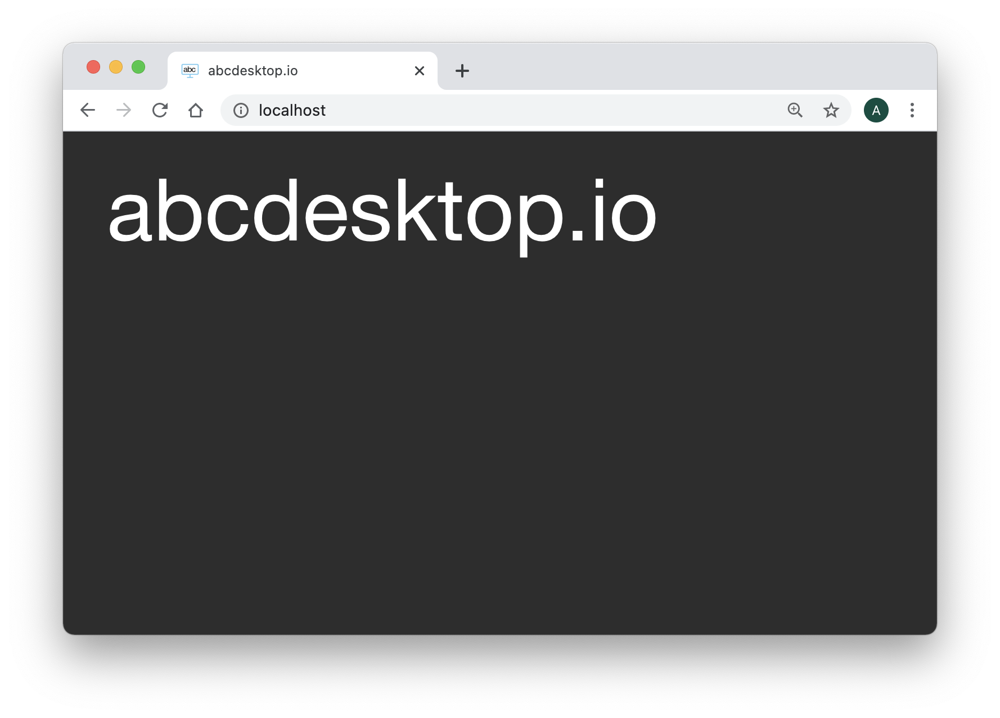
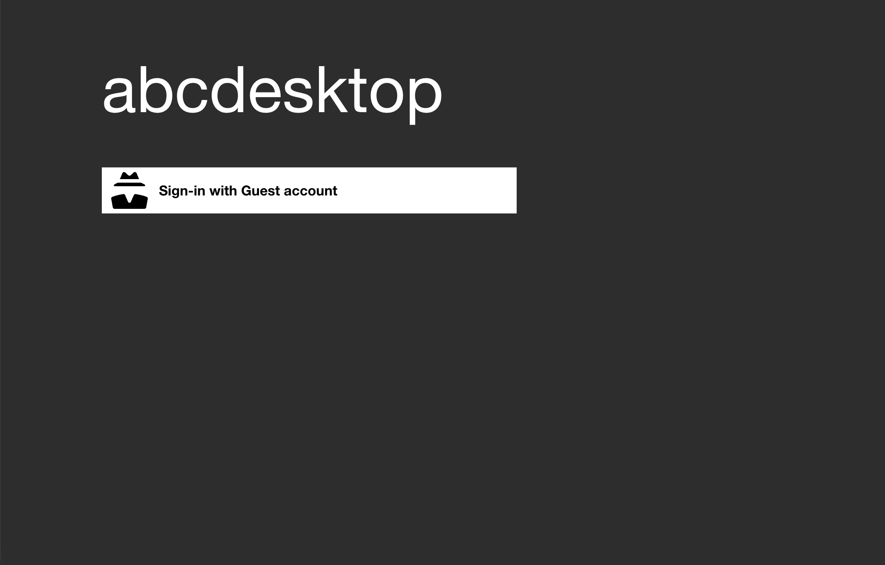
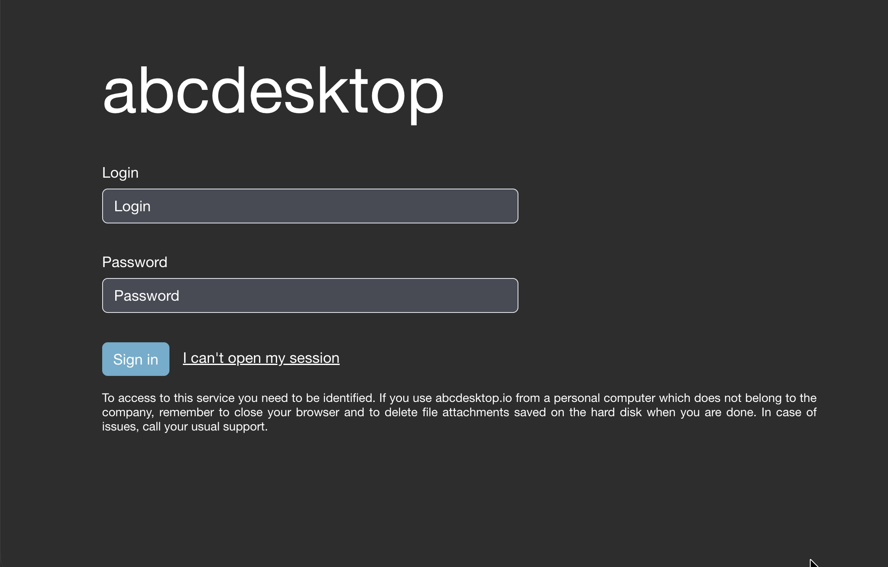

# Authentification overview

## Configuration file
The authentification configuration is set in the `od.config` file. In this chapter you will need to update the `od.config` configuration file. 
This update differs depending on the configuration docker mode or kubernetes mode. 

Read the 
[Update your configuration file and apply the new configuration file](../configure/updateconfiguration.md) section to make change in `od.config` file for kubernetes cluster.

## The dictionary authmanagers

The authmanagers is defined as a dictionary object :

```
authmanagers: {
  'external': { },
  'explicit': { },
  'implicit': { }}
```

The `od.config` defines four kinds of entries in the ```authmanagers``` object :

* `external`: use for OpenID Connect (Authentification) OAuth 2.0
* `explicit`: use for directory services  `LDAP`, `LDAPS` and `Microsoft Active Directory` authentification
* `metaexplicit`: use for `Microsoft Active Directory trusted relationships`, with support of FSP (Foreign Security Principals)
* `implicit`: use for Anonymous Authentification and SSL-client certificat 

## Related authmanagers 

| authmanagers type  | Description  |
|--------------------|--------------|
|  [`external`](authexternal.md)| For  OpenID Connect OAuth 2.0 authentification  |
|  [`metaexplicit`](authexplicit.md) | For Microsoft Active Directory Trusted relationship, with support of Foreign Security Principals and Special Identities |
|  [`explicit`](authexplicit.md) | For LDAP, LDAPS, Active Directory Authentification, and Kerberos authentification  |
|  [`implicit`](authimplicit.md) | For anonymous authentification, for an always True Authentification, and SSL-client certificat  |

## Hands-on

### Requirements

You should have read the hands-on :

* [Update your configuration file and apply the new configuration file](../configure/updateconfiguration.md) section to make change in `od.config` file for kubernetes cluster.

### Change authmanagers configuration

Edit your `od.config` pyos configuration file, and set the value to the authmanagers dictionary with empty values for `implicit`, `explicit`, and `external`, as describe :

```
authmanagers: {
  'external': {},
  'explicit': {},
  'implicit': {}}
```

??? warning "json dictionary"
    ```
        If you define a dictionary, you must close the `}` on the same last line as the previous one. A simple quick example for authmanagers dictionary.
        authmanagers: {
          'external': {},
          'explicit': {},
          'implicit': {}}
    ```

To apply changes, you have to replace the `abcdesktop-config`, by running the `replace kubectl` command line option. Then `rollout restart`the `pyos` pod. 

```
kubectl create -n abcdesktop configmap abcdesktop-config --from-file=od.config  -o yaml --dry-run | kubectl replace -n abcdesktop -f -
kubectl rollout restart deployment pyos-od -n abcdesktop
```


Start your web browser and open the URL `http://localhost:30443`



The Web home page should only show the title abcdesktop.io.
There is no `authmanagers` available.

Great you can now add some value to authenticate your users.

## authmanagers `implicit`:

`implicit` is the easiest configuration mode, and is used to run `Anonymous` authentification (always True). 




Read the [authmanagers implicit](authimplicit.md) Section.


## authmanagers `explicit`:

`explicit` is defined to use a directory service like LDAP. 



Read the [authmanagers explicit](authexplicit.md) Section.

## authmanagers `metaexplicit`:

`metaexplicit` offers a support to Microsoft Active Directory Trusted relationship, with support of Foreign Security Principals and Special Identities. 


Read the [authmanagers meta explicit](authmetaexplicit.md) Section.

## authmanagers `external`:

`external` use external OAuth 2.0 authentication, for example [Google OAuth 2.0](https://developers.google.com/identity/protocols/oauth2), or [Github OAuth 2.0](https://docs.github.com/en/developers/apps/building-oauth-apps/authorizing-oauth-apps) 


Read the [authmanagers external](authexternal.md) Section.


## authmanagers sample
        
In the [authmanagers implicit](authimplicit.md) section, [authmanagers explicit](authexplicit.md) section, and [authmanagers external](authexternal.md) section, you have learned how to defined the providers. 

You can build an `authmanagers` dictionary as described with `external`, `explicit` and `implicit` at the same time.

```json
authmanagers: {
  'external': {
    'providers': {
      'google': { 
        'icon': 'img/auth/google_icon.svg',
        'displayname': 'Google', 
        'textcolor': '#000000',
        'backgroundcolor': '#FFFFFF',
        'enabled': True,
        'client_id': 'xxxx, 
        'client_secret': 'xxxx',
        'userinfo_auth': True,
        'scope': [ 'https://www.googleapis.com/auth/userinfo.email',  'openid' ],
        'userinfo_url': 'https://www.googleapis.com/oauth2/v1/userinfo',
        'redirect_uri_prefix' : 'https://www.mydomain.com/API/auth/oauth',
        'redirect_uri_querystring': 'manager=external&provider=google',
        'authorization_base_url': 'https://accounts.google.com/o/oauth2/v2/auth',
        'token_url': 'https://oauth2.googleapis.com/token',
        'policies': {  'acl': { 'permit': [ 'all' ] } }
     },
     'github': {
        'icon': 'img/auth/github_icon.svg',
        'textcolor': '#000000',
        'backgroundcolor': '#FFFFFF',
        'displayname': 'Github',
        'enabled': True,
        'basic_auth': True,
        'userinfo_auth': True,
        'scope' : [ 'read:user' ], 
        'client_id': 'xxxx',
        'client_secret': 'xxxx',
        'redirect_uri_prefix' : 'https://www.mydomain.com/API/auth/oauth',
        'redirect_uri_querystring': 'manager=external&provider=github',
        'authorization_base_url': 'https://github.com/login/oauth/authorize',
        'token_url': 'https://github.com/login/oauth/access_token',
        'userinfo_url': 'https://api.github.com/user',
        'policies': { 'acl' : { 'permit': [ 'all' ] } }
     }
    }
  },
  'explicit': {
    'show_domains': True,
    'default_domain': 'AD',
    'providers': {
      'AD': { 
        'config_ref': 'adconfig', 
        'enabled': True
       }
    }
  },
  'implicit': {
    'providers': {
      'anonymous': {
        'displayname': 'Guest',
        'textcolor': '#000000',
        'icon': 'img/auth/anonymous_icon.svg',
        'backgroundcolor': '#FFFFFF',
        'caption': 'Have a look !',
        'userid': 'anonymous',
        'username': 'Anonymous'
      }     
    }
}}


adconfig : { 
  'AD': { 
      'default' : True, 
	  'ldap_timeout': 15,
	  'ldap_basedn': 'DC=ad,DC=domain,DC=local',
	  'ldap_fqdn': '_ldap._tcp.ad.domain.local',
	  'domain': 'AD',
	  'auth_type': 'KERBEROS',
	  'domain_fqdn': 'AD.DOMAIN.LOCAL',
	  'krb5_conf': '/etc/krb5.conf',
	  'servers'    :  [ 'ldap://192.168.7.12' ],
	  'kerberos_realm': 'AD.DOMAIN.LOCAL',
	  'serviceaccount': { 'login': 'svcaccount', 'password':'account' },
     'auth_protocol' : { 
     		'ntlm': True, 
     		'cntlm': False, 
     		'kerberos': True, 
     		'citrix': False, 
     		'localaccount': True },
     'query_dcs' : False } } }
```

