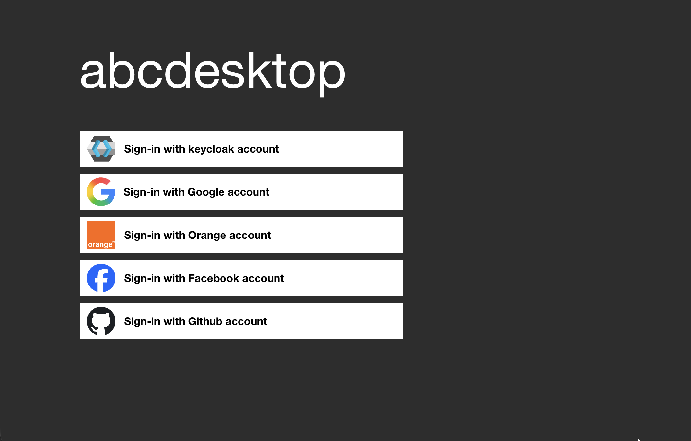
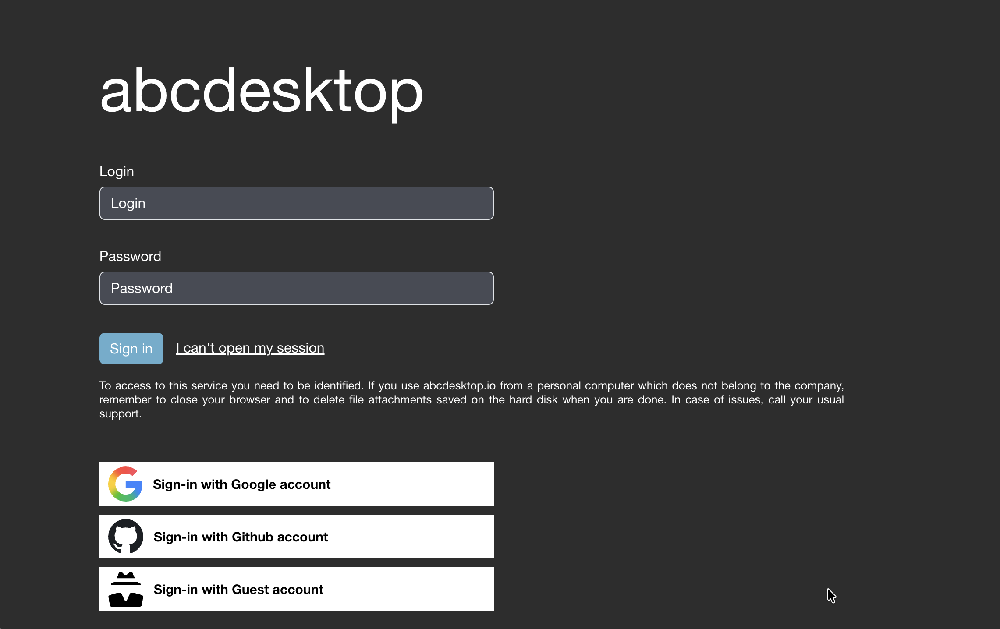

# Authentication Overview

## Configuration File

Authentication in abcdesktop.io is configured in the `od.config` file, which is stored as a Kubernetes ConfigMap. This section requires modifying the `od.config` configuration file. Refer to [Updating the Configuration File](../configure/updateconfiguration.md) for the procedure to apply changes in a Kubernetes cluster.

## The `authmanagers` Dictionary

The `authmanagers` object is the root authentication configuration dictionary:

```
authmanagers: {
  'external': {},
  'explicit': {},
  'implicit': {}}
```

The `od.config` file supports four `authmanagers` entry types:

- `external` — OAuth 2.0 / OpenID Connect authentication (Google, GitHub, Facebook, and other OIDC providers)
- `explicit` — Directory service authentication via LDAP, LDAPS, or Microsoft Active Directory
- `metaexplicit` — Microsoft Active Directory cross-domain and cross-forest trust authentication, with support for Foreign Security Principals (FSPs)
- `implicit` — Anonymous (always-allow) authentication and SSL/TLS client certificate authentication

## Authentication Manager Reference

| `authmanagers` Type | Description |
|--------------------|-------------|
| [`external`](authexternal.md) | OAuth 2.0 / OpenID Connect authentication |
| [`metaexplicit`](authmetaexplicit.md) | Microsoft Active Directory cross-domain trust authentication with Foreign Security Principal and Special Identity support |
| [`explicit`](authexplicit.md) | LDAP, LDAPS, Active Directory, and Kerberos authentication |
| [`implicit`](authimplicit.md) | Anonymous, always-allow, and SSL/TLS client certificate authentication |

## Prerequisites

Before configuring authentication, read:

- [Updating the Configuration File](../configure/updateconfiguration.md) — Learn how to apply `od.config` changes in a Kubernetes cluster.

## Configuring the `authmanagers` Dictionary

Edit the `od.config` file and initialize the `authmanagers` dictionary with empty provider entries for all manager types:

```
authmanagers: {
  'external': {},
  'explicit': {},
  'implicit': {}}
```

??? warning "JSON Dictionary Syntax"
    ```
    When defining a dictionary, the closing `}` must appear on the same line as the last entry. Example:
    authmanagers: {
      'external': {},
      'explicit': {},
      'implicit': {}}
    ```

To apply the changes, recreate the `abcdesktop-config` ConfigMap and restart the `pyos` deployment:

```
kubectl create -n abcdesktop configmap abcdesktop-config --from-file=od.config  -o yaml --dry-run | kubectl replace -n abcdesktop -f -
kubectl rollout restart deployment pyos-od -n abcdesktop
```

Open a web browser and navigate to `http://localhost:30443`:


The login page displays no authentication providers until at least one provider is configured.

## `implicit` Authentication

`implicit` is the simplest authentication mode. It grants anonymous, always-allow access without requiring user credentials.


See [Authentication: implicit](authimplicit.md) for configuration details.

## `explicit` Authentication

`explicit` authentication integrates with directory services such as LDAP, LDAPS, and Microsoft Active Directory. Users authenticate by providing a username and password, which are validated against the configured directory server.


See [Authentication: explicit](authexplicit.md) for configuration details.

## `metaexplicit` Authentication

The `metaexplicit` authentication manager enables authentication across [multiple Active Directory domains or forests through trust relationships](https://learn.microsoft.com/en-us/entra/identity/domain-services/concepts-forest-trust). It reads the user's domain from a metadirectory attribute and delegates authentication to the user's home domain. This provider supports Foreign Security Principals (FSPs) and Special Identities.


See [Authentication: metaexplicit](authmetaexplicit.md) for configuration details.

## `external` Authentication

`external` authentication delegates to external OAuth 2.0 providers, including [Google OAuth 2.0](https://developers.google.com/identity/protocols/oauth2), [GitHub OAuth 2.0](https://docs.github.com/en/developers/apps/building-oauth-apps/authorizing-oauth-apps), Facebook, Orange, and any OIDC-compliant identity provider.



See [Authentication: external](authexternal.md) for configuration details.

## Combining Multiple Authentication Providers

abcdesktop.io supports combining `external`, `explicit`, and `implicit` providers in a single `authmanagers` dictionary. The login page renders a button or form for each configured provider.

Example of a combined configuration:



The following `authmanagers` configuration produces the combined login page shown above:

```json
authmanagers: {
  'external': {
    'providers': {
      'google': { 
        'icon': 'img/auth/google_icon.svg',
        'displayname': 'Google', 
        'textcolor': '#000000',
        'backgroundcolor': '#FFFFFF',
        'enabled': True,
        'client_id': 'xxxx', 
        'client_secret': 'xxxx',
        'userinfo_auth': True,
        'scope': [ 'https://www.googleapis.com/auth/userinfo.email',  'openid' ],
        'userinfo_url': 'https://www.googleapis.com/oauth2/v1/userinfo',
```
