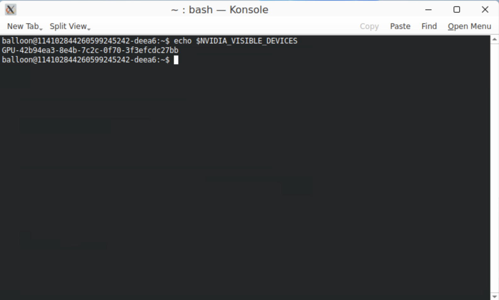

# Troubleshooting NVIDIA GPU Access to Ephemeral Containers with CDI Enabled


abcdesktop deploys applications as ephemeral containers or pods. NVIDIA provides support for the [Container Device Interface](https://docs.nvidia.com/datacenter/cloud-native/container-toolkit/latest/cdi-support.html), which enables GPU resource allocation without requiring privileged access.


## Apply `runtimeClassName` to the abcdesktop Configuration


Retrieve the `od.config` file.

If you do not already have a local copy of `od.config`, run the following command:

```
kubectl -n abcdesktop get configmap abcdesktop-config -o jsonpath='{.data.od\.config}' > od.config
```

Edit `od.config` and update the `executeclasses` dictionary to set `'runtimeClassName': 'nvidia'` for the appropriate execution class entries, then save the file.

```
# THIS IS WHERE THE RESOURCES ARE ACTUALLY DEFINED FOR THE POD DESKTOP.
# Application execute class defined
executeclasses : {
    'default':{
      'nodeSelector':None,
      'description': 'default: up to 4 CPU cores and 8Gi',
      'runtimeClassName': None,
      'resources':{
        'requests':{'memory':'576Mi','cpu':'220m'},       
        'limits':  {'memory':'8Gi','cpu':'4000m'}
      }
    },
    'bronze':{
      'nodeSelector':None,
      'runtimeClassName': None,
      'description': 'bronze: up to 2 CPU cores and 8Gi',
      'resources':{
        'requests':{'memory':'576Mi','cpu':'220m'},
        'limits':  {'memory':'8Gi','cpu':'2000m'}
      }
    },
    'silver':{
      'nodeSelector': None,
      'description': 'silver: 4 CPU cores and 32Gi RAM',
      'runtimeClassName': None,
      'resources':{
        'requests':{'memory':'2Gi','cpu':'2000m'},       
        'limits':{'memory':'32Gi','cpu':'4000m'} 
      }
    },
  'gold':{
    'nodeSelector':{'nvidia.com/gpu.present': 'true'},
    'description': 'gold: 4 CPU cores, 32Gi RAM and 1 GPU',
    'runtimeClassName': 'nvidia',
    'resources':{
      'requests':{'memory':"2Gi",'cpu':'4000m'},       
      'limits':{'memory':"32Gi",'cpu':'4000m'}
    }
  },
  'platinum':{
    'nodeSelector':{'nvidia.com/gpu.present':'true'},
    'description': 'platinum: 8 CPU cores, 128G RAM and 1 GPU',
    'runtimeClassName': 'nvidia',
    'resources':{
      'requests':{'memory':'4Gi','cpu':'4000m'},       
      'limits':{'memory':'128Gi','cpu':'8000m'} } } }
      
# features_permissions
# read executeclasses and permit a user to set a dedicated class name as desktop features
# 'read'   features_permissions is exposed to the frontend
# 'submit' features_permissions can be set to create a desktop
# 
desktop.features_permissions : [ 'read', 'submit' ]
```

```
desktop.overwrite_environment_variable_for_application : "/composer/overwrite_environment_variable_for_application.sh"
```


The `overwrite_environment_variable_for_application.sh` Bash script runs inside the `graphical` container of the user's pod.

```
gpu_uuid=$(nvidia-smi --query-gpu=gpu_uuid --format=csv,noheader)
# NVIDIA_VISIBLE_DEVICES is also know as k8s.device-plugin.nvidia.com/gpu
# define the variable named k8s.device-plugin.nvidia.com/gpu to the $gpu_uuid value
NVIDIA_GPU="{ \"k8s.device-plugin.nvidia.com/gpu\" : \"$gpu_uuid\" }"  
```

It reads the GPU UUID, then sets the variable `NVIDIA_GPU` to `k8s.device-plugin.nvidia.com/gpu=$gpu_uuid`.

For example, when `overwrite_environment_variable_for_application.sh` is executed on a GPU-equipped host:

``` bash
echo $NVIDIA_GPU
{ "k8s.device-plugin.nvidia.com/gpu" : "GPU-42b94ea3-8e4b-7c2c-0f70-3f3efcdc27bb" }
```

A newly launched application container inherits the `NVIDIA_VISIBLE_DEVICES` environment variable from the Bash script result. For example, running `echo $NVIDIA_VISIBLE_DEVICES` inside a new container returns the same GPU UUID:

```
echo $NVIDIA_VISIBLE_DEVICES
GPU-42b94ea3-8e4b-7c2c-0f70-3f3efcdc27bb
```

The following screenshot shows an ephemeral application sharing the GPU of the user's pod:



The screenshot displays the `$NVIDIA_VISIBLE_DEVICES` value and the output of the `nvidia-smi` command.


Update the `abcdesktop-config` ConfigMap:


```
kubectl create -n abcdesktop configmap abcdesktop-config --from-file=od.config -o yaml --dry-run=client | kubectl replace -n abcdesktop -f -
```

Restart the `pyos-od` deployment:

```
kubectl rollout restart deployment pyos-od -n abcdesktop
```

Create a new desktop pod to verify the `runtimeClassName`:


```
kubectl get pods -l type=x11server -n abcdesktop
NAME        READY   STATUS    RESTARTS   AGE
fry-02f18   3/3     Running   0          24m
```


Run commands inside an ephemeral container.

Start an application such as `firefox` from the web interface.


Retrieve the pod description to identify the ephemeral container name:

```
kubectl describe  pods fry-02f18  -n abcdesktop
```

The ephemeral container name is `philip-j--fry-firefox-745f9`:

```
...
  Normal  Pulled     26m   kubelet            Container image "ghcr.io/abcdesktopio/firefox.d:4.3" already present on machine
  Normal  Created    26m   kubelet            Created container: philip-j--fry-firefox-745f9
  Normal  Started    26m   kubelet            Started container philip-j--fry-firefox-745f9
```

Execute the following commands inside the ephemeral container `philip-j--fry-firefox-745f9` to verify GPU access:

```
kubectl exec -it fry-02f18 -c philip-j--fry-firefox-745f9 -n abcdesktop -- nvidia-smi -L
GPU 0: Quadro M620 (UUID: GPU-b5aebea9-8a25-fb21-631b-7e5da5a60ccb)
```

```
kubectl exec -it fry-02f18 -c philip-j--fry-firefox-745f9 -n abcdesktop -- ls -la /dev/dri
total 0
drwxr-xr-x 3 root root      100 janv. 13 15:05 .
drwxr-xr-x 6 root root      480 janv. 13 15:05 ..
drwxr-xr-x 2 root root       80 janv. 13 15:05 by-path
crw-rw-rw- 1 fry  fry  226,   1 janv. 13 15:05 card1
crw-rw-rw- 1 fry  fry  226, 128 janv. 13 15:05 renderD128
```


## Reference Links

- NVIDIA GPU Operator 23.6.2

[https://docs.nvidia.com/datacenter/cloud-native/gpu-operator/23.6.2/cdi.html#support-for-multi-instance-gpu](https://docs.nvidia.com/datacenter/cloud-native/gpu-operator/23.6.2/cdi.html#support-for-multi-instance-gpu) 

