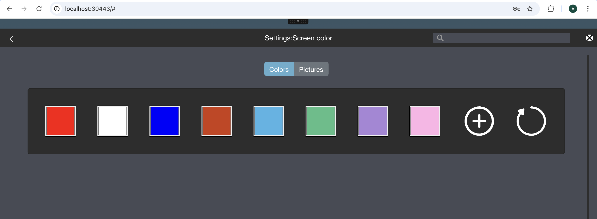

# How to edit the abcdesktop configuration file 

Th abcdesktop configuration file name is `od.config`. 
This file has the [cherrypy file format](https://docs.cherrypy.dev/en/stable/config.html) 
When the pyos process starts, it read the `od.config` file.
If something is wrong, the pyos process hangs. The command line `kubectl logs -l name=pyos-od  -n abcdesktop` write the pyos log on stdout.


## Edit your configuration file 

If the `od.config` file does not exist, extract it from the abcdesktop-config configmap to a local file `od.config`

```
kubectl -n abcdesktop get configmap abcdesktop-config -o jsonpath='{.data.od\.config}' > od.config
```

You get a the new local file `od.config`


To make change, edit your own `od.config` file

```bash
vim od.config 
```

## Make changes

Change the `defaultbackgroundcolors` option in the desktop options.

Locate the line `desktop.defaultbackgroundcolors` and update the first entries with the values `'#FF0000', '#FFFFFF',  '#0000FF'`

```json
desktop.defaultbackgroundcolors : [ '#FF0000', '#FFFFFF',  '#0000FF', '#CD3C14', '#4BB4E6', '#50BE87', '#A885D8', '#FFB4E6' ]
```

Save your local file `od.config`.


## Apply changes 

To apply changes, you have to replace the `abcdesktop-config`, by running the `replace kubectl` command line option. Then `rollout restart`the `pyos` pod. 

```
kubectl create -n abcdesktop configmap abcdesktop-config --from-file=od.config  -o yaml --dry-run | kubectl replace -n abcdesktop -f -
kubectl rollout restart deployment pyos-od -n abcdesktop
```

You've done it.

## Check your changes

To check that the new colours are presents in front, open the url `http://localhost:30443`, in your web browser, to start a simple abcdesktop.io container. 

```
http://localhost:30443
```

You should see the abcdesktop.io home page.

Press the `Sign-in Anonymously, have look`

At the right top corner, click on the menu and choose `Settings`, then click on `Screen Colors`

Choose your colour and you should have it as background colour :



Great, you can easily update your configuration file `od.config`. 

