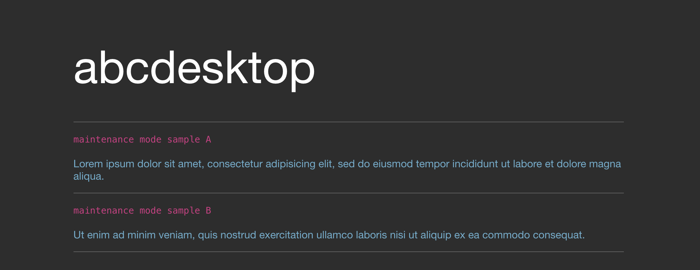
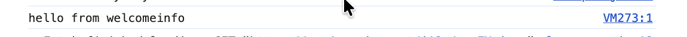
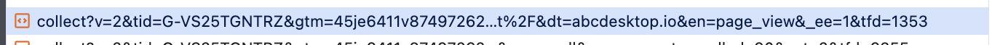

---
tags:
  - config
---

# Welcome

## welcomeinfo

### Description

`welcomeinfo` permits to display messages on the login page.

```json
welcomeinfo: { 'welcome': [] }
```


`welcomeinfo.welcome` is a list of dictionaries, with the following entries

- `notbefore`: date time
- `notafter`: date time
- `script` (optional) `{ 'async': boolean, 'src': uri }` or `{ 'data' : 'javascript code' } `
- `title` and `information` (optional)

### Sample

```json
# welcomeinfo
# Show a welcome message to the login page
welcomeinfo: {
  'welcome': [
   { 'notbefore': '01 Dec 2023 00:00:00 GMT',
      'notafter':  '01 Dec 2026 00:12:00 GMT',
       'title': 'maintenance mode sample A',
       'information': 'Lorem ipsum dolor sit amet, consectetur adipisicing elit, sed do eiusmod tempor incididunt ut labore et dolore magna aliqua.'
    },
    { 'notbefore': '03 Dec 2023 22:12:00 GMT',
      'notafter':  '04 Dec 2026 00:12:00 GMT',
      'title': 'maintenance mode sample B',
      'information': 'Ut enim ad minim veniam, quis nostrud exercitation ullamco laboris nisi ut aliquip ex ea commodo consequat.'
    } ] }
```


The login page shows the messages :




### Script

`welcomeinfo` can also load `javascript` source code, from another uri or from string.
The `javascript` code is embedded in the abcdesktop login page.

#### `data`

```json
welcomeinfo: {
  'welcome': [
    {
      'notbefore': '01 Dec 2023 00:00:00 GMT',
      'notafter':  '01 Dec 2026 00:12:00 GMT',
      'script': {
        'data': 'console.log(\'hello from welcomeinfo \');'
      }
    },
    { 'notbefore': '01 Dec 2023 00:00:00 GMT',
      'notafter':  '01 Dec 2026 00:12:00 GMT',
       'title': 'maintenance mode sample A',
       'information': 'Lorem ipsum dolor sit amet, consectetur adipisicing elit, sed do eiusmod tempor incididunt ut labore et dolore magna aliqua.'
    },
    { 'notbefore': '03 Dec 2023 22:12:00 GMT',
      'notafter':  '04 Dec 2026 00:12:00 GMT',
      'title': 'maintenance mode sample B',
      'information': 'Ut enim ad minim veniam, quis nostrud exercitation ullamco laboris nisi ut aliquip ex ea commodo consequat.'
    } ] }
```


On the web browser console you can read



#### `src` and `async`

`src` and `async` are aloso supported by `script` to load uri ( `sync`or `async` ).

This example loads `https://www.googletagmanager.com/gtag/js?id=G-VS25TGNTRZ` with `async` to `False`, and then loads javascript string source code from

```json
      window.dataLayer = window.dataLayer || [];\
      function gtag(){dataLayer.push(arguments);}\
      gtag(\'js\', new Date());\
      gtag(\'config\', \'G-VS25TGNTRZ\');
```

A complete example to embed Google Tag Manager

```json
welcomeinfo: {
  'welcome': [
    { 'notbefore': '04 Dec 2023 00:12:00 GMT',
      'notafter':  '08 Dec 2026 00:12:00 GMT',
      'script' : {
        'async': False,
        'src': 'https://www.googletagmanager.com/gtag/js?id=G-VS25TGNTRZ'
      }
    },
    {
      'notbefore': '01 Dec 2023 00:00:00 GMT',
      'notafter':  '01 Dec 2026 00:12:00 GMT',
      'script': {
        'data': '\
          window.dataLayer = window.dataLayer || [];\
          function gtag(){dataLayer.push(arguments);}\
          gtag(\'js\', new Date());\
          gtag(\'config\', \'G-VS25TGNTRZ\');'
      }
    },
    { 'notbefore': '01 Dec 2023 00:00:00 GMT',
      'notafter':  '01 Dec 2026 00:12:00 GMT',
       'title': 'maintenance mode',
       'information': 'Lorem ipsum dolor sit amet, consectetur adipisicing elit, sed do eiusmod tempor incididunt ut labore et dolore magna aliqua.'
    },
    { 'notbefore': '03 Dec 2023 22:12:00 GMT',
      'notafter':  '04 Dec 2026 00:12:00 GMT',
      'title': 'maintenance mode',
      'information': 'Ut enim ad minim veniam, quis nostrud exercitation ullamco laboris nisi ut aliquip ex ea commodo consequat.'
    } ] }
```
On the web browser network page you can read the fetch http request to `google-analytics.com` web site.



Great, you have define welcome info messages to show maintenance informations, and add some javascript source code if need.
