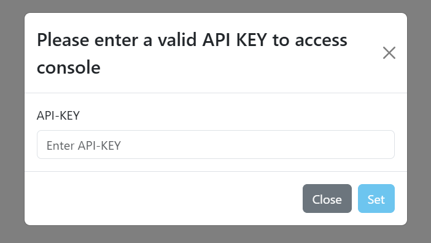
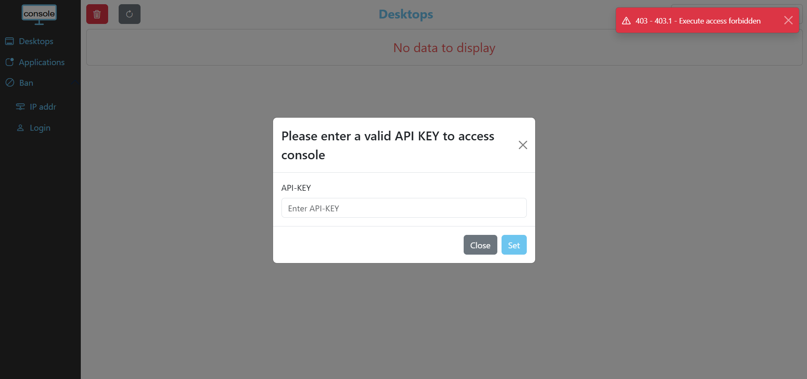
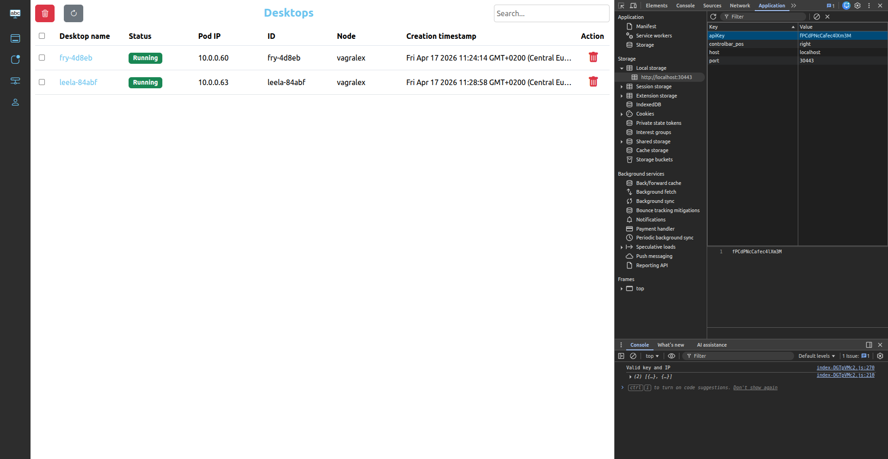

# Controllers 

## Controllers

abcdesktop is built on the Model-View-Controller (MVC) pattern. MVC separates an application's logic into three interconnected components, decoupling the internal representation of data from how that data is presented to and received from the user.

The following table lists all abcdesktop controllers and their descriptions:

| Controller               |  Description   |
|--------------------------|--------------- |
|`AccountingController`    | Accounting data in JSON format |
|`AuthController`          | Authenticate users |
|`ComposerController`      | CRUD operations for core services (e.g., `createDesktop`, `createApplication`) |
|`CoreController`          | Retrieve configuration and user message information |
|`ManagerController`       | Manage services (e.g., adding an application); used by the console service |
|`UserController`          | Retrieve user information |


## Access Permission

The `controllers` configuration is a dictionary, and is defined in the pyos's `od.config` file. 

```json
controllers : { 
	'AccountingController': { 
		'apikey': [ 'fPCdPNcCafec4lXm3M' ],
		'permitip': [ '10.0.0.0/8', '172.16.0.0/12', '192.168.0.0/16', 'fd00::/8', '169.254.0.0/16', '127.0.0.0/8' ] 
	},
	'ManagerController': { 
	   'database_acl': [ 'get', 'put', 'delete' ],
		'apikey': [ 'fQDbvjCafec4l', 'KzH23EZjCZSfsd9'],
		'permitip': [ '10.0.0.0/8', '172.16.0.0/12', '192.168.0.0/16', 'fd00::/8', '169.254.0.0/16', '127.0.0.0/8' ] 
	},
	'AuthController' : 		{ 'permitip': None },
	'ComposerController' : { 'requestsallowed' : { 'getdesktopdescription': True } },
	'CoreController' : 		{ 'permitip': None },
	'UserController' : 		{ 'permitip': None }
} 
```

By default, access to `AccountingController` and `ManagerController` is protected by IP source filters or by an `apikey`. The default configuration permits connections from private network ranges defined in [RFC 1918](https://tools.ietf.org/html/rfc1918) and [RFC 4193](https://tools.ietf.org/html/rfc4193). For more information, see [Private network](https://en.wikipedia.org/wiki/Private_network).

By default, all other controllers are accessible without restriction.

### Access control filter 

The access control filter configuration is defined as a JSON dictionary. Each dictionary entry uses the controller name as its key and accepts the sub-entries `permitip` and/or `apikey`.

- The `permitip` value is a list of subnets, for example `[ '10.0.0.0/8', '172.16.0.0/12' ]`. If `permitip` is not set, or if the controller is not defined in the configuration, IP-based filtering is disabled.
- The `apikey` value is a list of strings, for example `[ 'fPCdPSSj8gZri1Ncmg', 'Z9pXCa2y6ccDeBBeeUc4' ]`. If `apikey` is not set, or the controller is not defined, API key filtering is disabled. The HTTP header used to pass the key is `X-API-Key`.

If the source IP address is denied, the HTTP response status is `403 Forbidden`:
	
```json
{"status": 403, "status_message": "403 Forbidden", "message": "Request forbidden -- authorization will not help"} 
```


## Curl http requests sample

### Curl http request with `X-API-Key`

Add the http header `X-API-Key: fQDbvjCafec4l` to the curl command to list images

```bash
curl -X GET -H 'X-API-Key: fQDbvjCafec4l' -H 'Content-Type: text/javascript' http://localhost:30443/API/manager/images
```

The command returns

```json
{}
```

Add the http header `X-API-Key: fQDbvjCafec4l` to the curl command to add new application

```bash
curl -X POST -H 'X-API-Key: fQDbvjCafec4l'  -H 'Content-Type: text/javascript' http://localhost:30443/API/manager/image -d@xeyes.d.{{ abcdesktop.latest_release }}.json
```

The command returns

```json
[
 {	"cmd": ["/composer/appli-docker-entrypoint.sh"], 
 	"path": "/usr/bin/xeyes", 
 	"sha_id": "sha256:4ed2e110042b80f1634d8f3ae66b793914db813f53cd88811285448602d7540e", 
 	"id": "abcdesktopio/xeyes.d:3.0", 
 	"rules": {}, 
 	"acl": {"permit": ["all"]}, 
 	"launch": "xeyes.XEyes", 
 	"name": "xeyes", 
 	"icon": "circle_xfce4-eyes.svg", 
 	"keyword": "xeyes,eyes", 
 	"uniquerunkey": null, 
 	"cat": "utilities", 
 	"args": null, 
 	"execmode": null, 
 	"showinview": null, 
 	"displayname": "xeyes", 
 	"home": null, 
 	"desktopfile": null, 
 	"executeclassname": null, 
 	"executablefilename": "xeyes", 
 	"usedefaultapplication": false, 
 	"mimetype": [], 
 	"fileextensions": [], 
 	"legacyfileextensions": [], 
 	"secrets_requirement": null,
 	"containerengine": "ephemeral_container", 
 	"securitycontext": {}
 }
]
```

### Curl http request forbidden

```bash
curl -X DELETE -H 'Content-Type: text/javascript' http://localhost:30443/API/manager/images
```

The command returns

```json
{"status": 403, "message": "Request forbidden -- authorization will not help"}
```
 
## Requests through console

### Deal with console and `X-API-KEY`

As described above, when an `apikey` is configured, requests sent to pyos must include the `X-API-KEY` header containing the `apikey` string. When you connect to the console, a popup will appear prompting you to enter the `ManagerController apikey`.



If you close the popup without entering a valid `apikey`, or if you enter an incorrect one, the popup will reappear until a correct `apikey` is provided. An error message is also displayed in the top-right corner.



Once a valid `apikey` is entered, it is stored in your browser's `LocalStorage` so that you do not need to re-enter it each time you connect to the console.

