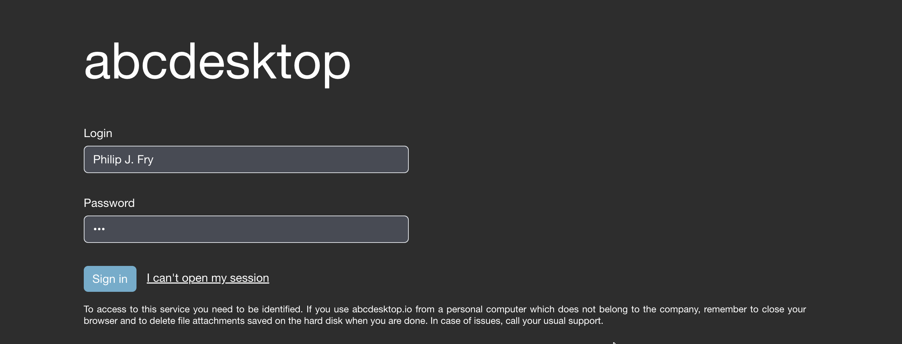
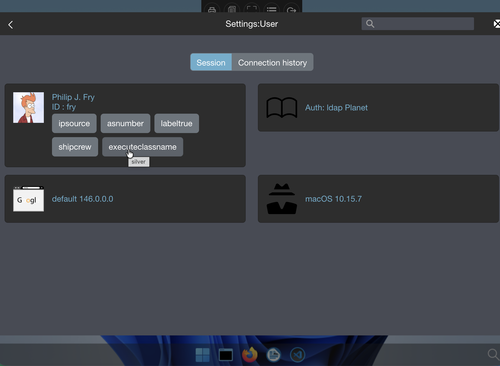
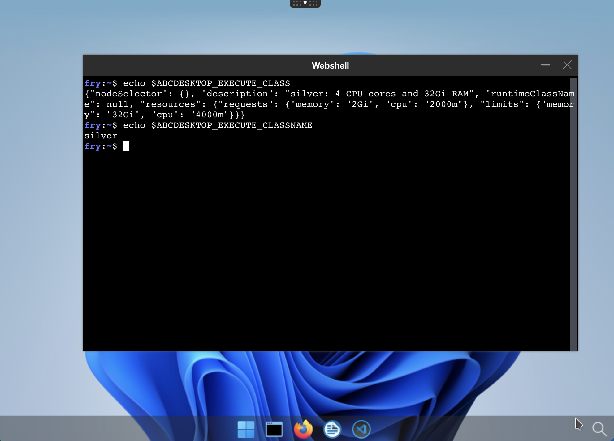
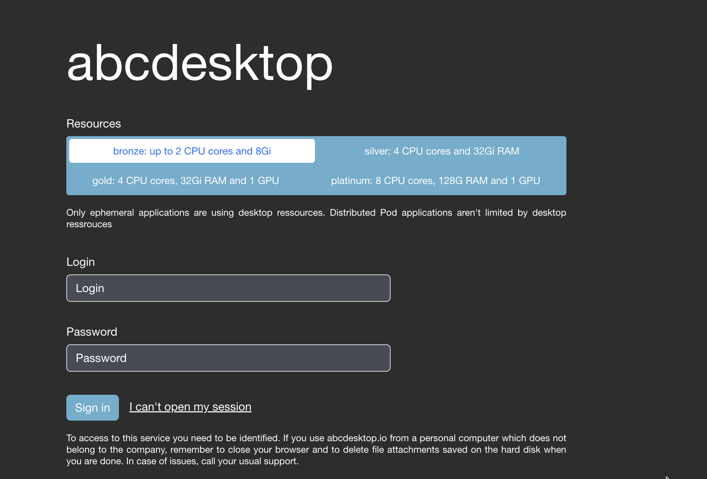
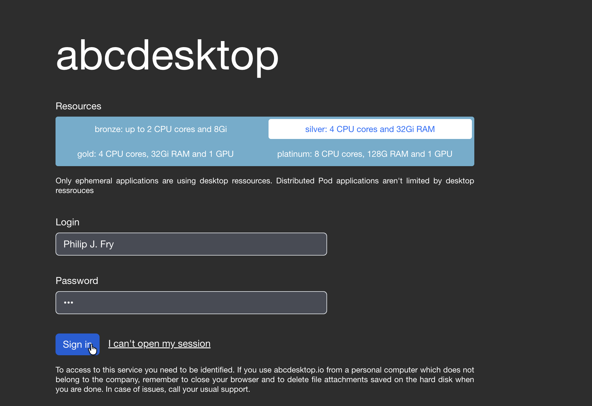

# executeclasses 

The executeclasses defines the resources for the desktop pods and for applications.
`executeclasses` defines how to adjust the resources for your pods either by creating rules or by allowing your users to select from the resources already defined.
The executeclasses is a dictionary, each entry describes the resources.


## `executeclasses` dictionary

```
executeclasses : {
  'default':{
    'nodeSelector':None,
    'description': 'default: up to 4 CPU cores and 8Gi',
    'runtimeClassName': None,
    'resources':{
      'requests':{'memory':"576Mi",'cpu':"220m"},       
      'limits':  {'memory':"8Gi",'cpu':"4000m"}
    }
  },
  'bronze':{
    'nodeSelector':None,
    'runtimeClassName': None,
    'description': 'bronze: up to 2 CPU cores and 8Gi',
    'resources':{
      'requests':{'memory':"576Mi",'cpu':"220m"},
      'limits':  {'memory':"8Gi",'cpu':"2000m"}
    }
  },
  'silver':{
    'nodeSelector': None,
    'description': 'silver: 4 CPU cores and 32Gi RAM',
    'runtimeClassName': None,
    'resources':{
      'requests':{'memory':"2Gi",'cpu':"2000m"},       
      'limits':{'memory':"32Gi",'cpu':"4000m"} 
    }
  },
  'gold':{
    # give a gpu to graphical container
    'containers' : { 'graphical': { 'resources': { 'limits': { 'nvidia.com/gpu':'1' } } } },
    'nodeSelector':{'nvidia.com/gpu': 'true'},
    'description': 'gold: 4 CPU cores, 32Gi RAM and 1 GPU',
    'runtimeClassName': 'nvidia',
    'resources':{
      'requests':{'memory':"2Gi",'cpu':"4000m"},       
      'limits':  {'memory':"32Gi",'cpu':"4000m"}
    }
  },
  'platinum':{
    # give a gpu to graphical container
    'containers' : { 'graphical': { 'resources': { 'limits': { 'nvidia.com/gpu':'1' } } } },
    # nodeselector optional 
    'nodeSelector':{'nvidia.com/gpu': 'true'},
    # this appears only on web interface 
    'description': 'platinum: 8 CPU cores, 128G RAM and 1 GPU',
    'runtimeClassName': 'nvidia',
    'resources':{
      'requests':{'memory':"4Gi",'cpu':"4000m"},       
      'limits':{'memory':"128Gi",'cpu':"8000m"} 
    }
  }}
```
  
The entry `'default'` must exist.


| key                | type    | Description  | Values | 
|--------------------|---------|--------------|--------|
| containers         | dict    | update the container with dict values |  { `'graphical': { 'resources': { 'limits': { 'nvidia.com/gpu':'1' } } } }` |
| nodeSelector       | dict    | update the nodeSelector with dict values  | `{'nvidia.com/gpu': 'true'}` |
| description        | string  | show description in the login page|  'platinum: 8 CPU cores, 128G RAM and 1 GPU' |
| runtimeClassName.  | string  | (optional) name of the runtime class | 'nvidia'|
| resources          | dict    | pods resources | `{ 'requests' {'memory':"4Gi",'cpu':"4000m"}, 'limits':{'memory':"128Gi",'cpu':"8000m"} }` |


## Define the `executeclassname` value

The `executeclassname` variable  is an entry in the `executeclasses` dictionary. It defines the `resources`, `nodeSelector` and `runtimeClassName` of a user's pod.
The `executeclassname` value is set during the auth process.

By himself, a user can to choose the `executeclassname` value from a list, or set the `executeclassname` value using rules. 
If the `executeclassname` is not set the `executeclassname` is set to the string `default` and the executeclasses is set to `executeclasses['default']`.


### Set `executeclassname` by rules

Update your `od.config` file to add a new rule. The `label` of the rule must be `executeclassname`, and the `load` will set the value of the `executeclassname`.

```
	'rule-executeclass': {
            'conditions' : [ { 'memberOf': 'cn=ship_crew,ou=people,dc=planetexpress,dc=com',   'expected' : True  } ],
            'expected' : True,
            'label':'executeclassname',
            'load': 'silver'
    },
```

If the user is 'memberOf' the group 'cn=ship_crew,ou=people,dc=planetexpress,dc=com' when the label `executeclassname` is set to the value `silver`
A full example of the ldapconfig becomes like this one.

```
ldapconfig : {
    'planet': {
            'default'       : True,
            'ldap_timeout'  : 15,
            'ldap_protocol' : 'ldap',
            'ldap_basedn'   : 'ou=people,dc=planetexpress,dc=com',
            'servers'       : [ 'openldap' ],
            'serviceaccount': { 'login': 'cn=admin,dc=planetexpress,dc=com', 'password': 'GoodNewsEveryone' },
            'policies': {
                    'acls': None,
                    'rules' : {
                            'rule-dummy' : {
                              'conditions' : [ {'boolean':True, 'expected':True } ],
                                                            'expected' : True,
                                                            'label':'labeltrue'
                            },
                            'rule-ship': {
                                    'conditions' : [ { 'memberOf': 'cn=ship_crew,ou=people,dc=planetexpress,dc=com',   'expected' : True  } ],
                                    'expected' : True,
                                    'label':'shipcrew'
                            },
                            'rule-executeclass': {
                                    'conditions' : [ { 'memberOf': 'cn=ship_crew,ou=people,dc=planetexpress,dc=com',   'expected' : True  } ],
                                    'expected' : True,
                                    'label':'executeclassname',
                                    'load': 'silver'
                            },
                            'rule-staff': {
                                    'conditions' : [ { 'memberOf': 'cn=admin_staff,ou=people,dc=planetexpress,dc=com', 'expected' : True  } ],
                                    'expected' : True,
                                    'label': 'adminstaff'
                            }
                    }
            } } }
```

- Save your new `od.config` file and reload your abcdesktop config 

```

```

Go to the abcdesktop url service, and choose a user member of `ship_crew`. 
`Philip J. Fry` is member of `ship_crew`.



> The pod is created with the requested resources.


- Get pod description

```
NAMESPACE=abcdesktop
kubectl get pods -l type=x11server -n $NAMESPACE
```

You should read on stdout

```
NAME             READY   STATUS    RESTARTS   AGE
fry-f7c42        4/4     Running   0          7s
```

Read the user's pod `fry-f7c42` description, replace `POD_NAME` with your own pod.

```
NAMESPACE=abcdesktop
POD_NAME=fry-f7c42
kubectl describe pods $POD_NAME -n $NAMESPACE
```

A label `executeclassname` is set to the user's pod

```
Labels:           abcdesktop/role=desktop
                  access_provider=planet
                  access_providertype=ldap
                  access_userid=fry
                  access_username=philip-j.-fry
                  executeclassname=silver
                  ...
```

The resources limits and requests are set from the `silver` executeclass.

```
Resources:
  Limits:
    cpu:     4
    memory:  32Gi
  Requests:
    cpu:     2
    memory:  2Gi
```

- Read the executeclasse information from the web user interface

The dialog box `settings`:`user information` shows the user's labels 



The current user chooses `silver`


- Open a webshell to read the environment variables.



Inside the pod, the environment variable `ABCDESKTOP EXECUTE_CLASSNAME` is set to the value `silver`

```
echo $ABCDESKTOP EXECUTE_CLASSNAME
silver
```

Inside the pod, the environment variable `ABCDESKTOP EXECUTE_CLASS` is set to the selected json value.

```
echo $ABCDESKTOP_EXECUTE_CLASS
{"nodeSelector": {}, "description": "silver: 4 CPU cores and 32Gi RAM", "runtimeClassName": null, "resources": {"requests": {"memory": "2Gi", "cpu": "2000m"}, "limits": {"memory": "32Gi", "cpu": "4000m"}}}
```


### Let user choose the `executeclassname`

To permit user to choose the `executeclassname`, change the option `desktop.features_permissions` in your abcdesktop config file.
`desktop.features_permissions` is a list of string.


```
# features_permissions
# read executeclasses and permit a user to set a dedicated class name as desktop features
# 'read' features_permissions is exposed to the frontend
# 'submit' features_permissions can be set to create a desktop
# 
desktop.features_permissions : [ 'read', 'submit' ]
```

- to display the `desktop.features_permissions` put `read` into the list
- to let user change the default executeclassname put `submit` into the list


This will change the abcdesktop login page, and write the `description` of each `executeclasses` entry, with the associated description.

In this case `desktop.features_permissions : [ 'read', 'submit' ]`



The user can choose on entry in the `executeclasses` values.



The `executeclassname` is set with the user's selected entry.


The current user chooses `silver`.


> The pod is created with the requested resources.


- List the labels of the user's pod.

A label `executeclassname` is set to the user's pod

```
Labels:           abcdesktop/role=desktop
                  access_provider=planet
                  access_providertype=ldap
                  access_userid=fry
                  access_username=philip-j.-fry
                  executeclassname=silver
                  ...
```

The resources limits and requests are set from the `silver` executeclass.

```
Resources:
  Limits:
    cpu:     4
    memory:  32Gi
  Requests:
    cpu:     2
    memory:  2Gi
```
                 
The dialog box `settings`:`user information` shows the user's labels 


The current user chooses `silver`

- Open a webshell to read the environment variables.


Inside the pod, the environment variable `ABCDESKTOP EXECUTE_CLASSNAME` is set to the value `silver`

```
echo $ABCDESKTOP EXECUTE_CLASSNAME
silver
```

Inside the pod, the environment variable `ABCDESKTOP EXECUTE_CLASS` is set to the selected json value.

```
echo $ABCDESKTOP_EXECUTE_CLASS
{"nodeSelector": {}, "description": "silver: 4 CPU cores and 32Gi RAM", "runtimeClassName": null, "resources": {"requests": {"memory": "2Gi", "cpu": "2000m"}, "limits": {"memory": "32Gi", "cpu": "4000m"}}}
```


Great! You can adjust the resources for your pod either by creating rules or by allowing your users to select from the resources already defined in a dictionary.


 