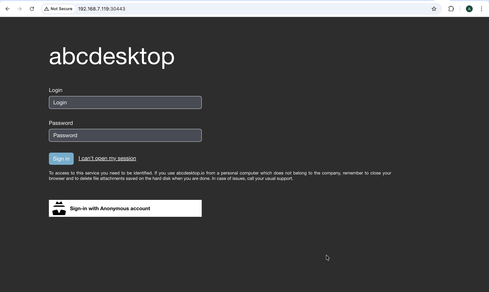

---
tags:
  - kind
  - installation
---

Kind is a tool for running local Kubernetes clusters using Docker container “nodes”. Kind was primarily designed for testing Kubernetes itself, but it can be used to deploy Kubernetes applications as well. To install or setup `kind`, refer to the [Kind documentation](https://kind.sigs.k8s.io/)

## Requirements

* [kind](https://kind.sigs.k8s.io/docs/user/quick-start) command line installed
* [docker](https://docs.docker.com/engine/install) Docker Engine installed
* [kubectl](https://kubernetes.io/docs/tasks/tools/install-kubectl-linux/) command-line tool must be configured to communicate with your cluster
* `openssl` and `curl` command line must be installed too (only for install using kubectl)

## Create kind cluster

Run the command line to create

```bash
kind create cluster --wait 5m
```

> the `--wait 5m` wait for control-plane = Ready

You should read on stdout:

```log
Creating cluster "kind" ...
 ✓ Ensuring node image (kindest/node:v1.35.0) 🖼
 ✓ Preparing nodes 📦
 ✓ Writing configuration 📜
 ✓ Starting control-plane 🕹️
 ✓ Installing CNI 🔌
 ✓ Installing StorageClass 💾
 ✓ Waiting ≤ 5m0s for control-plane = Ready ⏳
 • Ready after 24s 💚
Set kubectl context to "kind-kind"
You can now use your cluster with:

kubectl cluster-info --context kind-kind

Thanks for using kind! 😊
```

## Run the install bash script

```bash
curl -sL https://raw.githubusercontent.com/abcdesktopio/conf/main/kubernetes/install-{{ abcdesktop.latest_release }}.sh |bash
```

??? note "show details"
    ```log
    [INFO] abcdesktop install script namespace=abcdesktop
    [OK] kubectl version
    [OK] openssl version
    [OK] kubectl create namespace abcdesktop
    writing RSA key
    writing RSA key
    [OK] abcdesktop_jwt_desktop_payload keys create
    writing RSA key
    [OK] abcdesktop_jwt_desktop_signing keys create
    writing RSA key
    [OK] abcdesktop_jwt_user_signing keys create
    [OK] create secret generic abcdesktopjwtdesktoppayload
    [OK] create secret generic abcdesktopjwtdesktopsigning
    [OK] create secret generic abcdesktopjwtusersigning
    [OK] label secret abcdesktopjwtdesktoppayload
    [OK] label secret abcdesktopjwtdesktopsigning
    [OK] label secret abcdesktopjwtusersigning
    [OK] mongod key file create
    ######################################################################## 100.0%
    [OK] downloaded source https://raw.githubusercontent.com/abcdesktopio/conf/main/kubernetes/abcdesktop-4.4.yaml
    ######################################################################## 100.0%
    [OK] downloaded source https://raw.githubusercontent.com/abcdesktopio/conf/main/reference/od.config.4.4
    [OK] kubectl create configmap abcdesktop-config --from-file=od.config -n abcdesktop
    [OK] label configmap abcdesktop-config abcdesktop/role=pyos.config
    [OK] default account is created
    [OK] role.rbac.authorization.k8s.io/pyos-role created
    rolebinding.rbac.authorization.k8s.io/pyos-rbac created
    serviceaccount/pyos-serviceaccount created
    configmap/version-config created
    configmap/configmap-mongodb-scripts created
    secret/secret-mongodb created
    configmap/abcdesktop-passwd-templatefile created
    configmap/abcdesktop-group-templatefile created
    configmap/abcdesktop-shadow-templatefile created
    configmap/abcdesktop-gshadow-templatefile created
    statefulset.apps/mongodb-od created
    deployment.apps/memcached-od created
    deployment.apps/router-od created
    deployment.apps/nginx-od created
    deployment.apps/speedtest-od created
    deployment.apps/pyos-od created
    deployment.apps/console-od created
    deployment.apps/openldap-od created
    service/desktop created
    service/memcached created
    service/mongodb created
    service/speedtest created
    service/pyos created
    service/console created
    service/http-router created
    service/website created
    service/openldap created
    [OK] pyos-serviceaccount account is created
    [INFO] waiting for deployment/console-od available
    [OK] deployment.apps/console-od condition met
    [INFO] waiting for deployment/memcached-od available
    [OK] deployment.apps/memcached-od condition met
    [INFO] waiting for deployment/nginx-od available
    [OK] deployment.apps/nginx-od condition met
    [INFO] waiting for deployment/openldap-od available
    [OK] deployment.apps/openldap-od condition met
    [INFO] waiting for deployment/pyos-od available
    [OK] deployment.apps/pyos-od condition met
    [INFO] waiting for deployment/router-od available
    [OK] deployment.apps/router-od condition met
    [INFO] waiting for deployment/speedtest-od available
    [OK] deployment.apps/speedtest-od condition met
    [INFO] waiting for pod/console-od-7789497dcf-d24rb Ready
    [OK] pod/console-od-7789497dcf-d24rb condition met
    [INFO] waiting for pod/memcached-od-54cdf9d684-rsqkg Ready
    [OK] pod/memcached-od-54cdf9d684-rsqkg condition met
    [INFO] waiting for pod/mongodb-od-0 Ready
    [OK] pod/mongodb-od-0 condition met
    [INFO] waiting for pod/nginx-od-6bf5fd7c7-54k7p Ready
    [OK] pod/nginx-od-6bf5fd7c7-54k7p condition met
    [INFO] waiting for pod/openldap-od-5c4646dc7f-bjsh9 Ready
    [OK] pod/openldap-od-5c4646dc7f-bjsh9 condition met
    [INFO] waiting for pod/pyos-od-6f88895f4d-g4cdm Ready
    [OK] pod/pyos-od-6f88895f4d-g4cdm condition met
    [INFO] waiting for pod/router-od-647b77455d-nk677 Ready
    [OK] pod/router-od-647b77455d-nk677 condition met
    [INFO] waiting for pod/speedtest-od-7d7c95d754-dmt5j Ready
    [OK] pod/speedtest-od-7d7c95d754-dmt5j condition met
    [INFO] list all pods in namespace abcdesktop
    NAME                            READY   STATUS    RESTARTS   AGE
    console-od-7789497dcf-d24rb     1/1     Running   0          4m38s
    memcached-od-54cdf9d684-rsqkg   1/1     Running   0          4m38s
    mongodb-od-0                    2/2     Running   0          4m38s
    nginx-od-6bf5fd7c7-54k7p        1/1     Running   0          4m38s
    openldap-od-5c4646dc7f-bjsh9    1/1     Running   0          4m38s
    pyos-od-6f88895f4d-g4cdm        1/1     Running   0          4m38s
    router-od-647b77455d-nk677      1/1     Running   0          4m38s
    speedtest-od-7d7c95d754-dmt5j   1/1     Running   0          4m38s
    [INFO] Setup done
    [INFO] Checking the service url on http://localhost:30443
    [INFO] service status is down
    [INFO] Looking for a free tcp port from 30443
    [OK] get a free tcp port from 30443

    [INFO] If you're using a cloud provider
    [INFO] Forwarding abcdesktop service for you on port=30443
    [INFO] For you setup is running the command 'kubectl port-forward router-od-647b77455d-nk677 --address 0.0.0.0 30443:80 -n abcdesktop'
    [OK] Please open your web browser and connect to

    [INFO] http://192.168.7.119:30443/
    ```

## How to connect ?

The install bash script forward the tcp port 30443 to the router pod port tcp 80

`kubectl port-forward router-od-647b77455d-nk677 --address 0.0.0.0 30443:80 -n abcdesktop`

```log
[OK] Please open your web browser and connect to

[INFO] http://192.168.7.119:30443/
```
> Open the URL returnes by the install bash script. In this sample `http://192.168.7.119:30443/`



Your web browser shows the abcdesktop service home page


The user `Philip J. Fry` is connected to the abcdesktop service

> Open the URL returnes by the install bash script. In this sample `http://192.168.7.119:30443/`

Great you have installed abcdesktop using kind and your web browser shows the abcdesktop service.

## Delete cluster

To uninstall, run the kind `delete` cluster command line:

```bash
kind delete cluster
```
