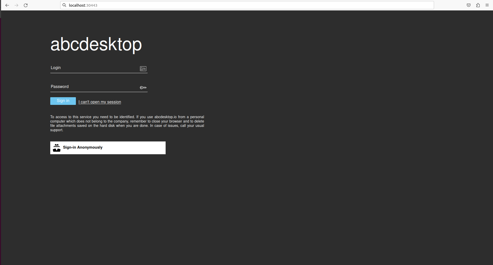
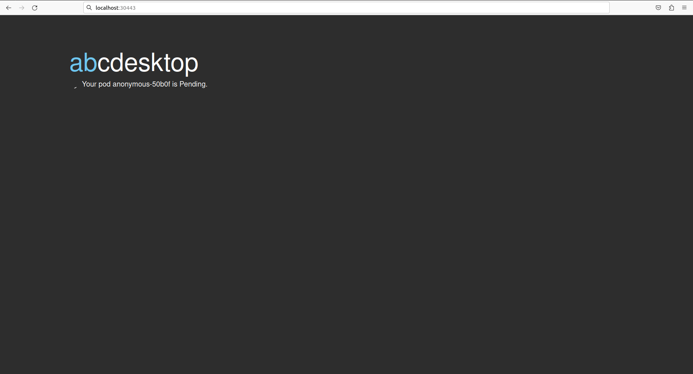
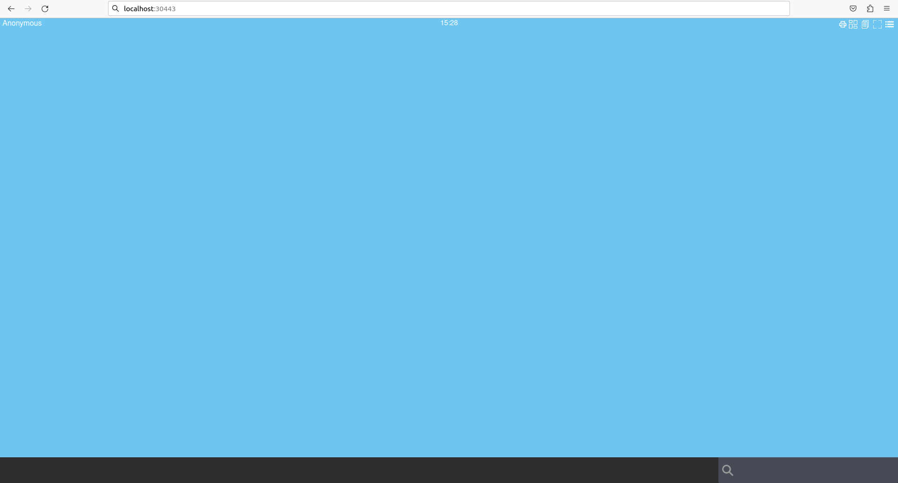

# Installation

## Requirements

- Kubernetes cluster in `READY` state
- `kubectl` or `minikube` command-line tool configured to communicate with your cluster
- `openssl` and `curl` command-line tools installed (required only when installing via kubectl)

You can run the **Quick installation process** or perform the **Manual installation step by step**.

> A Linux operating system is recommended to run abcdesktop.io.

??? Note "**Step 1:** Create abcdesktop namespace"
    Create the `abcdesktop` namespace:

    ``` shell
    kubectl create namespace abcdesktop
    ```

    You should read on the standard output

    ```
    namespace/abcdesktop created
    ```

## **Step 2:** Secure abcdesktop JWT exchange

The user JWT is signed, so a (private, public) RSA key pair is required for signing. The desktop JWT is both encrypted and signed, so a (private, public) RSA key pair is required for signing and a separate (private, public) RSA key pair is required to encrypt data.

* The JWT payload is encrypted with the abcdesktop jwt desktop payload private key by pyos.
* The JWT payload is decrypted with the abcdesktop jwt desktop payload public key by nginx.

> Use the payload private key as the encryption private key, and keep the payload public key private as well. Do not distribute this public key — it must remain private. This is a deliberate security design choice.

* The JSON Web Token payload is signed with the abcdesktop jwt desktop signing private key.
* The JSON Web Token payload is verified with the abcdesktop jwt desktop signing public key.

* The JSON Web Token user token is signed with the abcdesktop jwt user signing private key by pyos.
* The JSON Web Token user token is verified with the abcdesktop jwt user signing public key by pyos.
> Since multiple pods of pyos can run simultaneously, the same private and public key values are stored in a Kubernetes secret.

The abcdesktop jwt desktop payload public key is read by the `nginx lua script`. Exporting the public key requires the `RSAPublicKey_out` option to use the `RSAPublicKey` format. The `RSAPublicKey` format ensures key file compatibility between the `python 3.x jwt module` and the `lua jwt lib`.


The following commands generate all necessary cryptographic key pairs:

``` shell
# Desktop payload keys (encrypt/decrypt)
openssl genrsa -out abcdesktop_jwt_desktop_payload_private_key.pem 1024
openssl rsa -in abcdesktop_jwt_desktop_payload_private_key.pem \
    -outform PEM -pubout -out  _abcdesktop_jwt_desktop_payload_public_key.pem
openssl rsa -pubin -in _abcdesktop_jwt_desktop_payload_public_key.pem \
    -RSAPublicKey_out -out abcdesktop_jwt_desktop_payload_public_key.pem

# Desktop signing keys
openssl genrsa -out abcdesktop_jwt_desktop_signing_private_key.pem 1024
openssl rsa -in abcdesktop_jwt_desktop_signing_private_key.pem \
    -outform PEM -pubout -out abcdesktop_jwt_desktop_signing_public_key.pem

# User signing keys  
openssl genrsa -out abcdesktop_jwt_user_signing_private_key.pem 1024
openssl rsa -in abcdesktop_jwt_user_signing_private_key.pem \
    -outform PEM -pubout -out abcdesktop_jwt_user_signing_public_key.pem
```

Then, create the Kubernetes secrets from the generated key files:

``` shell
kubectl create secret generic abcdesktopjwtdesktoppayload \
    --from-file=abcdesktop_jwt_desktop_payload_private_key.pem \
    --from-file=abcdesktop_jwt_desktop_payload_public_key.pem \
    --namespace=abcdesktop

kubectl create secret generic abcdesktopjwtdesktopsigning \
    --from-file=abcdesktop_jwt_desktop_signing_private_key.pem \
    --from-file=abcdesktop_jwt_desktop_signing_public_key.pem \
    --namespace=abcdesktop

kubectl create secret generic abcdesktopjwtusersigning \
    --from-file=abcdesktop_jwt_user_signing_private_key.pem \
    --from-file=abcdesktop_jwt_user_signing_public_key.pem \
    --namespace=abcdesktop
```

The following output should appear on the standard output:

``` shell
secret/abcdesktopjwtdesktoppayload created
secret/abcdesktopjwtdesktopsigning created
secret/abcdesktopjwtusersigning created
```

Verify that all secrets were created successfully:

``` shell
kubectl get secrets -n abcdesktop
```

The following output should appear on the standard output:

```
NAME                          TYPE                                  DATA   AGE
abcdesktopjwtdesktoppayload   Opaque                                2      68s
abcdesktopjwtdesktopsigning   Opaque                                2      68s
abcdesktopjwtusersigning      Opaque                                2      67s
```

## **Step 3:** Download and create the abcdesktop config file  

Download the `od.config` file. This is the main configuration file for the `pyos` control plane service.

``` shell
curl https://raw.githubusercontent.com/abcdesktopio/conf/main/reference/od.config.{{ version }} --output od.config
```

Create the ConfigMap `abcdesktop-config` in the `abcdesktop` namespace:

``` shell
kubectl create configmap abcdesktop-config --from-file=od.config -n abcdesktop
```

The following output should appear on stdout:

``` shell
configmap/abcdesktop-config created
```

## **Step 4:** Create the abcdesktop pods and services

The `abcdesktop.yaml` file contains declarations for all roles, service accounts, pods, and services required by abcdesktop. Apply it to the `abcdesktop` namespace with the following command:

``` shell
kubectl create -n abcdesktop -f https://raw.githubusercontent.com/abcdesktopio/conf/main/kubernetes/abcdesktop-{{ version }}.yaml
```

The following output should appear on the standard output:

``` shell
role.rbac.authorization.k8s.io/pyos-role created
rolebinding.rbac.authorization.k8s.io/pyos-rbac created
serviceaccount/pyos-serviceaccount created
configmap/configmap-mongodb-scripts created
secret/secret-mongodb created
deployment.apps/mongodb-od created
deployment.apps/memcached-od created
deployment.apps/router-od created
deployment.apps/nginx-od created
deployment.apps/speedtest-od created
deployment.apps/pyos-od created
deployment.apps/console-od created
deployment.apps/openldap-od created
endpoints/desktop created
service/desktop created
service/memcached created
service/mongodb created
service/speedtest created
service/pyos created
service/console created
service/http-router created
service/website created
service/openldap created
```

Once the pods are created, all pods should reach `Running` status.
On the first installation, wait for all container images to finish downloading — this may take several minutes.

``` shell
kubectl get pods -n abcdesktop
```

The following output should appear on the standard output:

``` shell
NAME                            READY   STATUS    RESTARTS   AGE
console-od-79bf9bf475-cqtj5     1/1     Running   0          2m18s
memcached-od-d4b6b6867-djzr6    1/1     Running   0          2m19s
mongodb-od-5d996fd57b-gn4hv     1/1     Running   0          2m19s
nginx-od-796c7d7d6b-rk2d5       1/1     Running   0          2m19s
openldap-od-567dcf7bf6-krhpw    1/1     Running   0          2m18s
pyos-od-65bdd9d479-5228d        1/1     Running   0          2m18s
router-od-7b6dff8dd4-pn587      1/1     Running   0          2m19s
speedtest-od-7fcc9649b4-n2ldl   1/1     Running   0          2m18s
```

## **Step 5:** Connect to your local abcdesktop instance

Open your browser and navigate to http://[your-ip-hostname]:30443/

The abcdesktop home page should be accessible:



Click the **Connect with Anonymous** access button. The abcdesktop `pyos` service creates a new user pod in the background.



After a few seconds, all processes will be ready. The abcdesktop main screen appears with no applications in the dock.



You can also verify that the user pod was created by running the following command:

``` shell
kubectl get pods -l type=x11server -n abcdesktop
```

The `anonymous-XXXXX` pod should be present with a `Running` status:

``` shell
NAME              READY   STATUS    RESTARTS   AGE
anonymous-c44fc   5/5     Running   0          116s
```

abcdesktop.io has been successfully installed.
You only need a web browser to access your web workspace. You can now proceed to add container applications.
Read the next chapter to learn how to add applications.
