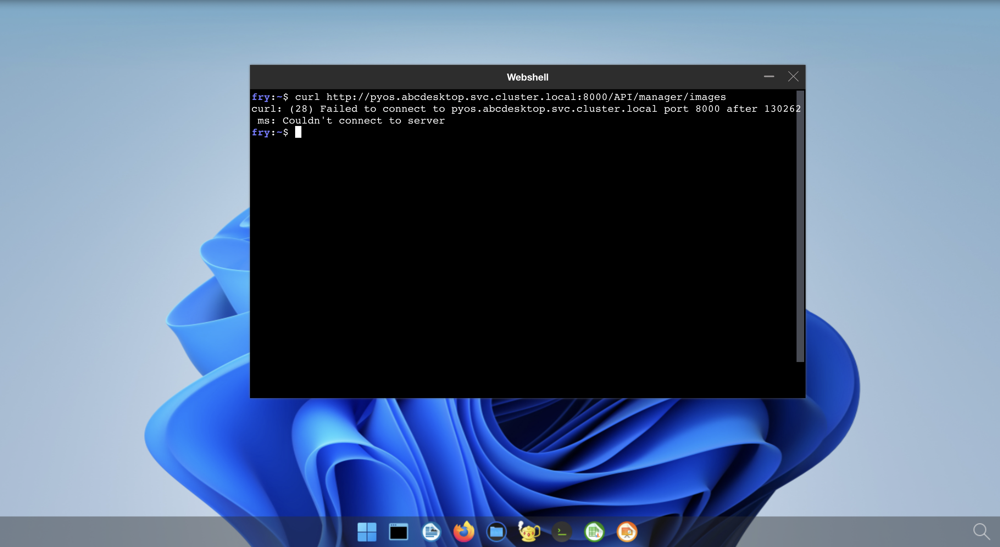

# Install

## Apply the default `netpol-default-4.4.yaml` file


To apply the network policies run the command :

```bash
kubectl apply -f https://raw.githubusercontent.com/abcdesktopio/conf/main/kubernetes/netpol-default-4.4.yaml -n abcdesktop
```

The command returns 

```
networkpolicy.networking.k8s.io/abcdesktop-rights created
networkpolicy.networking.k8s.io/memcached-rights created
networkpolicy.networking.k8s.io/memcached-permits created
networkpolicy.networking.k8s.io/mongodb-rights created
networkpolicy.networking.k8s.io/mongodb-permits created
networkpolicy.networking.k8s.io/console-rights created
networkpolicy.networking.k8s.io/console-permits created
networkpolicy.networking.k8s.io/speedtest-rights created
networkpolicy.networking.k8s.io/speedtest-permits created
networkpolicy.networking.k8s.io/pyos-rights created
networkpolicy.networking.k8s.io/pyos-permits created
networkpolicy.networking.k8s.io/router-rights created
networkpolicy.networking.k8s.io/router-permits created
networkpolicy.networking.k8s.io/nginx-rights created
networkpolicy.networking.k8s.io/nginx-permits created
networkpolicy.networking.k8s.io/ocapplications-permits created
networkpolicy.networking.k8s.io/ocuser-rights created
networkpolicy.networking.k8s.io/ocuser-permits created
networkpolicy.networking.k8s.io/authentication-permits created
networkpolicy.networking.k8s.io/ldap-permits created
networkpolicy.networking.k8s.io/ldap-rights created
networkpolicy.networking.k8s.io/smtp-permits created
networkpolicy.networking.k8s.io/https-permits created
networkpolicy.networking.k8s.io/storage-permits created
networkpolicy.networking.k8s.io/coredns-permits created
networkpolicy.networking.k8s.io/apiserver-permits created
networkpolicy.networking.k8s.io/graylog-permits created
```


### Test the network policies

- Login to your abcdesktop 
- Open a webshell and run a curl command. 

```bash
curl http://pyos.abcdesktop.svc.cluster.local:8000/API/manager/images
```

This http request is denied by the network policy and you should get an error message 

```
curl: (28) Failed to connect to pyos.abcdesktop.svc.cluster.local port 8000 after 130290 ms: Couldn't connect to server
```




You should get an error message, the user's pod can't reach `https://pyos.abcdesktop.svc.cluster.local:8000/API`.