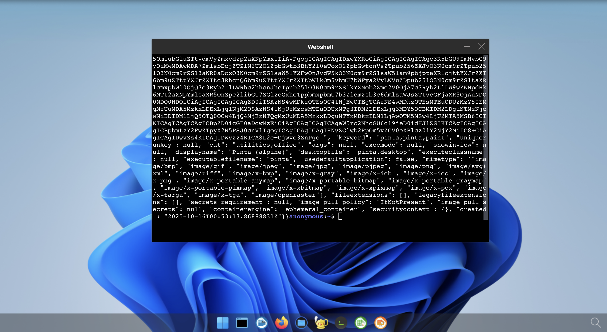

# Uninstall

## Disable the network policies  

To disable the network policies, run the following `kubectl delete` command:

```bash
kubectl delete -f https://raw.githubusercontent.com/abcdesktopio/conf/main/kubernetes/netpol-default-{{ abcdesktop.latest_release }}.yaml
```

After removing the policies, log in to your abcdesktop instance and open the web shell to run the same curl command:

```bash
curl http://pyos.abcdesktop.svc.cluster.local:8000/API/manager/images
```

You should receive a JSON document as the HTTP response, confirming that network restrictions are no longer in effect.




You may need to update the [netpol-default.yaml](https://raw.githubusercontent.com/abcdesktopio/conf/main/kubernetes/netpol-default-{{ abcdesktop.latest_release }}.yaml) file to match your own environment's requirements.
