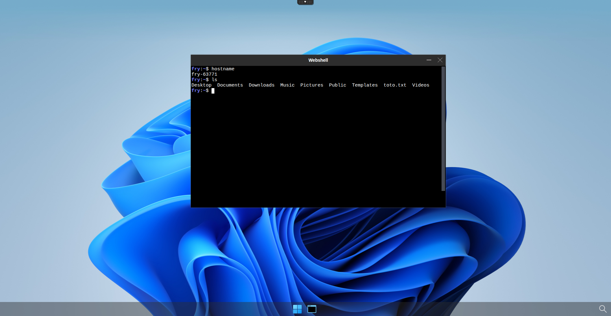

# Make user's home direcotry persistent using hostPath

## Prerequisites

- a Kuberenetes cluster with abcdesktop installed

## Define hostPath folder and update od.config

On your node, create a folder that will be the mount point for your user's home directories. For example `mnt/abcdesktop_volumes/`.  
Then you have to edit your `od.config` file. First set `desktop.homedirectorytype` to `'hostPath'` and then add a `desktop.hostPathRoot` whose value will be the path to the mount point you previously created.

```
desktop.homedirectorytype: 'hostPath'

#
# desktop.hostPathRoot set the hostPath root directory
# desktop.hostPathRoot is read only if desktop.homedirectorytype: 'hostPath'
desktop.hostPathRoot: '/mnt/abcdesktop_volumes'
```

Kubernetes will automatically create a folder for each of your users if it does not already exists.

Finally, update the configmap and restart pyos by running the commands below 

```
kubectl create -n abcdesktop configmap abcdesktop-config --from-file=od.config -o yaml --dry-run=client | kubectl replace -n abcdesktop -f -
kubectl rollout restart deploy pyos-od -n abcdesktop
```

## Check if user's homedir is persistent

You can now connect to your abcdesktop and login as a user.

Once connected you can run the following command to see if the user's homedir system exists

```
kubectl describe pod <YOUR-POD-NAME> -n abcdesktop 
```

You should see someting like this in the volumes section

```
Volumes:
  home:
    Type:          HostPath (bare host directory volume)
    Path:          /mnt/abcdesktop_volumes/fry
    HostPathType:  DirectoryOrCreate
```

You can also check on your host if a directory has been created

```
ls -la /mnt/abcdesktop_volumes/
total 20
drwxr-xr-x  5 root root  4096 Apr  7 16:44 .
drwxr-xr-x 14 root root  4096 Apr  7 11:39 ..
drwxr-x--- 15 2042 12042 4096 Apr  8 11:21 fry
```

By the way, the id of that folder's owner should be your user's id.

Now you can create a file in the user's homedir 


You can check if the file is present on your host.

```
ls -la /mnt/abcdesktop_volumes/fry
drwxr-x--- 2 2042 12042 4096 Mar 17 15:09 Desktop
drwxr-x--- 2 2042 12042 4096 Mar 17 15:09 Documents
drwxr-x--- 2 2042 12042 4096 Mar 17 15:09 Downloads
drwxr-x--- 2 2042 12042 4096 Mar 17 15:09 Music
drwxr-x--- 2 2042 12042 4096 Mar 17 15:09 Pictures
drwxr-x--- 2 2042 12042 4096 Mar 17 15:09 Public
drwxr-x--- 2 2042 12042 4096 Mar 17 15:09 Templates
-rw-r----- 1 2042 12042    0 Mar 18 09:11 toto.txt
drwxr-x--- 2 2042 12042 4096 Mar 17 15:09 Videos
```

Then perform a logoff to destroy your pod and recreates it, once reconnected on a new pod with the same user, check if the file you previously created is still there, it should appear.



Great ! Now you can configure home directory persistency using hostPath.

