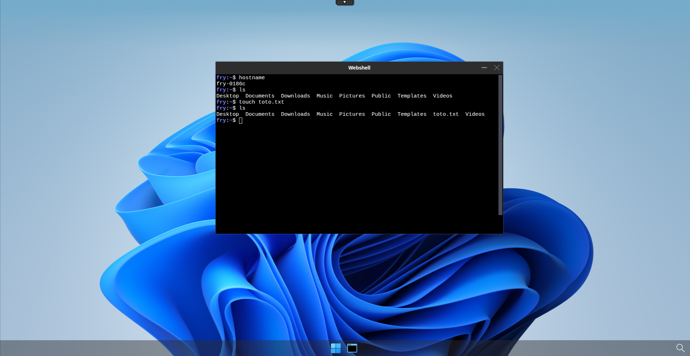

# Retain user's home directory using NFS storage

## Prerequisites

- a Kuberenetes cluster with abcdesktop installed
- [helm](https://helm.sh/fr/) command line

To make the user's homerdir persistent using nfs, you will need to : 
- Set up your own nfs server
- Bind user's homedir to nfs server using [PersistentVolume](https://kubernetes.io/docs/concepts/storage/persistent-volumes/) (PV) and [PersistentVolumeClaim](https://kubernetes.io/docs/concepts/storage/persistent-volumes/) (PVC)

## Set up a nfs server

### Server install

On a dedicated machine, please install the following packages

```
apt-get install nfs-kernel-server nfs-common
```

### Server configuration

Once installed, you need to create the folder that you will export

```
mkdir /data/abcdesktop_nfs
chown -R nobody:nogroup /data/abcdesktop_nfs
```

Edit `/etc/exports` 

```
vim /etc/exports
```

And add the following line 

```
/data/abcdesktop_nfs  192.168.X.X/24(rw,sync,no_subtree_check,no_root_squash) # make sure to change 192.168.X.X/24 by your own cluster subnet
```

Finaly, apply the config. 

```
exportfs -ra
systemctl restart nfs-kernel-server
```

Check that the config have been applied properly

```
exportfs -v
```

!!! note
    You should see the line you juste wrote in the config file

## Bind user's homedir to nfs server

### Install nfs-subdir-external-provisioner

!!! note 
    If you want more informations about `nfs-subdir-external-provisioner` please visit [this page](https://github.com/kubernetes-sigs/nfs-subdir-external-provisioner)

First, you have to install a provisonner to your cluster, in this example, we chose `nfs-subdir-external-provisioner` because of its dynamic subdir creation aspect.

Create a `nfs-subdur-values.yaml` file and paste the following lines to configure the storage class.

```
nfs:
  server: 192.168.X.X   # change it to your server ip
  path: /data/abcdesktop_nfs

replicaCount: 1

storageClass:
  name: nfs-user-storage-abcdesktop
  defaultClass: false
  reclaimPolicy: Retain
  volumeBindingMode: Immediate
  archiveOnDelete: true         
  onDelete: retain              
  pathPattern: "${.PVC.annotations.nfs.io/username}" # Important for dynamic subdir creation

rbac:
  create: true

serviceAccount:
  create: true
  name: nfs-subdir-external-provisioner

```

Then install `nfs-subdir-external-provisioner` by running the following command 

```
helm install nfs-subdir-external-provisioner \
  nfs-subdir-external-provisioner/nfs-subdir-external-provisioner \
  --namespace nfs-provisioner \
  --create-namespace \
  --values nfs-subdur-values.yaml
```

!!! info
    It is important to set the reclaim policy as Retain to keep our PV alive after PVC deletion

You can check if the storage class has been created by running this command

```
kubectl get sc
NAME                          PROVISIONER                                     RECLAIMPOLICY   VOLUMEBINDINGMODE   ALLOWVOLUMEEXPANSION   AGE
nfs-user-storage-abcdesktop   cluster.local/nfs-subdir-external-provisioner   Retain          Immediate           true                   40h
```

### Update od.config

Now, you will need to specify to pyos to bind users homedir to the exported nfs folder. To do so you will need to update the `od.config` file.

First, change `desktop.homedirectorytype` variable from `None` to `persistentVolumeClaim`.

```
desktop.homedirectorytype: 'persistentVolumeClaim'
```

Then add these lines to define the persistent volume claim template

```
desktop.persistentvolumeclaim: {
   'metadata': {
      'name': '{{ provider }}-{{ userid }}',
      'annotations': {
          'nfs.io/username': '{{ userid }}'
      }
   },
   'spec': {
    'storageClassName': 'nfs-user-storage-abcdesktop',
    'accessModes': [ 'ReadWriteMany' ],
    'resources': {
       'requests': {
          'storage': '10Gi' } } } }
```

!!! note 
    Here there is no need to specify a persistent volume template to pyos as `nfs-subdir-external-provisioner` will deal with it automaticaly.

Then, tell pyos to delete the persistent volume claim on user's pod delete but to keep the persistent volume as we defined storage class retain policy as `Retain` earlier. 

```
desktop.removepersistentvolume: False
desktop.removepersistentvolumeclaim: True
```

Finaly, update `od.config` configmap and restart pyos to apply the changes we made

```
kubectl create -n abcdesktop configmap abcdesktop-config --from-file=od.config -o yaml --dry-run=client | kubectl replace -n abcdesktop -f -
kubectl rollout restart deploy pyos-od -n abcdesktop
```

## Check if user's homedir is persistent

You can now connect to your abcdesktop and login as a user.

Once connected you can run the following command to see if the user's homedir system exists

```
kubectl describe pod <YOUR-POD-NAME> -n abcdesktop 
```

You should see someting like this in the volumes section

```
Volumes:
  home:
    Type:       PersistentVolumeClaim (a reference to a PersistentVolumeClaim in the same namespace)
    ClaimName:  planet-fry
    ReadOnly:   false
```

You can also check for PV and PVC inside you cluster

```
kubectl get pv,pvc -n abcdesktop

NAME                                                        CAPACITY   ACCESS MODES   RECLAIM POLICY   STATUS        CLAIM                   STORAGECLASS                   VOLUMEATTRIBUTESCLASS   REASON   AGE
persistentvolume/pvc-4b522afd-bf6e-411e-85c3-2a39e1b2c58f   10Gi       RWX            Retain           Bound         abcdesktop/planet-fry   nfs-user-storage-abcdesktop    <unset>                          26m

NAME                               STATUS   VOLUME                                     CAPACITY   ACCESS MODES   STORAGECLASS                   VOLUMEATTRIBUTESCLASS   AGE
persistentvolumeclaim/planet-fry   Bound    pvc-8f802cbc-873f-46ab-9d7a-fe266da42387   10Gi       RWX            nfs-user-storage-abcdesktop    <unset>                 22m
```

Now you can create a file in the user's homedir 



You can also check if the user's homedir is present on your nfs server, you should also see that a subdir have been created thanks to `nfs-subdir-external-provisioner`.

```
root@nfs-server_abcdesktop:/data/abcdesktop_nfs# ls
drwxr-x--- 15 2042 12042 4096 Mar 18 09:11 fry

root@nfs-server_abcdesktop:/data/abcdesktop_nfs# ls -l fry/
drwxr-x--- 2 2042 12042 4096 Mar 17 15:09 Desktop
drwxr-x--- 2 2042 12042 4096 Mar 17 15:09 Documents
drwxr-x--- 2 2042 12042 4096 Mar 17 15:09 Downloads
drwxr-x--- 2 2042 12042 4096 Mar 17 15:09 Music
drwxr-x--- 2 2042 12042 4096 Mar 17 15:09 Pictures
drwxr-x--- 2 2042 12042 4096 Mar 17 15:09 Public
drwxr-x--- 2 2042 12042 4096 Mar 17 15:09 Templates
-rw-r----- 1 2042 12042    0 Mar 18 09:11 toto.txt
drwxr-x--- 2 2042 12042 4096 Mar 17 15:09 Videos
```

Then perform a logoff to destroy your pod and recreates it, once reconnected on a new pod with the same user, check if the file you previously created is still there, it should appear.

