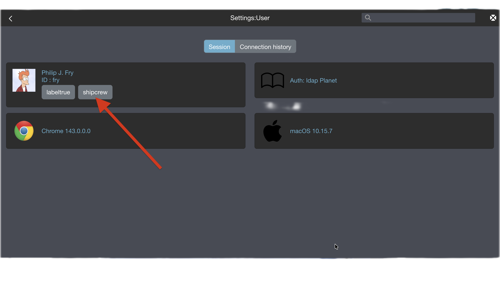
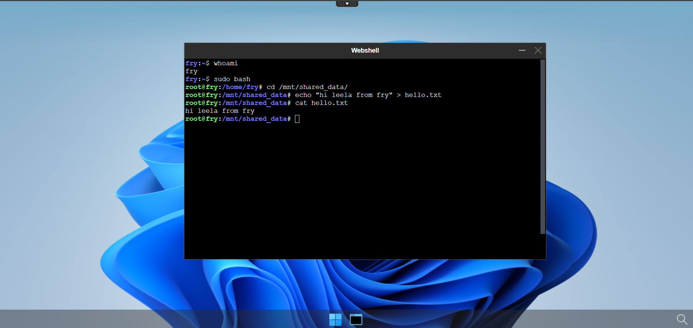
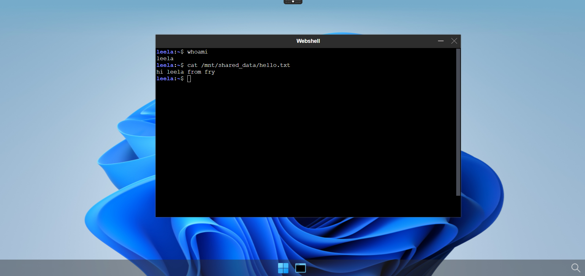
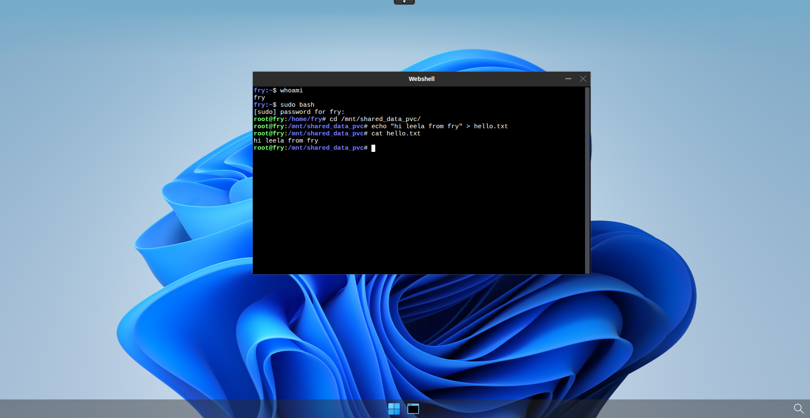
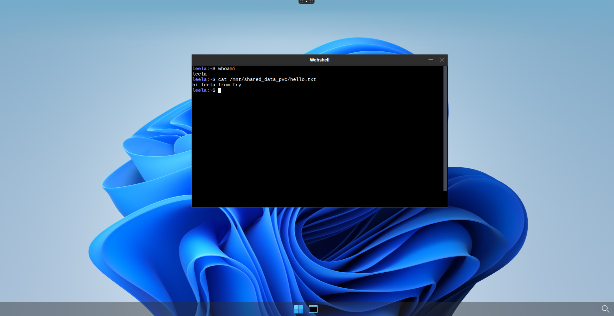

# Shared Volumes

Users may need to access shared files across sessions or desktops. This page describes two methods for mounting a shared directory inside user pods: using `hostPath` for node-local storage, and using a `PersistentVolumeClaim` backed by an NFS server for cluster-wide accessibility. Access to shared volumes is controlled through `rules` defined in `desktop.policies`.


## Check your rules in `authmanagers` `ldapconfig`

!!! note
    The `ldapconfig` for the demo LDAP server adds a few default rules. To get more information about the ldap server read the [docker-test-openldap](https://github.com/abcdesktopio/docker-test-openldap) web page.

The user `Philip J. Fry` is a member of the group `ship_crew`.

Details of the `ship_crew` group `cn=ship_crew,ou=people,dc=planetexpress,dc=com`

| Attribute        | Value            |
| ---------------- | ---------------- |
| objectClass      | Group |
| cn               | ship_crew |
| member           | cn=Turanga Leela,ou=people,dc=planetexpress,dc=com |
| member           | cn=Philip J. Fry,ou=people,dc=planetexpress,dc=com |
| member           | cn=Bender Bending Rodríguez,ou=people,dc=planetexpress,dc=com |


```
ldapconfig : {
        'planet': {
                'default'       : True,
                'ldap_timeout'  : 15,
                'ldap_protocol' : 'ldap',
                'ldap_basedn'   : 'ou=people,dc=planetexpress,dc=com',
                'servers'       : [ 'openldap' ],
                'secure'        : False,
                'serviceaccount': { 'login': 'cn=admin,dc=planetexpress,dc=com', 'password': 'GoodNewsEveryone' },
                'policies': {
                    'acls': None,
                    'rules' : {
                        'rule-dummy' : {
                            'conditions' : [ {'boolean':True, 'expected':True } ], 
                            'expected' : True,
                            'label':'labeltrue'
                        },
                        'rule-ship': {
                            'conditions' : [ { 'memberOf': 'cn=ship_crew,ou=people,dc=planetexpress,dc=com',   'expected' : True  } ],
                            'expected' : True,
                            'label':'shipcrew'
                        },
                        'rule-test': {
                            'conditions' : [ { 'memberOf': 'cn=admin_staff,ou=people,dc=planetexpress,dc=com', 'expected' : True  } ],
                            'expected' : True,
                            'label': 'adminstaff'
                        }
                    }
	            } } }
```

This provider defines three rules:

- `labeltrue` always for all users
- `shipcrew` if the user is member of `cn=ship_crew,ou=people,dc=planetexpress,dc=com` group
- `adminstaff` if the user is a member of `cn=admin_staff,ou=people,dc=planetexpress,dc=com` group


Open your web browser and log in as `Philip J. Fry` in your abcdesktop web service.

- Open the `Menu` |  `User` tab




When `Philip J. Fry` is logged in, `Philip J. Fry` gets the labels `labeltrue` and `shipcrew`.


## Define volume using `hostPath`

### Update `od.config` file

Add `rules` to the `desktop.policies` dictionary

```
desktop.policies: { 
  'rules': { 
    'volumes': { 
      'shipcrew': { 
        'type': 'hostPath', 
        'name': 'mntmyproject', 
        'path': '/mnt',
        'mountPath': '/mnt/shared_data'
      }
    },
    'network': {}                                
  },
  'acls' : {} }
```

> On your worker node, make sure that the `/mnt` directory exists.

This policy adds a new volume `mntmyproject` defined as a `hostPath` to the user's pod and mounts it as `/mnt/shared_data`.


Save your `od.config` file.

### Apply the new config file 

Replace the previous ConfigMap:

```
NAMESPACE=abcdesktop
kubectl create -n $NAMESPACE configmap abcdesktop-config --from-file=od.config -o yaml --dry-run=client | kubectl replace -n $NAMESPACE -f -
```

Expected output:

```
configmap/abcdesktop-config replaced
```

Restart pyos to apply the new ConfigMap:

```
NAMESPACE=abcdesktop
kubectl rollout restart deployment pyos-od -n $NAMESPACE
```

Expected output:

```
deployment.apps/pyos-od restarted
```

Your new configuration is now active.


### Restart a new desktop as `Philip J. Fry`
 

- Create a new desktop for `Philip J. Fry`
- Get the name of the `Philip J. Fry` pod


```
NAMESPACE=abcdesktop
kubectl get pods -l type=x11server -n $NAMESPACE
NAME        READY   STATUS    RESTARTS   AGE
fry-06c5f   4/4     Running   0          3m24s
```

- Describe the `Philip J. Fry` pod, and look for the `Mounts` and `Volumes` entries

```
NAMESPACE=abcdesktop
kubectl desribe pods fry-06c5f -n $NAMESPACE
```

The mount for `hostpath-mntmyproject-fry` is mapped to `/mnt/shared_data`.

```
    Mounts:
      /etc/sudoers.d from sudoers (rw)
      /home/fry from home (rw)
      /home/fry/.cache from cache (rw)
      /mnt/shared_data from hostpath-mntmyproject-fry (rw)
      /run/user/ from runuser (rw)
      /tmp from tmp (rw)
      /tmp/.X11-unix from x11socket (rw)
      /tmp/.cupsd from cupsdsocket (rw)
      /var/lib/extrausers from extrausers (rw)
      /var/log/desktop from log (rw)
      /var/run/dbus from rundbus (rw)
      /var/run/desktop from run (rw)
      /var/secrets/abcdesktop/vnc from auth-vnc-fry (rw)
```

The volume `hostpath-mntmyproject-fry` is defined as

```
  hostpath-mntmyproject-fry:
    Type:          HostPath (bare host directory volume)
    Path:          /mnt
    HostPathType:  DirectoryOrCreate
```


A new mount `/mnt/shared_data from hostpath-mntmyproject-fry (rw)` is added, backed by the `HostPath` volume `hostpath-mntmyproject-fry` pointing to `/mnt`.

> Check that your file system's permissions are set to your users

The volume `hostpath-mntmyproject-fry` is also mounted for applications ephemeral containers and pods.

- Start the `webshell` application in the web interface

- Now create a file inside the `/mnt/shared_data` folder, for example `hello.txt`



### Start a new desktop as `Turanga Leela`

Now start a desktop as `Turanga Leela`. As a member of the `shipcrew` group, you should see the file you created with `Philip J. Fry`.




## Define volume using `pvc` bounded on nfs server

!!! note
    For this part of the tutorial, you should have an NFS server already configured. If not, please follow the first chapter of [this tutorial](http://abcdesktop.pepins.net/advanced/4.4/storage/nfs/#set-up-a-nfs-server).

### Create nfs type `PersistentVolume` 

You must first create an NFS-type `PersistentVolume` bound to your NFS server.

The following YAML defines an NFS-type `PersistentVolume`. Save it as `nfs-pv-shared-data-abcdesktop.yaml`:

```yaml
apiVersion: v1
kind: PersistentVolume
metadata:
  name: shared-shipcrew-pv
spec:
  capacity:
    storage: 1Gi
  accessModes:
    - ReadWriteMany
  persistentVolumeReclaimPolicy: Retain
  storageClassName: ""
  claimRef:     # Define here claimName and namespace for bounding your PVC
    name: shared-shipcrew-pvc  
    namespace: abcdesktop     # You can replace it by your abcdesktop namespace if different
  nfs:
    path: /data/nfs_share/shared_data_shipcrew
    server: X.X.X.X     # Here goes your nfs server IP address
```

Apply it by running the following command:

```
kubectl apply -f nfs-pv-shared-data-abcdesktop.yaml
```

### Create `PersistentVolumeClaim`

With the `PersistentVolume` created and bound to the NFS server, create a `PersistentVolumeClaim` to reference the `shared-shipcrew-pv` `PersistentVolume`.

Save the following content to a `nfs-pvc-shared-data-abcdesktop.yaml` file:

```yaml
apiVersion: v1
kind: PersistentVolumeClaim
metadata:      # This matches the claimRef field of the PV yaml file
  name: shared-shipcrew-pvc
  namespace: abcdesktop     # Or your abcdesktop namespace if different
spec:
  accessModes:
    - ReadWriteMany
  resources:
    requests:
      storage: 1Gi
  storageClassName: ""
  volumeName: shared-shipcrew-pv      # Name of your persistent volume
```

!!! warning
    Setting `accessModes` to `ReadWriteMany` is required. Without it, the PVC cannot be mounted simultaneously across multiple user pods, which defeats the purpose of shared storage.

Apply it by running the following command:

```
NAMESPACE=abcdesktop
kubectl apply -f nfs-pvc-shared-data-abcdesktop.yaml -n $NAMESPACE
```

Verify that both the PV and PVC have been correctly bound:

```
NAMESPACE=abcdesktop
kubectl get pvc -n $NAMESPACE
NAME                  STATUS   VOLUME               CAPACITY   ACCESS MODES   STORAGECLASS   VOLUMEATTRIBUTESCLASS   AGE
shared-shipcrew-pvc   Bound    shared-shipcrew-pv   1Gi        RWX                           <unset>                 67m
```

```
kubectl get pv
NAME                 CAPACITY   ACCESS MODES   RECLAIM POLICY   STATUS   CLAIM                            STORAGECLASS   VOLUMEATTRIBUTESCLASS   REASON   AGE
shared-shipcrew-pv   1Gi        RWX            Retain           Bound    abcdesktop/shared-shipcrew-pvc                  <unset>                          3h11m
```

### Update `od.config` file

Add `rules` to the `desktop.policies` dictionary

```
desktop.policies: {
  'rules': {
    'volumes': {
      'shipcrew': {
        'type': 'pvc',
        'name': 'shared-shipcrew-pvc',
        'claimName': 'shared-shipcrew-pvc',
        'mountPath': '/mnt/shared_data_pvc'
      }
    },
    'network': {}
  },
  'acls' : {} }
```

> On your worker node, make sure that the `/mnt` directory exists.

This policy adds a new volume `shared-shipcrew-pvc` defined as a `pvc` to the user's pod and mounts it as `/mnt/shared_data_pvc`.


Save your `od.config` file.

### Apply the new config file 

Replace the previous ConfigMap:

```
NAMESPACE=abcdesktop
kubectl create -n $NAMESPACE configmap abcdesktop-config --from-file=od.config -o yaml --dry-run=client | kubectl replace -n $NAMESPACE -f -
```

Expected output:

```
configmap/abcdesktop-config replaced
```

Restart pyos to apply the new ConfigMap:

```
NAMESPACE=abcdesktop
kubectl rollout restart deployment pyos-od -n $NAMESPACE
```

Expected output:

```
deployment.apps/pyos-od restarted
```

Your new configuration is now active.


### Restart a new desktop as `Philip J. Fry`
 

- Create a new desktop for `Philip J. Fry`
- Get the name of the `Philip J. Fry` pod


```
NAMESPACE=abcdesktop
kubectl get pods -l type=x11server -n $NAMESPACE
NAME        READY   STATUS    RESTARTS   AGE
fry-06c5f   4/4     Running   0          3m24s
```

- Describe the `Philip J. Fry` pod, and look for the `Mounts` and `Volumes` entries

```
kubectl desribe pods fry-06c5f -n abcdesktop
```

The mount for `pvc-shared-shipcrew-pvc-fry` is mapped to `/mnt/shared_data_pvc`.

```
    Mounts:
      /etc/sudoers.d from sudoers (rw)
      /home/fry from home (rw)
      /home/fry/.cache from cache (rw)
      /mnt/shared_data_pvc from pvc-shared-shipcrew-pvc-fry (rw)
      /run/user/ from runuser (rw)
      /tmp from tmp (rw)
      /tmp/.X11-unix from x11socket (rw)
      /tmp/.cupsd from cupsdsocket (rw)
      /var/lib/extrausers from extrausers (rw)
      /var/log/desktop from log (rw)
      /var/run/dbus from rundbus (rw)
      /var/run/desktop from run (rw)
      /var/secrets/abcdesktop/vnc from auth-vnc-fry (rw)
```

The volume `pvc-shared-shipcrew-pvc-fry` is defined as

```
  pvc-shared-shipcrew-pvc-fry:
    Type:        PersistentVolumeClaim (a reference to a PersistentVolumeClaim in the same namespace)
    ClaimName:   shared-shipcrew-pvc
    ReadOnly:    false
```


A new `Mount` is defined as `/mnt/shared_data_pvc from pvc-shared-shipcrew-pvc-fry (rw)` and the volume `pvc-shared-shipcrew-pvc-fry` is defined as a `PersistentVolumeClaim` referencing `shared-shipcrew-pvc`.

> Check that your file system's permissions are set to your users

The volume `pvc-shared-shipcrew-pvc-fry` is also mounted for applications ephemeral containers and pods.

- Start the `webshell` application in the web interface

- Now create a file inside the `/mnt/shared_data_pvc` folder, for example `hello.txt`



### Start a new desktop as `Turanga Leela`

Now start a desktop as `Turanga Leela`. As a member of the `shipcrew` group, you should see the file you created with `Philip J. Fry`.



!!! info
    Note that you should be able to see `hello.txt` on your NFS server too.