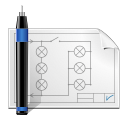

# Application list
This array describe the application list ready to use with abcdesktop.

|icon|displayname|description|file md|
|----|-----------|-----------|-------|
|{: style="height:32px;width:32px"}|2048|no description found|[2048.md](2048.md)|
|{: style="height:32px;width:32px"}|astromenace|hardcore 3D space shooter with spaceship upgrade possibilities|[astromenace.md](astromenace.md)|
|{: style="height:32px;width:32px"}|Atom|A hackable text editor for the 21st Century.|[atom.md](atom.md)|
|{: style="height:32px;width:32px"}|Base|Manage databases, create queries and reports to track and manage your information by using Base.|[base.md](base.md)|
|{: style="height:32px;width:32px"}|Blender|3D modeling, animation, rendering and post-production|[blender.md](blender.md)|
|{: style="height:32px;width:32px"}|Calc|Perform calculations, analyze information and manage lists in spreadsheets by using Calc.|[calc.md](calc.md)|
|{: style="height:32px;width:32px"}|Calculator|no description found|[calculator.md](calculator.md)|
|{: style="height:32px;width:32px"}|Chess|no description found|[chess.md](chess.md)|
|{: style="height:32px;width:32px"}|Chrome|no description found|[chrome.md](chrome.md)|
|{: style="height:32px;width:32px"}|Cloud Foundry cli|no description found|[cloudfoundry.md](cloudfoundry.md)|
|{: style="height:32px;width:32px"}|Dia|no description found|[dia.md](dia.md)|
|{: style="height:32px;width:32px"}|Doom|no description found|[doom.md](doom.md)|
|{: style="height:32px;width:32px"}|Draw|Create and edit drawings, flow charts and logos by using Draw.|[draw.md](draw.md)|
|{: style="height:32px;width:32px"}|Eclipse|no description found|[eclipse.md](eclipse.md)|
|{: style="height:32px;width:32px"}|Eclipse Sts4|no description found|[eclipse_sts4.md](eclipse_sts4.md)|
|{: style="height:32px;width:32px"}|eog|no description found|[eog.md](eog.md)|
|{: style="height:32px;width:32px"}|Evince|no description found|[evince.md](evince.md)|
|{: style="height:32px;width:32px"}|Evolution|no description found|[evolution.md](evolution.md)|
|{: style="height:32px;width:32px"}|file-roller|Create and modify an archive|[file-roller.md](file-roller.md)|
|{: style="height:32px;width:32px"}|Filelight|View disk usage information|[filelight.md](filelight.md)|
|{: style="height:32px;width:32px"}|Firefox|Browse the World Wide Web|[firefox.md](firefox.md)|
|{: style="height:32px;width:32px"}|Firefox-Rest|Browse the World Wide Web|[firefoxrest.md](firefoxrest.md)|
|{: style="height:32px;width:32px"}|GCompris|no description found|[gcompris.md](gcompris.md)|
|{: style="height:32px;width:32px"}|Gedit|no description found|[gedit.md](gedit.md)|
|{: style="height:32px;width:32px"}|gElemental|no description found|[gelemental.md](gelemental.md)|
|{: style="height:32px;width:32px"}|Geogebra|no description found|[geogebra.md](geogebra.md)|
|{: style="height:32px;width:32px"}|Gephi|no description found|[gephi.md](gephi.md)|
|{: style="height:32px;width:32px"}|OCR-gimagereader|no description found|[gimagereader.md](gimagereader.md)|
|{: style="height:32px;width:32px"}|Gimp|Create images and edit photographs|[gimp.md](gimp.md)|
|{: style="height:32px;width:32px"}|Gnumeric|Calculation, Analysis, and Visualization of Information|[gnumeric.md](gnumeric.md)|
|{: style="height:32px;width:32px"}|Golly|no description found|[golly.md](golly.md)|
|{: style="height:32px;width:32px"}|Gretl|no description found|[gretl.md](gretl.md)|
|{: style="height:32px;width:32px"}|Impress|Create and edit presentations for slideshows, meeting and Web pages by using Impress.|[impress.md](impress.md)|
|{: style="height:32px;width:32px"}|Inkscape|Create and edit Scalable Vector Graphics images|[inkscape.md](inkscape.md)|
|{: style="height:32px;width:32px"}|Kalzium|no description found|[kalzium.md](kalzium.md)|
|{: style="height:32px;width:32px"}|kDiamond|no description found|[kdiamond.md](kdiamond.md)|
|{: style="height:32px;width:32px"}|Kgeography|no description found|[kgeography.md](kgeography.md)|
|{: style="height:32px;width:32px"}|kigo|no description found|[kigo.md](kigo.md)|
|{: style="height:32px;width:32px"}|Klickety|no description found|[klickety.md](klickety.md)|
|{: style="height:32px;width:32px"}|Klotski|no description found|[klotski.md](klotski.md)|
|{: style="height:32px;width:32px"}|kSquares|no description found|[ksquares.md](ksquares.md)|
|{: style="height:32px;width:32px"}|kTurtle|no description found|[kturtle.md](kturtle.md)|
|{: style="height:32px;width:32px"}|Leocad|no description found|[leocad.md](leocad.md)|
|{: style="height:32px;width:32px"}|LibreCAD|no description found|[librecad.md](librecad.md)|
|{: style="height:32px;width:32px"}|Mahjongg|no description found|[mahjongg.md](mahjongg.md)|
|{: style="height:32px;width:32px"}|Math|Create and edit scientific formulas and equations by using Math.|[math.md](math.md)|
|{: style="height:32px;width:32px"}|Mathwar|no description found|[mathwar.md](mathwar.md)|
|{: style="height:32px;width:32px"}|Mines|no description found|[mines.md](mines.md)|
|{: style="height:32px;width:32px"}|Netbeans|no description found|[netbeans.md](netbeans.md)|
|{: style="height:32px;width:32px"}|Notepad Wine|no description found|[notepad-wine.md](notepad-wine.md)|
|{: style="height:32px;width:32px"}|OnlyOffice|Edit office documents|[onlyoffice.md](onlyoffice.md)|
|{: style="height:32px;width:32px"}|OpenShift cli|no description found|[openshift.md](openshift.md)|
|{: style="height:32px;width:32px"}|Planner|no description found|[planner.md](planner.md)|
|{: style="height:32px;width:32px"}|Postman|no description found|[postman.md](postman.md)|
|{: style="height:32px;width:32px"}|Putty Unix|no description found|[putty-unix.md](putty-unix.md)|
|{: style="height:32px;width:32px"}|Putty Wine|no description found|[putty-wine.md](putty-wine.md)|
|{: style="height:32px;width:32px"}|qElectrotech|no description found|[qelectrotech.md](qelectrotech.md)|
|{: style="height:32px;width:32px"}|Remarkable|A free, fully featured markdown editor for Linux.|[remarkable.md](remarkable.md)|
|{: style="height:32px;width:32px"}|Robots|no description found|[robots.md](robots.md)|
|{: style="height:32px;width:32px"}|Stellarium|no description found|[stellarium.md](stellarium.md)|
|{: style="height:32px;width:32px"}|Step|no description found|[step.md](step.md)|
|{: style="height:32px;width:32px"}|Sublime-Text|Sophisticated text editor for code, markup and prose|[sublime-text.md](sublime-text.md)|
|{: style="height:32px;width:32px"}|supertux2|Play a classic 2D platform game|[supertux2.md](supertux2.md)|
|{: style="height:32px;width:32px"}|swell-foop|no description found|[swell-foop.md](swell-foop.md)|
|{: style="height:32px;width:32px"}|Terminal|no description found|[terminal.md](terminal.md)|
|{: style="height:32px;width:32px"}|Shell AI|no description found|[terminalai.md](terminalai.md)|
|{: style="height:32px;width:32px"}|Tetravex|no description found|[tetravex.md](tetravex.md)|
|{: style="height:32px;width:32px"}|Thunderbird|Send and receive mail with Thunderbird|[thunderbird.md](thunderbird.md)|
|{: style="height:32px;width:32px"}|videolan|Read, capture, broadcast your multimedia streams|[vlc.md](vlc.md)|
|{: style="height:32px;width:32px"}|VSCode|Code Editing. Redefined.|[vscode.md](vscode.md)|
|{: style="height:32px;width:32px"}|Winefile Wine|no description found|[winefile-wine.md](winefile-wine.md)|
|{: style="height:32px;width:32px"}|WineMine Wine|no description found|[winemine-wine.md](winemine-wine.md)|
|{: style="height:32px;width:32px"}|Winhelp Wine|no description found|[winhelp-wine.md](winhelp-wine.md)|
|{: style="height:32px;width:32px"}|Writer|Create and edit text and graphics in letters, reports, documents and Web pages by using Writer.|[writer.md](writer.md)|
|{: style="height:32px;width:32px"}|Xedit|no description found|[xedit.md](xedit.md)|
|{: style="height:32px;width:32px"}|xeyes|no description found|[xeyes.md](xeyes.md)|
|{: style="height:32px;width:32px"}|Xman|no description found|[xman.md](xman.md)|
|{: style="height:32px;width:32px"}|Xterm|no description found|[xterm.md](xterm.md)|
|{: style="height:32px;width:32px"}|Youtube|Browse the World Wide Web|[youtube.md](youtube.md)|
