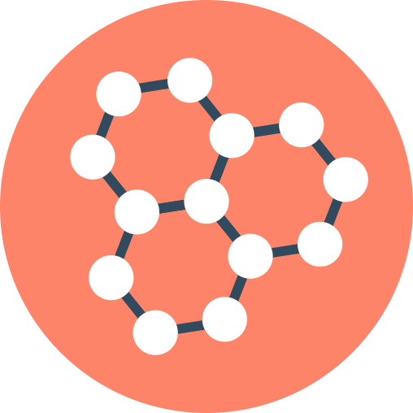

# Application list
This array describe the application list ready to use with abcdesktop.

|icon|displayname|description|markdown|json|
|----|-----------|-----------|--------|----|
|{: style="height:32px;width:32px"}|2048 (alpine gtk)|Obtain the 2048 tile|[2048-alpine.md](../2048-alpine)|[2048-alpine.d.3.0.json](../2048-alpine.d.3.0.json)|
|{: style="height:32px;width:32px"}|2048 (ubuntu qt)|The 2048 number game implemented in Qt|[2048-ubuntu.md](../2048-ubuntu)|[2048-ubuntu.d.3.0.json](../2048-ubuntu.d.3.0.json)|
|{: style="height:32px;width:32px"}|Apache Directory Studio|no description found|[apachedirectorystudio.md](../apachedirectorystudio)|[apachedirectorystudio.d.3.0.json](../apachedirectorystudio.d.3.0.json)|
|{: style="height:32px;width:32px"}|astromenace|hardcore 3D space shooter with spaceship upgrade possibilities|[astromenace.md](../astromenace)|[astromenace.d.3.0.json](../astromenace.d.3.0.json)|
|{: style="height:32px;width:32px"}|Base|Manage databases, create queries and reports to track and manage your information by using Base.|[base.md](../base)|[base.d.3.0.json](../base.d.3.0.json)|
|{: style="height:32px;width:32px"}|Beekeeper-studio|An easy-to use SQL query editor and database UI for Mac, Windows, and Linux|[beekeeperstudio.md](../beekeeperstudio)|[beekeeperstudio.d.3.0.json](../beekeeperstudio.d.3.0.json)|
|{: style="height:32px;width:32px"}|Blender|3D modeling, animation, rendering and post-production|[blender.md](../blender)|[blender.d.3.0.json](../blender.d.3.0.json)|
|{: style="height:32px;width:32px"}|Bless|Edit binary files|[bless.md](../bless)|[bless.d.3.0.json](../bless.d.3.0.json)|
|{: style="height:32px;width:32px"}|blobby|no description found|[blobby.md](../blobby)|[blobby.d.3.0.json](../blobby.d.3.0.json)|
|{: style="height:32px;width:32px"}|Brackets|no description found|[brackets.md](../brackets)|[brackets.d.3.0.json](../brackets.d.3.0.json)|
|{: style="height:32px;width:32px"}|Calculator|no description found|[calculator.md](../calculator)|[calculator.d.3.0.json](../calculator.d.3.0.json)|
|{: style="height:32px;width:32px"}|chess|Play the classic two-player board game of chess|[chess.md](../chess)|[chess.d.3.0.json](../chess.d.3.0.json)|
|{: style="height:32px;width:32px"}|Chrome|Access the Internet|[chrome.md](../chrome)|[chrome.d.3.0.json](../chrome.d.3.0.json)|
|{: style="height:32px;width:32px"}|Chromium|Access the Internet|[chromium.md](../chromium)|[chromium.d.3.0.json](../chromium.d.3.0.json)|
|{: style="height:32px;width:32px"}|citrix-client|no description found|[citrix.md](../citrix)|[citrix.d.3.0.json](../citrix.d.3.0.json)|
|{: style="height:32px;width:32px"}|Cloud Foundry cli|no description found|[cloudfoundry.md](../cloudfoundry)|[cloudfoundry.d.3.0.json](../cloudfoundry.d.3.0.json)|
|{: style="height:32px;width:32px"}|cmd.exe wine (alpine)|no description found|[cmd.exe.md](../cmd.exe)|[cmd.exe.d.3.0.json](../cmd.exe.d.3.0.json)|
|{: style="height:32px;width:32px"}|cntlm|no description found|[cntlm.md](../cntlm)|[cntlm.d.3.0.json](../cntlm.d.3.0.json)|
|{: style="height:32px;width:32px"}|corsix-th|Open source clone of Theme Hospital|[corsix-th.md](../corsix-th)|[corsix-th.d.3.0.json](../corsix-th.d.3.0.json)|
|{: style="height:32px;width:32px"}|cuda|Use the command line|[cuda.md](../cuda)|[cuda.d.3.0.json](../cuda.d.3.0.json)|
|{: style="height:32px;width:32px"}|cuda demo|Use the command line|[cudademo.md](../cudademo)|[cudademo.d.3.0.json](../cudademo.d.3.0.json)|
|{: style="height:32px;width:32px"}|cuda developper|Use the command line|[cudadev.md](../cudadev)|[cudadev.d.3.0.json](../cudadev.d.3.0.json)|
|{: style="height:32px;width:32px"}|Dia|no description found|[dia.md](../dia)|[dia.d.3.0.json](../dia.d.3.0.json)|
|{: style="height:32px;width:32px"}|Doom|no description found|[doom.md](../doom)|[doom.d.3.0.json](../doom.d.3.0.json)|
|{: style="height:32px;width:32px"}|Draw|Create and edit drawings, flow charts and logos by using Draw.|[draw.md](../draw)|[draw.d.3.0.json](../draw.d.3.0.json)|
|{: style="height:32px;width:32px"}|drawio|draw.io desktop|[drawio.md](../drawio)|[drawio.d.3.0.json](../drawio.d.3.0.json)|
|{: style="height:32px;width:32px"}|MicrosoftEdge|Access the Internet|[edge.md](../edge)|[edge.d.3.0.json](../edge.d.3.0.json)|
|{: style="height:32px;width:32px"}|elementary.terminal|Use the command line|[elementary.terminal.md](../elementary.terminal)|[elementary.terminal.d.3.0.json](../elementary.terminal.d.3.0.json)|
|{: style="height:32px;width:32px"}|eog|Browse and rotate images|[eog.md](../eog)|[eog.d.3.0.json](../eog.d.3.0.json)|
|{: style="height:32px;width:32px"}|Evince|View multi-page documents|[evince.md](../evince)|[evince.d.3.0.json](../evince.d.3.0.json)|
|{: style="height:32px;width:32px"}|Evolution|Manage your email, contacts and schedule|[evolution.md](../evolution)|[evolution.d.3.0.json](../evolution.d.3.0.json)|
|{: style="height:32px;width:32px"}|file-roller|Create and modify an archive|[file-roller.md](../file-roller)|[file-roller.d.3.0.json](../file-roller.d.3.0.json)|
|{: style="height:32px;width:32px"}|Filelight|View disk usage information|[filelight.md](../filelight)|[filelight.d.3.0.json](../filelight.d.3.0.json)|
|{: style="height:32px;width:32px"}|filezilla (alpine)|Download and upload files via FTP, FTPS and SFTP|[filezilla.md](../filezilla)|[filezilla.d.3.0.json](../filezilla.d.3.0.json)|
|{: style="height:32px;width:32px"}|Firefox-esr|no description found|[firefox-esr.md](../firefox-esr)|[firefox-esr.d.3.0.json](../firefox-esr.d.3.0.json)|
|{: style="height:32px;width:32px"}|Firefox|Browse the World Wide Web|[firefox.md](../firefox)|[firefox.d.3.0.json](../firefox.d.3.0.json)|
|{: style="height:32px;width:32px"}|flare|A single player, 2D-isometric, action Role-Playing Game|[flare.md](../flare)|[flare.d.3.0.json](../flare.d.3.0.json)|
|{: style="height:32px;width:32px"}|frozen-bubble|no description found|[frozen-bubble.md](../frozen-bubble)|[frozen-bubble.d.3.0.json](../frozen-bubble.d.3.0.json)|
|{: style="height:32px;width:32px"}|GCompris|no description found|[gcompris.md](../gcompris)|[gcompris.d.3.0.json](../gcompris.d.3.0.json)|
|{: style="height:32px;width:32px"}|Gedit|no description found|[gedit.md](../gedit)|[gedit.d.3.0.json](../gedit.d.3.0.json)|
|{: style="height:32px;width:32px"}|gElemental|no description found|[gelemental.md](../gelemental)|[gelemental.d.3.0.json](../gelemental.d.3.0.json)|
|{: style="height:32px;width:32px"}|Geogebra|no description found|[geogebra.md](../geogebra)|[geogebra.d.3.0.json](../geogebra.d.3.0.json)|
|{: style="height:32px;width:32px"}|Gimp|Create images and edit photographs|[gimp.md](../gimp)|[gimp.d.3.0.json](../gimp.d.3.0.json)|
|{: style="height:32px;width:32px"}|Gnumerix (alpine)|Calculation, Analysis, and Visualization of Information|[gnumeric.md](../gnumeric)|[gnumeric.d.3.0.json](../gnumeric.d.3.0.json)|
|{: style="height:32px;width:32px"}|Golly|no description found|[golly.md](../golly)|[golly.d.3.0.json](../golly.d.3.0.json)|
|{: style="height:32px;width:32px"}|Gretl|no description found|[gretl.md](../gretl)|[gretl.d.3.0.json](../gretl.d.3.0.json)|
|{: style="height:32px;width:32px"}|hyper|A terminal built on web technologies|[hyper.md](../hyper)|[hyper.d.3.0.json](../hyper.d.3.0.json)|
|{: style="height:32px;width:32px"}|Impress|Create and edit presentations for slideshows, meeting and Web pages by using Impress.|[impress.md](../impress)|[impress.d.3.0.json](../impress.d.3.0.json)|
|{: style="height:32px;width:32px"}|inkscape|Create and edit Scalable Vector Graphics images|[inkscape.md](../inkscape)|[inkscape.d.3.0.json](../inkscape.d.3.0.json)|
|{: style="height:32px;width:32px"}|jupyter|Use the command line|[jupyter.md](../jupyter)|[jupyter.d.3.0.json](../jupyter.d.3.0.json)|
|{: style="height:32px;width:32px"}|jupyter nvidia|Use the command line|[jupyternvidia.md](../jupyternvidia)|[jupyternvidia.d.3.0.json](../jupyternvidia.d.3.0.json)|
|{: style="height:32px;width:32px"}|Kalzium|no description found|[kalzium.md](../kalzium)|[kalzium.d.3.0.json](../kalzium.d.3.0.json)|
|{: style="height:32px;width:32px"}|kDiamond|no description found|[kdiamond.md](../kdiamond)|[kdiamond.d.3.0.json](../kdiamond.d.3.0.json)|
|{: style="height:32px;width:32px"}|Kgeography|no description found|[kgeography.md](../kgeography)|[kgeography.d.3.0.json](../kgeography.d.3.0.json)|
|{: style="height:32px;width:32px"}|kigo|no description found|[kigo.md](../kigo)|[kigo.d.3.0.json](../kigo.d.3.0.json)|
|{: style="height:32px;width:32px"}|Klickety|no description found|[klickety.md](../klickety)|[klickety.d.3.0.json](../klickety.d.3.0.json)|
|{: style="height:32px;width:32px"}|klotski|no description found|[klotski.md](../klotski)|[klotski.d.3.0.json](../klotski.d.3.0.json)|
|{: style="height:32px;width:32px"}|konsole|no description found|[konsole.md](../konsole)|[konsole.d.3.0.json](../konsole.d.3.0.json)|
|{: style="height:32px;width:32px"}|kSquares|no description found|[ksquares.md](../ksquares)|[ksquares.d.3.0.json](../ksquares.d.3.0.json)|
|{: style="height:32px;width:32px"}|kTurtle|no description found|[kturtle.md](../kturtle)|[kturtle.d.3.0.json](../kturtle.d.3.0.json)|
|{: style="height:32px;width:32px"}|Leocad|no description found|[leocad.md](../leocad)|[leocad.d.3.0.json](../leocad.d.3.0.json)|
|{: style="height:32px;width:32px"}|LibreCAD|no description found|[librecad.md](../librecad)|[librecad.d.3.0.json](../librecad.d.3.0.json)|
|{: style="height:32px;width:32px"}|mahjongg|no description found|[mahjongg.md](../mahjongg)|[mahjongg.d.3.0.json](../mahjongg.d.3.0.json)|
|{: style="height:32px;width:32px"}|Math|Create and edit scientific formulas and equations by using Math.|[math.md](../math)|[math.d.3.0.json](../math.d.3.0.json)|
|{: style="height:32px;width:32px"}|Mathwar|no description found|[mathwar.md](../mathwar)|[mathwar.d.3.0.json](../mathwar.d.3.0.json)|
|{: style="height:32px;width:32px"}|minecraft|Official Minecraft Launcher|[minecraft.md](../minecraft)|[minecraft.d.3.0.json](../minecraft.d.3.0.json)|
|{: style="height:32px;width:32px"}|gnome-mines (alpine)|no description found|[mines.md](../mines)|[mines.d.3.0.json](../mines.d.3.0.json)|
|{: style="height:32px;width:32px"}|FileManager|Access and organize files|[nautilus.md](../nautilus)|[nautilus.d.3.0.json](../nautilus.d.3.0.json)|
|{: style="height:32px;width:32px"}|Notepad Wine (alpine)|no description found|[notepad-wine.md](../notepad-wine)|[notepad-wine.d.3.0.json](../notepad-wine.d.3.0.json)|
|{: style="height:32px;width:32px"}|notepadqq|Edit source code files|[notepadqq.md](../notepadqq)|[notepadqq.d.3.0.json](../notepadqq.d.3.0.json)|
|{: style="height:32px;width:32px"}|octave|no description found|[octave.md](../octave)|[octave.d.3.0.json](../octave.d.3.0.json)|
|{: style="height:32px;width:32px"}|OnlyOffice|Edit office documents|[onlyoffice.md](../onlyoffice)|[onlyoffice.d.3.0.json](../onlyoffice.d.3.0.json)|
|{: style="height:32px;width:32px"}|OpenShift cli|no description found|[openshift.md](../openshift)|[openshift.d.3.0.json](../openshift.d.3.0.json)|
|{: style="height:32px;width:32px"}|Pinta (alpine)|Easily create and edit images|[pinta.md](../pinta)|[pinta.d.3.0.json](../pinta.d.3.0.json)|
|{: style="height:32px;width:32px"}|Planner|no description found|[planner.md](../planner)|[planner.d.3.0.json](../planner.d.3.0.json)|
|{: style="height:32px;width:32px"}|Postman|no description found|[postman.md](../postman)|[postman.d.3.0.json](../postman.d.3.0.json)|
|{: style="height:32px;width:32px"}|Putty Unix|no description found|[putty-unix.md](../putty-unix)|[putty-unix.d.3.0.json](../putty-unix.d.3.0.json)|
|{: style="height:32px;width:32px"}|Putty Wine (alpine)|no description found|[putty-wine.md](../putty-wine)|[putty-wine.d.3.0.json](../putty-wine.d.3.0.json)|
|{: style="height:32px;width:32px"}|qElectrotech|no description found|[qelectrotech.md](../qelectrotech)|[qelectrotech.d.3.0.json](../qelectrotech.d.3.0.json)|
|{: style="height:32px;width:32px"}|Remarkable|A free, fully featured markdown editor for Linux.|[remarkable.md](../remarkable)|[remarkable.d.3.0.json](../remarkable.d.3.0.json)|
|{: style="height:32px;width:32px"}|Remmina|Access remote desktops with Remmina|[remmina.md](../remmina)|[remmina.d.3.0.json](../remmina.d.3.0.json)|
|{: style="height:32px;width:32px"}|RemoteDesktop|no description found|[remotedesktopmanager.md](../remotedesktopmanager)|[remotedesktopmanager.d.3.0.json](../remotedesktopmanager.d.3.0.json)|
|{: style="height:32px;width:32px"}|rhythmbox|Play and organize your music collection|[rhythmbox.md](../rhythmbox)|[rhythmbox.d.3.0.json](../rhythmbox.d.3.0.json)|
|{: style="height:32px;width:32px"}|Robots|no description found|[robots.md](../robots)|[robots.d.3.0.json](../robots.d.3.0.json)|
|{: style="height:32px;width:32px"}|Shotcut|no description found|[shotcut.md](../shotcut)|[shotcut.d.3.0.json](../shotcut.d.3.0.json)|
|{: style="height:32px;width:32px"}|Stellarium|no description found|[stellarium.md](../stellarium)|[stellarium.d.3.0.json](../stellarium.d.3.0.json)|
|{: style="height:32px;width:32px"}|Step|no description found|[step.md](../step)|[step.d.3.0.json](../step.d.3.0.json)|
|{: style="height:32px;width:32px"}|stress|no description found|[stress.md](../stress)|[stress.d.3.0.json](../stress.d.3.0.json)|
|{: style="height:32px;width:32px"}|sublime-Text|Sophisticated text editor for code, markup and prose|[sublime-text.md](../sublime-text)|[sublime-text.d.3.0.json](../sublime-text.d.3.0.json)|
|{: style="height:32px;width:32px"}|supertux2|Play a classic 2D platform game|[supertux2.md](../supertux2)|[supertux2.d.3.0.json](../supertux2.d.3.0.json)|
|{: style="height:32px;width:32px"}|swell-foop|Clear the screen by removing groups of colored and shaped tiles|[swell-foop.md](../swell-foop)|[swell-foop.d.3.0.json](../swell-foop.d.3.0.json)|
|{: style="height:32px;width:32px"}|Microsoft Teams|Microsoft Teams for Linux is your chat-centered workspace in Office 365.|[teams.md](../teams)|[teams.d.3.0.json](../teams.d.3.0.json)|
|{: style="height:32px;width:32px"}|Terminal|Use the command line|[terminal.md](../terminal)|[terminal.d.3.0.json](../terminal.d.3.0.json)|
|{: style="height:32px;width:32px"}|Terminal [Pod]|Use the command line|[terminalpod.md](../terminalpod)|[terminalpod.d.3.0.json](../terminalpod.d.3.0.json)|
|{: style="height:32px;width:32px"}|Tetravex|no description found|[tetravex.md](../tetravex)|[tetravex.d.3.0.json](../tetravex.d.3.0.json)|
|{: style="height:32px;width:32px"}|Thunderbird|Send and receive mail with Thunderbird|[thunderbird.md](../thunderbird)|[thunderbird.d.3.0.json](../thunderbird.d.3.0.json)|
|{: style="height:32px;width:32px"}|Commodore64||[vice.md](../vice)|[vice.d.3.0.json](../vice.d.3.0.json)|
|{: style="height:32px;width:32px"}|videolan|Read, capture, broadcast your multimedia streams|[vlc.md](../vlc)|[vlc.d.3.0.json](../vlc.d.3.0.json)|
|{: style="height:32px;width:32px"}|vmmacos|no description found|[vmmacos.md](../vmmacos)|[vmmacos.d.3.0.json](../vmmacos.d.3.0.json)|
|{: style="height:32px;width:32px"}|VMRC|Connect to remote virtual machines|[vmrc.md](../vmrc)|[vmrc.d.3.0.json](../vmrc.d.3.0.json)|
|{: style="height:32px;width:32px"}|vmubuntu|no description found|[vmubuntu.md](../vmubuntu)|[vmubuntu.d.3.0.json](../vmubuntu.d.3.0.json)|
|{: style="height:32px;width:32px"}|VSCode|Code Editing. Redefined.|[vscode.md](../vscode)|[vscode.d.3.0.json](../vscode.d.3.0.json)|
|{: style="height:32px;width:32px"}|whatsdesk|unofficial whatsapp client for linux |[whatsdesk.md](../whatsdesk)|[whatsdesk.d.3.0.json](../whatsdesk.d.3.0.json)|
|{: style="height:32px;width:32px"}|Winefile Wine (alpine)|no description found|[winefile-wine.md](../winefile-wine)|[winefile-wine.d.3.0.json](../winefile-wine.d.3.0.json)|
|{: style="height:32px;width:32px"}|WineMine Wine (alpine)|no description found|[winemine-wine.md](../winemine-wine)|[winemine-wine.d.3.0.json](../winemine-wine.d.3.0.json)|
|{: style="height:32px;width:32px"}|Winhelp Wine|no description found|[winhelp-wine.md](../winhelp-wine)|[winhelp-wine.d.3.0.json](../winhelp-wine.d.3.0.json)|
|{: style="height:32px;width:32px"}|WinSCP|no description found|[winscp-wine.md](../winscp-wine)|[winscp-wine.d.3.0.json](../winscp-wine.d.3.0.json)|
|{: style="height:32px;width:32px"}|wireshark (alpine)|Network traffic analyzer|[wireshark.md](../wireshark)|[wireshark.d.3.0.json](../wireshark.d.3.0.json)|
|{: style="height:32px;width:32px"}|Writer alpine|Create and edit text and graphics in letters, reports, documents and Web pages by using Writer.|[writer.md](../writer)|[writer.d.3.0.json](../writer.d.3.0.json)|
|{: style="height:32px;width:32px"}|Xclock|no description found|[xclock.md](../xclock)|[xclock.d.3.0.json](../xclock.d.3.0.json)|
|{: style="height:32px;width:32px"}|Xedit|no description found|[xedit.md](../xedit)|[xedit.d.3.0.json](../xedit.d.3.0.json)|
|{: style="height:32px;width:32px"}|xeyes|no description found|[xeyes.md](../xeyes)|[xeyes.d.3.0.json](../xeyes.d.3.0.json)|
|{: style="height:32px;width:32px"}|Xman|no description found|[xman.md](../xman)|[xman.d.3.0.json](../xman.d.3.0.json)|
|{: style="height:32px;width:32px"}|Xpad|Jot down notes for later|[xpad.md](../xpad)|[xpad.d.3.0.json](../xpad.d.3.0.json)|
|{: style="height:32px;width:32px"}|Xterm|no description found|[xterm.md](../xterm)|[xterm.d.3.0.json](../xterm.d.3.0.json)|
|{: style="height:32px;width:32px"}|Youtube|Browse the World Wide Web|[youtube.md](../youtube)|[youtube.d.3.0.json](../youtube.d.3.0.json)|
