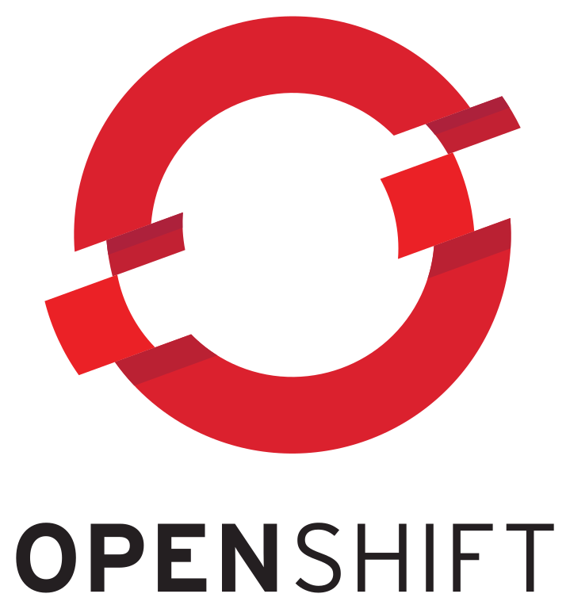

# Application list
This array describe the application list ready to use with abcdesktop.

|icon|displayname|description|markdown|json|
|----|-----------|-----------|--------|----|
|{: style="height:32px;width:32px"}|2048 (alpine gtk) with error|Obtain the 2048 tile|[2048-alpine-error.md](2048-alpine-error.md)|[2048-alpine-error.d.3.0.json](2048-alpine-error.d.3.0.json)|
|{: style="height:32px;width:32px"}|2048 (alpine gtk)|Obtain the 2048 tile|[2048-alpine.md](2048-alpine.md)|[2048-alpine.d.3.0.json](2048-alpine.d.3.0.json)|
|{: style="height:32px;width:32px"}|2048 (ubuntu qt)|The 2048 number game implemented in Qt|[2048-ubuntu.md](2048-ubuntu.md)|[2048-ubuntu.d.3.0.json](2048-ubuntu.d.3.0.json)|
|{: style="height:32px;width:32px"}|Apache Directory Studio|no description found|undefined|undefined|
|{: style="height:32px;width:32px"}|astromenace|hardcore 3D space shooter with spaceship upgrade possibilities|[astromenace.md](astromenace.md)|[astromenace.d.3.0.json](astromenace.d.3.0.json)|
|{: style="height:32px;width:32px"}|Base|Manage databases, create queries and reports to track and manage your information by using Base.|[base.md](base.md)|[base.d.3.0.json](base.d.3.0.json)|
|{: style="height:32px;width:32px"}|Beekeeper-studio|An easy-to use SQL query editor and database UI for Mac, Windows, and Linux|[beekeeperstudio.md](beekeeperstudio.md)|[beekeeperstudio.d.3.0.json](beekeeperstudio.d.3.0.json)|
|{: style="height:32px;width:32px"}|Blender|3D modeling, animation, rendering and post-production|[blender.md](blender.md)|[blender.d.3.0.json](blender.d.3.0.json)|
|{: style="height:32px;width:32px"}|Bless|Edit binary files|[bless.md](bless.md)|[bless.d.3.0.json](bless.d.3.0.json)|
|{: style="height:32px;width:32px"}|blobby|no description found|[blobby.md](blobby.md)|[blobby.d.3.0.json](blobby.d.3.0.json)|
|{: style="height:32px;width:32px"}|Brackets|no description found|[brackets.md](brackets.md)|[brackets.d.3.0.json](brackets.d.3.0.json)|
|{: style="height:32px;width:32px"}|Calc|Perform calculations, analyze information and manage lists in spreadsheets by using Calc.|[calc.md](calc.md)|[calc.d.3.0.json](calc.d.3.0.json)|
|{: style="height:32px;width:32px"}|Calculator|no description found|[calculator.md](calculator.md)|[calculator.d.3.0.json](calculator.d.3.0.json)|
|{: style="height:32px;width:32px"}|chess|Play the classic two-player board game of chess|[chess.md](chess.md)|[chess.d.3.0.json](chess.d.3.0.json)|
|{: style="height:32px;width:32px"}|Chrome|no description found|[chrome.md](chrome.md)|[chrome.d.3.0.json](chrome.d.3.0.json)|
|{: style="height:32px;width:32px"}|Chromium|Access the Internet|[chromium.md](chromium.md)|[chromium.d.3.0.json](chromium.d.3.0.json)|
|{: style="height:32px;width:32px"}|citrix-client|no description found|[citrix.md](citrix.md)|[citrix.d.3.0.json](citrix.d.3.0.json)|
|{: style="height:32px;width:32px"}|Cloud Foundry cli|no description found|undefined|undefined|
|{: style="height:32px;width:32px"}|cmd.exe wine (alpine)|no description found|undefined|undefined|
|{: style="height:32px;width:32px"}|cntlm|no description found|undefined|undefined|
|{: style="height:32px;width:32px"}|corsix-th|Open source clone of Theme Hospital|[corsix-th.md](corsix-th.md)|[corsix-th.d.3.0.json](corsix-th.d.3.0.json)|
|{: style="height:32px;width:32px"}|cuda|no description found|[cuda.md](cuda.md)|[cuda.d.3.0.json](cuda.d.3.0.json)|
|{: style="height:32px;width:32px"}|cuda demo|no description found|[cudademo.md](cudademo.md)|[cudademo.d.3.0.json](cudademo.d.3.0.json)|
|{: style="height:32px;width:32px"}|cuda developper|no description found|[cudadev.md](cudadev.md)|[cudadev.d.3.0.json](cudadev.d.3.0.json)|
|{: style="height:32px;width:32px"}|Dia|no description found|undefined|undefined|
|{: style="height:32px;width:32px"}|Doom|no description found|undefined|undefined|
|{: style="height:32px;width:32px"}|Draw|Create and edit drawings, flow charts and logos by using Draw.|[draw.md](draw.md)|[draw.d.3.0.json](draw.d.3.0.json)|
|{: style="height:32px;width:32px"}|drawio|draw.io desktop|[drawio.md](drawio.md)|[drawio.d.3.0.json](drawio.d.3.0.json)|
|{: style="height:32px;width:32px"}|MicrosoftEdge|Access the Internet|[edge.md](edge.md)|[edge.d.3.0.json](edge.d.3.0.json)|
|{: style="height:32px;width:32px"}|elementary.terminal|Use the command line|[elementary.terminal.md](elementary.terminal.md)|[elementary.terminal.d.3.0.json](elementary.terminal.d.3.0.json)|
|{: style="height:32px;width:32px"}|eog|no description found|[eog.md](eog.md)|[eog.d.3.0.json](eog.d.3.0.json)|
|{: style="height:32px;width:32px"}|Evince|no description found|[evince.md](evince.md)|[evince.d.3.0.json](evince.d.3.0.json)|
|{: style="height:32px;width:32px"}|Evolution|no description found|[evolution.md](evolution.md)|[evolution.d.3.0.json](evolution.d.3.0.json)|
|{: style="height:32px;width:32px"}|file-roller|Create and modify an archive|[file-roller.md](file-roller.md)|[file-roller.d.3.0.json](file-roller.d.3.0.json)|
|{: style="height:32px;width:32px"}|Filelight|View disk usage information|[filelight.md](filelight.md)|[filelight.d.3.0.json](filelight.d.3.0.json)|
|{: style="height:32px;width:32px"}|filezilla (alpine)|Download and upload files via FTP, FTPS and SFTP|[filezilla.md](filezilla.md)|[filezilla.d.3.0.json](filezilla.d.3.0.json)|
|{: style="height:32px;width:32px"}|Firefox-esr|no description found|[firefox-esr.md](firefox-esr.md)|[firefox-esr.d.3.0.json](firefox-esr.d.3.0.json)|
|{: style="height:32px;width:32px"}|Firefox|Browse the World Wide Web|[firefox.md](firefox.md)|[firefox.d.3.0.json](firefox.d.3.0.json)|
|{: style="height:32px;width:32px"}|flare|A single player, 2D-isometric, action Role-Playing Game|[flare.md](flare.md)|[flare.d.3.0.json](flare.d.3.0.json)|
|{: style="height:32px;width:32px"}|frozen-bubble|no description found|undefined|undefined|
|{: style="height:32px;width:32px"}|GCompris|no description found|undefined|undefined|
|{: style="height:32px;width:32px"}|Gedit|no description found|[gedit.md](gedit.md)|[gedit.d.3.0.json](gedit.d.3.0.json)|
|{: style="height:32px;width:32px"}|gElemental|no description found|undefined|undefined|
|{: style="height:32px;width:32px"}|Geogebra|no description found|undefined|undefined|
|{: style="height:32px;width:32px"}|OCR-gimagereader|no description found|[gimagereader.md](gimagereader.md)|[gimagereader.d.3.0.json](gimagereader.d.3.0.json)|
|{: style="height:32px;width:32px"}|Gimp|Create images and edit photographs|[gimp.md](gimp.md)|[gimp.d.3.0.json](gimp.d.3.0.json)|
|{: style="height:32px;width:32px"}|Gnumerix (alpine)|Calculation, Analysis, and Visualization of Information|[gnumeric.md](gnumeric.md)|[gnumeric.d.3.0.json](gnumeric.d.3.0.json)|
|{: style="height:32px;width:32px"}|Golly|no description found|undefined|undefined|
|{: style="height:32px;width:32px"}|Gretl|no description found|undefined|undefined|
|{: style="height:32px;width:32px"}|hyper|A terminal built on web technologies|[hyper.md](hyper.md)|[hyper.d.3.0.json](hyper.d.3.0.json)|
|{: style="height:32px;width:32px"}|Impress|Create and edit presentations for slideshows, meeting and Web pages by using Impress.|[impress.md](impress.md)|[impress.d.3.0.json](impress.d.3.0.json)|
|{: style="height:32px;width:32px"}|inkscape|Create and edit Scalable Vector Graphics images|[inkscape.md](inkscape.md)|[inkscape.d.3.0.json](inkscape.d.3.0.json)|
|{: style="height:32px;width:32px"}|jupyter|no description found|[jupyter.md](jupyter.md)|[jupyter.d.3.0.json](jupyter.d.3.0.json)|
|{: style="height:32px;width:32px"}|jupyter nvidia|no description found|[jupyternvidia.md](jupyternvidia.md)|[jupyternvidia.d.3.0.json](jupyternvidia.d.3.0.json)|
|{: style="height:32px;width:32px"}|Kalzium|no description found|undefined|undefined|
|{: style="height:32px;width:32px"}|kDiamond|no description found|undefined|undefined|
|{: style="height:32px;width:32px"}|Kgeography|no description found|undefined|undefined|
|{: style="height:32px;width:32px"}|kigo|no description found|[kigo.md](kigo.md)|[kigo.d.3.0.json](kigo.d.3.0.json)|
|{: style="height:32px;width:32px"}|Klickety|no description found|undefined|undefined|
|{: style="height:32px;width:32px"}|klotski|no description found|[klotski.md](klotski.md)|[klotski.d.3.0.json](klotski.d.3.0.json)|
|{: style="height:32px;width:32px"}|konsole|no description found|undefined|undefined|
|{: style="height:32px;width:32px"}|kSquares|no description found|undefined|undefined|
|{: style="height:32px;width:32px"}|kTurtle|no description found|undefined|undefined|
|{: style="height:32px;width:32px"}|Leocad|no description found|undefined|undefined|
|{: style="height:32px;width:32px"}|LibreCAD|no description found|undefined|undefined|
|{: style="height:32px;width:32px"}|mahjongg|no description found|[mahjongg.md](mahjongg.md)|[mahjongg.d.3.0.json](mahjongg.d.3.0.json)|
|{: style="height:32px;width:32px"}|Math|Create and edit scientific formulas and equations by using Math.|[math.md](math.md)|[math.d.3.0.json](math.d.3.0.json)|
|{: style="height:32px;width:32px"}|Mathwar|no description found|undefined|undefined|
|{: style="height:32px;width:32px"}|minecraft|Official Minecraft Launcher|[minecraft.md](minecraft.md)|[minecraft.d.3.0.json](minecraft.d.3.0.json)|
|{: style="height:32px;width:32px"}|gnome-mines (alpine)|no description found|undefined|undefined|
|{: style="height:32px;width:32px"}|FileManager|no description found|[nautilus.md](nautilus.md)|[nautilus.d.3.0.json](nautilus.d.3.0.json)|
|{: style="height:32px;width:32px"}|Notepad Wine (alpine)|no description found|undefined|undefined|
|{: style="height:32px;width:32px"}|notepadqq|Edit source code files|[notepadqq.md](notepadqq.md)|[notepadqq.d.3.0.json](notepadqq.d.3.0.json)|
|{: style="height:32px;width:32px"}|octave|no description found|[octave.md](octave.md)|[octave.d.3.0.json](octave.d.3.0.json)|
|{: style="height:32px;width:32px"}|OnlyOffice|Edit office documents|[onlyoffice.md](onlyoffice.md)|[onlyoffice.d.3.0.json](onlyoffice.d.3.0.json)|
|{: style="height:32px;width:32px"}|OpenShift cli|no description found|undefined|undefined|
|{: style="height:32px;width:32px"}|Pinta (alpine)|Easily create and edit images|[pinta.md](pinta.md)|[pinta.d.3.0.json](pinta.d.3.0.json)|
|{: style="height:32px;width:32px"}|Planner|no description found|undefined|undefined|
|{: style="height:32px;width:32px"}|Postman|no description found|undefined|undefined|
|{: style="height:32px;width:32px"}|Putty Unix|no description found|undefined|undefined|
|{: style="height:32px;width:32px"}|Putty Wine (alpine)|no description found|undefined|undefined|
|{: style="height:32px;width:32px"}|qElectrotech|no description found|undefined|undefined|
|{: style="height:32px;width:32px"}|Remarkable|A free, fully featured markdown editor for Linux.|[remarkable.md](remarkable.md)|[remarkable.d.3.0.json](remarkable.d.3.0.json)|
|{: style="height:32px;width:32px"}|Remmina|Access remote desktops with Remmina|[remmina.md](remmina.md)|[remmina.d.3.0.json](remmina.d.3.0.json)|
|{: style="height:32px;width:32px"}|RemoteDesktop|no description found|[remotedesktopmanager.md](remotedesktopmanager.md)|[remotedesktopmanager.d.3.0.json](remotedesktopmanager.d.3.0.json)|
|{: style="height:32px;width:32px"}|rhythmbox|Play and organize your music collection|[rhythmbox.md](rhythmbox.md)|[rhythmbox.d.3.0.json](rhythmbox.d.3.0.json)|
|{: style="height:32px;width:32px"}|Robots|no description found|undefined|undefined|
|{: style="height:32px;width:32px"}|Shotcut|no description found|[shotcut.md](shotcut.md)|[shotcut.d.3.0.json](shotcut.d.3.0.json)|
|{: style="height:32px;width:32px"}|Stellarium|no description found|undefined|undefined|
|{: style="height:32px;width:32px"}|Step|no description found|undefined|undefined|
|{: style="height:32px;width:32px"}|stress|no description found|[stress.md](stress.md)|[stress.d.3.0.json](stress.d.3.0.json)|
|{: style="height:32px;width:32px"}|sublime-Text|Sophisticated text editor for code, markup and prose|[sublime-text.md](sublime-text.md)|[sublime-text.d.3.0.json](sublime-text.d.3.0.json)|
|{: style="height:32px;width:32px"}|supertux2|Play a classic 2D platform game|[supertux2.md](supertux2.md)|[supertux2.d.3.0.json](supertux2.d.3.0.json)|
|{: style="height:32px;width:32px"}|swell-foop|no description found|[swell-foop.md](swell-foop.md)|[swell-foop.d.3.0.json](swell-foop.d.3.0.json)|
|{: style="height:32px;width:32px"}|Microsoft Teams|Microsoft Teams for Linux is your chat-centered workspace in Office 365.|[teams.md](teams.md)|[teams.d.3.0.json](teams.d.3.0.json)|
|{: style="height:32px;width:32px"}|Terminal|no description found|[terminal.md](terminal.md)|[terminal.d.3.0.json](terminal.d.3.0.json)|
|{: style="height:32px;width:32px"}|Terminal [Pod]|no description found|[terminalpod.md](terminalpod.md)|[terminalpod.d.3.0.json](terminalpod.d.3.0.json)|
|{: style="height:32px;width:32px"}|Tetravex|no description found|undefined|undefined|
|{: style="height:32px;width:32px"}|Thunderbird|Send and receive mail with Thunderbird|[thunderbird.md](thunderbird.md)|[thunderbird.d.3.0.json](thunderbird.d.3.0.json)|
|{: style="height:32px;width:32px"}|Commodore64||[vice.md](vice.md)|[vice.d.3.0.json](vice.d.3.0.json)|
|{: style="height:32px;width:32px"}|videolan|Read, capture, broadcast your multimedia streams|[vlc.md](vlc.md)|[vlc.d.3.0.json](vlc.d.3.0.json)|
|{: style="height:32px;width:32px"}|vmmacos|no description found|undefined|undefined|
|{: style="height:32px;width:32px"}|VMRC|Connect to remote virtual machines|[vmrc.md](vmrc.md)|[vmrc.d.3.0.json](vmrc.d.3.0.json)|
|{: style="height:32px;width:32px"}|vmubuntu|no description found|undefined|undefined|
|{: style="height:32px;width:32px"}|VSCode|Code Editing. Redefined.|[vscode.md](vscode.md)|[vscode.d.3.0.json](vscode.d.3.0.json)|
|{: style="height:32px;width:32px"}|whatsdesk|unofficial whatsapp client for linux |[whatsdesk.md](whatsdesk.md)|[whatsdesk.d.3.0.json](whatsdesk.d.3.0.json)|
|{: style="height:32px;width:32px"}|Winefile Wine (alpine)|no description found|undefined|undefined|
|{: style="height:32px;width:32px"}|WineMine Wine (alpine)|no description found|undefined|undefined|
|{: style="height:32px;width:32px"}|Winhelp Wine|no description found|undefined|undefined|
|{: style="height:32px;width:32px"}|WinSCP|no description found|undefined|undefined|
|{: style="height:32px;width:32px"}|wireshark (alpine)|no description found|[wireshark.md](wireshark.md)|[wireshark.d.3.0.json](wireshark.d.3.0.json)|
|{: style="height:32px;width:32px"}|Writer alpine|Create and edit text and graphics in letters, reports, documents and Web pages by using Writer.|[writer.md](writer.md)|[writer.d.3.0.json](writer.d.3.0.json)|
|{: style="height:32px;width:32px"}|Xedit|no description found|undefined|undefined|
|{: style="height:32px;width:32px"}|xeyes|no description found|undefined|undefined|
|{: style="height:32px;width:32px"}|Xman|no description found|undefined|undefined|
|{: style="height:32px;width:32px"}|Xpad|Jot down notes for later|[xpad.md](xpad.md)|[xpad.d.3.0.json](xpad.d.3.0.json)|
|{: style="height:32px;width:32px"}|Xterm|no description found|undefined|undefined|
|{: style="height:32px;width:32px"}|Youtube|Browse the World Wide Web|[youtube.md](youtube.md)|[youtube.d.3.0.json](youtube.d.3.0.json)|
