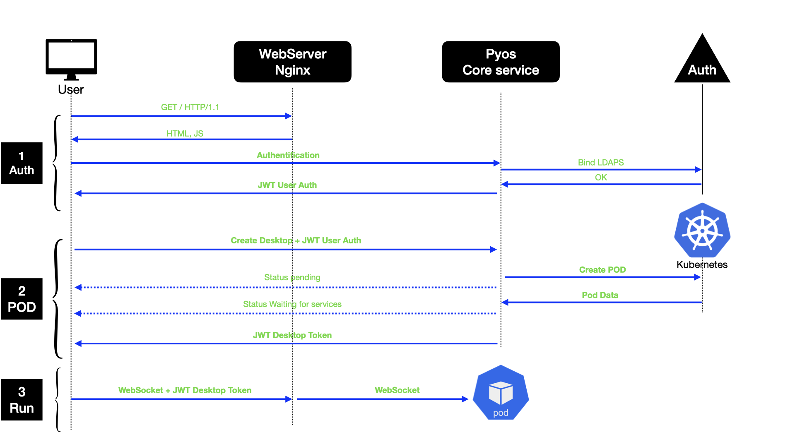

# Architecture in docker mode

## abcdesktop workflow (with LDAP Auth)

1. User login, get a user JWT
2. Create a user POD (or a container) and retrieve a Desktop JWT
3. Run, the user is connected to his own POD (or container)

	- All JWT are signed with RSA keys. 
	- All JWT payload are encrypted with RSA keys

## Services Infrastructure

The service infrastructure is based on :

- WebServer [Nginx container](/core/nginx)
- Database service [MongoDB](/core/mongodb/)
- Memcached service [Memcached](/core/memcached/)
- Pyos Core service (abcdesktop engine) [Pyos](/core/pyos/)

The user creates a pod [user](/core/user)

## Roles summary

### pyos

Pyos is the core abcdesktop service. Pyos is a stateless services, Pyos's roles are :

- Authenticate user on authenticate providers
 - OAuth 2.0 Provider : Google, Facebook, Orange
 - LDAP and LDAPS
 - Active Directory
- Start/Stop user container in docker mode and Pod in Kubernetes mode 
- Start/Stop application container

When a new user is authenticated, a dedicated user container is created. 
When the user starts an application (like LibreOffice for example) a dedicated application container is created.

### nginx
The nginx container act as web server and websocket reverse proxy. 

### mongo
Mongo is used by pyos to store user profil informations. 
The profil informations are :

- Login history
- Dock configuration
- Images and colors configuration 

### memcached
Memcache is use to store progress text message information during login process 
Memcache data are set and get pyos only.

### oc.user
oc.user is the user container. oc.user runs X11 graphical environment

### applications
All applications are docker container, and share a graphical socket with the user container 
