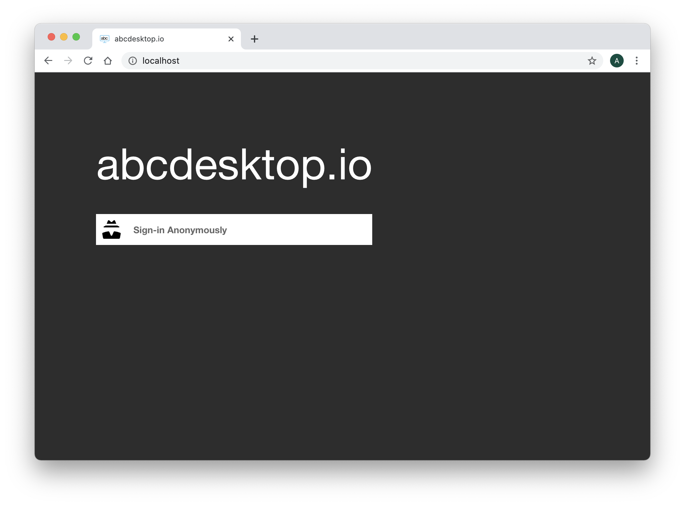
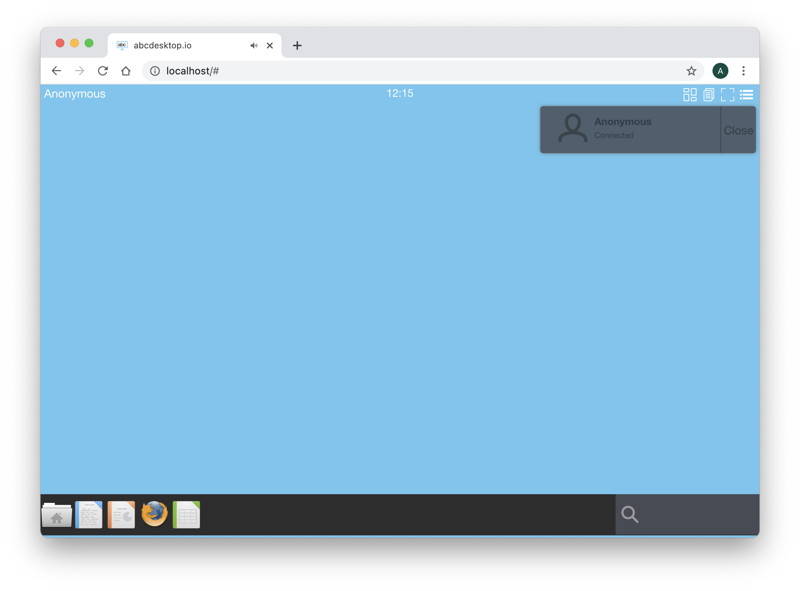
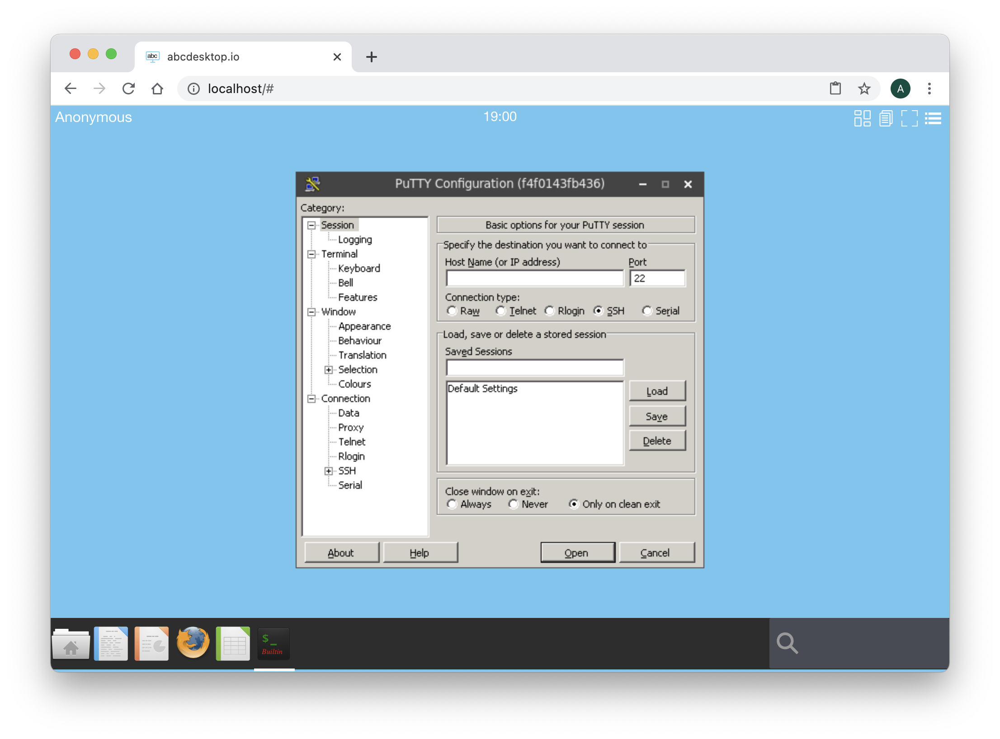
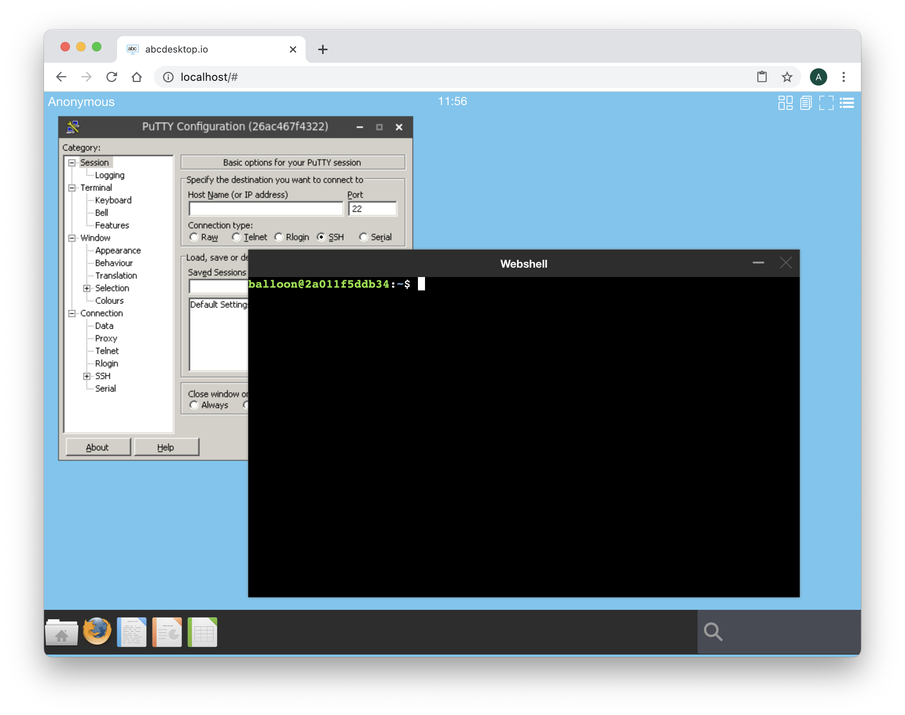
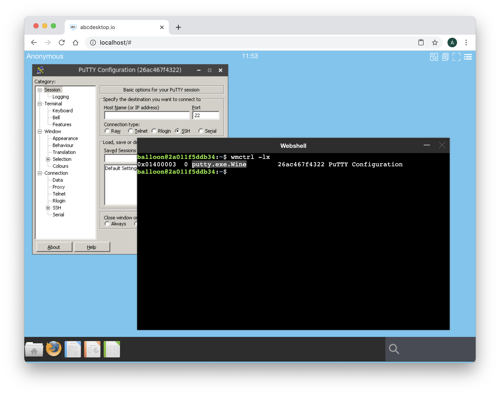
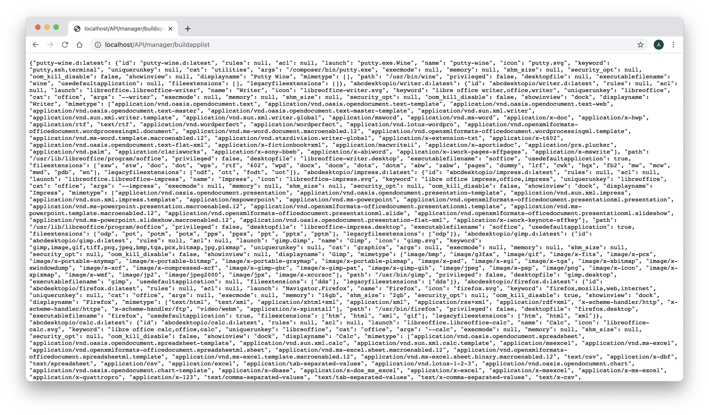
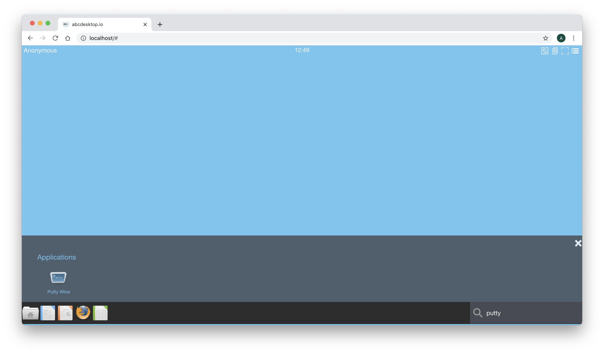
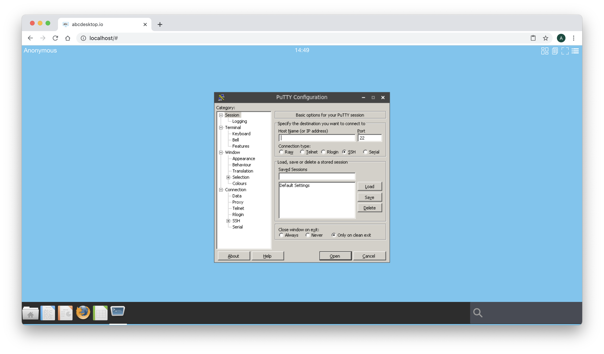

# Build abcdesktop docker image for Windows using Wine


## Requirements

- Read the chapter [Edit your configuration file in docker mode](config/editconfig/) is mandatory
- Read the chapter [Build abcdesktop docker image](applications.md) is mandatory.
- Read the chapter [Run docker image for Windows using Wine](runapplications.wine.md) is mandatory.
- Run a daemon ```sshd``` on your host

## WineHQ embedded in oc.template.gtk.wine.50

To run Windows applications abcdesktop use WineHQ. A dedicated image template source is ready to use as source of others Windows applications. This template is named ```abcdesktopio:oc.template.gtk.wine.50```

Start pulling this template image, if you don't have already done in the previous exercice : 

```
docker pull abcdesktopio:oc.template.gtk.wine.50
```

## Change the od.config configuration file

### The ```homedirectorytype``` option  

To share the home directory ```/home/balloon```volume data between containers, set the ```desktop.homedirectorytype``` to ```'volume'``` in your od.config file.

Edit your own ```od.config``` file as described in the chapter [Edit your configuration file in docker mode](config/editconfig/), and make sure that ```desktop.homedirectorytype``` is set to ```'volume'```

```
desktop.homedirectorytype: 'volume' 
```

If need, run the ```docker-compose restart``` command in your abcdesktop directory where the ```od.config``` and the ```docker-compose.yml``` are located. 

```
docker-compose restart
```


## Build a new windows putty inside a docker container

> In this exercice we are going to install and run putty.exe for Windows inside a docker container for abcdesktop.


PuTTY is an SSH and telnet client, developed originally by Simon Tatham for the Windows platform. 


Start an OpenDekstop session. You can use an authenticated session using an authentication provider ```external``` or ```explicit```, or you can do this exercice using Anonymous Authentification also know as the authentication provider ```implicit```.

>In this exercice we choose an Anonymous authentification, **DO NOT CLOSE YOUR WEB BROWSER**, you should not be able de reconnect with the same user context, and have to restart this exercice again.




Login using the ```Anonymous``` authentification provider.




Open a terminal window and run the command 

```
docker ps --filter ancestor=abcdesktopio:oc.user.18.04
```

The option ```--filter ancestor=abcdesktopio:oc.user.18.04``` ask to filter only container with the image ```ancestor``` set to value ```abcdesktopio:oc.user.18.04```.

You should read the container with the image named abcdesktop/oio:oc.user.18.04 

```
docker ps --filter ancestor=abcdesktop/oio:oc.user.18.04
CONTAINER ID        IMAGE                           COMMAND                  CREATED             STATUS              PORTS                                                                              NAMES
5719b77d3f2a        abcdesktop/oio:oc.user.18.04   "/composer/docker-en…"   27 seconds ago      Up 25 seconds       4714/tcp, 6081/tcp, 29780-29781/tcp, 29783-29784/tcp, 29786/tcp, 55556-55557/tcp   57be1e5b-0b14-4c05-ae79-75e9a03c77be
```

Read the values ```CONTAINER ID``` and ```NAMES```

> Note: If you read more than one entry, stop and remove all the oc.user containers, running the command ```docker stop``` and ```docker rm```. Then restart an OpenDekstop session.


Run a ```docker inspect -f "{{ .HostConfig.Binds }}" ``` and add your ```CONTAINER ID``` as parameter.

```
docker inspect -f "{{ .HostConfig.Binds }}" CONTAINER_ID
```
where CONTAINER_ID is your own container id.

For example
```
docker inspect -f "{{ .HostConfig.Binds }}" 5719b77d3f2a
```

You should read the volume name starting by the prefix ```tmp-``` and by the prefix ```home-``` with your uuid concatened

```
[tmp-57be1e5b-0b14-4c05-ae79-75e9a03c77be:/tmp home-57be1e5b-0b14-4c05-ae79-75e9a03c77be:/home/balloon]
```


We are using the ```/tmp``` volume and the ```/home/balloon``` volume of your container.


> If your are using an anonymous authentification, the name of your container id is formated as an uuid, for example ```a32deda7-324f-4ee4-9e51-51c1aaf66bcf```. The name of the ```tmp``` volume is  ```tmp-a32deda7-324f-4ee4-9e51-51c1aaf66bcf``` and the name of ```tmp``` volume is  ```home-a32deda7-324f-4ee4-9e51-51c1aaf66bcf``` 

> If your are using an LDAP authentification, the name of your container id is a string equal to the username, for example ```hermes```. The name of the ```tmp``` volume is  ```tmp-hermes```  and the name of ```tmp``` volume is  ```home-hermes```.

Replace in the command the string ```TMP_VOLUMENAME``` by your own tmp volume name. 

Replace in the command the string ```HOME_VOLUMENAME``` by your own home volume name. 

```
docker run -it -v TMP_VOLUMENAME:/tmp  -v HOME_VOLUMENAME:/home/balloon --user balloon abcdesktopio:oc.template.gtk.wine.50 bash
```

For example with the ```hermes``` user:

```bash
docker run -it -v tmp-hermes:/tmp -v home-hermes:/home/balloon  --user balloon opabcdesktopio:oc.template.gtk.wine.50 bash 
```

For example with an anonymous user:

```bash
docker run -it -v tmp-a32deda7-324f-4ee4-9e51-51c1aaf66bcf:/tmp -v home-a32deda7-324f-4ee4-9e51-51c1aaf66bcf:/home/balloon --user balloon abcdesktopio:oc.template.gtk.wine.50 bash 
```

Great, you have started a new docker container. The oc.user containter and your new container are sharing the same volume mounted as ```/tmp```. You get a prompt inside the new docker container.

```bash
To run a command as administrator (user "root"), use "sudo <command>".
See "man sudo_root" for details.

balloon@721263d5dece:~$ 
```

Run the command ```ls -la .cache``` in the ```/home/balloon``` directory

```bash
lrwxrwxrwx 1 balloon balloon 16 Mar 25 07:19 .cache -> /composer/.cache
``` 

Go to the .cache directory

```bash
cd .cache
```

and run the ```ls -la``` command 

```bash
root@0c6cae1641d2:/home/balloon/.cache# ls -la
total 12
drwxr-xr-x 1 balloon balloon 4096 Mar 23 22:42 .
drwxr-xr-x 1 root    root    4096 Mar 23 22:42 ..
drwxr-xr-x 2 root    root    4096 Mar 23 22:42 wine
```

This data of the ```/home/balloon/.cache``` is local to the container's image ```abcdesktopio:oc.template.gtk.wine.50``` and does not exist in the oc.user image. This data of the ```/home/balloon/.cache``` only exists in your container instance.


Set the ```DISPLAY``` environment variable to ```:0.0```

```
balloon@721263d5dece:~$ export DISPLAY=:0.0
```

And now download putty.exe from the web site https://www.putty.org/.

```
balloon@8e48719ae72f:~$ wget https://the.earth.li/~sgtatham/putty/latest/w32/putty.exe
```

And now start the ```putty.exe``` with wine, with the command ```wine putty.exe```

```
balloon@5719b77d3f2a:~$ wine putty.exe
```

After few seconds you should read on the standard error

```
wine: created the configuration directory '/home/balloon/.wine'
0012:err:ole:marshal_object couldn't get IPSFactory buffer for interface {00000131-0000-0000-c000-000000000046}
0012:err:ole:marshal_object couldn't get IPSFactory buffer for interface {6d5140c1-7436-11ce-8034-00aa006009fa}
0012:err:ole:StdMarshalImpl_MarshalInterface Failed to create ifstub, hres=0x80004002
0012:err:ole:CoMarshalInterface Failed to marshal the interface {6d5140c1-7436-11ce-8034-00aa006009fa}, 80004002
0012:err:ole:get_local_server_stream Failed: 80004002
0014:err:ole:marshal_object couldn't get IPSFactory buffer for interface {00000131-0000-0000-c000-000000000046}
0014:err:ole:marshal_object couldn't get IPSFactory buffer for interface {6d5140c1-7436-11ce-8034-00aa006009fa}
0014:err:ole:StdMarshalImpl_MarshalInterface Failed to create ifstub, hres=0x80004002
0014:err:ole:CoMarshalInterface Failed to marshal the interface {6d5140c1-7436-11ce-8034-00aa006009fa}, 80004002
0014:err:ole:get_local_server_stream Failed: 80004002
0017:fixme:ntdll:NtLockFile I/O completion on lock not implemented yet
0017:fixme:ntdll:NtQuerySystemInformation info_class SYSTEM_PERFORMANCE_INFORMATION
0017:err:mscoree:LoadLibraryShim error reading registry key for installroot
0017:err:mscoree:LoadLibraryShim error reading registry key for installroot
0017:err:mscoree:LoadLibraryShim error reading registry key for installroot
0017:err:mscoree:LoadLibraryShim error reading registry key for installroot
0019:fixme:ntdll:NtLockFile I/O completion on lock not implemented yet
0019:fixme:ntdll:NtQuerySystemInformation info_class SYSTEM_PERFORMANCE_INFORMATION
0019:err:mscoree:LoadLibraryShim error reading registry key for installroot
0019:err:mscoree:LoadLibraryShim error reading registry key for installroot
0019:err:mscoree:LoadLibraryShim error reading registry key for installroot
0019:err:mscoree:LoadLibraryShim error reading registry key for installroot
0019:fixme:msi:internal_ui_handler internal UI not implemented for message 0x0b000000 (UI level = 5)
0019:fixme:msi:internal_ui_handler internal UI not implemented for message 0x0b000000 (UI level = 5)
0017:fixme:msi:internal_ui_handler internal UI not implemented for message 0x0b000000 (UI level = 1)
0017:fixme:msi:internal_ui_handler internal UI not implemented for message 0x0b000000 (UI level = 1)
001d:fixme:ntdll:NtLockFile I/O completion on lock not implemented yet
001d:fixme:ntdll:NtQuerySystemInformation info_class SYSTEM_PERFORMANCE_INFORMATION
001d:fixme:msi:internal_ui_handler internal UI not implemented for message 0x0b000000 (UI level = 1)
001d:fixme:msi:internal_ui_handler internal UI not implemented for message 0x0b000000 (UI level = 1)
0010:err:winediag:SECUR32_initNTLMSP ntlm_auth was not found or is outdated. Make sure that ntlm_auth >= 3.0.25 is in your path. Usually, you can find it in the winbind package of your distribution.
0010:fixme:dwmapi:DwmIsCompositionEnabled 05E3DD14
001f:fixme:iphlpapi:NotifyIpInterfaceChange (family 0, callback 0x25bf537, context 0x2a3838, init_notify 0, handle 0x6c3fcd8): stub
0010:fixme:ntdll:NtQuerySystemInformation info_class SYSTEM_PERFORMANCE_INFORMATION
wine: configuration in L"/home/balloon/.wine" has been updated.
0009:fixme:shcore:SetCurrentProcessExplicitAppUserModelID L"SimonTatham.PuTTY": stub
0009:err:winediag:SECUR32_initNTLMSP ntlm_auth was not found or is outdated. Make sure that ntlm_auth >= 3.0.25 is in your path. Usually, you can find it in the winbind package of your distribution.
```


On the abcdesktop display, Wine shows a windows message ```wine: created the configuration directory '/home/balloon/.wine'```


After few seconds, Putty is running :



You can use this Putty Windows application to connect to another host using ```ssh``` or ```telnet``` protocol. 


The application Putty is opened and is running in the background. 
At the right corner, write in the search bar the keyword ```shell```
Click on the ```Web Shell``` icon, a new Terminal WebShell is now opened :



Run the command to list each X11 windows and get the WMClass name.

```bash
wmctrl -lx 
```



Read the WM_CLASS of the Putty Wine application: ```putty.exe.Wine```

Then exit the ```web shell``` and quit on the Putty application. 
Wine has created a configuration directory in the default directory ```.wine```. 

### Build the oc.template.gtk.wine.putty image template

Create two directory putty on desktop directory, for example in your home directory

```bash
cd
mkdir opendekstop
mkdir opendekstop/putty
mkdir opendekstop/putty/icons
```


You are going to create your first abcdesktop image template file. This file's content is the .wine directory execution environement.
 
Create a file ```oc.template.gtk.wine.putty```, and add the content 

```Dockerfile
FROM abcdesktopio:oc.template.gtk.wine.50
RUN mkdir -p /composer/wineprefix/putty 
RUN mkdir -p /composer/bin
RUN chown $BUSER:$BUSER /composer/wineprefix/putty
RUN wget -O /composer/bin/putty.exe http://the.earth.li/~sgtatham/putty/latest/x86/putty.exe
USER $BUSER
ENV LC_ALL=C
ENV WINEPREFIX=/composer/wineprefix/putty/.wine
ENV WINEARCH=win32
RUN wineboot -i
RUN mv .cache/fontconfig /composer/.cache
```

Build your docker image template file.
Run the ```docker build``` command

```bash
docker build -t oc.template.gtk.wine.putty -f oc.template.gtk.wine.putty .
```

You should read on standard output:

```
Sending build context to Docker daemon  872.1MB
Step 1/11 : FROM abcdesktopio:oc.template.gtk.wine.50
 ---> d17a88d3444b
Step 2/11 : RUN mkdir -p /composer/wineprefix/putty
 ---> Running in 0d37be27165e
Removing intermediate container 0d37be27165e
 ---> f2cd049a27ab
Step 3/11 : RUN mkdir -p /composer/bin
 ---> Running in 32a7a9e3b5a3
Removing intermediate container 32a7a9e3b5a3
 ---> 63f0cf999dab
Step 4/11 : RUN chown $BUSER:$BUSER /composer/wineprefix/putty
 ---> Running in 57bb77a3b4ed
Removing intermediate container 57bb77a3b4ed
 ---> 57b61fb92cc1
Step 5/11 : RUN wget -O /composer/bin/putty.exe http://the.earth.li/~sgtatham/putty/latest/x86/putty.exe
 ---> Running in 2e92d93dc509
--2020-03-29 11:48:49--  http://the.earth.li/~sgtatham/putty/latest/x86/putty.exe
Resolving the.earth.li (the.earth.li)... 93.93.131.124, 2a00:1098:86:4d:c0ff:ee:15:900d
Connecting to the.earth.li (the.earth.li)|93.93.131.124|:80... connected.
HTTP request sent, awaiting response... 302 Found
Location: https://the.earth.li/~sgtatham/putty/latest/w32/putty.exe [following]
--2020-03-29 11:48:49--  https://the.earth.li/~sgtatham/putty/latest/w32/putty.exe
Connecting to the.earth.li (the.earth.li)|93.93.131.124|:443... connected.
HTTP request sent, awaiting response... 302 Found
Location: https://the.earth.li/~sgtatham/putty/0.73/w32/putty.exe [following]
--2020-03-29 11:48:49--  https://the.earth.li/~sgtatham/putty/0.73/w32/putty.exe
Reusing existing connection to the.earth.li:443.
HTTP request sent, awaiting response... 200 OK
Length: 1096080 (1.0M) [application/x-msdos-program]
Saving to: '/composer/bin/putty.exe'

     0K .......... .......... .......... .......... ..........  4% 1.38M 1s
    50K .......... .......... .......... .......... ..........  9% 2.47M 1s
   100K .......... .......... .......... .......... .......... 14% 13.7M 0s
   150K .......... .......... .......... .......... .......... 18% 2.63M 0s
   200K .......... .......... .......... .......... .......... 23% 6.61M 0s
   250K .......... .......... .......... .......... .......... 28% 4.04M 0s
   300K .......... .......... .......... .......... .......... 32% 6.26M 0s
   350K .......... .......... .......... .......... .......... 37% 3.79M 0s
   400K .......... .......... .......... .......... .......... 42% 1.24M 0s
   450K .......... .......... .......... .......... .......... 46% 7.33M 0s
   500K .......... .......... .......... .......... .......... 51% 5.85M 0s
   550K .......... .......... .......... .......... .......... 56% 4.25M 0s
   600K .......... .......... .......... .......... .......... 60% 8.49M 0s
   650K .......... .......... .......... .......... .......... 65% 3.75M 0s
   700K .......... .......... .......... .......... .......... 70% 20.6M 0s
   750K .......... .......... .......... .......... .......... 74% 2.92M 0s
   800K .......... .......... .......... .......... .......... 79% 18.8M 0s
   850K .......... .......... .......... .......... .......... 84% 2.90M 0s
   900K .......... .......... .......... .......... .......... 88% 16.3M 0s
   950K .......... .......... .......... .......... .......... 93% 4.27M 0s
  1000K .......... .......... .......... .......... .......... 98% 9.93M 0s
  1050K .......... ..........                                 100%  106M=0.3s

2020-03-29 11:48:49 (4.02 MB/s) - '/composer/bin/putty.exe' saved [1096080/1096080]

Removing intermediate container 2e92d93dc509
 ---> a345c9aef5e9
Step 6/11 : USER $BUSER
 ---> Running in 8e411fba7e76
Removing intermediate container 8e411fba7e76
 ---> 05a809d4fc5f
Step 7/11 : ENV LC_ALL=C
 ---> Running in 0c866bf9a6dd
Removing intermediate container 0c866bf9a6dd
 ---> 70eab5b35730
Step 8/11 : ENV WINEPREFIX=/composer/wineprefix/putty/.wine
 ---> Running in 91933a7da5c4
Removing intermediate container 91933a7da5c4
 ---> bf23db87e10e
Step 9/11 : ENV WINEARCH=win32
 ---> Running in d5e42e05c594
Removing intermediate container d5e42e05c594
 ---> b6e7a569f2d5
Step 10/11 : RUN wineboot -i
 ---> Running in 032a7e3ff345
wine: created the configuration directory '/composer/wineprefix/putty/.wine'
0012:err:ole:marshal_object couldn't get IPSFactory buffer for interface {00000131-0000-0000-c000-000000000046}
0012:err:ole:marshal_object couldn't get IPSFactory buffer for interface {6d5140c1-7436-11ce-8034-00aa006009fa}
0012:err:ole:StdMarshalImpl_MarshalInterface Failed to create ifstub, hres=0x80004002
0012:err:ole:CoMarshalInterface Failed to marshal the interface {6d5140c1-7436-11ce-8034-00aa006009fa}, 80004002
0012:err:ole:get_local_server_stream Failed: 80004002
0010:err:winediag:nodrv_CreateWindow Application tried to create a window, but no driver could be loaded.
0010:err:winediag:nodrv_CreateWindow Make sure that your X server is running and that $DISPLAY is set correctly.
0014:err:winediag:nodrv_CreateWindow Application tried to create a window, but no driver could be loaded.
0014:err:winediag:nodrv_CreateWindow Make sure that your X server is running and that $DISPLAY is set correctly.
0014:err:ole:apartment_createwindowifneeded CreateWindow failed with error 0
0014:err:ole:apartment_createwindowifneeded CreateWindow failed with error 0
0014:err:ole:marshal_object couldn't get IPSFactory buffer for interface {00000131-0000-0000-c000-000000000046}
0014:err:ole:apartment_createwindowifneeded CreateWindow failed with error 14007
0014:err:ole:StdMarshalImpl_MarshalInterface Failed to create ifstub, hres=0x800736b7
0014:err:ole:CoMarshalInterface Failed to marshal the interface {6d5140c1-7436-11ce-8034-00aa006009fa}, 800736b7
0014:err:ole:get_local_server_stream Failed: 800736b7
000b:err:winediag:nodrv_CreateWindow Application tried to create a window, but no driver could be loaded.
000b:err:winediag:nodrv_CreateWindow Make sure that your X server is running and that $DISPLAY is set correctly.
0016:err:winediag:nodrv_CreateWindow Application tried to create a window, but no driver could be loaded.
0016:err:winediag:nodrv_CreateWindow Make sure that your X server is running and that $DISPLAY is set correctly.
0018:err:winediag:nodrv_CreateWindow Application tried to create a window, but no driver could be loaded.
0018:err:winediag:nodrv_CreateWindow Make sure that your X server is running and that $DISPLAY is set correctly.
Could not find Wine Gecko. HTML rendering will be disabled.
wine: configuration in L"/composer/wineprefix/putty/.wine" has been updated.
Removing intermediate container 032a7e3ff345
 ---> 6e5a94bb720b
Step 11/11 : RUN mv .cache/fontconfig /composer/.cache
 ---> Running in aa4c4dc5dd54
Removing intermediate container aa4c4dc5dd54
 ---> ebf87d0220d5
Successfully built ebf87d0220d5
Successfully tagged oc.template.gtk.wine.putty:latest
```

Great, you have built the new ```oc.template.gtk.wine.putty``` template image. Now, we have to build the putty image using this template


### Build your new applications image for the putty 

Find a icon on svg format for the putty applications.
You can use this one [Octicons-terminal.svg](https://upload.wikimedia.org/wikipedia/commons/6/6f/Octicons-terminal.svg), or another svg image file. Save your svg image in the ```abcdesktop/io/putty/icons``` directory.

Create a new applist.json file, in your ```abcdesktop/io/putty``` directory and add the content into:

```
[
  {
    "args": "/composer/bin/putty.exe",
    "cat": "utilities",
    "debpackage": "",
    "icon": "putty.svg",
    "keyword": "putty,ssh",
    "launch": "putty.exe.Wine",
    "name": "Putty",
    "displayname": "Putty",
    "path": "/usr/bin/wine",
    "template": "oc.template.gtk.wine.putty"
  }
]
```


> Use your ```own oc.template.gtk.wine.putty``` image as template source, do not use the default docker abcdesktop/io.io template source.

To build your new image, download the [make.js](/https://raw.githubusercontent.com/abcdesktop/ioio/oc.apps/master/make.js?token=AO25BQMPS3K4GXIGWRQ3QNC6WJXWE) script file. ```make.js``` is located in the ```oc.apps``` repository. Look at [https://github.com/abcdesktop/ioio/oc.apps](https://github.com/abcdesktop/ioio/oc.apps) if you can not download this file.

```make.js``` is a nodejs javascript file. Node.js® is a JavaScript runtime built on Chrome's V8 JavaScript.

> If you don't have already nodejs installed on your system, go to the website [nodejs download website](https://nodejs.org/en/download/) and follow the instructions to install nodejs.

In the build directory, you should have 

```
drwxr-xr-x   5 devuser  staff   160      Mar 11 15:15 .
drwxr-xr-x+ 31 devuser  staff   992      Mar 11 15:15 ..
-rw-r--r--   1 devuser  staff   265      Mar 25 15:15 applist.json
drwxr-xr-x   3 devuser  staff    96      Mar 25 15:02 icons
-rw-r--r--   1 devuser  staff  8036      Mar 25 15:12 make.js
-rw-r--r--   1 devuser  staff   359      Mar 25 15:29 oc.template.gtk.wine.putty
-rw-r--r--   1 devuser  staff  872069120 Mar 25 15:37 putty.tar

./icons:
total 8
drwxr-xr-x  3 devuser  staff    96 Mar 11 15:02 .
drwxr-xr-x  5 devuser  staff   160 Mar 11 15:15 ..
-rw-r--r--  1 devuser  staff  1909 Oct 31  2015 putty.svg
```

Run the command make.js

```
node make.js
```

You should get the output 

```
{
  args: '/composer/bin/putty.exe',
  cat: 'utilities',
  debpackage: '',
  icon: 'putty.svg',
  keyword: 'putty,ssh',
  launch: 'putty.exe.Wine',
  name: 'Putty',
  displayname: 'Putty',
  path: '/usr/bin/wine',
  template: 'oc.template.gtk.wine.putty'
}
Building putty.exe.Wine
{
  args: '/composer/bin/putty.exe',
  cat: 'utilities',
  debpackage: '',
  icon: 'putty.svg',
  keyword: 'putty,ssh',
  launch: 'putty.exe.Wine',
  name: 'Putty',
  displayname: 'Putty',
  path: '/usr/bin/wine',
  template: 'oc.template.gtk.wine.putty'
}
Building documentation putty.exe.Wine
        - 'Putty'   : 'putty.md'
```

The ```make.js``` has built a new DockerFile ```putty.d``` for you.

```
FROM oc.template.gtk.wine.putty
ENV BUSER balloon
LABEL oc.icon="putty.svg"
LABEL oc.icondata="PHN2ZyBoZWlnaHQ9IjEwMjQiIHdpZHRoPSI4OTYiIHhtbG5zPSJodHRwOi8vd3d3LnczLm9yZy8yMDAwL3N2ZyI+CiAgPHBhdGggZD0iTTgzMSAxMjdINjNjLTM1LjM1IDAtNjQgMjguNjUtNjQgNjR2NjQwYzAgMzUuMzUgMjguNjUgNjQgNjQgNjRoNzY4YzM1LjM1IDAgNjQtMjguNjUgNjQtNjRWMTkxQzg5NSAxNTUuNjQ5OTk5OTk5OTk5OTggODY2LjM1IDEyNyA4MzEgMTI3ek0xMjcgNTc1bDEyOC0xMjhMMTI3IDMxOWw2NC02NCAxOTIgMTkyTDE5MSA2MzkgMTI3IDU3NXpNNjM5IDYzOUgzODN2LTY0aDI1NlY2Mzl6IiAvPgo8L3N2Zz4K"
LABEL oc.keyword="putty,ssh"
LABEL oc.cat="utilities"
LABEL oc.launch="putty.exe.Wine"
LABEL oc.template="oc.template.gtk.wine.putty"
ENV ARGS="/composer/bin/putty.exe"
LABEL oc.name="Putty"
LABEL oc.displayname="Putty"
LABEL oc.path="/usr/bin/wine"
LABEL oc.type=app
RUN cd /usr/share/icons   && /composer/safelinks.sh
RUN cd /usr/share/pixmaps && /composer/safelinks.sh
WORKDIR /home/balloon
USER balloon
ENV APPNAME "Putty"
ENV APPBIN "/usr/bin/wine"
LABEL oc.args="/composer/bin/putty.exe"
ENV APP "/usr/bin/wine"
```


Build your putty image, with the docker build command 

```
docker build -t putty.d -f putty.d .
```
The API server does not know that you have built your new 2048 application.
You have to send a message to the API server, to update the API Server images cache list.

Using your web browser or a curl command, call a http request to notify the API Server

```
http://localhost/API/manager/buildapplist
```

This http request return a json object, with all docker images details :



Reloead your web browser connected on the abcdesktop/io.io website, and log your again as anonymous.

In the search area, type ```putty```. Click on the ```Putty``` Application.



Wine is starting your ```Putty``` application :



Great, you have build a template abcdesktop/io image for ```Putty```, build the application image ```Putty```. You can push this image to your own private docker registry.

  
