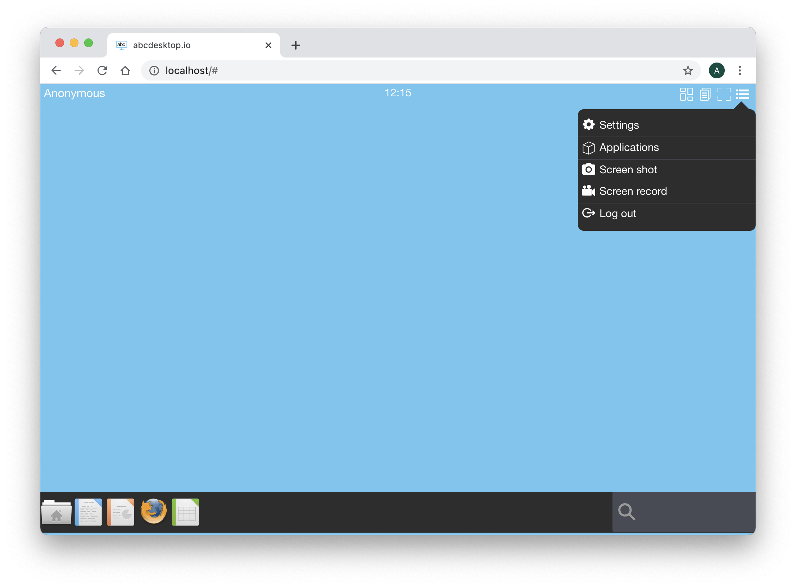
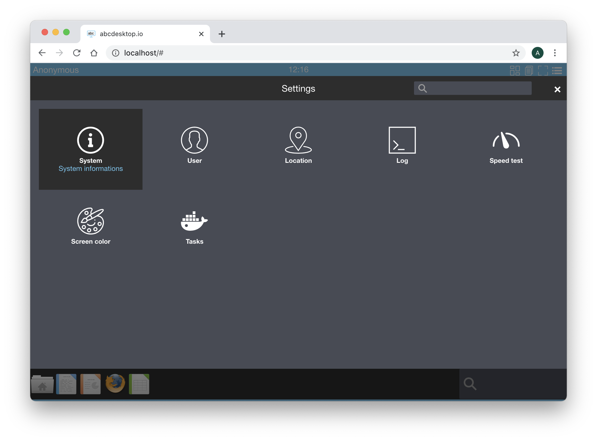
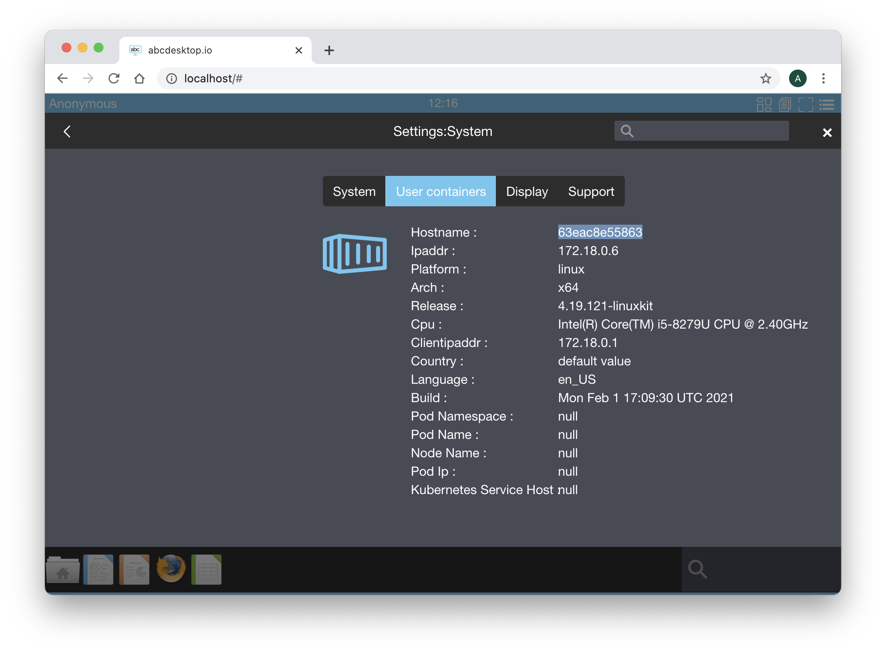

# Build abcdesktop docker image for Microsoft Windows using Wine


## Requirements

- Read the chapter [Edit your configuration file in docker mode](/config/editconfig/) is mandatory
- Read the chapter [Build abcdesktop docker image](/buildapplicationsgnulinux/) is mandatory.
- A running dockerd last version 
- An access to the docker public registry
- An access to the ubuntu repository
- Nodejs installed on your host.


abcdesktop can run Microsoft Windows applications using Wine.


## wine embedded in `oc.template.gtk.wine` image

To run Windows applications abcdesktop use wine. A dedicated image template source is ready to use as source of others Windows applications. This template is named `abcdesktopio/oc.template.gtk.wine.`

Start pulling this template image, if you don't have already done in the previous exercice : 

```
docker pull abcdesktopio/oc.template.gtk.wine
```

This image embeded the architecture format `win32` `win64`. By default the `WINEARCH` is set to `win32`. The `playonlinux` package is all ready installed.

## Change the od.config configuration file

### The ```homedirectorytype``` option  

To share the home directory ```/home/balloon```volume data between containers, set the ```desktop.homedirectorytype``` to ```'volume'``` in your od.config file.

Edit your own ```od.config``` file as described in the chapter [Edit your configuration file in docker mode](config/editconfig/), and make sure that ```desktop.homedirectorytype``` is set to ```'volume'```

```
desktop.homedirectorytype: 'volume' 
```

If need, run the ```docker-compose restart``` command in your abcdesktop directory where the ```od.config``` and the ```docker-compose.yml``` are located. 

```
docker-compose restart
```


## Build a new windows putty inside a docker container

> In this exercice we are going to install and run putty.exe for Windows inside a docker container for abcdesktop.


PuTTY is an SSH and telnet client, developed originally by Simon Tatham for the Microsoft Windows platform. 


Start an abcdesktop session. You can use an authenticated session using an authentication provider `external` or `explicit`, or you can do this exercice using Anonymous Authentification also know as the authentication provider `implicit`.

>In this exercice we choose an Anonymous authentification, **DO NOT CLOSE YOUR WEB BROWSER**, you should not be able de reconnect with the same user context, and have to restart this exercice again.


Login using the `Anonymous` authentification provider.


Click on the menu and choose settings options



On the `Settings` dialog box, choose `System` option



Choose the `User container` tabs, and select the `hostname` value. 



Copy this value into your clipboard. The hostname use the docker `containerid` value.

Keep your web browser open, and open a terminal shell on your server, to run docker shell commmand. 

Run the `docker inspect -f "{{ .HostConfig.Binds }}" ` and add your `CONTAINER ID` as parameter.

```
CONTAINER_ID=5719b77d3f2a
docker inspect -f "{{ .HostConfig.Binds }}" $CONTAINER_ID
```
where CONTAINER_ID is your own `containerid` value.

For example
```bash
docker inspect -f "{{ .HostConfig.Binds }}" 5719b77d3f2a
```

You should read the volume name starting by the prefix `tmp-` with your uuid value, and a second volume name starting by the prefix `home-` with your uuid:

```
[tmp-57be1e5b-0b14-4c05-ae79-75e9a03c77be:/tmp home-57be1e5b-0b14-4c05-ae79-75e9a03c77be:/home/balloon]
```


We are using the `/tmp` volume and the `/home/balloon` volume of your container.


> If your are using an anonymous authentification, the name of your container id is formated as an uuid, for example `a32deda7-324f-4ee4-9e51-51c1aaf66bcf`. The name of the `tmp` volume is  `tmp-a32deda7-324f-4ee4-9e51-51c1aaf66bcf` and the name of `tmp` volume is  `home-a32deda7-324f-4ee4-9e51-51c1aaf66bcf` 
> 
> If your are using an LDAP authentification, the name of your container id is a string equal to the username, for example `hermes`. The name of the `tmp` volume is  `tmp-hermes`  and the name of `tmp` volume is  `home-hermes`.

Replace in the command the string `TMP_VOLUMENAME` by your own tmp volume name. 

Replace in the command the string `HOME_VOLUMENAME` by your own home volume name. 

```bash
docker run -it -v TMP_VOLUMENAME:/tmp  -v HOME_VOLUMENAME:/home/balloon --user balloon abcdesktopio/oc.template.gtk.wine bash
```


For example with an anonymous user:

```bash
docker run -it -v tmp-a32deda7-324f-4ee4-9e51-51c1aaf66bcf:/tmp -v home-a32deda7-324f-4ee4-9e51-51c1aaf66bcf:/home/balloon --user balloon abcdesktopio/oc.template.gtk.wine bash 
```

Great, you have started a new docker container. The oc.user container and your new container is sharing the same volume mounted as `/tmp`. You get a prompt inside the new docker container.

```bash
To run a command as administrator (user "root"), use "sudo <command>".
See "man sudo_root" for details.

balloon@721263d5dece:~$ 
```

Init the wine directory 

```
wineboot --init
```

After few seconds you should read on the standard error

```
0014:err:ole:marshal_object couldn't get IPSFactory buffer for interface {00000131-0000-0000-c000-000000000046}
0014:err:ole:marshal_object couldn't get IPSFactory buffer for interface {6d5140c1-7436-11ce-8034-00aa006009fa}
0014:err:ole:StdMarshalImpl_MarshalInterface Failed to create ifstub, hres=0x80004002
0014:err:ole:CoMarshalInterface Failed to marshal the interface {6d5140c1-7436-11ce-8034-00aa006009fa}, 80004002
0014:err:ole:get_local_server_stream Failed: 80004002
0012:err:ole:marshal_object couldn't get IPSFactory buffer for interface {00000131-0000-0000-c000-000000000046}
0012:err:ole:marshal_object couldn't get IPSFactory buffer for interface {6d5140c1-7436-11ce-8034-00aa006009fa}
0012:err:ole:StdMarshalImpl_MarshalInterface Failed to create ifstub, hres=0x80004002
0012:err:ole:CoMarshalInterface Failed to marshal the interface {6d5140c1-7436-11ce-8034-00aa006009fa}, 80004002
0012:err:ole:get_local_server_stream Failed: 80004002
Could not find Wine Gecko. HTML rendering will be disabled.
Could not find Wine Gecko. HTML rendering will be disabled.
wine: configuration in L"/composer/.wine" has been updated.
```


And now download putty.exe from the web site https://www.putty.org/. 

> In this example, we use the 64 bits binary format

```
balloon@8e48719ae72f:~$ wget https://the.earth.li/~sgtatham/putty/latest/w64/putty.exe
```

Start the `putty.exe` with wine, with the command `wine putty.exe`

```
balloon@5719b77d3f2a:~$ wine putty.exe
```

After few seconds you should read on the standard error

``` 
0009:err:winediag:SECUR32_initNTLMSP ntlm_auth was not found or is outdated. Make sure that ntlm_auth >= 3.0.25 is in your path. Usually, you can find it in the winbind package of your distribution.
```

The wine prefix is `WINEPREFIX=/composer/.wine`, all files used by wine are stored in `/composer/.wine` directory.

On abcdesktop display, wine is starting the application putty, after few seconds, Putty is running :


You can use this Putty Windows application to connect to another host using `ssh` or `telnet` protocol. 


The application Putty is opened and is running in the background. 
At the right corner, write in the search bar the keyword `shell`
Click on the `Web Shell` icon, a new Terminal WebShell is now opened :


Run the command to list each X11 windows and get the WMClass name.

```bash
wmctrl -lx 
```


Read the WM_CLASS of the Putty Wine application: `putty.exe.Wine`

Then exit the `web shell` and quit on the Putty application. 
Wine has created a configuration directory in the default directory `/composer/.wine`. 


## Build the new putty.d image for abcdesktop


> In this chapter we are going to build a new docker image for abcdesktop

The new image is the putty. 

Create a directory named `build`, and create a directory `icons` inside build

```bash
mkdir build
mkdir build/icons
cd build
```

To build your own json file.

Create a json file named `applist.json`, inside build directory, and add the content to the json file.

```json
[
{
    "template": "abcdesktopio/oc.template.gtk.wine",
    "preruncommands": [ 
    	"ENV WINEARCH=win64",
    	"USER $BUSER",
     	"RUN wineboot --init",
    	"RUN wget -O /composer/bin/putty.exe https://the.earth.li/~sgtatham/putty/latest/w64/putty.exe",
    	"RUN echo disable > $WINEPREFIX/.update-timestamp" ],
    "args": "/composer/bin/putty.exe",
    "cat": "utilities",
    "debpackage": "",
    "icon": "putty.svg",
    "keyword": "putty,ssh,terminal",
    "launch": "putty.exe.Wine",
    "name": "putty-wine",
    "displayname": "Putty Wine",
    "path": "/usr/bin/wine"
}
]
```

To fill the data inside the json file :

| name                         | Type     |          Data                 |                                                                             
|------------------------------|--------- |-------------------------------|
|  `cat`                       | string   | utilities | 
|  `icon`                      | string   | putty.svg | 
|  `keyword`                   | string   | putty,ssh,terminal | 
|  `launch`                    | string   | putty.exe.Wine | 
|  `name`                      | string   | putty| 
|  `path`                      | string   | /usr/bin/wine |
|  `args `                     | string   | /composer/bin/putty.exe | 
|  `template`                  | string   | abcdesktopio/oc.template.gtk.wine | 

You can read the following help lines.

* `cat` is the category, choose the most appropriate value in the list :
			`[ 'office', 'games', 'graphics', 'development', 'utilities', 'education' ]`
* `icon` is the name of the icon. abcdesktop support only `svg` icon file format. To get the icon file, look at the link [https://raw.githubusercontent.com/abcdesktopio/oc.apps/main/icons/putty.svg](https://raw.githubusercontent.com/abcdesktopio/oc.apps/main/icons/putty.svg)
* `keyword` is a list of the keywords to find the application. Set the value to `putty,ssh,terminal`.
* `launch`  is the X11 Class name of the window. To get this value, we need to run the application on GNU/Linux (read the dedicated chapter below). 
* `name` is the name of the application. Set the value to putty.
* `path` is the binary path to run the application.   
* `template` is the name of the parent image. The default image parent for wine is `abcdesktopio/oc.template.gtk.wine`. 


Save the putty icon file on SVG format to the icons directory. 

```bash
wget -O icons/putty.svg https://raw.githubusercontent.com/abcdesktopio/oc.apps/main/icons/putty.svg
```

### Build putty your from `applist.json`

To build your new image, download the [make.js](https://raw.githubusercontent.com/abcdesktopio/oc.apps/main/make.js) script file. `make.js` is located in the `oc.apps` repository. Look at [https://github.com/abcdesktopio/oc.apps](https://github.com/abcdesktopio/oc.apps) if you can not download this file.

Save `make.js` it to you build directory.
`make.js` is a nodejs JavaScript file. Node.js® is a JavaScript runtime built on Chrome's V8 JavaScript.

> If you don't have already nodejs installed on your system, go to the website [nodejs download website](https://nodejs.org/en/download/) and follow the instructions to install nodejs.

```bash
wget https://raw.githubusercontent.com/abcdesktopio/oc.apps/main/make.js
```


In the build directory, you should have 

```
drwxr-xr-x   5 devuser  staff   160 Mar 11 15:15 .
drwxr-xr-x+ 31 devuser  staff   992 Mar 11 15:15 ..
-rw-r--r--   1 devuser  staff   497 Mar 11 15:15 applist.json
drwxr-xr-x   3 devuser  staff    96 Mar 11 15:02 icons
-rw-r--r--   1 devuser  staff  6112 Mar 11 15:12 make.js

./icons:
total 8
drwxr-xr-x  3 devuser  staff    96 Mar 11 15:02 .
drwxr-xr-x  5 devuser  staff   160 Mar 11 15:15 ..
-rw-r--r--  1 devuser  staff  1909 Oct 31  2015 putty.svg
```

Run the command make.js

```bash
node make.js
```

`make.js` build a new DockerFile for `putty` application. Remember, all application images use container images. 

You should get the output 

```json
{
  template: 'abcdesktopio/oc.template.gtk.wine',
  preruncommands: [
    'ENV WINEARCH=win64',
    'USER $BUSER',
    'RUN wineboot --init',
    'RUN echo disable > $WINEPREFIX/.update-timestamp', 
    'RUN wget -O /composer/bin/putty.exe https://the.earth.li/~sgtatham/putty/latest/w64/putty.exe'
  ],
  args: '/composer/bin/putty.exe',
  cat: 'utilities',
  debpackage: '',
  icon: 'putty.svg',
  keyword: 'putty,ssh,terminal',
  launch: 'putty.exe.Wine',
  name: 'putty-wine',
  displayname: 'Putty Wine',
  path: '/usr/bin/wine'
}
```

The new files `putty-wine.d` has been generated :

* `putty-wine.d` is the Dockerfile for your putty abcdesktop application

Read the content of the Dockerfile `putty-wine.d`.
List all labels, and confirm that the icon file is uuencoded format. Uuencoding is a form of binary-to-text encoding.


Now it's time to build your putty app. Run the command `docker build` command.

```bash
docker build  --build-arg TAG=latest -f putty-wine.d -t putty-wine.d .
```

You should read on the standard ouput


```
[+] Building 21.6s (10/10) FINISHED                                                                                      
 => [internal] load build definition from putty-wine.d                                                              0.0s
 => => transferring dockerfile: 12.46kB                                                                             0.0s
 => [internal] load .dockerignore                                                                                   0.0s
 => => transferring context: 2B                                                                                     0.0s
 => [internal] load metadata for docker.io/abcdesktopio/oc.template.gtk.wine:dev                                    0.0s
 => CACHED [1/6] FROM docker.io/abcdesktopio/oc.template.gtk.wine:dev                                               0.0s
 => [2/6] RUN wineboot --init                                                                                      10.9s
 => [3/6] RUN wget -O /composer/bin/putty.exe https://the.earth.li/~sgtatham/putty/latest/w64/putty.exe             0.6s 
 => [4/6] RUN  if [ -d /usr/share/icons ];   then cd /usr/share/icons;    /composer/safelinks.sh; fi                9.2s 
 => [5/6] RUN  if [ -d /usr/share/pixmaps ]; then cd /usr/share/pixmaps;  /composer/safelinks.sh; fi                0.4s 
 => [6/6] WORKDIR /home/balloon                                                                                     0.0s 
 => exporting to image                                                                                              0.4s 
 => => exporting layers                                                                                             0.3s 
 => => writing image sha256:2cbe019726e67ecb83af74e944ff932705086e632ab4a57dec719be5e7e654cd                        0.0s 
 => => naming to docker.io/library/putty-wine.d                                                                     0.0s
```

Now, your new image is ready to run.


### Run your putty for abcdesktop

The API server does not know that you have built your new 2048 application.
You have to send a message to the API server, to update the API Server images cache list.

Using your web browser or a curl command, call a http request to notify the API Server

```
http://localhost/API/manager/buildapplist
```

This http request return a json object, with all docker images details :


Reloead your web browser connected on the abcdesktop website, and log your again as anonymous.

In the search area, type ```putty```. Click on the ```Putty``` Application.


Wine is starting your ```Putty``` application :


Great, you have build a abcdesktop image for ```Putty```, build the application image ```Putty```. You can push this image to your own private docker registry.


### Optional add a persistant `user.reg` and `system.reg` windows registry files

> This is a quick and dirty solution, but it works fine  

Your wine configuration is stored in `/composer/.wine`, and by default `user.reg` and `system.reg` are located in the `WINEPREFIX` directory. The `user.reg` and `system.reg` files build when wine starts. 

To make a copy of fresh running `putty-wine.d` image. 
Start your `putty-wine.d` image and using a shell located the new `user.reg` and `system.reg` files

```
docker ps -a | grep putty-wine
65d95f4e7717   putty-wine.d:latest                               "/composer/appli-doc…"   16 seconds ago   Up 15 seconds                                                                                                    anonymous-putty-wine-7877d100de0b4363ad24240d67032c8c
```

Then copy files using the `docker cp` command

```bash
CONTAINERID=65d95f4e7717
docker cp $CONTAINERID:/composer/.wine/user.reg .
docker cp $CONTAINERID:/composer/.wine/system.reg .
```

Add them to your default `putty-wine.d` image using applist.json file :

```json
[
{
    "template": "abcdesktopio/oc.template.gtk.wine",
    "preruncommands": [ 
        "ENV WINEARCH=win64",
        "USER $BUSER",
        "RUN wineboot --init",
        "RUN wget -O /composer/bin/putty.exe https://the.earth.li/~sgtatham/putty/latest/w64/putty.exe",
        "RUN echo disable > $WINEPREFIX/.update-timestamp",
        "COPY --chown=$BUSER:$BUSER user.reg system.reg /composer/.wine" ],
    "args": "/composer/bin/putty.exe",
    "cat": "utilities",
    "debpackage": "",
    "icon": "putty.svg",
    "keyword": "putty,ssh,terminal",
    "launch": "putty.exe.Wine",
    "name": "putty-wine",
    "displayname": "Putty Wine",
    "path": "/usr/bin/wine"
}
]
```

Rebuild your Dockerfile

``` 
node make.js
```

```
{
  template: 'abcdesktopio/oc.template.gtk.wine',
  preruncommands: [
    'ENV WINEARCH=win64',
    'USER $BUSER',
    'RUN wineboot --init',
    'RUN wget -O /composer/bin/putty.exe https://the.earth.li/~sgtatham/putty/latest/w64/putty.exe',
    'RUN echo disable > $WINEPREFIX/.update-timestamp',
    'COPY --chown=$BUSER:$BUSER user.reg system.reg /composer/.wine'
  ],
  args: '/composer/bin/putty.exe',
  cat: 'utilities',
  debpackage: '',
  icon: 'putty.svg',
  keyword: 'putty,ssh,terminal',
  launch: 'putty.exe.Wine',
  name: 'putty-wine',
  displayname: 'Putty Wine',
  path: '/usr/bin/wine'
}
Building putty.exe.Wine
```


Run the command `docker build` command.

```bash
docker build  --build-arg TAG=latest -f putty-wine.d -t putty-wine.d .
```

Now your wine keep your registry's updates.

