# Build your own application image 

abcdesktop use docker image format with some labels to describe the application.

## Requirements

- A running dockerd last version 
- An access to the docker public registry
- An access to the ubuntu repository
- Nodejs installed on your host.  
- The root password of the oc.user docker image. The default password is `lmdpocpetit`, but this value may have been changed.


## Build your own application image 

> In this chapter we are going to build a new docker image for abcdesktop

The new image is the game 2048. 

Create a directory named `build`, and create a directory `icons` inside build

```
mkdir build
mkdir build/icons
cd build
```

To build your own image create first a json file.

Create a json file named `applist.json`, inside build directory, and add the content to the json file.

```
[
  {
    "cat": "games",
    "debpackage": "2048-qt",
    "icon": "2048_logo.svg",
    "keyword": "2048",
    "launch": "2048-qt.2048-qt",
    "name": "2048",
    "displayname": "2048",
    "path": "/usr/games/2048-qt",
    "template": "abcdesktopio/oc.template.gtk"
  }
]
```

To fill the data inside the json file :

| name                             | Type     |          Data                 |                                                                             
|----------------------------------|--------- |-------------------------------|
|  ```cat```                       | string   | games | 
|  ```debpackage```                | string   | 2048-qt | 
|  ```icon```                      | string   | 2048_logo.svg | 
|  ```keyword```                   | string   | 2048 | 
|  ```launch```                    | string   | 2048-qt.2048-qt | 
|  ```name```                      | string   | 2048| 
|  ```path```                      | string   | /usr/games/2048-qt |
|  ```template```                  | string   | abcdesktopio/oc.template.gtk | 

You can read the following help lines, or fill the json missing value by yourself.

* `cat` is the category, choose the most appropriate value in the list :
			[ 'office', 'games', 'graphics', 'development', 'utilities', 'education' ]
* `debpackage` is the name of the 2048 ubuntu package. To find the package name, look at the link [2048 Ubuntu Package](https://packages.ubuntu.com/source/bionic/2048-qt).
* `icon` is the name of the icon. abcdesktop support only `svg` icon file format. To get the icon file, look at the link [https://upload.wikimedia.org/wikipedia/commons/1/18/2048_logo.svg](https://upload.wikimedia.org/wikipedia/commons/1/18/2048_logo.svg)
* `keyword` is a list of the keywords to find the application. Set the value to 2048.
* `launch`  is the X11 Class name of the window. To get this value, we need to run the application on GNU/Linux (read the dedicated chapter below). 
* `name` is the name of the application. Set the value to 2048.
* `path` is the binary path to run the application.   
* `template` is the name of the parent image. The default image parent is `abcdesktopio/oc.template.gtk`. You will learn how to customize your own template image, in next chapter. 


Save the 2048 icon file on SVG format to the icons directory. 
You should have this file in the icons directory as the output of the ```ls icons``` command :

```
2048_logo.svg
```

### Build your new image 2048

To build your new image, download the [make.js](https://raw.githubusercontent.com/abcdesktopio/oc.apps/main/make.js) script file. `make.js` is located in the `oc.apps` repository. Look at [https://github.com/abcdesktopio/oc.apps](https://github.com/abcdesktopio/oc.apps) if you can not download this file.

Save `make.js` it to you build directory.
`make.js` is a nodejs JavaScript file. Node.js® is a JavaScript runtime built on Chrome's V8 JavaScript.

> If you don't have already nodejs installed on your system, go to the website [nodejs download website](https://nodejs.org/en/download/) and follow the instructions to install nodejs.

In the build directory, you should have 

```
drwxr-xr-x   5 devuser  staff   160 Mar 11 15:15 .
drwxr-xr-x+ 31 devuser  staff   992 Mar 11 15:15 ..
-rw-r--r--   1 devuser  staff   265 Mar 11 15:15 applist.json
drwxr-xr-x   3 devuser  staff    96 Mar 11 15:02 img
-rw-r--r--   1 devuser  staff  8036 Mar 11 15:12 make.js

./img:
total 8
drwxr-xr-x  3 devuser  staff    96 Mar 11 15:02 .
drwxr-xr-x  5 devuser  staff   160 Mar 11 15:15 ..
-rw-r--r--  1 devuser  staff  1909 Oct 31  2015 2048_logo.svg
```

Run the command make.js

```
node make.js
```

`make.js` build a new DockerFile for the 2048 application. Remember, all application images use container images. 

You should get the output 

```
{
  cat: 'games',
  debpackage: '2048-qt',
  icon: '2048_logo.svg',
  keyword: '2048',
  launch: '2048-qt.2048-qt',
  name: '2048',
  displayname: '2048',
  path: '/usr/games/2048-qt',
  template: 'abcdesktopio/oc.template.gtk'
}
Building 2048-qt.2048-qt
{
  cat: 'games',
  debpackage: '2048-qt',
  icon: '2048_logo.svg',
  keyword: '2048',
  launch: '2048-qt.2048-qt',
  name: '2048',
  displayname: '2048',
  path: '/usr/games/2048-qt',
  template: 'abcdesktopio/oc.template.gtk'
}
Building documentation 2048-qt.2048-qt
        - '2048'   : '2048.md'
```

The new files `2048.d` and `2048.md` have been generated :

* `2048.d` is the Dockerfile for your 2048 abcdesktop application
* `2048.md` is the documentation file for your 2048 abcdesktop application

Read the content of the Dockerfile ```2048.d```.
List all labels, and confirm that the icon file is uuencoded format. Uuencoding is a form of binary-to-text encoding.


Now it's time to build your 2048 app. Run the command `docker build` command.

```
docker build  --build-arg TAG=latest -f 2048.d -t 2048.d .
```

You should read the output : 

```
[+] Building 32.0s (10/10) FINISHED                                                                                                                                                                 
 => [internal] load build definition from 2048.d                                                                                                                                               0.0s
 => => transferring dockerfile: 33B                                                                                                                                                            0.0s
 => [internal] load .dockerignore                                                                                                                                                              0.0s
 => => transferring context: 2B                                                                                                                                                                0.0s
 => [internal] load metadata for docker.io/abcdesktopio/oc.template.gtk:latest                                                                                                                 1.4s
 => [1/6] FROM docker.io/abcdesktopio/oc.template.gtk:latest@sha256:f3c98362fb80f5edde423b895422fc183e2728257de1d4352c4f70c7b43835fb                                                           0.4s
 => => resolve docker.io/abcdesktopio/oc.template.gtk:latest@sha256:f3c98362fb80f5edde423b895422fc183e2728257de1d4352c4f70c7b43835fb                                                           0.0s
 => => sha256:f3c98362fb80f5edde423b895422fc183e2728257de1d4352c4f70c7b43835fb 4.50kB / 4.50kB                                                                                                 0.0s
 => => sha256:f3c3f03bd0b5cda9f56703a4ba1b9d96d5ff2be3c03bee1831ce30dc98bb3b62 8.93kB / 8.93kB                                                                                                 0.0s
 => [2/6] RUN DEBIAN_FRONTEND=noninteractive apt-get update && apt-get install -y  --no-install-recommends 2048-qt && apt-get clean                                                           27.5s
 => [3/6] RUN echo 'debconf debconf/frontend select Noninteractive' | debconf-set-selections                                                                                                   0.5s
 => [4/6] RUN  if [ -d /usr/share/icons ];   then cd /usr/share/icons;    /composer/safelinks.sh; fi                                                                                           0.5s 
 => [5/6] RUN  if [ -d /usr/share/pixmaps ]; then cd /usr/share/pixmaps;  /composer/safelinks.sh; fi                                                                                           0.4s 
 => [6/6] WORKDIR /home/balloon                                                                                                                                                                0.0s 
 => exporting to image                                                                                                                                                                         1.1s 
 => => exporting layers                                                                                                                                                                        1.1s 
 => => writing image sha256:a861af06b7f0dfa19fcde19ee8848bfee65807f852b082d9314e68676966895a                                                                                                   0.0s
 => => naming to docker.io/library/2048.d
```

Check that your image is ready on your system:

Run the docker images command 

```
docker images
```

You should read on the stdout more lines, only 2048.d is listed here :

```
REPOSITORY                           TAG                                                     IMAGE ID       CREATED              SIZE
2048.d                               latest                                                  a861af06b7f0   About a minute ago   1.17GB
```

The total image size of 2048.d is 1.17GB.

The 2048.d does not use 1.17GB, but only the difference between the 2048 image and the source image `abcdesktopio/oc.template.gtk`.


## Update the cache application list

The API server receives a new image event from docker. To run the new applications just refresh you web browser page.


## Run your new application

Return to your abcdesktop website `http://localhost` and log in as Anonymous.

At the right corner, write in the search bar the keyword `2048`

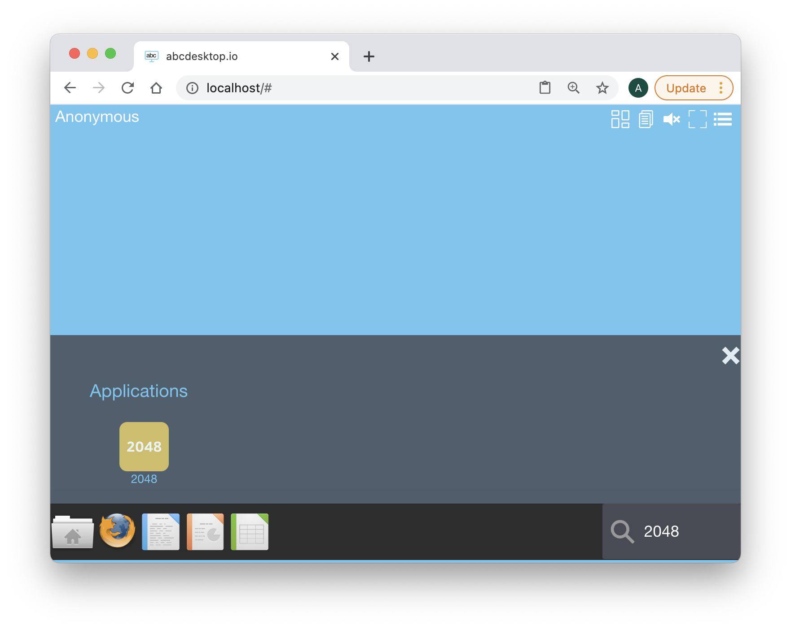

Click on the `2048` icon, and start your first abcdesktop application :

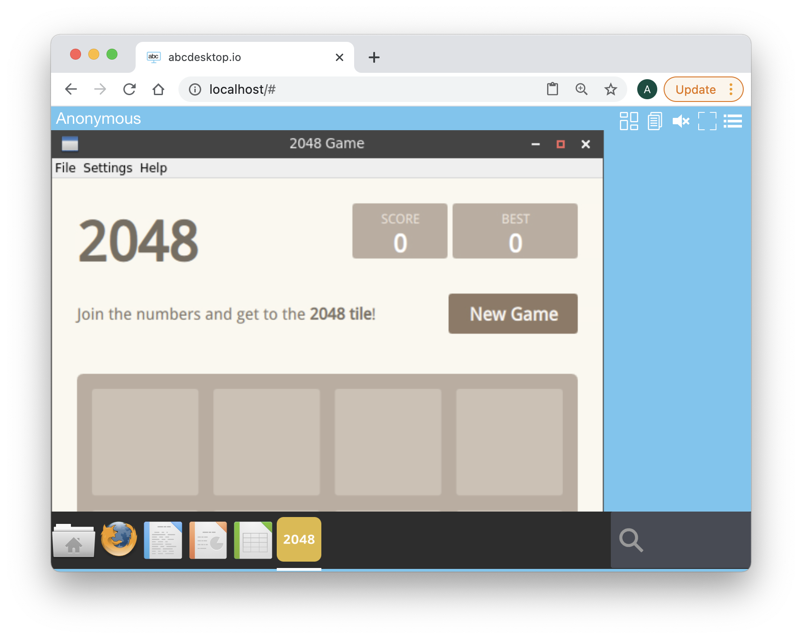

Great it's a good job, you have build your own abcdesktop 2048 application. 

Now you can spent a lot of time to reach the 2048 score. Have fun !


### Get `launch` and `path` values

To get the X11 class name of the 2048 game, we need to install it on a Linux host. You can use abcdesktop as a Linux host or choose your own.

If you want to use abcdesktop as a GNU/Linux host 

Open the url http://localhost, in your web browser, to start a simple abcdesktop container. You will use this container to install the 2048 application and fill the missing values `launch` and `path`.

```
http://localhost
```

You should see the abcdesktop.io home page.

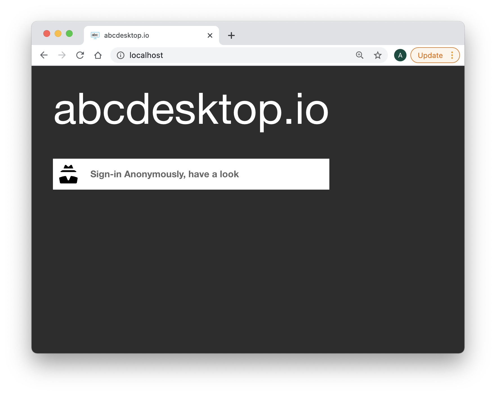

Press the `Connect with Anonymous access, have look`

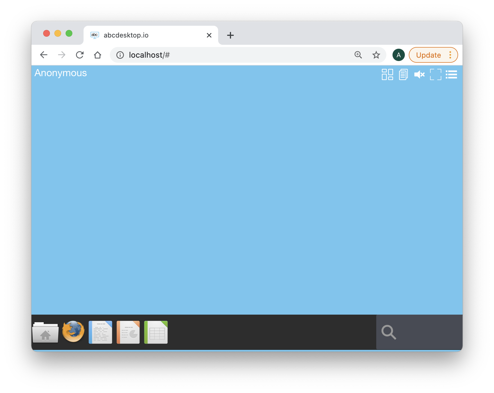

At the right corner, write in the search bar the keyword `shell`

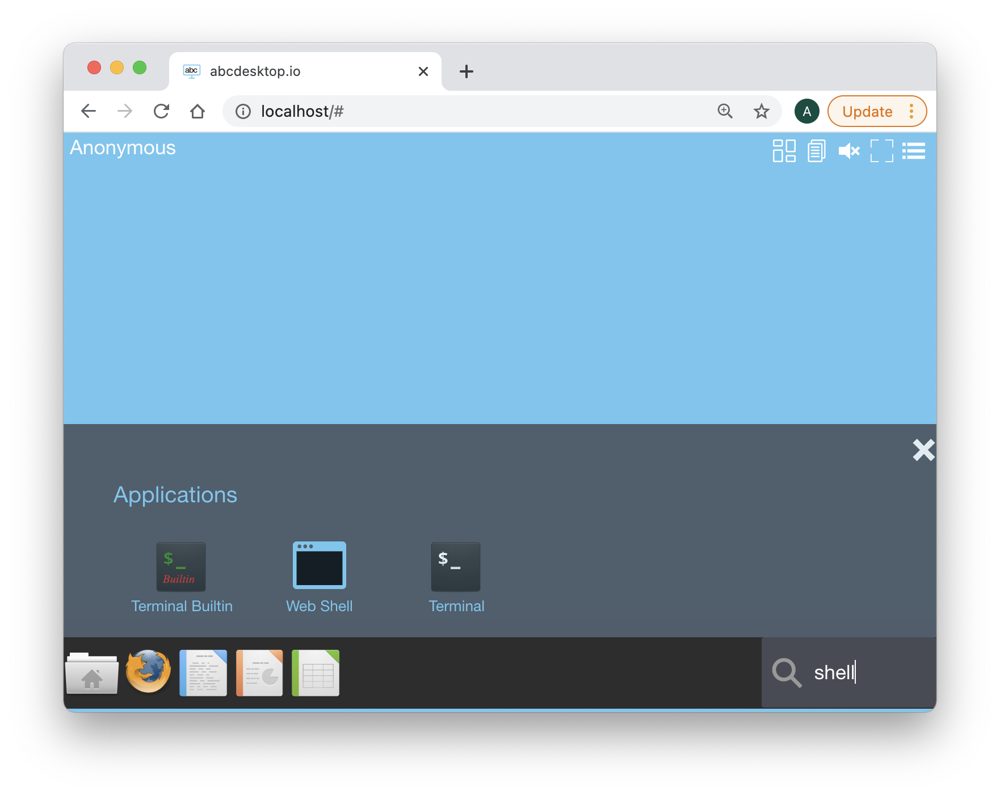

Click on the `Web Shell` icon, a new Terminal WebShell is now opened :


Run the command 

```
sudo apt-get update 
```

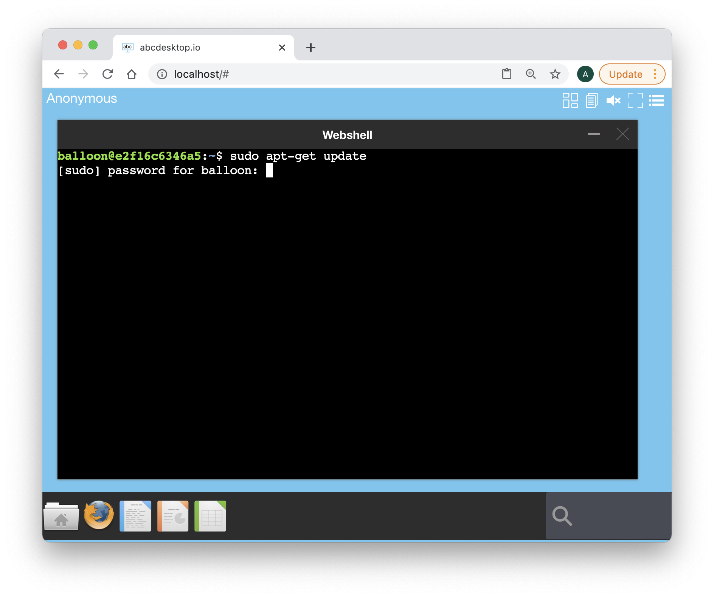

The default password is `lmdpocpetit`
( if your admin did not change it, otherwise ask to the administrator )

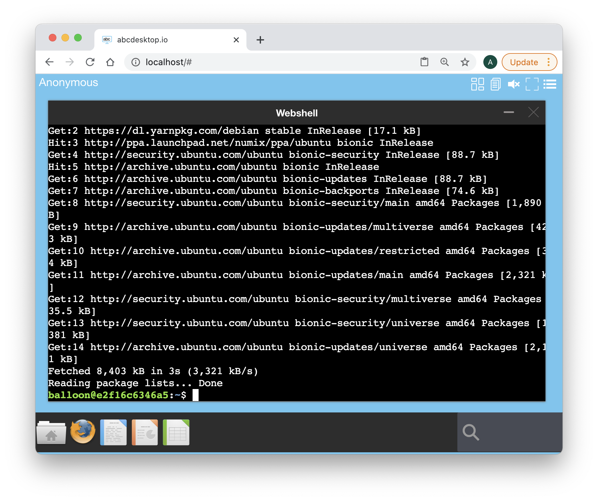


Run the installation command 

```
sudo apt-get install -y 2048-qt 
```

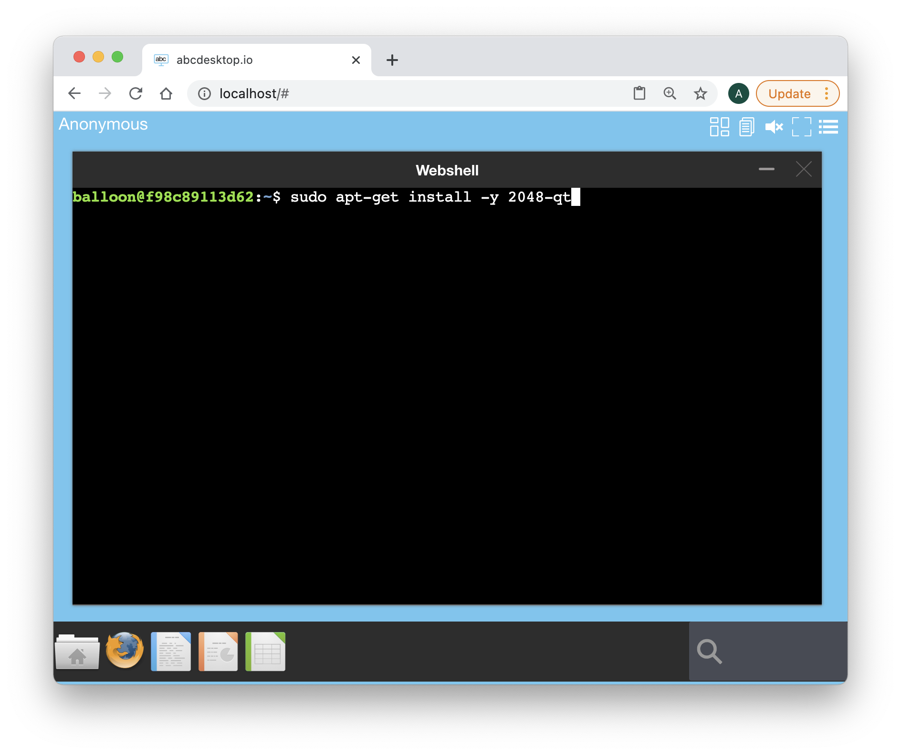

You should read the output, during the installation process

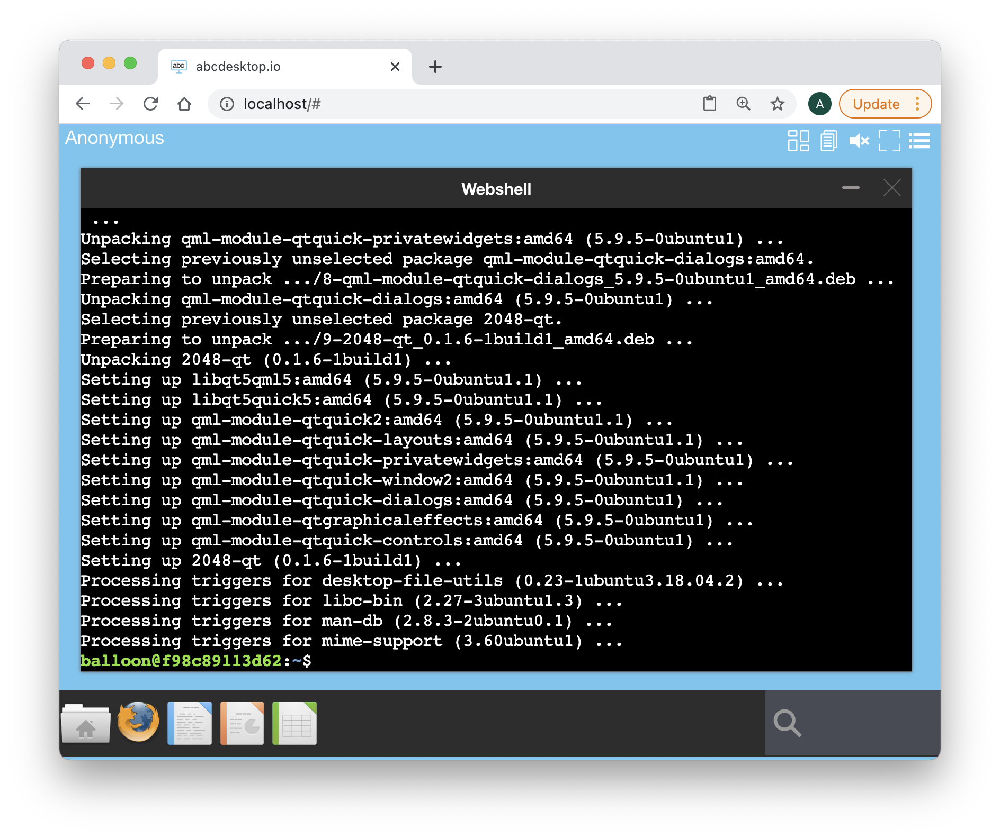

On Ubuntu, the games are installed in a dedicated directory `/usr/games`.

Read the file list of the [2048-qt Ubuntu package](https://packages.ubuntu.com/xenial/amd64/2048-qt/filelist)

```
/usr/games/2048-qt
/usr/share/applications/2048-qt.desktop
/usr/share/doc/2048-qt/changelog.Debian.gz
/usr/share/doc/2048-qt/copyright
/usr/share/man/man6/2048-qt.6.gz
/usr/share/menu/2048-qt
/usr/share/pixmaps/2048-qt.xpm
```


Start the 2048 game binary `2048-qt` in background.

```
/usr/games/2048-qt & 
```

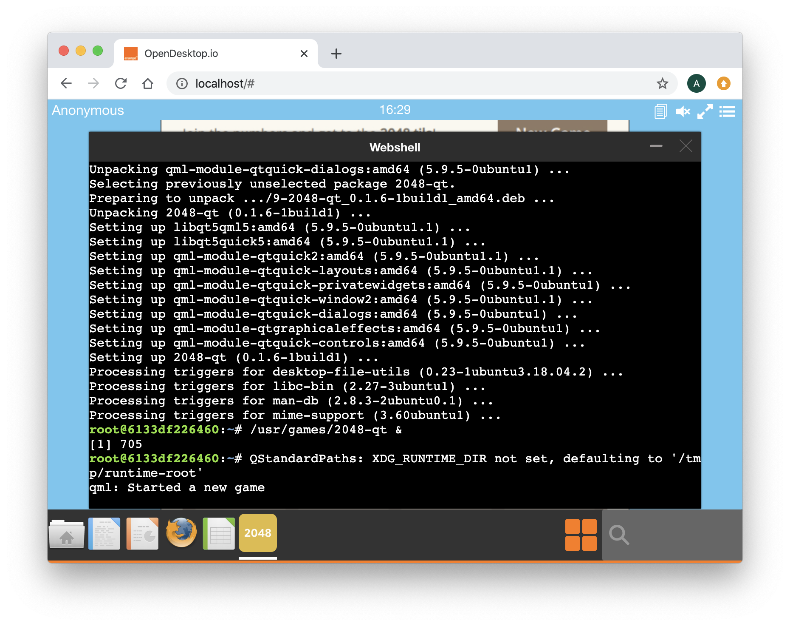

The new 2048 window is opening in the background. You can minimise the shell window to play to the 2048 game, but this is not the goal of this chapter. To show the shell window again, [click on the shell icon on the upper right corner](img/2048-restaureshell.png).

Run the command to list each X11 windows and get the WMClass name.

```
wmctrl -lx 
```

`wmctrl` is a command that can be used to interact with an X Window manager, and can query the window manager for information, and it can request that certain window management actions be taken. 

* `-l` list the windows being managed by the window manager. 
* `-x` include WM_CLASS in the window list


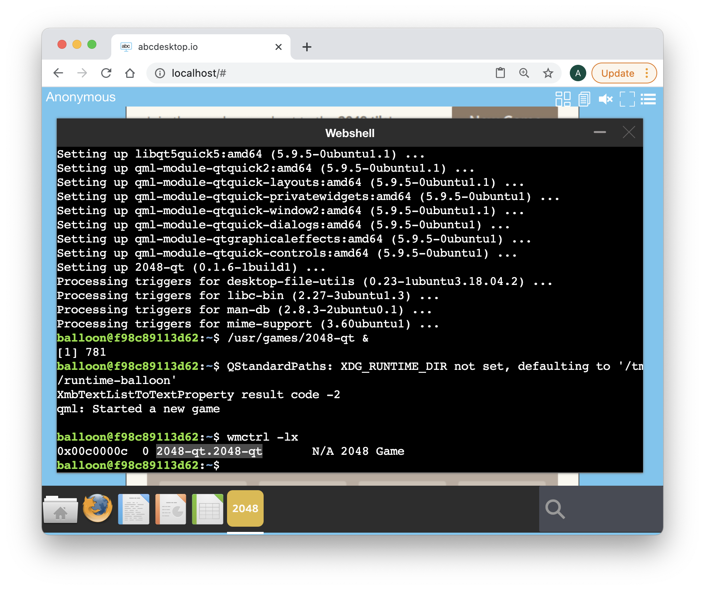

Great, look at the third value, this is what we are looking for :

* The `launch` is `2048-qt.2048-qt`
* The `path` is `/usr/games/2048-qt`

You can now close your web browser and fill your json file, by yourself


## GIMP 

The applist.json is a array of application object. Add a new application object in the array, and fill the value for the new application.

By yourself, you have to run this exercice again, for the Gimp application.
Gimp is [Gnu Image Manipulation Program](https://www.gimp.org/).

New applist.json data, and build your own Gimp abcdesktop.io application.


```
[
  {
    "cat": "games",
    "debpackage": "2048-qt",
    "icon": "2048_logo.svg",
    "keyword": "2048",
    "launch": "2048-qt.2048-qt",
    "name": "2048",
    "displayname": "2048",
    "path": "/usr/games/2048-qt",
    "template": "abcdesktopio/oc.template.gtk"
  },
  {
    "cat": "",
    "debpackage": "",
    "icon": "",
    "keyword": "",
    "launch": "t",
    "name": "",
    "displayname": "",
    "path": "",
    "template": ""
  }

]
```

You should get data entries like:

* The GIMP icon SVG file is avalaible on wikipedia website [The_GIMP_icon_-_gnome.svg](https://upload.wikimedia.org/wikipedia/commons/4/45/The_GIMP_icon_-_gnome.svg)
* The wmctrl show the WM_CLASS `gimp.Gimp`
* The path is `/usr/bin/gimp`

```
[
  {
    "cat": "games",
    "debpackage": "2048-qt",
    "icon": "2048_logo.svg",
    "keyword": "2048",
    "launch": "2048-qt.2048-qt",
    "name": "2048",
    "displayname": "2048",
    "path": "/usr/games/2048-qt",
    "template": "abcdesktopio/oc.template.gtk"
  },
  {
    "cat": "graphics",
    "debpackage": "gimp",
    "icon": "gimp.svg",
    "keyword": "gimp,image,gif,tiff,png,jpeg,bmp,tga,pcx,bitmap,jpg,pixmap",
    "launch": "gimp.Gimp",
    "name": "Gimp",
    "path": "/usr/bin/gimp",
    "template": "abcdesktopio/oc.template.gtk"
  }

]
```

## Add MimeType, FileExtensions and desktopfile entries 

abcdesktop support MimeType, File Extensions and [Desktop Entry Specification](https://developer.gnome.org/desktop-entry-spec/) entries from Gnome.


```
    "mimetype": "image/bmp;image/g3fax;image/gif;image/x-fits;image/x-pcx;image/x-portable-anymap;image/x-portable-bitmap;image/x-portable-graymap;image/x-portable-pixmap;image/x-psd;image/x-sgi;image/x-tga;image/x-xbitmap;image/x-xwindowdump;image/x-xcf;image/x-compressed-xcf;image/x-gimp-gbr;image/x-gimp-pat;image/x-gimp-gih;image/jpeg;image/x-psp;image/png;image/x-icon;image/x-xpixmap;image/x-wmf;image/jp2;image/jpeg2000;image/jpx;image/x-xcursor;",
    "fileextensions": "dds",
    "legacyfileextensions":"dds",
    "desktopfile":"/usr/share/applications/gimp.desktop"
```


These entries allow user to use the file manager choice `Open with` and `Open with Other Application`

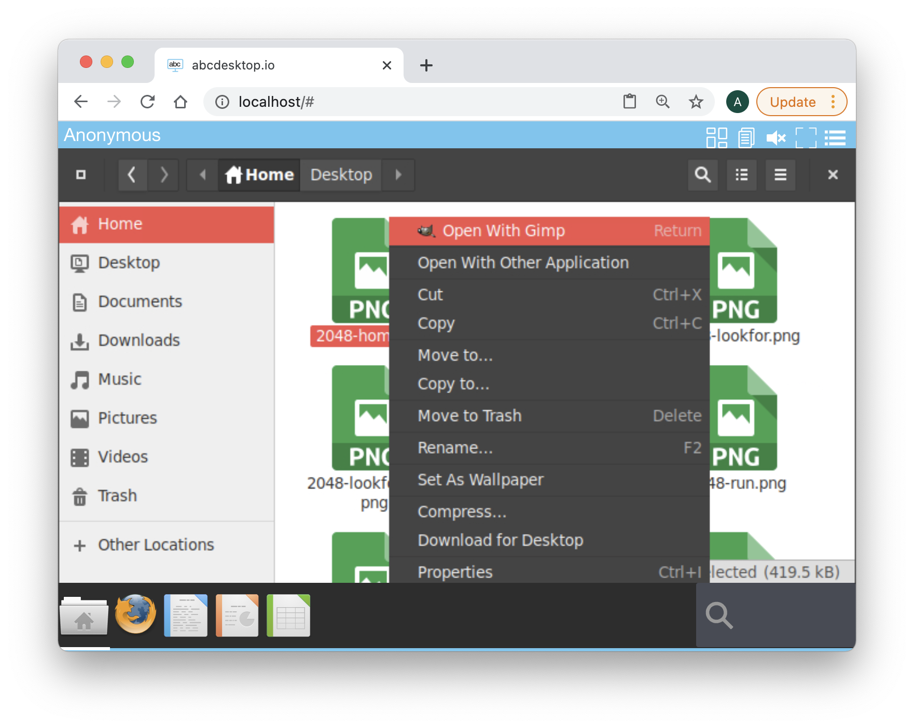

and list `Recommended Applications`

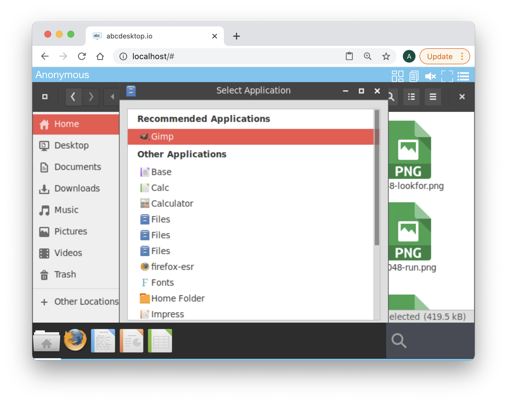

The Gimp Json data shows

```
{
    "cat": "graphics",
    "debpackage": "gimp",
    "icon": "gimp.svg",
    "keyword": "gimp,image,gif,tiff,png,jpeg,bmp,tga,pcx,bitmap,jpg,pixmap",
    "launch": "gimp.Gimp",
    "name": "Gimp",
    "path": "/usr/bin/gimp",
    "template": "abcdesktopio/oc.template.gtk",
    "mimetype": "image/bmp;image/g3fax;image/gif;image/x-fits;image/x-pcx;image/x-portable-anymap;image/x-portable-bitmap;image/x-portable-graymap;image/x-portable-pixmap;image/x-psd;image/x-sgi;image/x-tga;image/x-xbitmap;image/x-xwindowdump;image/x-xcf;image/x-compressed-xcf;image/x-gimp-gbr;image/x-gimp-pat;image/x-gimp-gih;image/jpeg;image/x-psp;image/png;image/x-icon;image/x-xpixmap;image/x-wmf;image/jp2;image/jpeg2000;image/jpx;image/x-xcursor;",
    "fileextensions": "dds",
    "legacyfileextensions":"dds",
    "desktopfile":"/usr/share/applications/gimp.desktop"
}
```


Have a look to the complete [applist.json](https://raw.githubusercontent.com/abcdesktopio/oc.apps/main/applist.json) file. abcdesktop applist.json contains description to build all default abcdesktop applications. 


### Using the Alpine Docker image

### musl memory 
[musl versus glibc](https://octopus.com/blog/using-alpine-docker-image#musl-vs-glibc)


