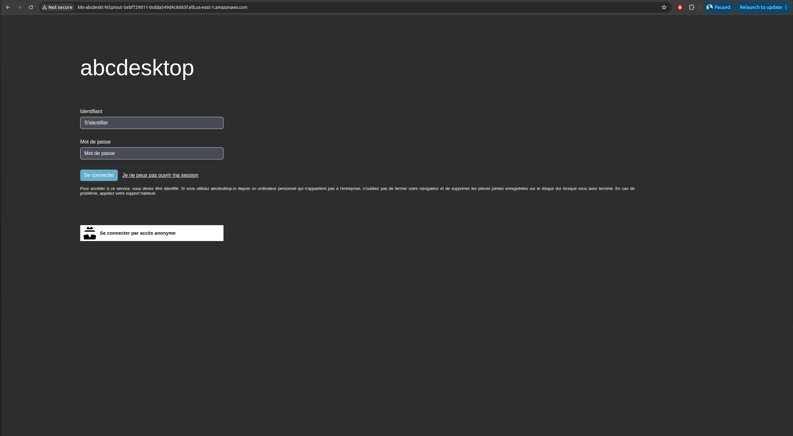
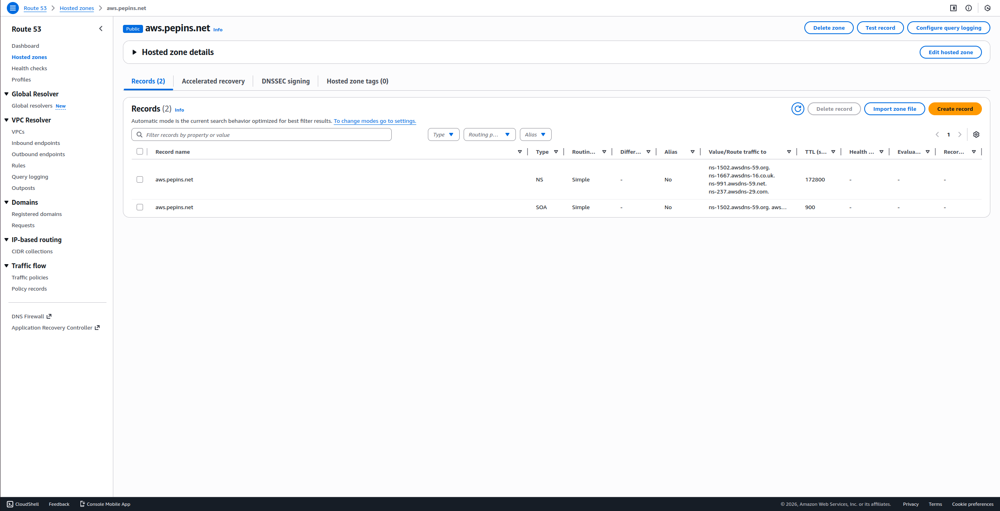
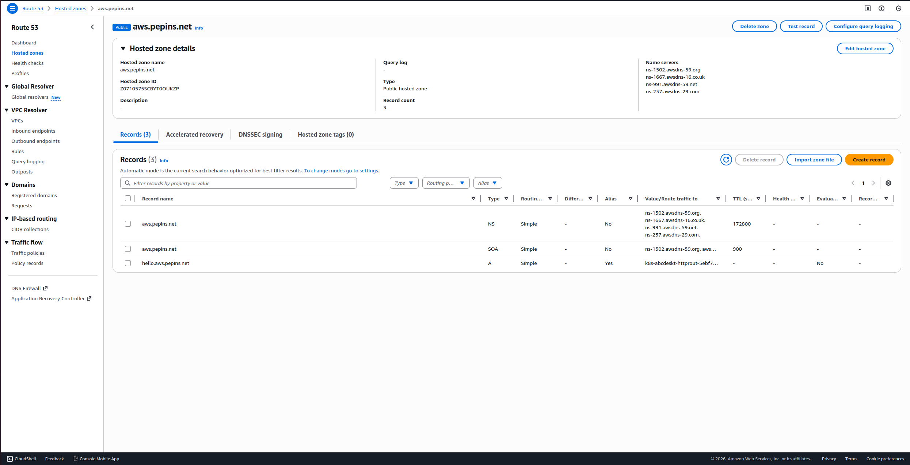
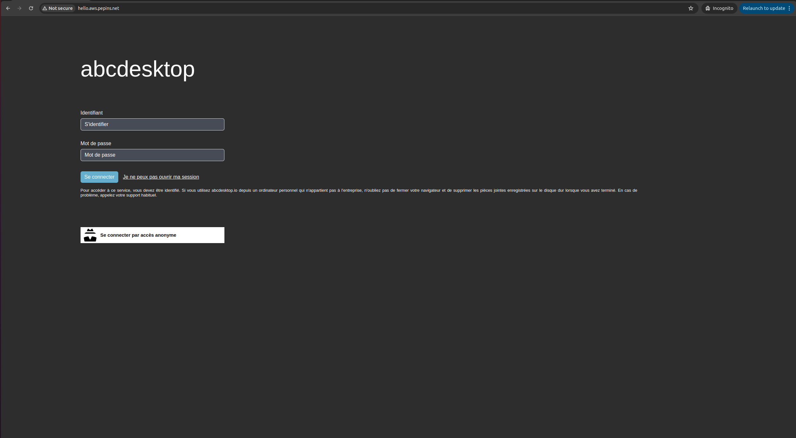

# Publish your website as a public secured service


## Requirements


- read the previous chapter [Deploy abcdesktop on AWS with Amazon Elastic Kubernetes Service](aws.md) 
- an AWS account
- your own internet domain
- `aws` command line interface [aws-cli](https://aws.amazon.com/cli/)
- `kubectl` command line
- `wget` command line


## Overview

In this chapter, you will use a `LoadBalancer` service to expose your abcdesktop service with a public IP address, configure your DNS zone file to use your domain name, and enable TLS to secure the service.
 

## Add tags for public subnets

By default, when creating your VPC, the public subnets do not have the `kubernetes.io/role/elb=1` tag. This tag is required to expose your service through a load balancer on AWS, because AWS scans your VPC for subnets bearing this exact tag to determine where to place load balancers.

To add the tag, run the following command:

```
aws ec2 create-tags --resources <your_public_subnets_ids> --tags Key=kubernetes.io/role/elb,Value=1
```

> You can find your public subnet IDs on the `Subnets` page of the VPC dashboard in the AWS console.

You can verify that the tags have been applied by running the following command:

```
aws ec2 describe-subnets --filters "Name=vpc-id,Values=<your_vpc_id>" "Name=tag:kubernetes.io/role/elb,Values=1" --query 'Subnets[*].[SubnetId,AvailabilityZone]' --output table
```

You should see the following output on stdout:

```
--------------------------------------------
|              DescribeSubnets             |
+---------------------------+--------------+
|  subnet-09c09bd5bbdec72a6 |  us-east-1b  |
|  subnet-02d592feab5bb0faf |  us-east-1a  |
+---------------------------+--------------+

```

## Create a new `http-router` service yaml file


The default installation configures the `http-router` service as type `NodePort`. You will update it to type `LoadBalancer` to expose the service with a public IP address.

Create a file named `http-router.yaml`:

```
apiVersion: v1
kind: Service
metadata:
  name: http-router
  labels:
    abcdesktop/role: router-od
  annotations:
    service.beta.kubernetes.io/aws-load-balancer-type: "nlb-ip"
    service.beta.kubernetes.io/aws-load-balancer-scheme: "internet-facing"
    service.beta.kubernetes.io/aws-load-balancer-healthcheck-protocol: "http"
    service.beta.kubernetes.io/aws-load-balancer-healthcheck-port: "80"
    service.beta.kubernetes.io/aws-load-balancer-healthcheck-path: "/healthz"
spec:
  type: LoadBalancer
  selector:
    run: router-od
  ports:
    - name: https
      protocol: TCP
      port: 443
      targetPort: 443
    - name: http
      protocol: TCP
      port: 80
      targetPort: 80
```

Save your `http-router.yaml` file.

Delete the existing `http-router` service:

```
kubectl delete service http-router -n abcdesktop
service "http-router" deleted
```

Apply your new `service/http-router`:

```
kubectl apply -f http-router.yaml -n abcdesktop
service/http-router created
```

Wait a few minutes. The `EXTERNAL-IP` of the `http-router` service will initially remain in a `Pending` state:

```
kubectl get services http-router -n abcdesktop 
```

```
NAME          TYPE           CLUSTER-IP      EXTERNAL-IP   PORT(S)        AGE
http-router   LoadBalancer   172.20.207.4    <pending>     80:32155/TCP   3s
```

Check the `EXTERNAL-IP` of the `http-router` service again:

```
kubectl get services http-router -n abcdesktop       
```

> The service has been assigned `k8s-abcdeskt-httprout-5ebf729011-0cdda549d4c8665f.elb.us-east-1.amazonaws.com` as its `EXTERNAL-IP`.

```      
NAME          TYPE           CLUSTER-IP     EXTERNAL-IP                                                                     PORT(S)                      AGE
http-router   LoadBalancer   172.20.207.4   k8s-abcdeskt-httprout-5ebf729011-0cdda549d4c8665f.elb.us-east-1.amazonaws.com   443:32461/TCP,80:31216/TCP   2m3d
``` 

Open a web browser and navigate to the provided URL to access your abcdesktop service.





Web browsers do not permit WebSocket connections over an insecure protocol. To log in, you must use the `https` protocol. 


## Update your DNS zone file 


You will use an FQDN (Fully Qualified Domain Name) to replace the raw IP address.




This screenshot shows the AWS network console for Route 53 and displays the `Domain` configuration. You can also manage your zone file directly through your own domain registrar.

### Create new record

Create a new DNS `A` record named `hello` (e.g., `hello.aws.pepins.net`) aliased to `k8s-abcdeskt-httprout-5ebf729011-0cdda549d4c8665f.elb.us-east-1.amazonaws.com`.

First, retrieve the hosted zone ID of your load balancer by running the following command:

```
aws elbv2 describe-load-balancers   --region us-east-1   --query 'LoadBalancers[0].CanonicalHostedZoneId'
```

You should receive output similar to the following:

```
Z26RNL4JYFTOTI
```

Paste the following content into a `create-record-abcdesktop-aws.json` file:

```
{
  "Comment": "create a new record for abcdesktop on aws",
  "Changes": [
    {
      "Action": "CREATE",
      "ResourceRecordSet": {
        "Name": "hello.aws.pepins.net.",
        "Type": "A",
        "AliasTarget": {
          "HostedZoneId": "<your_hosted_zone_id>",
          "DNSName": "k8s-abcdeskt-httprout-5ebf729011-0cdda549d4c8665f.elb.us-east-1.amazonaws.com",
          "EvaluateTargetHealth": false
        }
      }
    }
  ]
}
```

Next, retrieve the hosted zone ID of your domain in Route 53. You can obtain it through the Route 53 web console or by running the following command:

```
aws route53 list-hosted-zones   --query 'HostedZones[*].[Name,Id]'   --output table
```

The output will look similar to the following:

```
--------------------------------------------------------
|                    ListHostedZones                   |
+------------------+-----------------------------------+
|  aws.pepins.net. |  /hostedzone/Z0710575SCBYT0OUKZP  |
+------------------+-----------------------------------+
```

Finally, run the following command to add the DNS record:

```
aws route53 change-resource-record-sets --hosted-zone-id <your_domain_hosted_zone_id> --change-batch file://create-record-abcdesktop-aws.json 
```

For example:

```
aws route53 change-resource-record-sets --hosted-zone-id Z0710575SCBYT0OUKZP --change-batch file://create-record-abcdesktop-aws.json
```

The output will look similar to the following:

```
{
    "ChangeInfo": {
        "Id": "/change/C07091422RBO1K64I6QWN",
        "Status": "PENDING",
        "SubmittedAt": "2026-01-14T13:30:30.133000+00:00",
        "Comment": "create a new record for abcdesktop on aws"
    }
}
```

If you navigate to the Route 53 web console, you will see the newly added record.



From your local device, open a web browser to confirm DNS resolution:




Web browsers do not permit WebSocket connections over an insecure protocol. To log in, you must use the `https` protocol.

As you can see, the website is marked `Not Secured`. The next step adds an X.509 SSL certificate to secure the service.


## Obtain a Certificate

If you already have an X.509 certificate with private and public key files for your website, you can skip this section.

To create an SSL certificate, this guide uses the Let's Encrypt service. You will need your public hostname and email address.

Define the environment variables `ABCDESKTOP_PUBLIC_FQDN` and `USER_EMAIL_ADDRESS`:


``` bash
ABCDESKTOP_PUBLIC_FQDN=hello.aws.pepins.net
USER_EMAIL_ADDRESS=thisisyouremail@domain.com
ROUTER_POD_NAME=$(kubectl get pods -l run=router-od -o jsonpath={.items..metadata.name}  -n abcdesktop)
kubectl exec -n abcdesktop -it ${ROUTER_POD_NAME} -- /usr/bin/certbot certonly --webroot -w /var/lib/nginx/html -d ${ABCDESKTOP_PUBLIC_FQDN} -m "${USER_EMAIL_ADDRESS}" --agree-tos -n
```

You should see the following output on stdout:

```
Saving debug log to /var/log/letsencrypt/letsencrypt.log
Account registered.
Requesting a certificate for hello.aws.pepins.net

Successfully received certificate.
Certificate is saved at: /etc/letsencrypt/live/hello.aws.pepins.net/fullchain.pem
Key is saved at:         /etc/letsencrypt/live/hello.aws.pepins.net/privkey.pem
This certificate expires on 2026-04-13.
These files will be updated when the certificate renews.

NEXT STEPS:
- The certificate will need to be renewed before it expires. Certbot can automatically renew the certificate in the background, but you may need to take steps to enable that functionality. See https://certbot.org/renewal-setup for instructions.

- - - - - - - - - - - - - - - - - - - - - - - - - - - - - - - - - - - - - - - -
If you like Certbot, please consider supporting our work by:
 * Donating to ISRG / Let's Encrypt:   https://letsencrypt.org/donate
 * Donating to EFF:                    https://eff.org/donate-le
- - - - - - - - - - - - - - - - - - - - - - - - - - - - - - - - - - - - - - - -

```

The `fullchain.pem` and `privkey.pem` files are stored inside the container at the following paths:

```
Certificate is saved at: /etc/letsencrypt/live/hello.aws.pepins.net/fullchain.pem
Key is saved at:         /etc/letsencrypt/live/hello.aws.pepins.net/privkey.pem
```

Export the certificate files and create a new Kubernetes secret:


```
kubectl exec -n abcdesktop -it  ${ROUTER_POD_NAME} -- cat /etc/letsencrypt/live/$ABCDESKTOP_PUBLIC_FQDN/fullchain.pem > fullchain.pem
kubectl exec -n abcdesktop -it  ${ROUTER_POD_NAME} -- cat /etc/letsencrypt/live/$ABCDESKTOP_PUBLIC_FQDN/privkey.pem > privkey.pem
```


## Create a Secret for the X.509 Certificate


Create a Kubernetes secret named `http-router-certificat` using the `fullchain.pem` and `privkey.pem` file contents:

```
kubectl create secret tls http-router-certificat --cert=fullchain.pem --key=privkey.pem -n abcdesktop 
```

The secret is created successfully:

```
secret/http-router-certificat created
```


## Update `http-router` ConfigMap to use the new `http-router-certificat` secret

Download [abcdesktop-routehttp-config.{{ abcdesktop.latest_release }}.yaml](https://raw.githubusercontent.com/abcdesktopio/conf/refs/heads/main/kubernetes/abcdesktop-routehttp-config.{{ abcdesktop.latest_release }}.yaml) file 

```
wget https://raw.githubusercontent.com/abcdesktopio/conf/refs/heads/main/kubernetes/abcdesktop-routehttp-config.{{ abcdesktop.latest_release }}.yaml
```

Open your `abcdesktop-routehttp-config.{{ abcdesktop.latest_release }}.yaml` file and locate the ConfigMap `abcdesktop-routehttp-config`.

Uncomment the HTTPS directives and replace `YOUR_SERVER_NAME_AND_DOMAIN` with your actual domain name. 

```
 # nginx server config
 server {
     ...
     
     ######
     # uncomment this to enable https
     #
     listen 443 ssl http2 default_server;
     listen [::]:443 ssl http2 default_server;
     server_name YOUR_SERVER_NAME_AND_DOMAIN; # change this too
     ssl_certificate     /etc/nginx/ssl/tls.crt;
     ssl_certificate_key /etc/nginx/ssl/tls.key;
     #
     # end of https section
     ######
     
     ...
     index index.html index.htm;
```

For example

```
     listen 443 ssl http2 default_server;
     listen [::]:443 ssl http2 default_server;
     server_name hello.aws.pepins.net;
     ssl_certificate     /etc/nginx/ssl/tls.crt;
     ssl_certificate_key /etc/nginx/ssl/tls.key;
```

Apply the updated NGINX configuration file:

```
kubectl apply -f abcdesktop-routehttp-config.{{ abcdesktop.latest_release }}.yaml -n abcdesktop
```
 
## Update `deployment` http-router
 
Update the `deployment` route to mount the SSL certificate.

The `abcdesktop-deployment-routehttps.{{ abcdesktop.latest_release }}.yaml` file adds `mountPath: /etc/nginx/ssl` mapped to `secretName: http-router-certificat`:

```
kubectl apply -f https://raw.githubusercontent.com/abcdesktopio/conf/refs/heads/main/kubernetes/abcdesktop-deployment-routehttps.{{ abcdesktop.latest_release }}.yaml -n abcdesktop
```

## Reach your website using `https` protocol 

You can now connect to your public abcdesktop website using `https` protocol.


The connection is secured, and the certificate information is visible in the browser.
 
 
