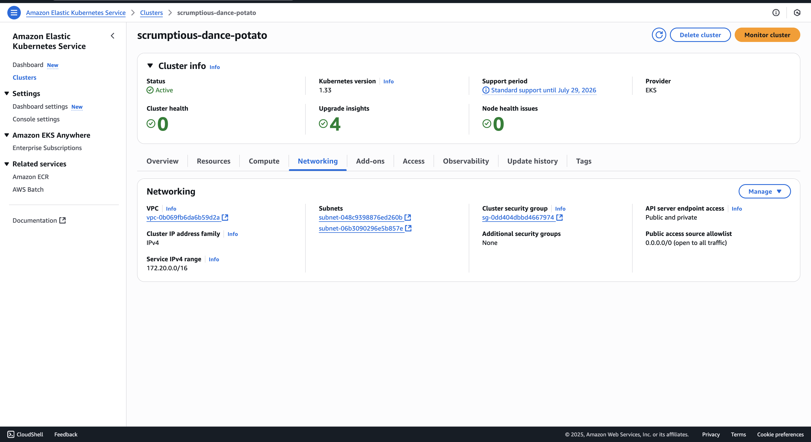
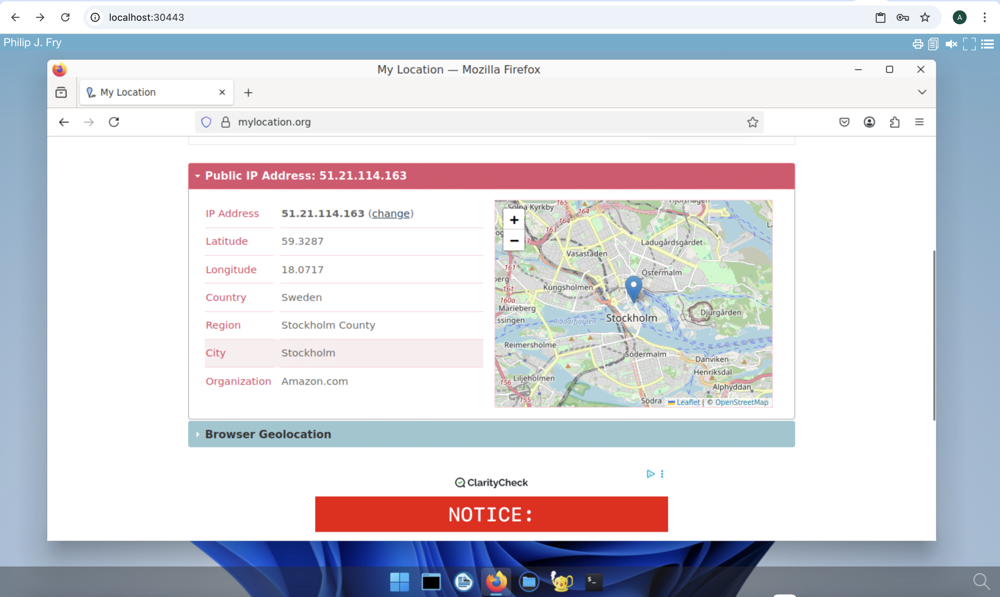

# Deploy abcdesktop on AWS with Amazon Elastic Kubernetes Service

## Requirements

- aws command line interface [aws-cli](https://aws.amazon.com/cli/)
- Create an Amazon Elastic Kubernetes Service (EKS) cluster and a VPC with a NAT gateway
> A **NAT gateway** is required so your nodes can pull images from the `ghcr.io` public registry. If your Kubernetes nodes cannot reach `ghcr.io`, pods will remain in `ImagePullBackOff` state.

- Define the environment variables `AWS_ACCESS_KEY_ID`, `AWS_SECRET_ACCESS_KEY`, and `AWS_SESSION_TOKEN`. You can retrieve credentials as needed from your AWS access portal.


## EKS console overview

This screenshot describes the Amazon Elastic Kubernetes Service console. It shows the `Cluster` and `Networking` information.




## Check your caller-identity

```
aws sts get-caller-identity
```

This example uses `SandboxAdministratorAccess`, but you can use any role with sufficient permissions.

``` bash
$ aws sts get-caller-identity
{
    "UserId": "XXXXXXXXXXXXXXXXXXX:user.namee@domain.org",
    "Account": "YYYYYYYYYYYYYYYY",
    "Arn": "arn:aws:ZZZ::ZZZZZZZZZZZZZ:assumed-role/AWSReservedSSO_SandboxAdministratorAccess_ZZZZZZZZZZZZZZZ/user.namee@domain.org"
}
```

## Find your cluster's name

This example uses `eu-north-1` as the region value.

``` bash
aws eks list-clusters --region eu-north-1
{
    "clusters": [
        "scrumptious-dance-potato"
    ]
}
```

## Create your Kubernetes config file

Create your kubernetes config file using the `aws eks update-kubeconfig` command line

``` bash
aws eks update-kubeconfig --region region-code --name my-cluster
```

In this example 

``` bash
aws eks update-kubeconfig --region eu-north-1 --name scrumptious-dance-potato
```

Run a command such as `kubectl cluster-info` to verify that your kubeconfig is correctly configured.

``` bash
kubectl cluster-info 
```

## Run the abcdesktop install script 


Download and extract the latest release automatically

```
curl -sL https://raw.githubusercontent.com/abcdesktopio/conf/main/kubernetes/install-{{ abcdesktop.latest_release }}.sh | bash
```

To get more details about the install process, please read the [Setup guide](https://www.abcdesktop.io/{{ abcdesktop.latest_release }}/setup/kubernetes_abcdesktop/)


## Connect to your abcdesktop service 

By default, the install script exposes the service on a free TCP port `:30443` using a `kubectl port-forward` command to forward traffic to the HTTP service on port `:80`.

Open your web browser and navigate to `http://localhost:30443`.


 
Log in as user `Philip J. Fry` with the password `fry`


 
After the image-pulling process completes, your first abcdesktop session is ready.


## Add applications to your desktop


Using the same terminal session, run the application install script:

```
curl -sL https://raw.githubusercontent.com/abcdesktopio/conf/main/kubernetes/pullapps-{{ abcdesktop.latest_release }}.sh | bash
```

To get more details about the install applications process, please read the [Setup applications guide](https://www.abcdesktop.io/{{ abcdesktop.latest_release }}/setup/kubernetes_abcdesktop_applications/)

Then reload the web page with the desktop of `Philip J. Fry`.
New applications are now listed in the `plasmashell` dock.


Start Firefox application

> The first run may require waiting for the image-pulling process to complete.

Navigate to `https://mylocation.org` to check where your pod is running.




For the `eu-north-1` region, the desktop is located near Stockholm, Sweden.


