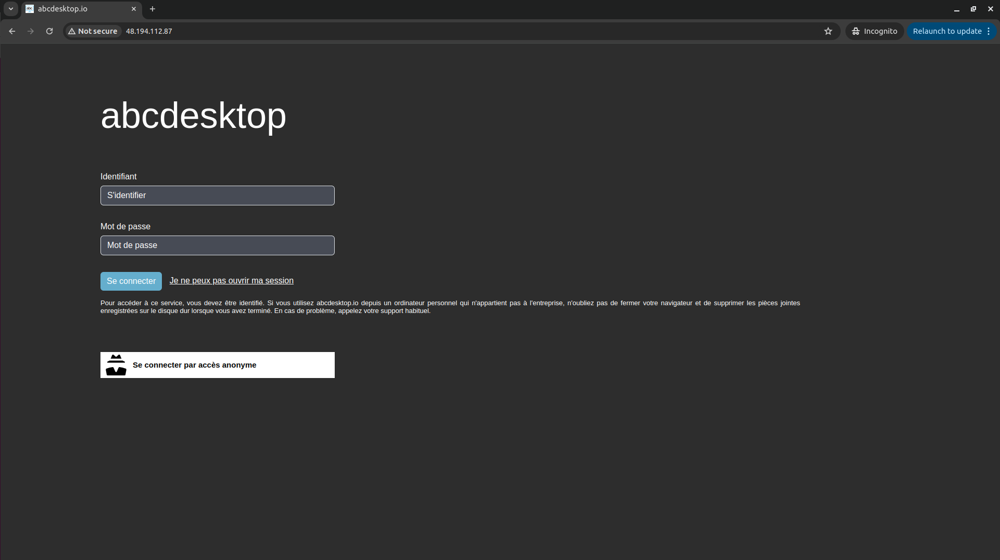
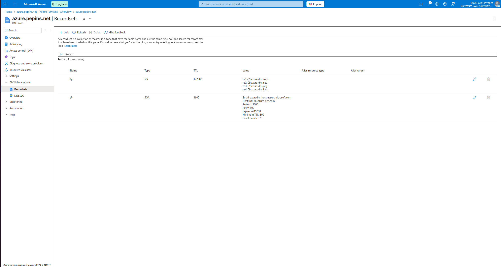
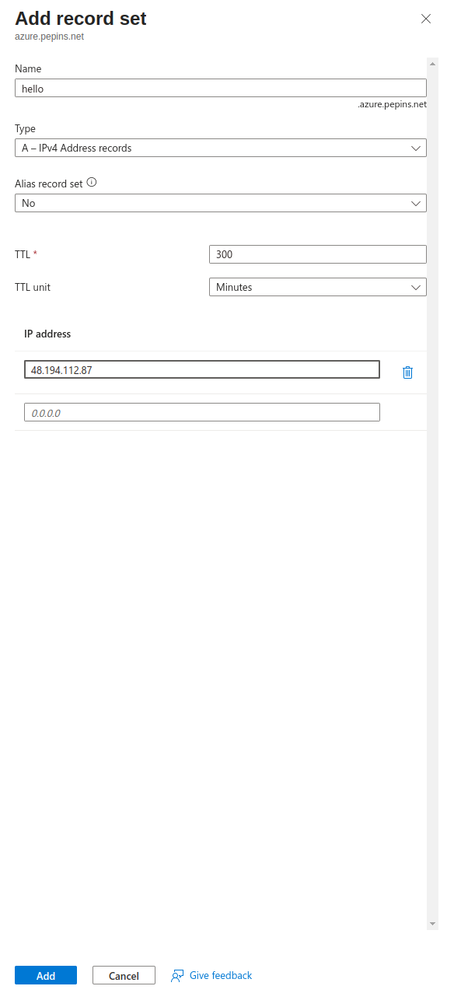
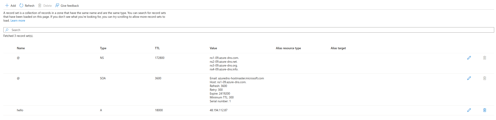
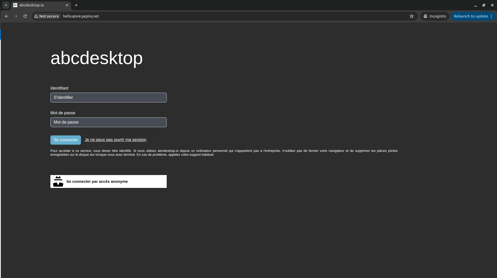
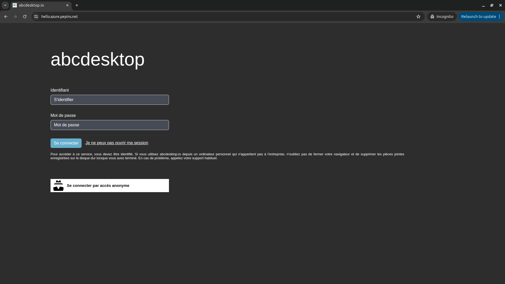
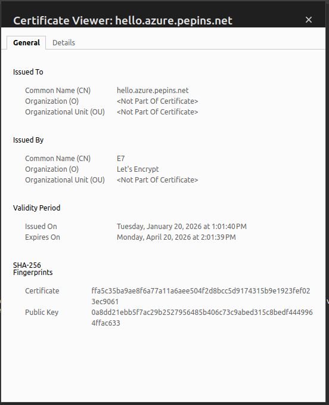

# Publish your website as a public secured service


## Requirements


- read the previous chapter [Deploy abcdesktop on Azure with Kubernetes](azure.md) 
- `az` command line interface [azure-cli](https://learn.microsoft.com/en-us/cli/azure/install-azure-cli?view=azure-cli-latest) installed.
- A running Azure Kubernetes Service cluster that is `ready` and running.
- your own internet domain
- `kubectl` command line
- `wget` command line


## Overview

In this chapter, you will use a `LoadBalancer` service to expose your abcdesktop instance with a public IP address, configure your DNS zone file to use your domain name, and enable TLS to secure the service.
 

## Create a new `http-router` service yaml file


The default installation configures the `http-router` service as type `NodePort`. You will update it to type `LoadBalancer` to expose the service with a public IP address.

Create a file named `http-router.yaml`:

```
kind: Service
apiVersion: v1
metadata:
  name: http-router
  labels:
    abcdesktop/role: router-od
  annotations:
    service.beta.kubernetes.io/azure-load-balancer-health-probe-request-path: "/healthz"
    service.beta.kubernetes.io/port_80_health-probe_port: "80"
    service.beta.kubernetes.io/port_443_health-probe_port: "443"
spec:
  type: LoadBalancer
  selector:
    run: router-od
  ports:
  - protocol: TCP
    port: 443
    targetPort: 443
    name: https
  - protocol: TCP
    port: 80
    targetPort: 80
    name: http
```

Save your `http-router.yaml` file.

Delete the existing `http-router` service:

```
kubectl delete service http-router -n abcdesktop
service "http-router" deleted
```

Apply your new `service/http-router`:

```
kubectl apply -f http-router.yaml -n abcdesktop
service/http-router created
```

Wait a few minutes. The `EXTERNAL-IP` of the `http-router` service will initially remain in a `Pending` state:

```
kubectl get services http-router -n abcdesktop 
```

```
NAME          TYPE           CLUSTER-IP     EXTERNAL-IP   PORT(S)                      AGE
http-router   LoadBalancer   10.0.165.172   <pending>     443:32562/TCP,80:30224/TCP   4s
```

Check the `EXTERNAL-IP` of the `http-router` service again:

```
kubectl get services http-router -n abcdesktop       
```

> The service has been assigned `48.194.112.87` as its `EXTERNAL-IP`.

```      
NAME          TYPE           CLUSTER-IP     EXTERNAL-IP     PORT(S)                      AGE
http-router   LoadBalancer   10.0.165.172   48.194.112.87   443:32562/TCP,80:30224/TCP   22s
```

Open a web browser and navigate to your abcdesktop service using the IP address.





Web browsers do not permit WebSocket connections over an insecure protocol. To log in, you must use the `https` protocol.


## Update your DNS zone file 


You will use an FQDN (Fully Qualified Domain Name) to replace the IP address.




This screenshot shows the Microsoft Azure network console and displays the `Domain` configuration. You can also manage your zone file directly through your own domain registrar.

### Create new record

Create a new `A` record named `hello` (e.g., `hello.azure.pepins.net`) pointing to `48.194.112.87`. Set a low `TTL` value to allow DNS changes to propagate quickly.

The IP address is shown in the Microsoft Azure network console and corresponds to the `EXTERNAL-IP` of your `http-router` service.

```
kubectl get services http-router -n abcdesktop
NAME          TYPE           CLUSTER-IP     EXTERNAL-IP     PORT(S)                      AGE
http-router   LoadBalancer   10.0.165.172   48.194.112.87   443:32562/TCP,80:30224/TCP   22s
```



Press the `Add` button to update your zone file with the new record.



From your local device, open a web browser to confirm DNS resolution:




Web browsers do not permit WebSocket connections over an insecure protocol. To log in, you must use the `https` protocol.

As you can see, the website is marked `Not Secured`. The next step adds an X.509 SSL certificate to secure the service.


## Obtain a Certificate

If you already have an X.509 certificate with private and public key files for your website, you can skip this chapter.

To obtain an SSL certificate, this guide uses the Let's Encrypt service. You will need your public hostname and email address.

Define the environment variables `ABCDESKTOP_PUBLIC_FQDN` and `USER_EMAIL_ADDRESS`:


``` bash
ABCDESKTOP_PUBLIC_FQDN=hello.azure.pepins.net
USER_EMAIL_ADDRESS=thisisyouremail@domain.com
ROUTER_POD_NAME=$(kubectl get pods -l run=router-od -o jsonpath={.items..metadata.name}  -n abcdesktop)
kubectl exec -n abcdesktop -it ${ROUTER_POD_NAME} -- /usr/bin/certbot certonly --webroot -w /var/lib/nginx/html -d ${ABCDESKTOP_PUBLIC_FQDN} -m "${USER_EMAIL_ADDRESS}" --agree-tos -n
```

You should see the following output on stdout:

```
Saving debug log to /var/log/letsencrypt/letsencrypt.log
Account registered.
Requesting a certificate for hello.azure.pepins.net

Successfully received certificate.
Certificate is saved at: /etc/letsencrypt/live/hello.azure.pepins.net/fullchain.pem
Key is saved at:         /etc/letsencrypt/live/hello.azure.pepins.net/privkey.pem
This certificate expires on 2026-04-20.
These files will be updated when the certificate renews.

NEXT STEPS:
- The certificate will need to be renewed before it expires. Certbot can automatically renew the certificate in the background, but you may need to take steps to enable that functionality. See https://certbot.org/renewal-setup for instructions.

- - - - - - - - - - - - - - - - - - - - - - - - - - - - - - - - - - - - - - - -
If you like Certbot, please consider supporting our work by:
 * Donating to ISRG / Let's Encrypt:   https://letsencrypt.org/donate
 * Donating to EFF:                    https://eff.org/donate-le
- - - - - - - - - - - - - - - - - - - - - - - - - - - - - - - - - - - - - - - -
```

The files `fullchain.pem` and `privkey.pem` are located inside the container. 

```
Certificate is saved at: /etc/letsencrypt/live/hello.azure.pepins.net/fullchain.pem
Key is saved at:         /etc/letsencrypt/live/hello.azure.pepins.net/privkey.pem
```

Export the certificate files and create a new Kubernetes secret.


```
kubectl exec -n abcdesktop -it  ${ROUTER_POD_NAME} -- cat /etc/letsencrypt/live/$ABCDESKTOP_PUBLIC_FQDN/fullchain.pem > fullchain.pem
kubectl exec -n abcdesktop -it  ${ROUTER_POD_NAME} -- cat /etc/letsencrypt/live/$ABCDESKTOP_PUBLIC_FQDN/privkey.pem > privkey.pem
```


## Create a Secret for the X.509 Certificate

Create a Kubernetes secret named `http-router-certificat` using the `fullchain.pem` and `privkey.pem` file contents.

```
kubectl create secret tls http-router-certificat --cert=fullchain.pem --key=privkey.pem -n abcdesktop 
```

The secret has been created.

```
secret/http-router-certificat created
```


## Update `http-router` ConfigMap to use the new `http-router-certificat` secret

Download [abcdesktop-routehttp-config.{{ abcdesktop.latest_release }}.yaml](https://raw.githubusercontent.com/abcdesktopio/conf/refs/heads/main/kubernetes/abcdesktop-routehttp-config.{{ abcdesktop.latest_release }}.yaml) file 

```
wget https://raw.githubusercontent.com/abcdesktopio/conf/refs/heads/main/kubernetes/abcdesktop-routehttp-config.{{ abcdesktop.latest_release }}.yaml
```

Open your `abcdesktop-routehttp-config.{{ abcdesktop.latest_release }}.yaml` file and locate the ConfigMap `abcdesktop-routehttp-config`.

Uncomment the HTTPS directives and replace `YOUR_SERVER_NAME_AND_DOMAIN` with your actual domain name. 

```
 # nginx server config
 server {
     ...
     
     ######
     # uncomment this to enable https
     #
     listen 443 ssl http2 default_server;
     listen [::]:443 ssl http2 default_server;
     server_name YOUR_SERVER_NAME_AND_DOMAIN; # change this too
     ssl_certificate     /etc/nginx/ssl/tls.crt;
     ssl_certificate_key /etc/nginx/ssl/tls.key;
     #
     # end of https section
     ######
     
     ...
     index index.html index.htm;
```

For example

```
     listen 443 ssl http2 default_server;
     listen [::]:443 ssl http2 default_server;
     server_name hello.azure.pepins.net;
     ssl_certificate     /etc/nginx/ssl/tls.crt;
     ssl_certificate_key /etc/nginx/ssl/tls.key;
```

Apply your new NGINX configuration file

```
kubectl apply -f abcdesktop-routehttp-config.{{ abcdesktop.latest_release }}.yaml -n abcdesktop
```
 
## Update `deployment` http-router
 
Update the `deployment` route to add the SSL certificate entry.

The `abcdesktop-deployment-routehttps.{{ abcdesktop.latest_release }}.yaml` file adds `mountPath: /etc/nginx/ssl` mapped to `secretName: http-router-certificat`:

```
kubectl apply -f https://raw.githubusercontent.com/abcdesktopio/conf/refs/heads/main/kubernetes/abcdesktop-deployment-routehttps.{{ abcdesktop.latest_release }}.yaml -n abcdesktop
```

## Reach your website using `https` protocol 

You can now connect to your abcdesktop public website using the `https` protocol.




The connection is secured, and the certificate information is visible in the browser.



 
 
