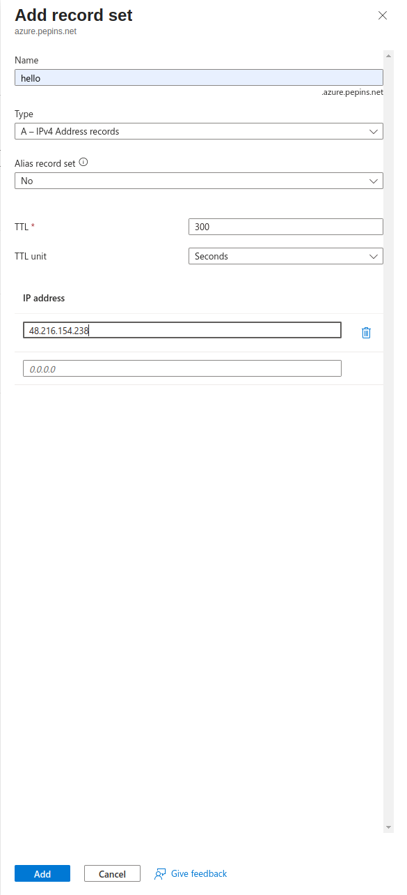
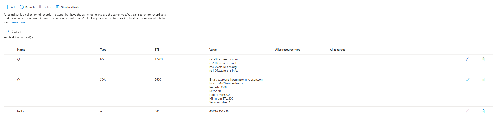
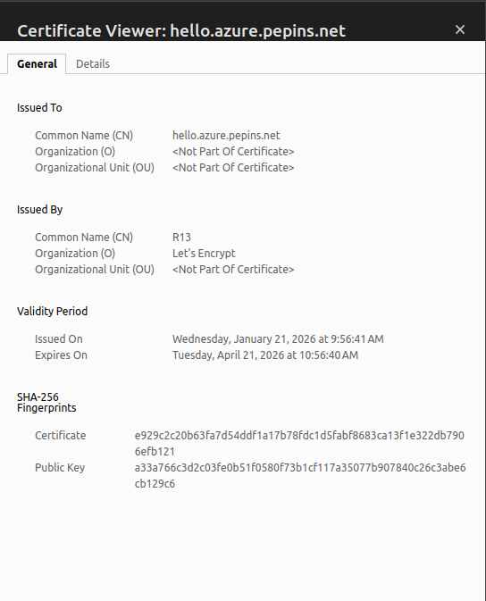
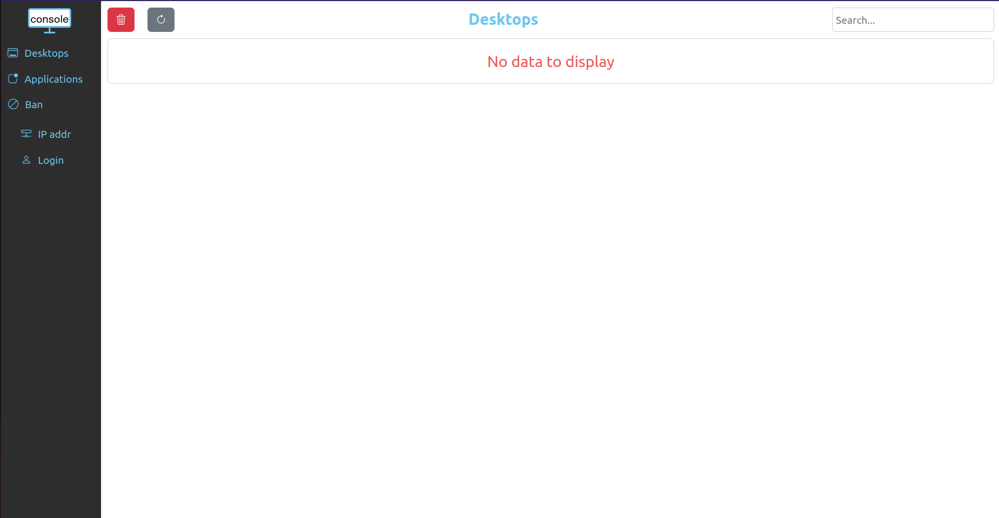
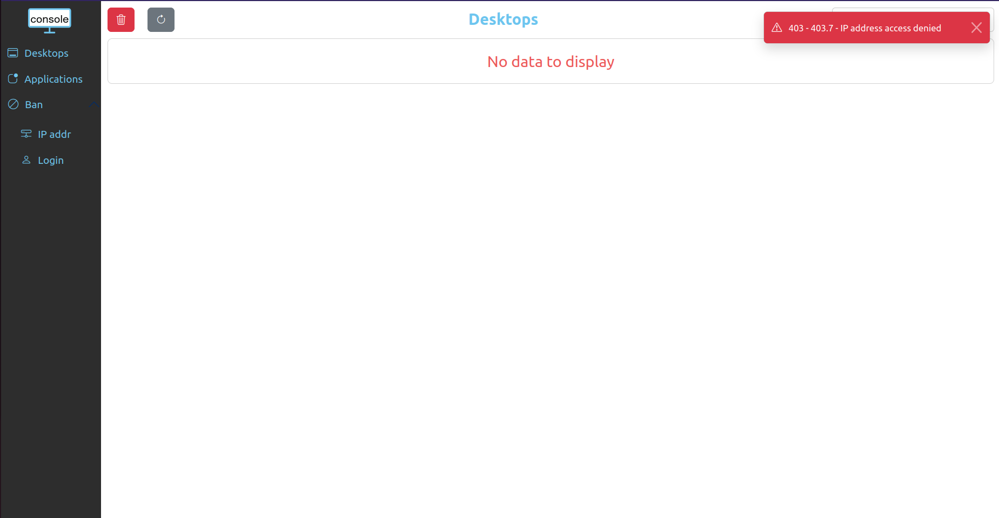

# Publish your website as a public secured service


## Requirements


- read the previous chapter [Deploy abcdesktop on Azure with Kubernetes](azure.md) 
- `az` command line interface [azure-cli](https://learn.microsoft.com/en-us/cli/azure/install-azure-cli?view=azure-cli-latest) installed.
- A running Azure Kubernetes Service cluster that is `ready` and running.
- your own internet domain
- `kubectl` command line
- `helm` command line

## Overview

In this chapter, you will use an NGINX ingress controller to expose your abcdesktop service with a public IP address, configure your DNS zone file to use your own domain name, and enable TLS to secure the service.

## Update http-router service

When installing abcdesktop, the `http-router` service type is `NodePort` by default. To expose the service through an ingress controller, you must change the service type from `NodePort` to `ClusterIP`.

If you perform a get services command you will see the `NodePort` type

``` 
kubectl get svc http-router -n abcdesktop
NAME          TYPE       CLUSTER-IP    EXTERNAL-IP   PORT(S)        AGE
http-router   NodePort   10.0.170.21   <none>        80:30443/TCP   5m31s
```

To change it, you will first need to delete the service

```
kubectl delete service http-router -n abcdesktop
service "http-router" deleted
```

Then paste the following lines in a new `http-router.yaml` file

```
kind: Service
apiVersion: v1
metadata:
  name: http-router
  labels:
    abcdesktop/role: router-od
spec:
  selector:
    run: router-od
  ports:
  - protocol: TCP
    port: 443
    targetPort: 443
    name: https
  - protocol: TCP
    port: 80
    targetPort: 80
    name: http
```

Then, apply your new `service/http-router`:

```
kubectl apply -f http-router.yaml -n abcdesktop
service/http-router created
```

Now check that the service type is `ClusterIP`

```
kubectl get svc http-router -n abcdesktop
NAME          TYPE        CLUSTER-IP     EXTERNAL-IP   PORT(S)          AGE
http-router   ClusterIP   10.0.132.230   <none>        443/TCP,80/TCP   5s
```

## Deploy nginx ingress controller

You will now deploy an NGINX ingress controller on your cluster using `helm`.

First, run the following command to add the NGINX ingress controller repository:

```
helm repo add ingress-nginx https://kubernetes.github.io/ingress-nginx && helm repo update
```

Then install it on your cluster:

```
helm install ingress-nginx ingress-nginx/ingress-nginx --namespace ingress-nginx --create-namespace
```

Once the installation process has completed, you can verify that the service was created by running this command:

```
kubectl get svc ingress-nginx-controller -n ingress-nginx
NAME                       TYPE           CLUSTER-IP    EXTERNAL-IP      PORT(S)                      AGE
ingress-nginx-controller   LoadBalancer   10.0.54.215   <pending>   80:30940/TCP,443:30922/TCP   96s
```

Wait a few minutes until the service is assigned an `EXTERNAL-IP`:

```
NAME                       TYPE           CLUSTER-IP    EXTERNAL-IP      PORT(S)                      AGE
ingress-nginx-controller   LoadBalancer   10.0.54.215   48.216.154.238   80:30940/TCP,443:30922/TCP   96s
```

You must run the following command to add an Azure annotation to your NGINX ingress controller; otherwise, your service will not be reachable from the internet.

```
kubectl annotate svc ingress-nginx-controller -n ingress-nginx \
  service.beta.kubernetes.io/azure-load-balancer-health-probe-request-path=/healthz \
  --overwrite
```

### Create new record

Create a new DNS `A` record named `hello` (e.g., `hello.azure.pepins.net`) pointing to `48.216.154.238`. Set a low TTL value to allow DNS changes to propagate quickly.



Press the `Add` button to update your zone file with the new record.



## Configure NGINX Ingress Rules for Backend Services 

In this step, you expose the backend services to the outside world by telling NGINX what host each service maps to. You define a rule in NGINX that associates a hostname with the abcdesktop route backend service.

Create an ingress resource for NGINX using the abcdesktop service and save it as `abcdesktop_host.yaml`. Update this manifest with your own FQDN by replacing `hello.azure.pepins.net` with your own values.

```
apiVersion: networking.k8s.io/v1
kind: Ingress
metadata:
  name: ingress-abcdesktop
  namespace: abcdesktop
spec:
  rules:
    - host: hello.azure.pepins.net
      http:
        paths:
          - path: /
            pathType: Prefix
            backend:
              service:
                name: http-router
                port:
                  number: 80
  ingressClassName: nginx
```

Apply the Ingress yaml file

```
kubectl apply -f abcdesktop_host.yaml -n abcdesktop
```

You should read

```
ingress.networking.k8s.io/ingress-abcdesktop created
```


Verify the ingress resources:

```
kubectl get ingress -n abcdesktop
```

The output looks similar to the following:

Wait a few seconds while the `ADDRESS` field is being populated
```
NAME                 CLASS   HOSTS                    ADDRESS   PORTS   AGE
ingress-abcdesktop   nginx   hello.azure.pepins.net             80      5s
```

When you obtain an `IP ADDRESS`

```
NAME                 CLASS   HOSTS                    ADDRESS          PORTS   AGE
ingress-abcdesktop   nginx   hello.azure.pepins.net   48.216.154.238   80      55s
```


The spec section of the manifest contains a list of host rules used to configure the Ingress. If unspecified, or no rule matches, all traffic is sent to the default backend service. The manifest has the following fields:

- host specifies the fully qualified domain name of a network host, for example echo.`<your-domain-name>`.

- http contains the list of HTTP selectors pointing to backends.

- paths provides a collection of paths that map requests to backends.

In the example above, the ingress resource instructs NGINX to route each HTTP request using the `/` prefix for the `hello.azure.pepins.net` host to the `http-router` backend service on port 80. Every request to `http://hello.azure.pepins.net/` is served by the `http-router` backend service.

You can have multiple ingress controllers per cluster. The `ingressClassName` field in the manifest differentiates between them. You can also define multiple rules for different hosts and paths within a single ingress resource.


> Web browsers do not permit WebSocket connections over an insecure protocol. To log in, you must use the `https` protocol.

As you can see, the website is marked `Not Secured`. The next step adds an X.509 SSL certificate to secure the service.

## Enable HTTPS

### Deploy Cert Manager on our AKS cluster

Use `helm` to install cert-manager on your cluster, following the same approach used for the NGINX ingress controller.

First add the cert-manager helm repository:

```
helm repo add jetstack https://charts.jetstack.io && helm repo update  
```

Then install it on your cluster:

```
helm install \
  cert-manager oci://quay.io/jetstack/charts/cert-manager \
  --namespace cert-manager \
  --create-namespace \
  --set crds.enabled=true
```

Once installed, you can inspect the Kubernetes resources created by Cert Manager:

```
kubectl get all -n cert-manager
```

The output looks similar to the following

```
NAME                                           READY   STATUS    RESTARTS   AGE
pod/cert-manager-7ff7f97d55-l6ws6              1/1     Running   0          7m31s
pod/cert-manager-cainjector-59bb669f8d-lj927   1/1     Running   0          7m31s
pod/cert-manager-webhook-59bbd786df-jlmzb      1/1     Running   0          7m31s

NAME                              TYPE        CLUSTER-IP     EXTERNAL-IP   PORT(S)            AGE
service/cert-manager              ClusterIP   10.0.193.131   <none>        9402/TCP           7m32s
service/cert-manager-cainjector   ClusterIP   10.0.185.217   <none>        9402/TCP           7m32s
service/cert-manager-webhook      ClusterIP   10.0.78.107    <none>        443/TCP,9402/TCP   7m32s

NAME                                      READY   UP-TO-DATE   AVAILABLE   AGE
deployment.apps/cert-manager              1/1     1            1           7m32s
deployment.apps/cert-manager-cainjector   1/1     1            1           7m32s
deployment.apps/cert-manager-webhook      1/1     1            1           7m32s

NAME                                                 DESIRED   CURRENT   READY   AGE
replicaset.apps/cert-manager-7ff7f97d55              1         1         1       7m32s
replicaset.apps/cert-manager-cainjector-59bb669f8d   1         1         1       7m32s
replicaset.apps/cert-manager-webhook-59bbd786df      1         1         1       7m32s
```

The cert-manager pods and webhook service are running.

Cert-Manager creates custom resource definitions (CRDs). Cert-Manager relies on three important CRDs to issue certificates from a Certificate Authority (such as Let’s Encrypt):

Issuer: Defines a namespaced certificate issuer, which allows you to use different CAs in each namespace.

ClusterIssuer: Similar to Issuer, but it does not belong to a namespace and can be used to issue certificates in any namespace.

Certificate: Defines a namespaced resource that references an Issuer or ClusterIssuer for issuing certificates.

Inspect the CRDs by running the following command:

```
kubectl get crd -l app.kubernetes.io/name=cert-manager
```

The output looks similar to the following:

```
NAME                                  CREATED AT
certificaterequests.cert-manager.io   2026-01-21T08:12:10Z
certificates.cert-manager.io          2026-01-21T08:12:10Z
challenges.acme.cert-manager.io       2026-01-21T08:12:11Z
clusterissuers.cert-manager.io        2026-01-21T08:12:11Z
issuers.cert-manager.io               2026-01-21T08:12:11Z
orders.acme.cert-manager.io           2026-01-21T08:12:10Z
```

### Configure Production-Ready TLS Certificates for nginx

Configure a Cert-Manager `Issuer` resource that fetches TLS certificates for NGINX using the HTTP-01 challenge provider.

Create the following manifest, replace `<your-valid-email-address>` with your own email address, and save it as `cert-manager-issuer.yaml`:

```
apiVersion: cert-manager.io/v1
kind: Issuer
metadata:
  name: letsencrypt-nginx
spec:
  acme:
    email: <your-valid-email-address>
    server: https://acme-v02.api.letsencrypt.org/directory
    privateKeySecretRef:
      name: letsencrypt-nginx-private-key
    solvers:
      # Use the HTTP-01 challenge provider
      - http01:
          ingress:
            class: nginx
```

The ACME issuer configuration has the following fields:

email: Email address to be associated with the ACME account.
server: URL used to access the ACME server’s directory endpoint.
privateKeySecretRef: Kubernetes secret to store the automatically generated ACME account private key.

The ingress resources use the HTTP-01 challenge.

```
kubectl apply -f cert-manager-issuer.yaml -n abcdesktop
```

The output looks similar to the following:

```
issuer.cert-manager.io/letsencrypt-nginx created
```

Verify that the Issuer resource is created:

```
kubectl get issuer -n abcdesktop
```

The output looks similar to the following:

```
NAME                READY   AGE
letsencrypt-nginx   True    7s
```

Next, configure the NGINX ingress resource to use TLS. Open the `abcdesktop_host.yaml` manifest, add the `annotations` and `tls` sections shown below, and save the file. You can also add `nginx.ingress.kubernetes.io` annotations to increase default timeout values. Replace `hello.azure.pepins.net` with your own FQDN:

```
apiVersion: networking.k8s.io/v1
kind: Ingress
metadata:
  name: ingress-abcdesktop
  namespace: abcdesktop
  annotations:
   cert-manager.io/issuer: letsencrypt-nginx
   nginx.org/client-max-body-size: "256M"
   nginx.ingress.kubernetes.io/proxy-connect-timeout: "30"
   nginx.ingress.kubernetes.io/proxy-read-timeout: "1800"
   nginx.ingress.kubernetes.io/proxy-send-timeout: "1800"
   nginx.ingress.kubernetes.io/proxy-body-size: "256M"
spec:
  tls:
   - hosts:
     - hello.azure.pepins.net
     secretName: letsencrypt-nginx-echo
  rules:
    - host: hello.azure.pepins.net
      http:
        paths:
          - path: /
            pathType: Prefix
            backend:
              service:
                name: http-router
                port:
                  number: 80
  ingressClassName: nginx
```

Run the following command to configure the hosts to use TLS:

```
kubectl apply -f abcdesktop_host.yaml -n abcdesktop
```

After a few minutes, check the state of the ingress object:

```
kubectl get ingress -n  abcdesktop
NAME                 CLASS   HOSTS                    ADDRESS         PORTS     AGE
ingress-abcdesktop   nginx   hello.azure.pepins.net   52.184.250.38   80, 443   9m18s
```

You see that `443` has appeared in the `PORTS` section.

Verify that the certificate resource has been created:

```
kubectl get certificates -n abcdesktop
```

The output looks similar to the following:

```
NAME                     READY   SECRET                   AGE
letsencrypt-nginx-echo   True    letsencrypt-nginx-echo   3m27s
```

Run the following `curl` command to confirm that your secured abcdesktop service is running:

```
curl -Li https://hello.azure.pepins.net/
HTTP/2 200 
date: Wed, 21 Jan 2026 09:56:41 GMT
content-type: text/html
content-length: 56291
vary: Accept-Encoding
last-modified: Tue, 20 Jan 2026 12:19:32 GMT
etag: "696f72d4-dbe3"
accept-ranges: bytes
x-frame-options: SAMEORIGIN
x-xss-protection: 1; mode=block
strict-transport-security: max-age=31536000; includeSubDomains

<!doctype html>
...
```

## Reach your website using `https` protocol 

You can now connect to your abcdesktop public website using the `https` protocol.


The connection is secured and you can inspect the certificate details.



## See real client IP address behind ingress controller 

Now that your application is publicly exposed, you may want to consider the security implications of traffic flowing through your cluster.  
For example, the console module of abcdesktop should not be accessible to everyone, as it is designed to be an administrator console. That is why, when you install abcdesktop, there is a pool of permitted IP addresses specified in the `od.config` file.

```
ManagerController': { 'permitip': [ '10.0.0.0/8', '172.16.0.0/12', '192.168.0.0/16', 'fd00::/8', '169.254.0.0/16', '127.0.0.0/8' ] }
```

By default, the configuration only permits private networks defined in [RFC 1918](https://datatracker.ietf.org/doc/html/rfc1918) and [RFC 4193](https://datatracker.ietf.org/doc/html/rfc4193). Because your service is publicly exposed, none of your visitors should be able to access the console. However, you may find that the console is actually accessible, which is not the expected behavior.



And when you check Pyos logs you will see why console behaves like that.

```
kubectl get pods -n abcdesktop
NAME                            READY   STATUS    RESTARTS   AGE
console-od-5cd84fdd69-zbjxf     1/1     Running   0          11m
memcached-od-6ccd5b5f67-wwnw8   1/1     Running   0          11m
mongodb-od-0                    2/2     Running   0          11m
nginx-od-784885cbd5-b7dqx       1/1     Running   0          11m
openldap-od-bb485cb4b-2ltm8     1/1     Running   0          11m
pyos-od-5c5cfdbfc8-t9r9m        1/1     Running   0          11m
router-od-6b7456b789-dsqdh      1/1     Running   0          11m
speedtest-od-8686c67749-hncft   1/1     Running   0          11m
```

```
kubectl exec -it pyos-od-5c5cfdbfc8-t9r9m -n abcdesktop -- bash
Defaulted container "pyos" out of: pyos, wait-for-mongo (init)
pyos-od-5c5cfdbfc8-t9r9m:/var/pyos# tail logs/trace.log 
2026-02-06 16:03:51 abcpool1-node-fa2594 139923622185784 base_controller [DEBUG  ] controllers.manager_controller.ManagerController.apifilter:anonymous 
2026-02-06 16:03:51 abcpool1-node-fa2594 139923622185784 base_controller [DEBUG  ] controllers.manager_controller.ManagerController.ipfilter:anonymous 
2026-02-06 16:03:51 abcpool1-node-fa2594 139923622185784 base_controller [DEBUG  ] controllers.manager_controller.ManagerController.ipfilter:anonymous ipsource 10.2.1.0 is permited in network 10.0.0.0/8
2026-02-06 16:03:51 abcpool1-node-fa2594 139923622185784 manager_controller [DEBUG  ] controllers.manager_controller.ManagerController.handle_desktop_GET:anonymous 
2026-02-06 16:03:51 abcpool1-node-fa2594 139923622185784 orchestrator [DEBUG  ] oc.od.orchestrator.ODOrchestratorKubernetes.__init__:anonymous load_incluster_config done
2026-02-06 16:03:51 abcpool1-node-fa2594 139923622185784 od [INFO   ] __main__.trace_response:anonymous /manager/desktop b'[]'
2026-02-06 16:03:55 abcpool1-node-fa2594 139923627645752 od [INFO   ] __main__.trace_request:anonymous /healthz
2026-02-06 16:04:05 abcpool1-node-fa2594 139923618954040 od [INFO   ] __main__.trace_request:anonymous /healthz
2026-02-06 16:04:15 abcpool1-node-fa2594 139923617876792 od [INFO   ] __main__.trace_request:anonymous /healthz
2026-02-06 16:04:25 abcpool1-node-fa2594 139923621108536 od [INFO   ] __main__.trace_request:anonymous /healthz
```

As you can see in the logs, the source IP address seen by Pyos is a private IP address such as `10.X.X.X` (within the subnet defined as internal to your cluster), which falls within the pool of permitted IP addresses.  

This occurs because the NGINX Ingress Controller forwards requests using its own cluster IP address rather than preserving the client's original IP. As a result, both Router and Pyos see the IP address of the ingress controller load balancer.

To fix this, update the configuration of your NGINX ingress controller by pasting the following lines into a `patch-ingress.yaml` file:

```
controller:
  service:
    externalTrafficPolicy: "Local"
    annotations:
      service.beta.kubernetes.io/azure-load-balancer-health-probe-request-path: "/healtz"
  config:
    use-proxy-protocol: "false"
    real-ip-header: X-Real-IP
    proxy-real-ip-cidr: "10.0.0.0/8"
    compute-full-forwarded-for: "true"
    use-forwarded-headers: "true"
    log-format-upstream: '{"time": "$time_iso8601", "remote_addr": "$proxy_protocol_addr", "x_forwarded_for": "$proxy_add_x_forwarded_for", "http_x_forwarded-for": "$http_x_forwarded_for", "request_id": "$req_id", "remote_user": "$remote_user", "bytes_sent": $bytes_sent, "request_time": $request_time, "status": $status, "vhost": "$host", "request_proto": "$server_protocol", "path": "$uri", "request_query": "$args", "request_length": $request_length, "method": "$request_method", "http_referrer": "$http_referer",  "http_user_agent": "$http_user_agent" }'
```

Run the following command to apply it:

```
helm upgrade ingress-nginx ingress-nginx/ingress-nginx -n ingress-nginx -f patch-loadbalancer.yaml
```

Retry connecting to the console. You should now see an error message in the top-right corner.



You can also inspect the Pyos logs to verify that your public IP address is now visible as the source IP:

```
kubectl exec -it pyos-od-5c5cfdbfc8-t9r9m -n abcdesktop -- bash
Defaulted container "pyos" out of: pyos, wait-for-mongo (init)
pyos-od-5c5cfdbfc8-t9r9m:/var/pyos# tail logs/trace.log 
2026-02-06 16:25:25 abcpool1-node-fa2594 139923622185784 od [INFO   ] __main__.trace_request:anonymous /healthz
2026-02-06 16:25:35 abcpool1-node-fa2594 139923627645752 od [INFO   ] __main__.trace_request:anonymous /healthz
2026-02-06 16:25:37 abcpool1-node-fa2594 139923618954040 od [INFO   ] __main__.trace_request:anonymous /manager/healtz
2026-02-06 16:25:37 abcpool1-node-fa2594 139923618954040 base_controller [DEBUG  ] controllers.manager_controller.ManagerController.apifilter:anonymous 
2026-02-06 16:25:37 abcpool1-node-fa2594 139923618954040 base_controller [DEBUG  ] controllers.manager_controller.ManagerController.ipfilter:anonymous 
2026-02-06 16:25:37 abcpool1-node-fa2594 139923618954040 base_controller [INFO   ] controllers.manager_controller.ManagerController.ipfilter:anonymous ipsource <your_public_ip> access is denied, not in network list [IPNetwork('10.0.0.0/8'), IPNetwork('172.16.0.0/12'), IPNetwork('192.168.0.0/16'), IPNetwork('fd00::/8'), IPNetwork('169.254.0.0/16'), IPNetwork('127.0.0.0/8')]
2026-02-06 16:25:37 abcpool1-node-fa2594 139923618954040 base_controller [ERROR  ] controllers.manager_controller.ManagerController.raise_http_error_message:anonymous 403.7 - IP address access denied
2026-02-06 16:25:37 abcpool1-node-fa2594 139923618954040 od [INFO   ] __main__.trace_response:anonymous /manager/healtz b'{"status": 403, "message": "403.7 - IP address access denied"}'
2026-02-06 16:25:45 abcpool1-node-fa2594 139923617876792 od [INFO   ] __main__.trace_request:anonymous /healthz
2026-02-06 16:25:55 abcpool1-node-fa2594 139923621108536 od [INFO   ] __main__.trace_request:anonymous /healthz
```
