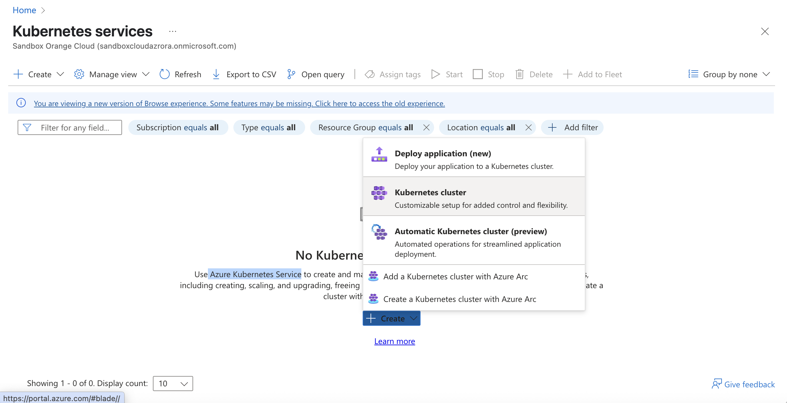
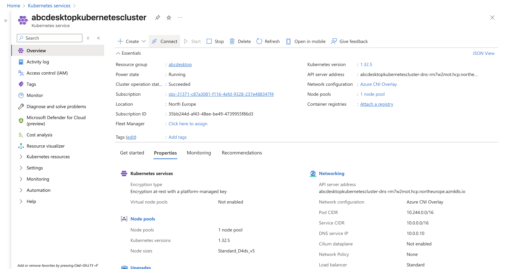
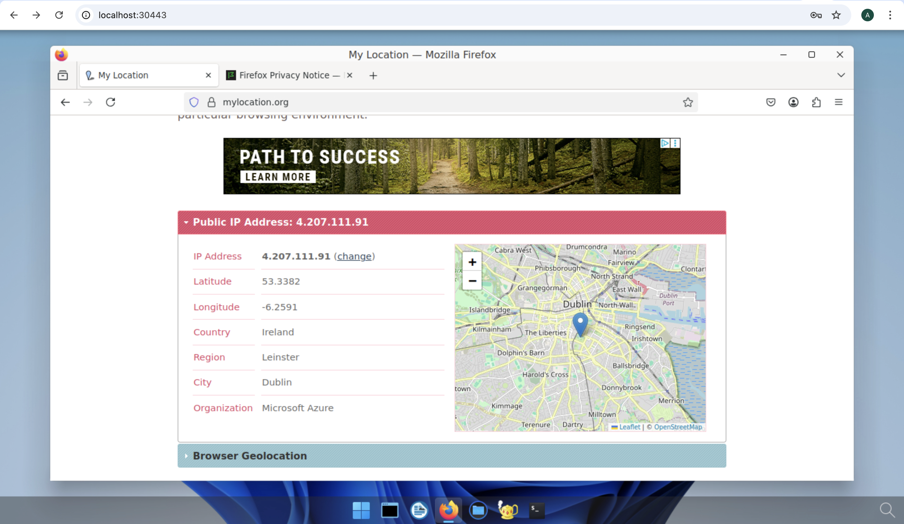

# Deploy abcdesktop on Azure with Microsoft Azure Kubernetes Service


## Requirements

- `az` command line interface [azure-cli](https://learn.microsoft.com/en-us/cli/azure/install-azure-cli?view=azure-cli-latest) installed.
- you need your `Azure Subscription Name`, your `Username` and `Password`
- A running Azure Kubernetes Service cluster that is `ready` and running.

## Azure console overview

Create a new Azure Kubernetes Service cluster.



> Options and features are set by default.

In this example, the Kubernetes cluster is named `abcdesktopkubernetescluster`.
This screenshot shows the Azure Kubernetes Service console, displaying the **Node pools** and **Networking** configuration.




## Check your caller-identity

If you don't have already done it, use the `az login` command line

```
az login
```

The remaining steps complete in your web browser using your own credentials.


## Set your subscription for your Azure account


``` bash
az account set --subscription XXXXXX-YYYYY-ZZZZZ-AAAA-BBBBBBBBBB
```

## Create your kubernetes config 

``` bash
az aks get-credentials --name MyManagedCluster --overwrite-existing --resource-group MyResourceGroup
``` 

For example 

- `resource-group`: abcdesktop
- `name`: abcdesktopkubernetescluster

``` bash
az aks get-credentials --resource-group abcdesktop --name abcdesktopkubernetescluster --overwrite-existing
```

## Get your kubernetes cluster informations

Run the `kubectl cluster-info` command line to confirm that the `kubectl` command can communicate with your Azure cluster.

``` bash
kubectl cluster-info
```

``` bash
Kubernetes control plane is running at https://abcdesktopkubernetescluster-dns-rm7w2mot.hcp.northeurope.azmk8s.io:443
CoreDNS is running at https://abcdesktopkubernetescluster-dns-rm7w2mot.hcp.northeurope.azmk8s.io:443/api/v1/namespaces/kube-system/services/kube-dns:dns/proxy
Metrics-server is running at https://abcdesktopkubernetescluster-dns-rm7w2mot.hcp.northeurope.azmk8s.io:443/api/v1/namespaces/kube-system/services/https:metrics-server:/proxy

To further debug and diagnose cluster problems, use 'kubectl cluster-info dump'.
```

## Run the abcdesktop install script 


Download and extract the latest release automatically

```
curl -sL https://raw.githubusercontent.com/abcdesktopio/conf/main/kubernetes/install-{{ abcdesktop.latest_release }}.sh | bash
```

To get more details about the install process, please read the [Setup guide](https://www.abcdesktop.io/{{ abcdesktop.latest_release }}/setup/kubernetes_abcdesktop/)


## Connect to your abcdesktop service 

By default install script is listening on a free tcp port `:30443` and is using a `kubectl port-forward` command line to reach http web service `:80`

Open your web browser to `http://localhost:30443`


 
Login as user `Philip J. Fry` with the password `fry`


 
After the image-pulling process completes, you get your first abcdesktop session


## Add applications to your desktop


Using the previous terminal shell, run the application install script 

```
curl -sL https://raw.githubusercontent.com/abcdesktopio/conf/main/kubernetes/pullapps-{{ abcdesktop.latest_release }}.sh | bash
```

To get more details about the install applications process, please read the [Setup applications guide](https://www.abcdesktop.io/{{ abcdesktop.latest_release }}/setup/kubernetes_abcdesktop_applications/)

Then reload the web page with the desktop of `Philip J. Fry`
New applications are now listed in the dock of `plasmashell`


Start Firefox application

> The first run may involve waiting for the image pulling process to finish

Go to `https://mylocation.org` website to check where your pod is running.  In my case for the region `North Europe`, the desktop is located near `Dublin` city in `Ireland`. 





