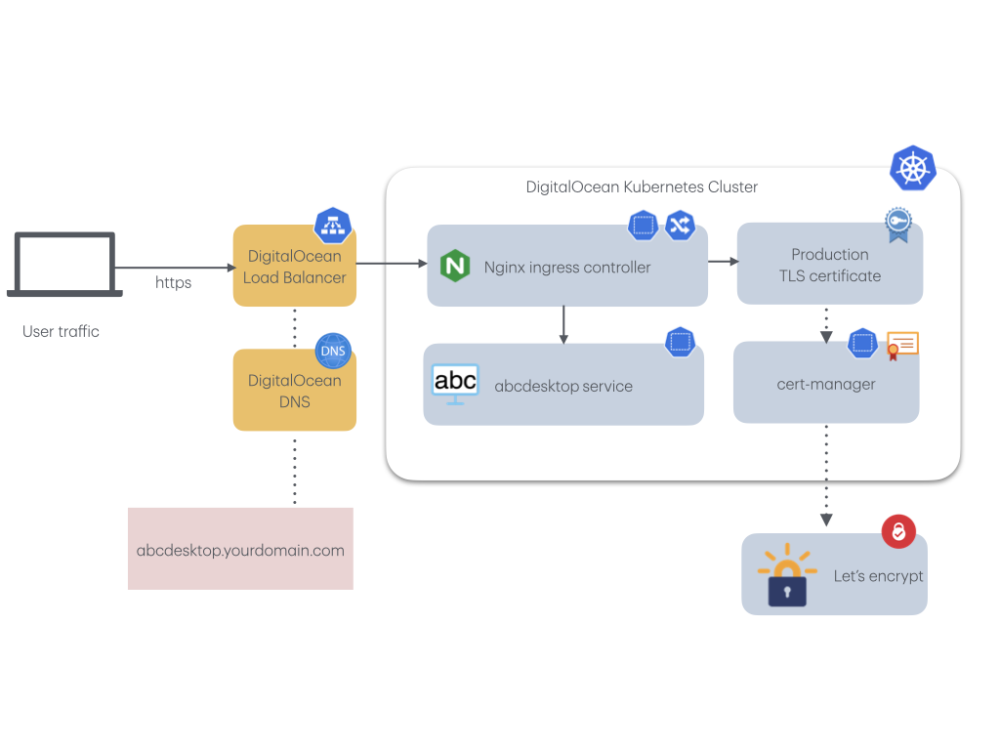
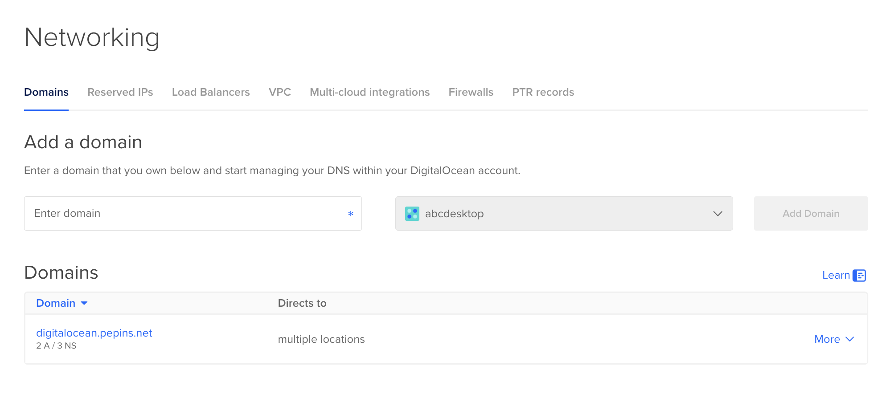
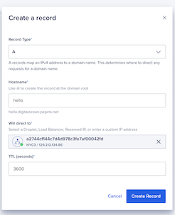
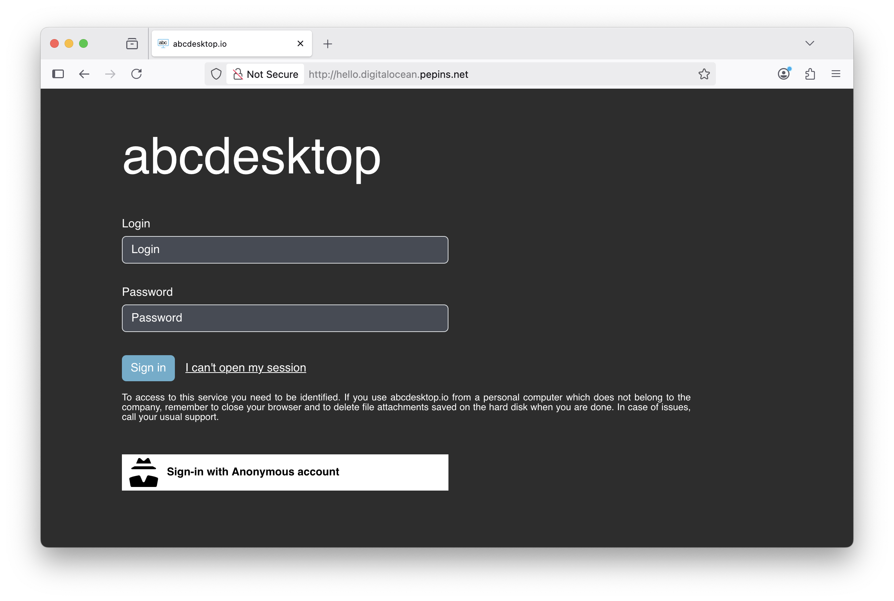
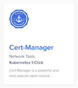
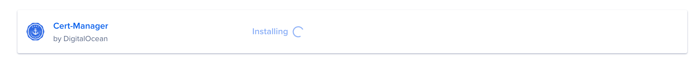
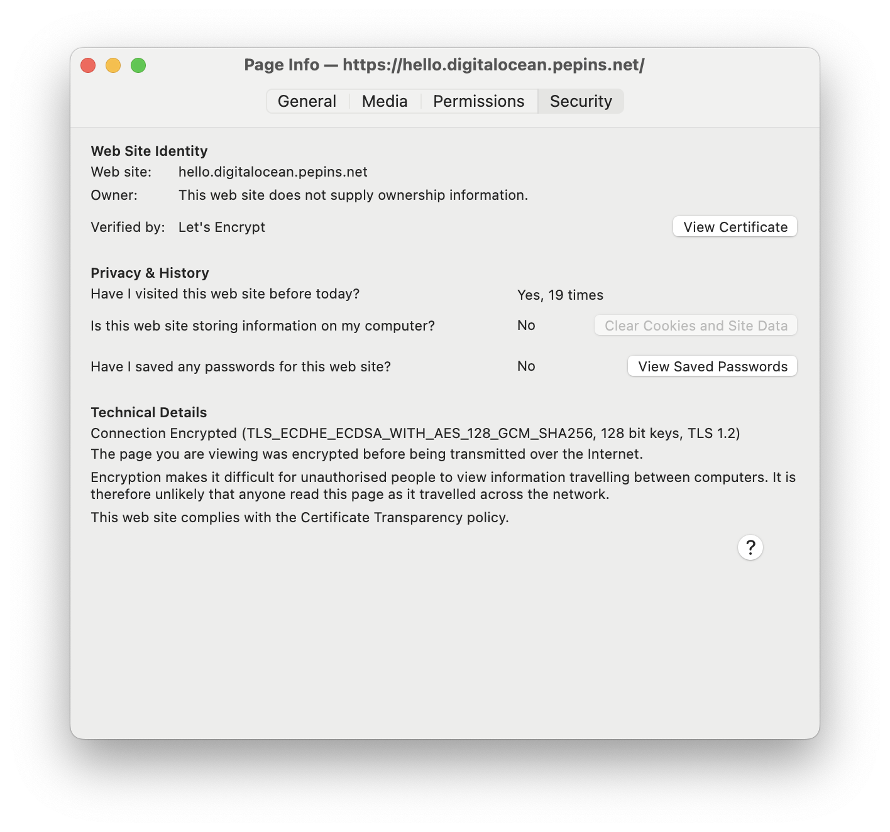

---
tags:
  - install
  - digitalocean
  - cloud
  - nginx
  - ingress
  - controller
---

# Publish your website as a public secured service


## Requirements


- Read the previous chapter [Deploy abcdesktop on DigitalOcean with Kubernetes](digitalocean.md) 
- a DigitalOcean account
- a domain you own hosted on DigitalOcean
- `doctl` command line interface [doctl cli](https://docs.digitalocean.com/reference/doctl/how-to/install/)
- `kubectl` command line
- `wget` command line
- `helm` command line

### For more information

- Read the DigitalOcean chapter [install-nginx-ingress-controller](https://docs.digitalocean.com/products/kubernetes/getting-started/operational-readiness/install-nginx-ingress-controller/)

## Overview

In this chapter, you will use an NGINX ingress controller to expose your abcdesktop service with a public IP address, configure your DNS zone file to use your own domain name, and enable TLS to secure the service.
 
 

## Update http-router service

By default, the `http-router` service type is `NodePort`. To expose the service through an ingress controller, you must change the service type from `NodePort` to `ClusterIP`.

Run the following command to confirm the current service type is `NodePort`:

``` 
kubectl get svc http-router -n abcdesktop
```

You should see the following output:

```
NAME          TYPE       CLUSTER-IP    EXTERNAL-IP   PORT(S)        AGE
http-router   NodePort   10.0.170.21   <none>        80:30443/TCP   5m31s
```

To change the service type, first delete the existing service:

```
kubectl delete service http-router -n abcdesktop
```

You should see the following output:

```
service "http-router" deleted
```

Create a new `http-router.yaml` file with the following content:

```
kind: Service
apiVersion: v1
metadata:
  name: http-router
  labels:
    abcdesktop/role: router-od
spec:
  selector:
    run: router-od
  ports:
  - protocol: TCP
    port: 443
    targetPort: 443
    name: https
  - protocol: TCP
    port: 80
    targetPort: 80
    name: http
```

Create the new `service/http-router`:

```
kubectl apply -f http-router.yaml -n abcdesktop
```

You should see the following output:

```
service/http-router created
```

Verify that the service type has changed to `ClusterIP`:

```
kubectl get svc http-router -n abcdesktop
```

You should see the following output:

```
NAME          TYPE        CLUSTER-IP     EXTERNAL-IP   PORT(S)          AGE
http-router   ClusterIP   10.0.132.230   <none>        443/TCP,80/TCP   5s
```

## Deploy nginx ingress controller

Deploy an NGINX ingress controller to your cluster using `helm`.

First, add the NGINX ingress controller Helm repository:

```
helm repo add ingress-nginx https://kubernetes.github.io/ingress-nginx && helm repo update
```

Then install it on your cluster:

```
helm install ingress-nginx ingress-nginx/ingress-nginx --namespace ingress-nginx --create-namespace
```

After installation completes, verify that the service was created:

```
kubectl get svc ingress-nginx-controller -n ingress-nginx
NAME                       TYPE           CLUSTER-IP    EXTERNAL-IP   PORT(S)                      AGE
ingress-nginx-controller   LoadBalancer   10.3.74.197   <pending>     80:32649/TCP,443:32195/TCP   12s
```

Wait a few minutes until the `EXTERNAL-IP` field is populated:

```
NAME                       TYPE           CLUSTER-IP    EXTERNAL-IP      PORT(S)                      AGE
ingress-nginx-controller   LoadBalancer   10.3.74.197   129.212.134.86   80:32649/TCP,443:32195/TCP   4m34s
```


## Update your DNS zone file 


We will associate your `FQDN` (Fully Qualified Domain Name) with the load balancer's IP address.



This screenshot shows the DigitalOcean network console, displaying the **Domain** configuration. You can also manage your zone file directly through your domain registrar.

### Create new record

In this example, create a new `A` record named `hello` (`hello.digitalocean.pepins.net`) pointing to `129.212.134.86`. This IP address is the load balancer IP address.

> Replace the hostname, domain name, and IP address with your own values.

Open the DigitalOcean console and navigate to `networking/domains`.

Create a record in the [networking domains console](https://cloud.digitalocean.com/networking/domains).

Map your hostname (e.g., `hello.digitalocean.pepins.net`) to the IP address `129.212.134.86`.
Replace the hostname, domain name, and IP address with your own values.



Click `Create Record` to update your zone file with the new record.


## Configure NGINX Ingress Rules for Backend Services 

In this step, you expose the backend applications to the outside world by defining a rule in NGINX that maps each host to an abcdesktop route backend service.

Create an ingress resource for NGINX using the abcdesktop service and save it as `abcdesktop_host.yaml`. Update this manifest with your own FQDN by replacing `hello.digitalocean.pepins.net` with your own values.

```
apiVersion: networking.k8s.io/v1
kind: Ingress
metadata:
  name: ingress-abcdesktop
  namespace: abcdesktop
spec:
  rules:
    - host: hello.digitalocean.pepins.net
      http:
        paths:
          - path: /
            pathType: Prefix
            backend:
              service:
                name: http-router
                port:
                  number: 80
  ingressClassName: nginx
```

Apply the Ingress YAML file:

```
NAMESPACE=abcdesktop
kubectl apply -f abcdesktop_host.yaml -n $NAMESPACE
```

You should see the following output:

```
ingress.networking.k8s.io/ingress-abcdesktop created
```


Verify the ingress resources:

```
NAMESPACE=abcdesktop
kubectl get ingress -n $NAMESPACE
```

The output looks similar to the following.

Wait a few seconds while the `ADDRESS` field is being populated:

```
NAME                 CLASS   HOSTS                           ADDRESS   PORTS   AGE
ingress-abcdesktop   nginx   hello.digitalocean.pepins.net             80      24s
```

When the `ADDRESS` field is populated:

```
NAME                 CLASS   HOSTS                           ADDRESS          PORTS   AGE
ingress-abcdesktop   nginx   hello.digitalocean.pepins.net   129.212.134.86   80      3m13s
```


The `spec` section of the manifest contains a list of host rules used to configure the Ingress. If no rule matches, all traffic is sent to the default backend service. The manifest has the following fields:

- `host` specifies the fully qualified domain name of a network host, for example `echo.<your-domain-name>`.

- `http` contains the list of HTTP selectors pointing to backends.

- `paths` provides a collection of paths that map requests to backends.

In the example above, the ingress resource instructs NGINX to route each HTTP request using the `/` prefix for the `hello.digitalocean.pepins.net` host to the `http-router` backend service running on port 80. In other words, every request to `http://hello.digitalocean.pepins.net/` is served by the `http-router` backend service on port 80.

You can have multiple ingress controllers per cluster. The `ingressClassName` field in the manifest differentiates between them. You can also define multiple rules for different hosts and paths within a single ingress resource.



> Web browsers block WebSocket connections without a secure protocol. To log in, use the `https` protocol.

Your website is marked as `Not Secured`. You must add an X.509 SSL certificate to secure the service.


## Enable HTTPS


### Install Cert-Manager using the DigitalOcean marketplace

Navigate to your cluster in the Kubernetes section of the control panel, then click the **Marketplace** tab.



In the recommended apps section, select **Cert-Manager** and click **Install**.



When installed, the app appears in the **History of Installed 1-Click Apps** section of the tab.

Inspect the Kubernetes resources created by Cert-Manager:

```
kubectl get all -n cert-manager
```

The output looks similar to the following:

```
NAME                                           READY   STATUS    RESTARTS   AGE
pod/cert-manager-56bc5978b8-dhxtj              1/1     Running   0          2m33s
pod/cert-manager-cainjector-7f5bd9c869-czbwq   1/1     Running   0          2m33s
pod/cert-manager-webhook-7b55b785f-78f6q       1/1     Running   0          2m33s

NAME                           TYPE        CLUSTER-IP     EXTERNAL-IP   PORT(S)   AGE
service/cert-manager-webhook   ClusterIP   10.108.45.89   <none>        443/TCP   2m33s

NAME                                      READY   UP-TO-DATE   AVAILABLE   AGE
deployment.apps/cert-manager              1/1     1            1           2m34s
deployment.apps/cert-manager-cainjector   1/1     1            1           2m34s
deployment.apps/cert-manager-webhook      1/1     1            1           2m34s

NAME                                                 DESIRED   CURRENT   READY   AGE
replicaset.apps/cert-manager-56bc5978b8              1         1         1       2m34s
replicaset.apps/cert-manager-cainjector-7f5bd9c869   1         1         1       2m34s
replicaset.apps/cert-manager-webhook-7b55b785f       1         1         1       2m34s
```

The Cert-Manager pods and webhook service are running.

Cert-Manager creates custom resource definitions (CRDs). It relies on three important CRDs to issue certificates from a Certificate Authority (such as Let's Encrypt):

- **Issuer**: Defines a namespaced certificate issuer, allowing you to use different CAs in each namespace.

- **ClusterIssuer**: Similar to `Issuer`, but not namespaced; it can issue certificates in any namespace.

- **Certificate**: Defines a namespaced resource that references an `Issuer` or `ClusterIssuer` for issuing certificates.

Inspect the CRDs by running the following command:

```
kubectl get crd -l app.kubernetes.io/name=cert-manager
```

The output looks similar to the following:

```
NAME                                  CREATED AT
certificaterequests.cert-manager.io   2025-10-14T12:08:15Z
certificates.cert-manager.io          2025-10-14T12:08:15Z
challenges.acme.cert-manager.io       2025-10-14T12:08:15Z
clusterissuers.cert-manager.io        2025-10-14T12:08:15Z
issuers.cert-manager.io               2025-10-14T12:08:15Z
orders.acme.cert-manager.io           2025-10-14T12:08:15Z
```


### Configure production-ready TLS certificates for NGINX

Configure a certificate issuer resource for Cert-Manager, which fetches the TLS certificate for NGINX to use. The certificate issuer uses the HTTP-01 challenge provider to accomplish this task.

Create the following manifest, replace `<your-valid-email-address>` with your own value, and save it as `cert-manager-issuer.yaml`:

```
apiVersion: cert-manager.io/v1
kind: Issuer
metadata:
  name: letsencrypt-nginx
spec:
  acme:
    email: <your-valid-email-address>
    server: https://acme-v02.api.letsencrypt.org/directory
    privateKeySecretRef:
      name: letsencrypt-nginx-private-key
    solvers:
      # Use the HTTP-01 challenge provider
      - http01:
          ingress:
            class: nginx
```

The ACME issuer configuration has the following fields:

- `email`: Email address to be associated with the ACME account.
- `server`: URL used to access the ACME server's directory endpoint.
- `privateKeySecretRef`: Kubernetes secret used to store the automatically generated ACME account private key.

The `Issuer` resource uses the HTTP-01 challenge.

```
NAMESPACE=abcdesktop
kubectl apply -f cert-manager-issuer.yaml -n $NAMESPACE
```

The output looks similar to the following:

```
issuer.cert-manager.io/letsencrypt-nginx created
```

Verify that the `Issuer` resource was created:

```
NAMESPACE=abcdesktop
kubectl get issuer -n $NAMESPACE         
```

The output looks similar to the following:

```
NAME                READY   AGE
letsencrypt-nginx   True    7s
```


Next, update each NGINX ingress resource to use TLS. Open the `abcdesktop_host.yaml` manifest, add the `annotations` and `tls` sections shown below, and save the file.
You can also add `nginx.ingress.kubernetes.io` annotations to increase default timeout values.
Replace `hello.digitalocean.pepins.net` with your own FQDN.

```
apiVersion: networking.k8s.io/v1
kind: Ingress
metadata:
  name: ingress-abcdesktop
  annotations:
   cert-manager.io/issuer: letsencrypt-nginx
   nginx.org/client-max-body-size: "256M"
   nginx.ingress.kubernetes.io/proxy-connect-timeout: "30"
   nginx.ingress.kubernetes.io/proxy-read-timeout: "1800"
   nginx.ingress.kubernetes.io/proxy-send-timeout: "1800"
   nginx.ingress.kubernetes.io/proxy-body-size: "256M"
spec:
  tls:
   - hosts:
     - hello.digitalocean.pepins.net
     secretName: letsencrypt-nginx-echo
  rules:
    - host: hello.digitalocean.pepins.net
      http:
        paths:
          - path: /
            pathType: Prefix
            backend:
              service:
                name: http-router
                port:
                  number: 80
  ingressClassName: nginx
```

Apply the updated manifest to configure TLS:

```
kubectl apply -f abcdesktop_host.yaml -n abcdesktop
```

After a few minutes, check the state of the ingress object:

```
NAMESPACE=abcdesktop
kubectl get ingress -n $NAMESPACE
NAME                 CLASS   HOSTS                           ADDRESS          PORTS     AGE
ingress-abcdesktop   nginx   hello.digitalocean.pepins.net   129.212.134.86   80, 443   31m
```

Check that the certificate resource has been created:

```
NAMESPACE=abcdesktop
kubectl get certificates -n $NAMESPACE
```

The output looks similar to the following:

```
NAME                     READY   SECRET                   AGE
letsencrypt-nginx-echo   True    letsencrypt-nginx-echo   27m
```

Run a `curl` command to confirm that your secured abcdesktop service is running:

```
  % Total    % Received % Xferd  Average Speed   Time    Time     Time  Current
                                 Dload  Upload   Total   Spent    Left  Speed
  0     0    0     0    0     0      0      0 --:--:-- --:--:-- --:--:--     0HTTP/2 200 
date: Tue, 14 Oct 2025 13:23:05 GMT
content-type: text/html
content-length: 55889
vary: Accept-Encoding
last-modified: Tue, 14 Oct 2025 01:03:51 GMT
etag: "68eda177-da51"
accept-ranges: bytes
x-frame-options: SAMEORIGIN
x-xss-protection: 1; mode=block
strict-transport-security: max-age=31536000; includeSubDomains

<!doctype html>
...
```


## Reach your website using `https` protocol 

You can now connect to your abcdesktop public website using the `https` protocol.


The connection is secured. You can inspect the certificate details.



 
## See the real client IP address behind the ingress controller 

Now that your application is publicly exposed, you may want to review the security and traffic behavior inside your cluster.
For example, the console module of abcdesktop is designed to be an administrator interface and should not be accessible to all users. For this reason, abcdesktop includes a pool of permitted IP addresses configured in the `od.config` file.

```
ManagerController': { 'permitip': [ '10.0.0.0/8', '172.16.0.0/12', '192.168.0.0/16', 'fd00::/8', '169.254.0.0/16', '127.0.0.0/8' ] }
```

By default, the configuration permits only private networks defined in [rfc1918](https://datatracker.ietf.org/doc/html/rfc1918) and [rfc4193](https://datatracker.ietf.org/doc/html/rfc4193). Since your service is publicly exposed, no visitor should be able to access the console. However, you may find that you can access the console normally — this is not the expected behavior.


Examine the Pyos logs to understand why the console behaves this way.

```
NAMESPACE=abcdesktop
kubectl get pods -n $NAMESPACE
```

You should see the following output:

```
NAME                            READY   STATUS    RESTARTS   AGE
console-od-5cd84fdd69-zbjxf     1/1     Running   0          11m
memcached-od-6ccd5b5f67-wwnw8   1/1     Running   0          11m
mongodb-od-0                    2/2     Running   0          11m
nginx-od-784885cbd5-b7dqx       1/1     Running   0          11m
openldap-od-bb485cb4b-2ltm8     1/1     Running   0          11m
pyos-od-5c5cfdbfc8-t9r9m        1/1     Running   0          11m
router-od-6b7456b789-dsqdh      1/1     Running   0          11m
speedtest-od-8686c67749-hncft   1/1     Running   0          11m
```

```
NAMESPACE=abcdesktop
kubectl exec -it pyos-od-5c5cfdbfc8-t9r9m -n $NAMESPACE -- tail logs/trace.log
```

You should see the following output:

```
Defaulted container "pyos" out of: pyos, wait-for-mongo (init)
pyos-od-5c5cfdbfc8-t9r9m:/var/pyos# tail logs/trace.log 
2026-02-06 16:03:51 abcpool1-node-fa2594 139923622185784 base_controller [DEBUG  ] controllers.manager_controller.ManagerController.apifilter:anonymous 
2026-02-06 16:03:51 abcpool1-node-fa2594 139923622185784 base_controller [DEBUG  ] controllers.manager_controller.ManagerController.ipfilter:anonymous 
2026-02-06 16:03:51 abcpool1-node-fa2594 139923622185784 base_controller [DEBUG  ] controllers.manager_controller.ManagerController.ipfilter:anonymous ipsource 10.2.1.0 is permited in network 10.0.0.0/8
2026-02-06 16:03:51 abcpool1-node-fa2594 139923622185784 manager_controller [DEBUG  ] controllers.manager_controller.ManagerController.handle_desktop_GET:anonymous 
2026-02-06 16:03:51 abcpool1-node-fa2594 139923622185784 orchestrator [DEBUG  ] oc.od.orchestrator.ODOrchestratorKubernetes.__init__:anonymous load_incluster_config done
2026-02-06 16:03:51 abcpool1-node-fa2594 139923622185784 od [INFO   ] __main__.trace_response:anonymous /manager/desktop b'[]'
2026-02-06 16:03:55 abcpool1-node-fa2594 139923627645752 od [INFO   ] __main__.trace_request:anonymous /healthz
2026-02-06 16:04:05 abcpool1-node-fa2594 139923618954040 od [INFO   ] __main__.trace_request:anonymous /healthz
2026-02-06 16:04:15 abcpool1-node-fa2594 139923617876792 od [INFO   ] __main__.trace_request:anonymous /healthz
2026-02-06 16:04:25 abcpool1-node-fa2594 139923621108536 od [INFO   ] __main__.trace_request:anonymous /healthz
```

As shown in the `logs/trace.log` output, the source IP address seen by Pyos is a private address such as `10.X.X.X` (within the subnet defined as internal to your cluster), which falls within the permitted IP pool.

This occurs because the NGINX ingress controller does not forward the client's public IP address; instead, it proxies requests using its own cluster IP address. As a result, both the Router and Pyos see the IP address of the ingress controller load balancer.

To fix this, update the NGINX ingress controller configuration by creating a `patch-ingress.yaml` file with the following content:

```
controller:
  service:
    externalTrafficPolicy: "Local"
    annotations:
      service.beta.kubernetes.io/do-loadbalancer-enable-proxy-protocol: "true"
  config:
    use-proxy-protocol: "true"
    real-ip-header: "proxy_protocol"
    proxy-real-ip-cidr: "10.0.0.0/8"
    log-format-upstream: '{"time": "$time_iso8601", "remote_addr": "$proxy_protocol_addr", "x_forwarded_for": "$proxy_add_x_forwarded_for", "http_x_forwarded-for": "$http_x_forwarded_for", "request_id": "$req_id", "remote_user": "$remote_user", "bytes_sent": $bytes_sent, "request_time": $request_time, "status": $status, "vhost": "$host", "request_proto": "$server_protocol", "path": "$uri", "request_query": "$args", "request_length": $request_length, "method": "$request_method", "http_referrer": "$http_referer",  "http_user_agent": "$http_user_agent" }'
```

Apply the updated configuration:

```
helm upgrade ingress-nginx ingress-nginx/ingress-nginx -n ingress-nginx -f patch-ingress.yaml
```

Retry connecting to the console. You should now see an error message in the upper right corner.


Check the Pyos logs again; the source IP address should now reflect your public IP address.

```
NAMESPACE=abcdesktop
kubectl exec -it pyos-od-5c5cfdbfc8-t9r9m -n $NAMESPACE -- tail logs/trace.log
```

You should see the following output:

```
Defaulted container "pyos" out of: pyos, wait-for-mongo (init)
pyos-od-5c5cfdbfc8-t9r9m:/var/pyos# tail logs/trace.log 
2026-02-06 16:25:25 abcpool1-node-fa2594 139923622185784 od [INFO   ] __main__.trace_request:anonymous /healthz
2026-02-06 16:25:35 abcpool1-node-fa2594 139923627645752 od [INFO   ] __main__.trace_request:anonymous /healthz
2026-02-06 16:25:37 abcpool1-node-fa2594 139923618954040 od [INFO   ] __main__.trace_request:anonymous /manager/healtz
2026-02-06 16:25:37 abcpool1-node-fa2594 139923618954040 base_controller [DEBUG  ] controllers.manager_controller.ManagerController.apifilter:anonymous 
2026-02-06 16:25:37 abcpool1-node-fa2594 139923618954040 base_controller [DEBUG  ] controllers.manager_controller.ManagerController.ipfilter:anonymous 
2026-02-06 16:25:37 abcpool1-node-fa2594 139923618954040 base_controller [INFO   ] controllers.manager_controller.ManagerController.ipfilter:anonymous ipsource <your_public_ip> access is denied, not in network list [IPNetwork('10.0.0.0/8'), IPNetwork('172.16.0.0/12'), IPNetwork('192.168.0.0/16'), IPNetwork('fd00::/8'), IPNetwork('169.254.0.0/16'), IPNetwork('127.0.0.0/8')]
2026-02-06 16:25:37 abcpool1-node-fa2594 139923618954040 base_controller [ERROR  ] controllers.manager_controller.ManagerController.raise_http_error_message:anonymous 403.7 - IP address access denied
2026-02-06 16:25:37 abcpool1-node-fa2594 139923618954040 od [INFO   ] __main__.trace_response:anonymous /manager/healtz b'{"status": 403, "message": "403.7 - IP address access denied"}'
2026-02-06 16:25:45 abcpool1-node-fa2594 139923617876792 od [INFO   ] __main__.trace_request:anonymous /healthz
2026-02-06 16:25:55 abcpool1-node-fa2594 139923621108536 od [INFO   ] __main__.trace_request:anonymous /healthz
```
