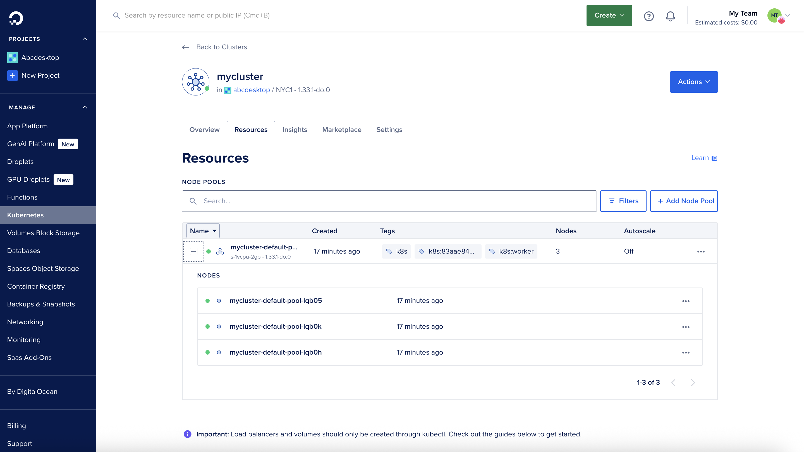
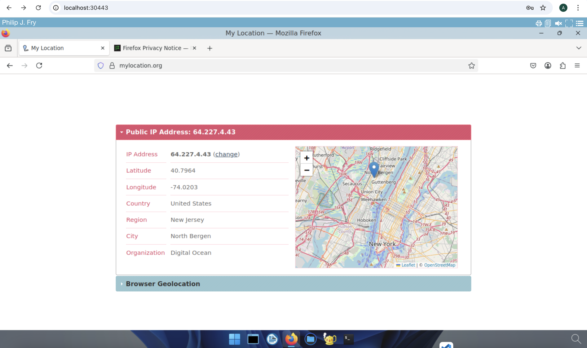

# Deploy abcdesktop on DigitalOcean with Kubernetes

## Requirements

- a DigitalOcean account
- `kubectl` 
- `doctl` command line interface [doctl cli](https://docs.digitalocean.com/reference/doctl/how-to/install/)

> If you are using the `doctl` command line for the first time, run the `doctl auth` command to authenticate with your DigitalOcean account using tokens that you generate in the control panel at [https://cloud.digitalocean.com/account/api/tokens](https://cloud.digitalocean.com/account/api/tokens).

## Create a `DOKS` DigitalOcean Kubernetes cluster

If you do not have a running Kubernetes cluster, use the `doctl` CLI with the `kubernetes cluster create` subcommand to create one.

```
doctl kubernetes clusters create --size s-4vcpu-8gb myabccluster 
```

After a few minutes, the Kubernetes cluster is ready:

```
Notice: Cluster is provisioning, waiting for cluster to be running
...............................................................
Notice: Cluster created, fetching credentials
Notice: Adding cluster credentials to kubeconfig file found in "/Users/myuser/.kube/config"
Notice: Setting current-context to do-nyc1-myabccluster
ID                                      Name            Region    Version        Auto Upgrade    Status     Node Pools
83aae84d-cfa9-4a89-ae75-89f0d5078d33    myabccluster    nyc1      1.33.1-do.0    false           running    myabccluster-default-pool
```


## DigitalOcean console overview

This screenshot shows the DigitalOcean control panel, displaying the **Resources** of the Kubernetes cluster and **Nodes** information.




## Run the abcdesktop install script 

Download and install the latest release automatically:

```
curl -sL https://raw.githubusercontent.com/abcdesktopio/conf/main/kubernetes/install-{{ abcdesktop.latest_release }}.sh | bash
```

To get more details about the install process, please read the [Setup guide](https://www.abcdesktop.io/{{ abcdesktop.latest_release }}/setup/kubernetes_abcdesktop/)

## Connect to your abcdesktop service 

By default, the install script listens on a free TCP port `:30443` and uses a `kubectl port-forward` command to forward traffic to the HTTP service on port `:80`.

Open a web browser and navigate to `http://localhost:30443`.


 
Log in as user `Philip J. Fry` with the password `fry`.


 
After the image-pulling process completes, you get your first abcdesktop session.


## Add applications to your desktop


Using the previous terminal shell, run the application install script:

```
curl -sL https://raw.githubusercontent.com/abcdesktopio/conf/main/kubernetes/pullapps-{{ abcdesktop.latest_release }}.sh | bash
```

To get more details about the install applications process, please read the [Setup applications guide](https://www.abcdesktop.io/{{ abcdesktop.latest_release }}/setup/kubernetes_abcdesktop_applications/)

Reload the web page to refresh the desktop of `Philip J. Fry`.
New applications are now listed in the dock of `plasmashell`.


Start the Firefox application.

> The first run may involve waiting for the image-pulling process to finish.

Navigate to `https://mylocation.org` to verify the geographic location of your pod. In this example, for the `nyc1` (New York City 1) region, the desktop is located near `North Bergen` in the `United States`.



