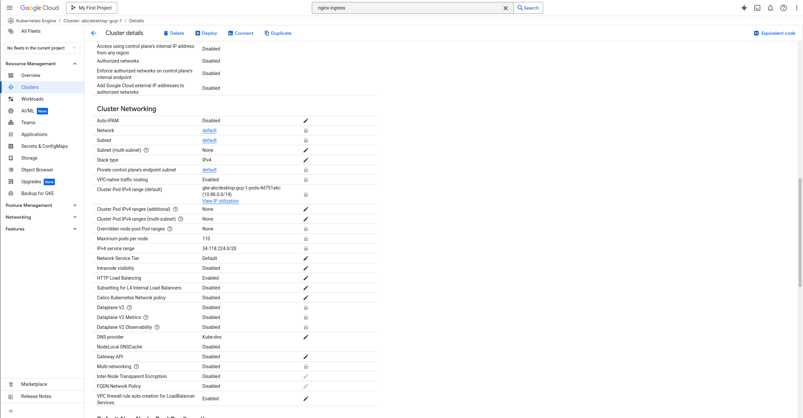
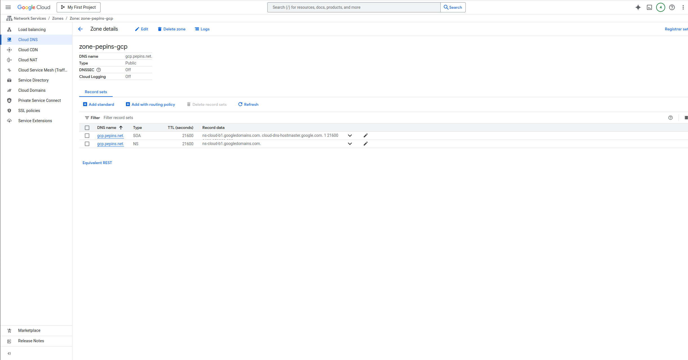
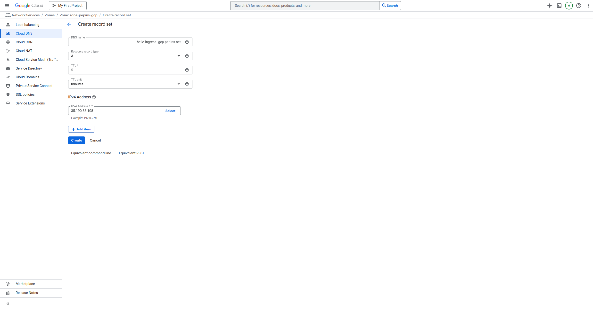
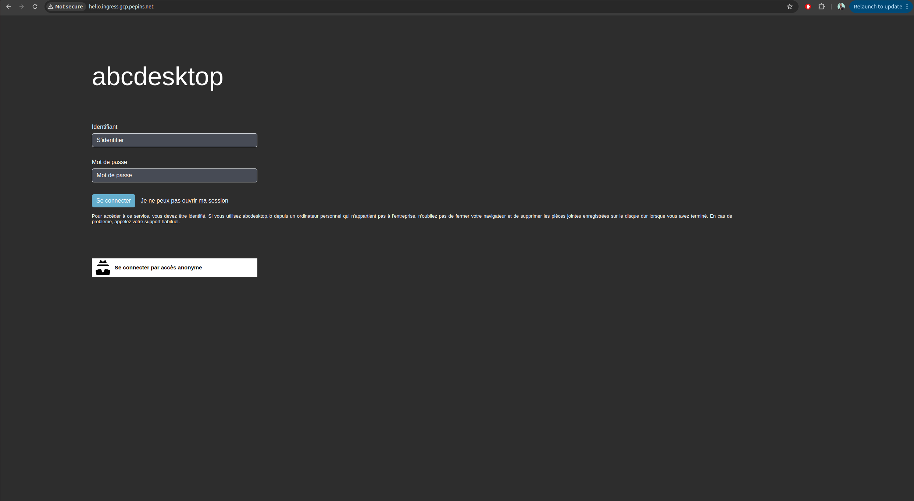
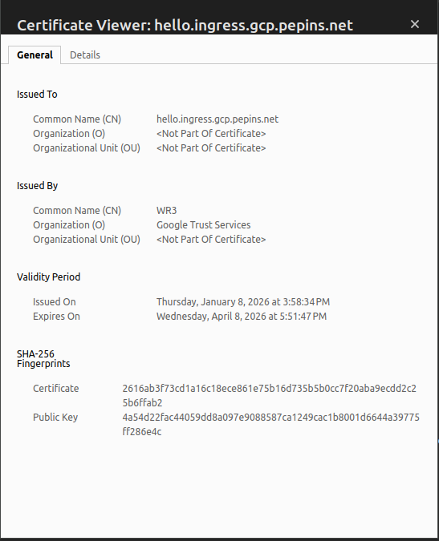

# Publish your website as a public secured service

## Requirements


- Read the previous chapter [Deploy abcdesktop on GCP with Kubernetes](gcp.md) 
- a GCP account
- your own domain hosted on GCP
- `gcloud` command line interface [gcloud cli](https://docs.cloud.google.com/sdk/docs/install-sdk/)
- `kubectl` command line

### For more information

- Read the Google Cloud chapter [install-gke-ingress-controller](https://docs.cloud.google.com/kubernetes-engine/docs/concepts/ingress-xlb)

## Overview

In this chapter, we will use a GKE ingress controller to expose your abcdesktop service with a public IP address, configure the DNS zone file to use your own domain name, and enable TLS to secure your service.

## Set up the GKE Ingress controller

In this example, we will use the GKE built-in ingress controller. Before starting, verify that the `HttpLoadBalancing` add-on is enabled on your cluster.
Navigate to your cluster page in the GCP console, then select **Networking**. You should see `HttpLoadBalancing` listed as enabled. If it is not, enable it and save your changes.



Create an ingress resource for GKE using the abcdesktop service and save it as `abcdesktop_host.yaml`.
Update this manifest with your own FQDN, replacing `hello.ingress.gcp.pepins.net` with your own value.

```
apiVersion: networking.k8s.io/v1
kind: Ingress
metadata:
  name: ingress-abcdesktop
  annotations:
    spec.ingressClassName: "gce"
spec:
  rules:
    - host: hello.ingress.gcp.pepins.net
      http:
        paths:
          - path: /
            pathType: Prefix
            backend:
              service:
                name: http-router
                port:
                  number: 80
```


The `spec.ingressClassName` annotation instructs GKE to deploy an external application load balancer.

Apply the Ingress YAML file:

```
NAMESPACE=abcdesktop
kubectl apply -f abcdesktop_host.yaml -n $NAMESPACE
```

You should see the following output:

```
ingress.networking.k8s.io/ingress-abcdesktop created
```


Verify the ingress resources:

```
NAMESPACE=abcdesktop
kubectl get ingress -n $NAMESPACE
```

The output looks similar to the following.

Wait a few seconds while the `ADDRESS` field is being populated:

```
NAME                 CLASS    HOSTS                          ADDRESS   PORTS   AGE
ingress-abcdesktop   <none>   hello.ingress.gcp.pepins.net             80      4s
```

When the `ADDRESS` field is populated:

```
NAME                 CLASS    HOSTS                          ADDRESS         PORTS   AGE
ingress-abcdesktop   <none>   hello.ingress.gcp.pepins.net   35.190.86.108   80      3m14s
```

In the example above, the ingress resource instructs GCE to route each HTTP request using the `/` prefix for the `hello.ingress.gcp.pepins.net` host to the `http-router` backend service running on port 80. In other words, every request to `http://hello.ingress.gcp.pepins.net/` is served by the `http-router` backend service on port 80.

## Update your DNS zone file 

We will associate your `FQDN` (Fully Qualified Domain Name) with the load balancer's IP address.



This screenshot shows the GCP network console displaying the **Domain** configuration. You can also manage your zone file directly through your domain registrar.

### Create new record

In this example, create a new `A` record named `hello.ingress` (`hello.ingress.gcp.pepins.net`) pointing to `35.190.86.108`. This IP address is the load balancer IP address.

Click `Add Standard` to update your zone file with the new record.



The new record should then appear on your domain page.


From your local device, open a web browser.



> Web browsers block WebSocket connections without a secure protocol. To log in, use the `https` protocol.

Your website is marked as `Not Secured`. We will add an X.509 SSL certificate to secure the service.

## Enable HTTPS

### Configure Google-managed SSL certificates

To enable HTTPS on the exposed service, we will use Google-managed SSL certificates, which are natively integrated with GCP and work seamlessly with a GKE ingress controller.

First, create a `ManagedCertificate` object by saving the following manifest to a file named `abcdesktop_managed_certificate.yaml`.

```
apiVersion: networking.gke.io/v1
kind: ManagedCertificate
metadata:
  name: abcdesktop-cert
spec:
  domains:
    - hello.ingress.gcp.pepins.net
```

Then apply it to the cluster:

```
NAMESPACE=abcdesktop
kubectl apply -f abcdesktop_managed_certificate.yaml -n $NAMESPACE
```

Next, update the previously created Ingress manifest to reference the managed certificate in the `annotations` section.


```
apiVersion: networking.k8s.io/v1
kind: Ingress
metadata:
  name: ingress-abcdesktop
  annotations:
    spec.ingressClassName: "gce"
    networking.gke.io/managed-certificates: "abcdesktop-cert"
spec:
  rules:
    - host: hello.ingress.gcp.pepins.net
      http:
        paths:
          - path: /
            pathType: Prefix
            backend:
              service:
                name: http-router
                port:
                  number: 80                         
```

Apply the updated manifest to start certificate provisioning:

```
NAMESCAPE=abcdesktop
kubectl apply -f abcdesktop_host.yaml -n $NAMESPACE
```

Verify that provisioning has started:

```
NAMESCAPE=abcdesktop
kubectl get managedcertificate -n $NAMESPACE
```

```
NAME                AGE   STATUS
abcdesktop-cert     30s   Provisioning
```

After approximately 10 to 15 minutes, the status changes from `Provisioning` to `Active`.

```
NAMESCAPE=abcdesktop
kubectl get managedcertificate  -n $NAMESPACE
```

```
NAME                AGE   STATUS
abcdesktop-cert     12m   Active
```

## Reach your website using `https` protocol 

You can now connect to your public abcdesktop website using the `https` protocol.


The connection is secured. You can inspect the certificate details.




## Increase ingress connection timeout

By default, a GCE-type ingress has a connection timeout of 30 seconds. Since abcdesktop requires persistent connections to the desktop session, you must increase this timeout to prevent premature disconnections.

Unlike an NGINX-type ingress, you cannot add annotations to the ingress YAML file to increase the timeout value. Instead, you must create a `BackendConfig` object and link it to your routing service.

Create a `backend_config_timeout.yaml` file with the following content:

```
apiVersion: cloud.google.com/v1
kind: BackendConfig
metadata:
  name: long-timeout-backend
spec:
  timeoutSec: 1800
```

Apply it to the cluster:

```
NAMESPACE=abcdesktop
kubectl apply -f backend_config_timeout.yaml -n $NAMESPACE
```

Next, update the `http-router` service to reference the `long-timeout-backend` configuration. Create an `http-router.yaml` file with the following content:

```
kind: Service
apiVersion: v1
metadata:
  name: http-router
  labels:
    abcdesktop/role: router-od
  annotations:
    cloud.google.com/backend-config: '{"ports":{"80":"long-timeout-backend"}}'
spec:
  selector:
    run: router-od
  ports:
  - protocol: TCP
    port: 443
    targetPort: 443
    name: https
  - protocol: TCP
    port: 80
    targetPort: 80
    name: http
```

Apply it to the cluster:

```
NAMESPACE=abcdesktop
kubectl apply -f http_router.yaml -n $NAMESPACE
```

Wait a few minutes for GCE to apply the new configuration. After reconnecting to your desktop, the connection should no longer drop after 30 seconds.


> **Note:** When using the GKE ingress controller with this method, the reverse proxy forwards the client's source IP address to your cluster, so no additional configuration is required for that purpose.
