---
tags:
  - gcp
  - install
  - AD
  - cloud
---


# Deploy abcdesktop on Google Cloud Provider (GCP) with Kubernetes

## Requirements

- a GCP account
- an existing [GCP project](https://developers.google.com/workspace/guides/create-project) 
- `kubectl` 
- `gcloud` command line interface [gcloud cli](https://docs.cloud.google.com/sdk/docs/install-sdk/)

> If you use the `gcloud` command line for the first time, run `gcloud auth login` to authenticate with your GCP account.

## Create a Kubernetes Cluster Using gcloud CLI

First, configure `gcloud` to set your GCP project as the current project by running the following command.

```
gcloud config set project <YOUR_PROJECT_ID>
```

Run the following command to create your Kubernetes cluster:

```
gcloud container clusters create abcdesktop-gcp-1 --machine-type=custom-4-8192 --zone=us-central1-a --num-nodes=2
```

If you want more details about the command parameters go the [gcloud container clusters create documentation](https://docs.cloud.google.com/sdk/gcloud/reference/container/clusters/create)

After a few minutes, you get a kubernetes cluster ready

```
Note: Your Pod address range (`--cluster-ipv4-cidr`) can accommodate at most 1008 node(s).
Creating cluster abcdesktop-gcp-1 in us-central1-a... Cluster is being health-checked (Kubernetes Control Plane is healthy)...done.                                                                                                                                              
Created [https://container.googleapis.com/v1/projects/project-3104fb45-bad0-46b7-b2b/zones/us-central1-a/clusters/abcdesktop-gcp-1].
To inspect the contents of your cluster, go to: https://console.cloud.google.com/kubernetes/workload_/gcloud/us-central1-a/abcdesktop-gcp-1?project=project-3104fb45-bad0-46b7-b2b
kubeconfig entry generated for abcdesktop-gcp-1.
NAME              LOCATION       MASTER_VERSION      MASTER_IP      MACHINE_TYPE   NODE_VERSION        NUM_NODES  STATUS   STACK_TYPE
abcdesktop-gcp-1  us-central1-a  1.33.5-gke.1308000  34.172.78.248  custom-4-8192  1.33.5-gke.1308000  2          RUNNING  IPV4
```

## Create a Kubernetes Cluster Using Google Cloud Console

If you do not have a running Kubernetes cluster, connect to your GCP console and search for `Create a Kubernetes Cluster`.

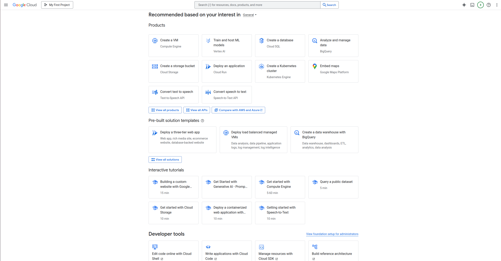

You will arrive on the GCP Kubernetes cluster application main page, then click on `Create cluster` and follow the step as shown below.

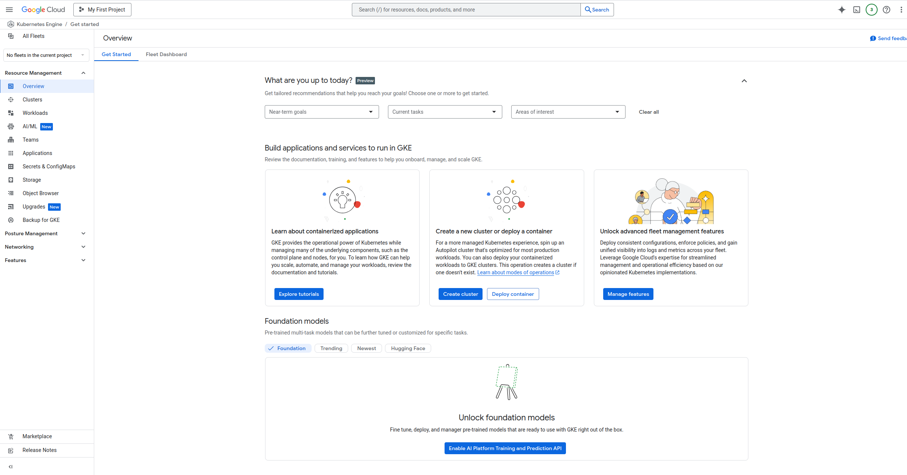
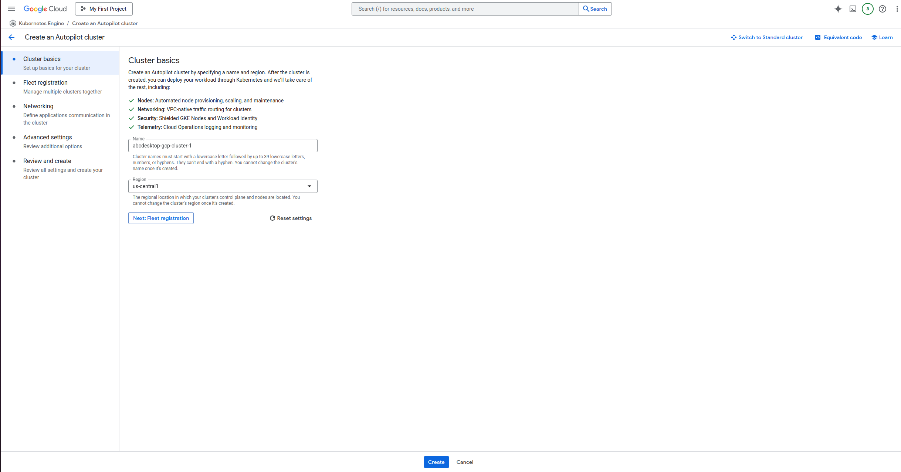
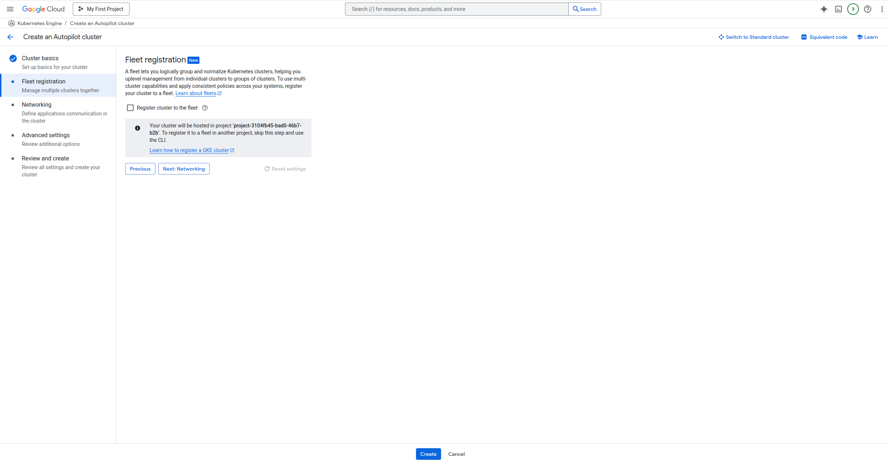
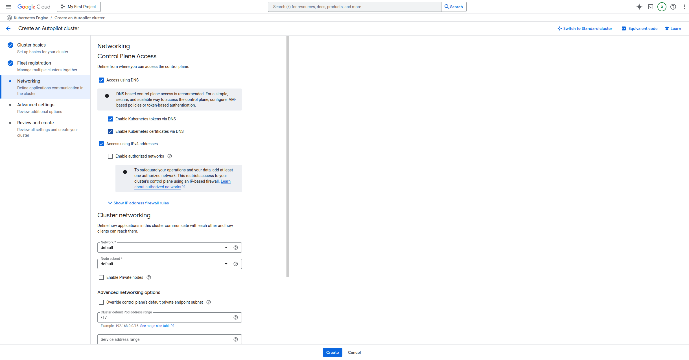
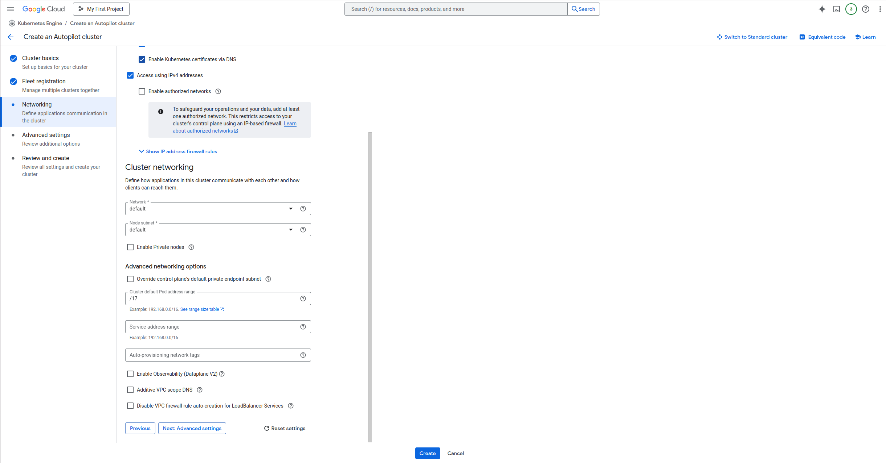
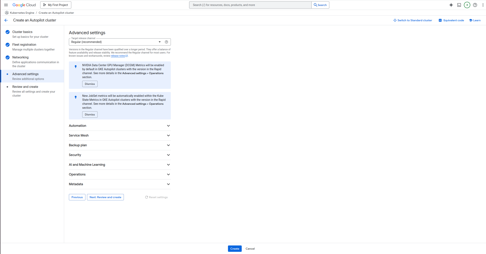

Now wait a few minutes for your cluster to be ready.

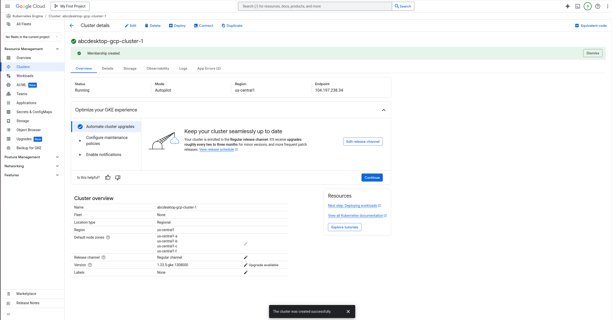

Once your cluster is ready, you will need to link it to your local machine in order to manage it. To do so, first install the `gke-gcloud-auth-plugin` by running the following command:

```
gcloud components install gke-gcloud-auth-plugin
```

Then click on the `Connect` button and paste the provided command into your terminal.

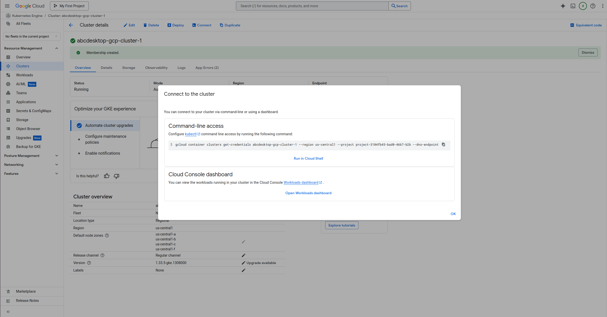

## Run the abcdesktop install script 

Download and install the latest release automatically

```
curl -sL https://raw.githubusercontent.com/abcdesktopio/conf/main/kubernetes/install-{{ abcdesktop.latest_release }}.sh | bash
```

To get more details about the install process, please read the [Setup guide](https://www.abcdesktop.io/{{ abcdesktop.latest_release }}/setup/kubernetes_abcdesktop/)

## Connect to your abcdesktop service 

By default, the install script exposes the service on a free TCP port `:30443` using a `kubectl port-forward` command to forward traffic to the HTTP service on port `:80`.

Open your web browser and navigate to `http://localhost:30443`.

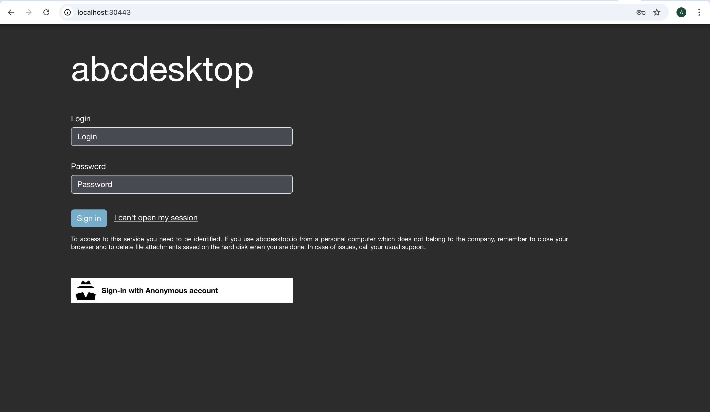

 
Login as user `Philip J. Fry` with the password `fry`

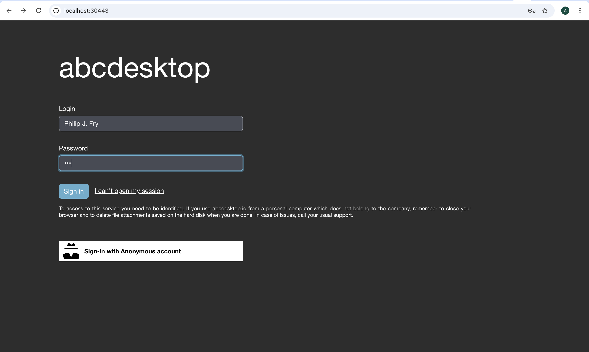
 
After image pulling process, you get your first abcdesktop 

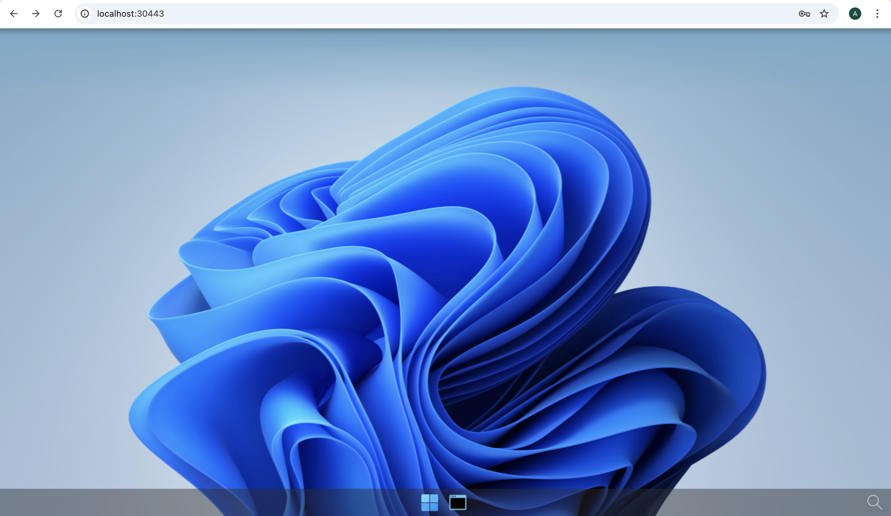


### Resource issue

If this resource issue occurs

```
Unprocessable Entity {"kind":"Status","apiVersion":"v1","metadata":{},"status":"Failure","message":"Pod \"fry-38b04\" is invalid: [spec.resources.requests[cpu]: Invalid value: \"1\": must be greater than or equal to aggregate container requests of 1500m, spec.resources.requests[memory]: Invalid value: \"576Mi\": must be greater than or equal to aggregate container requests of 6Gi]","reason":"Invalid","details":{"name":"fry-38b04","kind":"Pod","causes":[{"reason":"FieldValueInvalid","message":"Invalid value: \"1\": must be greater than or equal to aggregate container requests of 1500m","field":"spec.resources.requests[cpu]"},{"reason":"FieldValueInvalid","message":"Invalid value: \"576Mi\": must be greater than or equal to aggregate container requests of 6Gi","field":"spec.resources.requests[memory]"}]},"code":422}
```

- Update the `od.config`, add comment the `executeclasses` `default` entry

```
executeclasses : {
  'default':{
    'nodeSelector': { 'cloud.google.com/compute-class': 'Scale-Out' },
    'description': 'default: up to 4 CPU cores and 8Gi',
    'runtimeClassName': None,
    'resources':{
      # 'requests':{'memory':"576Mi",'cpu':"1000m"},
      # 'limits':  {'memory':"8Gi",'cpu':"2000m"}
    }
  },
```

- Restart `pyos-od` deployment to reload the `abcdesktop-config`

```
NAMESPACE=abcdesktop
kubectl create -n $NAMESPACE configmap abcdesktop-config --from-file=od.config -o yaml --dry-run=client | kubectl replace -n abcdesktop -f -
kubectl rollout restart deployment pyos-od -n $NAMESPACE
```


## Add applications to your desktop


Using the previous terminal shell, run the application install script 

```
curl -sL https://raw.githubusercontent.com/abcdesktopio/conf/main/kubernetes/pullapps-{{ abcdesktop.latest_release }}.sh | bash
```

To get more details about the install applications process, please read the [Setup applications guide](https://www.abcdesktop.io/{{ abcdesktop.latest_release }}/setup/kubernetes_abcdesktop_applications/)

Then reload the web page showing the desktop of `Philip J. Fry`.
New applications are now listed in the dock of `plasmashell`.

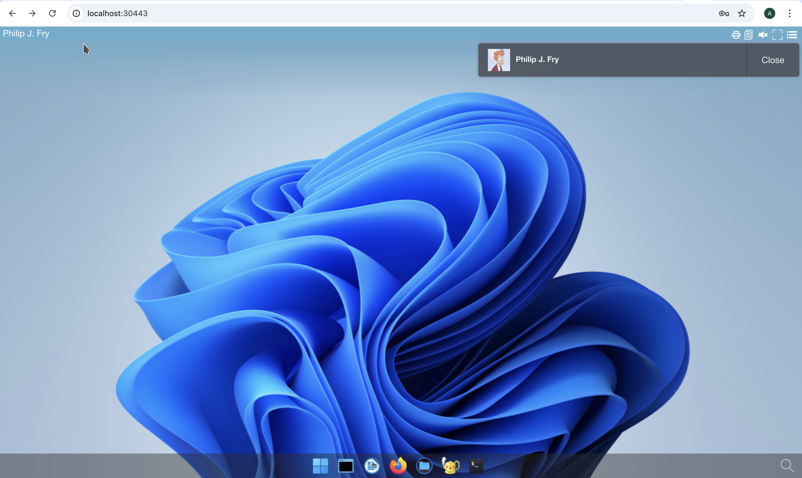

Start Firefox application

> The first run may involve waiting for the image pulling process to finish

In this example, for the `Iowa` region, the desktop is located near `Council Bluffs` in the `United States`.


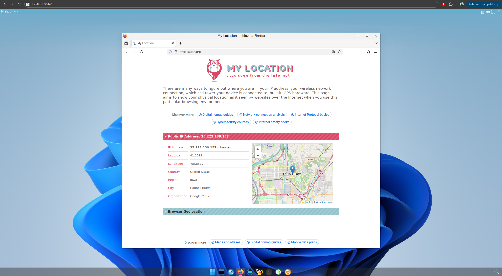
