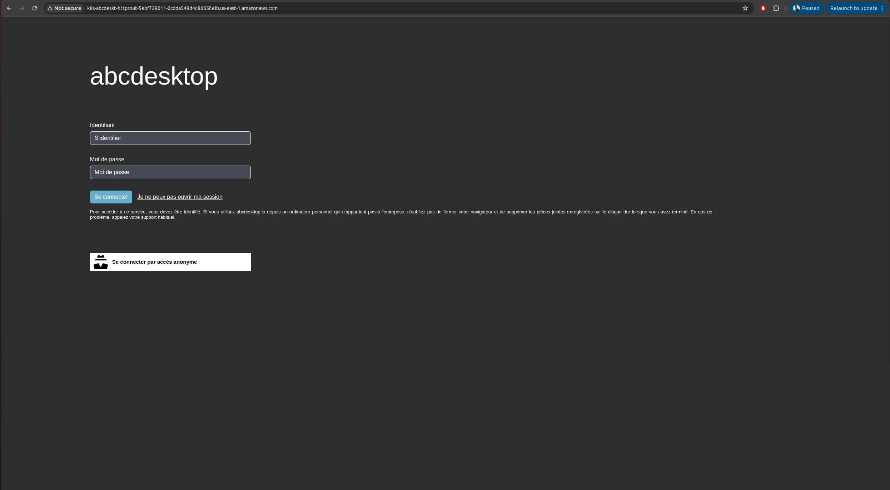
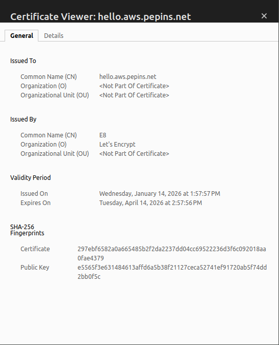

# Publish your website as a public secured service


## Requirements


- read the previous chapter [Deploy abcdesktop on AWS with Amazon Elastic Kubernetes Service](aws) 
- an AWS account
- your own internet domain
- `aws` command line interface [aws-cli](https://aws.amazon.com/cli/)
- `kubectl` command line
- `wget` command line


## Overview

In this chapter we are going to, use a `loadBalancer` to host your abcdesktop service with a public IP Address, then configure dns zone file to use your domain name, and activate TLS to secure your service.
 

## Add tags for public subnets

By default, when creating your VPC, the public subnets does not have the `kubernetes.io/role/elb=1` tag, but this tag is mandatory in order to expose our service using a load balancer with AWS. Actually, AWS scans your VPC, searching for the subnets with this percise tag to place the load balancers.  

To do so, run the following command

```
aws ec2 create-tags --resources <your_public_subnets_ids> --tags Key=kubernetes.io/role/elb,Value=1
```

> You can find your public subnets ids in the `Subnets` page of the VPC dashboard on AWS console

You can check if the tags have been applied by running the following command

```
aws ec2 describe-subnets --filters "Name=vpc-id,Values=<your_vpc_id>" "Name=tag:kubernetes.io/role/elb,Values=1" --query 'Subnets[*].[SubnetId,AvailabilityZone]' --output table
```

You should read on stdout

```
--------------------------------------------
|              DescribeSubnets             |
+---------------------------+--------------+
|  subnet-09c09bd5bbdec72a6 |  us-east-1b  |
|  subnet-02d592feab5bb0faf |  us-east-1a  |
+---------------------------+--------------+

```

## Create a new `http-router` service yaml file


The default install define the `http-router` service with as `nodePort` type. We are going to update the `http-router` service with a `LoadBalancer` type.

Create a file named `http-router.yaml`

```
apiVersion: v1
kind: Service
metadata:
  name: http-router
  labels:
    abcdesktop/role: router-od
  annotations:
    service.beta.kubernetes.io/aws-load-balancer-type: "nlb-ip"
    service.beta.kubernetes.io/aws-load-balancer-scheme: "internet-facing"
    service.beta.kubernetes.io/aws-load-balancer-healthcheck-protocol: "http"
    service.beta.kubernetes.io/aws-load-balancer-healthcheck-port: "80"
    service.beta.kubernetes.io/aws-load-balancer-healthcheck-path: "/healthz"
spec:
  type: LoadBalancer
  selector:
    run: router-od
  ports:
    - name: https
      protocol: TCP
      port: 443
      targetPort: 443
    - name: http
      protocol: TCP
      port: 80
      targetPort: 80
```

Save your `http-router.yaml` file

Delete the previous service `http-router`

```
kubectl delete service http-router -n abcdesktop
service "http-router" deleted
```

Create your new `service/http-router`

```
kubectl apply -f http-router.yaml -n abcdesktop
service/http-router created
```

Wait for few minutes, the `EXTERNAL-IP` of service `http-router` stays in `Pending` state

```
kubectl get services http-router -n abcdesktop 
```

```
NAME          TYPE           CLUSTER-IP      EXTERNAL-IP   PORT(S)        AGE
http-router   LoadBalancer   172.20.207.4    <pending>     80:32155/TCP   3s
```

Check the EXTERNAL-IP of service `http-router` again

```
kubectl get services http-router -n abcdesktop       
```

> Great the service gets `k8s-abcdeskt-httprout-5ebf729011-0cdda549d4c8665f.elb.us-east-1.amazonaws.com` as an `EXTERNAL-IP`

```      
NAME          TYPE           CLUSTER-IP     EXTERNAL-IP                                                                     PORT(S)                      AGE
http-router   LoadBalancer   172.20.207.4   k8s-abcdeskt-httprout-5ebf729011-0cdda549d4c8665f.elb.us-east-1.amazonaws.com   443:32461/TCP,80:31216/TCP   2m3d
``` 

You can open a web browser to reach your abcdesktop service with the given URL





Web browser doesn't allow usage of websocket without secure protocol. To login you need `https` protocol


## Update your DNS zone file 


We will use a `FQDN` (Fully Qualified Domain Name) to replace the `IP Address`.


This screenshot describes the AWS network console Route 53. It shows the `Domain` informations, but your can manage your zone file from your own registrar.

### Create new record

We are going to create a new record `hello` (`hello.aws.pepins.net`) using `k8s-abcdeskt-httprout-5ebf729011-0cdda549d4c8665f.elb.us-east-1.amazonaws.com` as an alias. 

First, you will need your load balancer hosted zone id. To get, run the following command :

```
aws elbv2 describe-load-balancers   --region us-east-1   --query 'LoadBalancers[0].CanonicalHostedZoneId'
```

You should get something like this

```
Z26RNL4JYFTOTI
```

Now paste the following lines in a  `create-record-abcdesktop-aws.json` file :

```
{
  "Comment": "create a new record for abcdesktop on aws",
  "Changes": [
    {
      "Action": "CREATE",
      "ResourceRecordSet": {
        "Name": "hello.aws.pepins.net.",
        "Type": "A",
        "AliasTarget": {
          "HostedZoneId": "<your_hosted_zone_id>",
          "DNSName": "k8s-abcdeskt-httprout-5ebf729011-0cdda549d4c8665f.elb.us-east-1.amazonaws.com",
          "EvaluateTargetHealth": false
        }
      }
    }
  ]
}
```

Now, you will need to retrieve the hosted zone id of your domain on route 53. You can get it through the Route 53 web interface, or by running the following command : 

```
aws route53 list-hosted-zones   --query 'HostedZones[*].[Name,Id]'   --output table
```

You should read something like this 

```
--------------------------------------------------------
|                    ListHostedZones                   |
+------------------+-----------------------------------+
|  aws.pepins.net. |  /hostedzone/Z0710575SCBYT0OUKZP  |
+------------------+-----------------------------------+
```

Finally, run this command to add the record : 

```
aws route53 change-resource-record-sets --hosted-zone-id <your_domain_hosted_zone_id> --change-batch file://create-record-abcdesktop-aws.json 
```

For example 

```
aws route53 change-resource-record-sets --hosted-zone-id Z0710575SCBYT0OUKZP --change-batch file://create-record-abcdesktop-aws.json
```

You should read something like this 

```
{
    "ChangeInfo": {
        "Id": "/change/C07091422RBO1K64I6QWN",
        "Status": "PENDING",
        "SubmittedAt": "2026-01-14T13:30:30.133000+00:00",
        "Comment": "create a new record for abcdesktop on aws"
    }
}
```

If you go to your Route 53 web console, you should see the record you juste added


From your local device, you can open a web browser


Web browser doesn't allow usage of websocket without secure protocol. To login you need `https` protocol.

As you can see, your website is `Not Secured`, we are going to add X509 SSL certificate to secure your service.


## Obtain a certificat 

If you already have a X509 certificat with a private and public certified key files for your web site, you can skip this chapter.

To create you SSL certificat, we are using let's encrypt service. You need your new hostname and your email address

Define the new variables `ABCDESKTOP_PUBLIC_FQDN` and `USER_EMAIL_ADDRESS` 


``` bash
ABCDESKTOP_PUBLIC_FQDN=hello.aws.pepins.net
USER_EMAIL_ADDRESS=thisisyouremail@domain.com
ROUTER_POD_NAME=$(kubectl get pods -l run=router-od -o jsonpath={.items..metadata.name}  -n abcdesktop)
kubectl exec -n abcdesktop -it ${ROUTER_POD_NAME} -- /usr/bin/certbot certonly --webroot -w /var/lib/nginx/html -d ${ABCDESKTOP_PUBLIC_FQDN} -m "${USER_EMAIL_ADDRESS}" --agree-tos -n
```

You should read on stdout

```
Saving debug log to /var/log/letsencrypt/letsencrypt.log
Account registered.
Requesting a certificate for hello.aws.pepins.net

Successfully received certificate.
Certificate is saved at: /etc/letsencrypt/live/hello.aws.pepins.net/fullchain.pem
Key is saved at:         /etc/letsencrypt/live/hello.aws.pepins.net/privkey.pem
This certificate expires on 2026-04-13.
These files will be updated when the certificate renews.

NEXT STEPS:
- The certificate will need to be renewed before it expires. Certbot can automatically renew the certificate in the background, but you may need to take steps to enable that functionality. See https://certbot.org/renewal-setup for instructions.

- - - - - - - - - - - - - - - - - - - - - - - - - - - - - - - - - - - - - - - -
If you like Certbot, please consider supporting our work by:
 * Donating to ISRG / Let's Encrypt:   https://letsencrypt.org/donate
 * Donating to EFF:                    https://eff.org/donate-le
- - - - - - - - - - - - - - - - - - - - - - - - - - - - - - - - - - - - - - - -

```

The files `fullchain.pem` and `privkey.pem` are located inside the container. 

```
Certificate is saved at: /etc/letsencrypt/live/hello.aws.pepins.net/fullchain.pem
Key is saved at:         /etc/letsencrypt/live/hello.aws.pepins.net/privkey.pem
```

We export the files and create a new secrets. 


```
kubectl exec -n abcdesktop -it  ${ROUTER_POD_NAME} -- cat /etc/letsencrypt/live/$ABCDESKTOP_PUBLIC_FQDN/fullchain.pem > fullchain.pem
kubectl exec -n abcdesktop -it  ${ROUTER_POD_NAME} -- cat /etc/letsencrypt/live/$ABCDESKTOP_PUBLIC_FQDN/privkey.pem > privkey.pem
```


## Create a secret for X509 certificat


Create a secret named `http-router-certificat` with the `fullchain.pem` and `privkey.pem` file content

```
kubectl create secret tls http-router-certificat --cert=fullchain.pem --key=privkey.pem -n abcdesktop 
```

You secret is created 

```
secret/http-router-certificat created
```


## Update `http-router` ConfigMap to use the new `http-router-certificat` secret

Download [abcdesktop-routehttp-config.4.3.yaml](https://raw.githubusercontent.com/abcdesktopio/conf/refs/heads/main/kubernetes/abcdesktop-routehttp-config.4.3.yaml) file 

```
wget https://raw.githubusercontent.com/abcdesktopio/conf/refs/heads/main/kubernetes/abcdesktop-routehttp-config.4.3.yaml
```

Open your `abcdesktop-routehttp-config.4.3.yaml` file, look for the ConfigMap `abcdesktop-routehttp-config`.

Remove the comments to enable https and change the value `YOUR_SERVER_NAME_AND_DOMAIN` by your own value. 

```
 # nginx server config
 server {
     ...
     
     ######
     # uncomment this to enable https
     #
     listen 443 ssl http2 default_server;
     listen [::]:443 ssl http2 default_server;
     server_name YOUR_SERVER_NAME_AND_DOMAIN; # change this too
     ssl_certificate     /etc/nginx/ssl/tls.crt;
     ssl_certificate_key /etc/nginx/ssl/tls.key;
     #
     # end of https section
     ######
     
     ...
     index index.html index.htm;
```

For example

```
     listen 443 ssl http2 default_server;
     listen [::]:443 ssl http2 default_server;
     server_name hello.aws.pepins.net;
     ssl_certificate     /etc/nginx/ssl/tls.crt;
     ssl_certificate_key /etc/nginx/ssl/tls.key;
```

Apply your new nginx confguration file

```
kubectl apply -f abcdesktop-routehttp-config.4.3.yaml -n abcdesktop
```
 
## Update `deployment` http-router
 
Update the `deployment` route to add certificat ssl entry

The `abcdesktop-deployment-routehttps.4.3.yaml` file  adds `mountPath: /etc/nginx/ssl` to `secretName: http-router-certificat`

```
kubectl apply -f https://raw.githubusercontent.com/abcdesktopio/conf/refs/heads/main/kubernetes/abcdesktop-deployment-routehttps.4.3.yaml -n abcdesktop
```

## Reach your website using `https` protocol 

You can now connect to your abcdesktop desktop pulic web site using `https` protocol. 


The status is secured and we get some informations from the certificate



 
 
