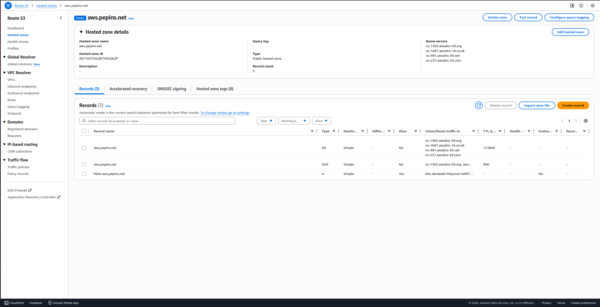
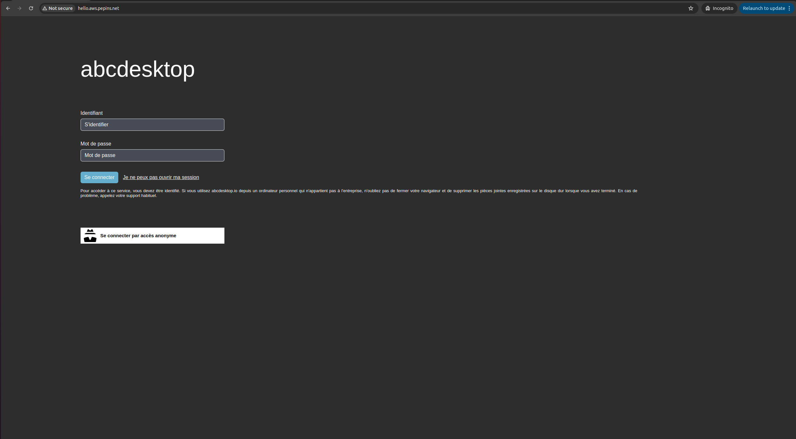
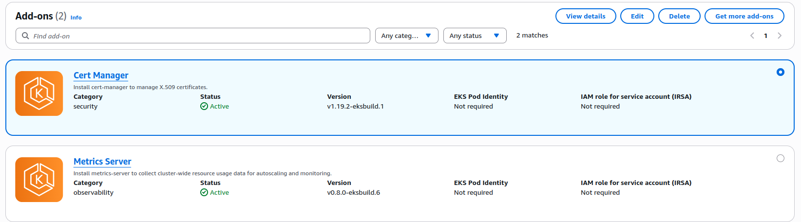
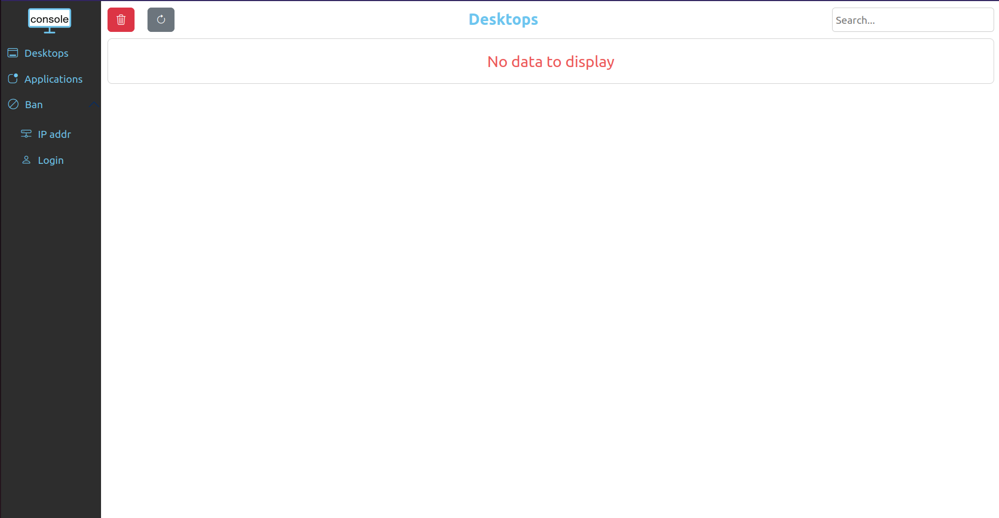

# Publish your website as a public secured service


## Requirements


- read the previous chapter [Deploy abcdesktop on AWS with Amazon Elastic Kubernetes Service](aws) 
- an AWS account
- your own internet domain
- `aws` command line interface [aws-cli](https://aws.amazon.com/cli/)
- `kubectl` command line
- `helm` command line

## Overview

In this chapter we are going to, use a `nginx-ingress-controller` to host your abcdesktop service with a public IP Address, then configure dns zone file to use your own domain name, and activate TLS to secure your service.

## Add tags for public subnets

By default, when creating your VPC, the public subnets does not have the `kubernetes.io/role/elb=1` tag, but this tag is mandatory in order to expose our service using a nginx ingress controller with AWS. Actually, AWS scans your VPC, searching for the subnets with this percise tag to place the ingress controller.  

To do so, run the following command

```
aws ec2 create-tags --resources <your_public_subnets_ids> --tags Key=kubernetes.io/role/elb,Value=1
```

> You can find your public subnets ids in the `Subnets` page of the VPC dashboard on AWS console

You can check if the tags have been applied by running the following command

```
aws ec2 describe-subnets --filters "Name=vpc-id,Values=<your_vpc_id>" "Name=tag:kubernetes.io/role/elb,Values=1" --query 'Subnets[*].[SubnetId,AvailabilityZone]' --output table
```

You should read on stdout

```
--------------------------------------------
|              DescribeSubnets             |
+---------------------------+--------------+
|  subnet-09c09bd5bbdec72a6 |  us-east-1b  |
|  subnet-02d592feab5bb0faf |  us-east-1a  |
+---------------------------+--------------+

```

## Update http-router service

When installing abcdesktop, http-router service type is `NodePort` by default, in order to expose the service through an ingress controller you will need to change the service type from `NodePort` to `ClusterIP`.

If you perform a get services command you will see the `NodePort` type

``` 
kubectl get svc http-router -n abcdesktop
NAME          TYPE       CLUSTER-IP    EXTERNAL-IP   PORT(S)        AGE
http-router   NodePort   10.0.170.21   <none>        80:30443/TCP   5m31s
```

To change it, you will first need to delete the service

```
kubectl delete service http-router -n abcdesktop
service "http-router" deleted
```

Then paste the following lines in a new `http-router.yaml` file

```
kind: Service
apiVersion: v1
metadata:
  name: http-router
  labels:
    abcdesktop/role: router-od
spec:
  selector:
    run: router-od
  ports:
  - protocol: TCP
    port: 443
    targetPort: 443
    name: https
  - protocol: TCP
    port: 80
    targetPort: 80
    name: http
```

Then Create your new `service/http-router`

```
kubectl apply -f http-router.yaml -n abcdesktop
service/http-router created
```

Now check that the service type is `ClusterIP`

```
kubectl get svc http-router -n abcdesktop
NAME          TYPE        CLUSTER-IP     EXTERNAL-IP   PORT(S)          AGE
http-router   ClusterIP   10.0.132.230   <none>        443/TCP,80/TCP   5s
```

## Deploy nginx ingress controller

You will now deploy a nginx ingress controller on your cluster using `helm`.

First, run the following command to add the nginx ingress controller repository : 

```
helm repo add ingress-nginx https://kubernetes.github.io/ingress-nginx && helm repo update
```

Then install it on your cluster 

```
helm install ingress-nginx ingress-nginx/ingress-nginx --namespace ingress-nginx --create-namespace
```

Once the installation process completed, you can check that the service has been createed by running this command : 

```
kubectl get svc ingress-nginx-controller -n ingress-nginx
NAME                                 TYPE           CLUSTER-IP      EXTERNAL-IP   PORT(S)                      AGE
ingress-nginx-controller             LoadBalancer   172.20.87.254   <pending>     80:32337/TCP,443:30414/TCP   34s
```

You will see that `EXTERNAL-IP` is `<pending>` forever, it is totally noraml because by default the controller is considering your service as internal, to make it public you should add annotations by running the following command

```
kubectl annotate svc ingress-nginx-controller -n ingress-nginx service.beta.kubernetes.io/aws-load-balancer-scheme=internet-facing service.beta.kubernetes.io/aws-load-balancer-type=nlb --overwrite
```

Now you can run the previous command until you get an `EXTERNAL-IP` 

```
kubectl get svc ingress-nginx-controller -n ingress-nginx
NAME                                 TYPE           CLUSTER-IP      EXTERNAL-IP                                                                     PORT(S)                      AGE
ingress-nginx-controller             LoadBalancer   172.20.87.254   k8s-ingressn-ingressn-dc31c08978-b7ef1bca03cfe45b.elb.us-east-1.amazonaws.com   80:32337/TCP,443:30414/TCP   3m
```

### Create new record

We are going to create a new record `hello` (`hello.aws.pepins.net`) using `k8s-ingressn-ingressn-dc31c08978-b7ef1bca03cfe45b.elb.us-east-1.amazonaws.com` as an alias. 

First, you will need your load balancer hosted zone id. To get, run the following command :

```
aws elbv2 describe-load-balancers   --region us-east-1   --query 'LoadBalancers[0].CanonicalHostedZoneId'
```

You should get something like this

```
Z26RNL4JYFTOTI
```

Now paste the following lines in a  `create-record-abcdesktop-aws.json` file :

```
{
  "Comment": "create a new record for abcdesktop on aws",
  "Changes": [
    {
      "Action": "CREATE",
      "ResourceRecordSet": {
        "Name": "hello.aws.pepins.net.",
        "Type": "A",
        "AliasTarget": {
          "HostedZoneId": "<your_hosted_zone_id>",
          "DNSName": "k8s-ingressn-ingressn-dc31c08978-b7ef1bca03cfe45b.elb.us-east-1.amazonaws.com",
          "EvaluateTargetHealth": false
        }
      }
    }
  ]
}
```

Now, you will need to retrieve the hosted zone id of your domain on route 53. You can get it through the Route 53 web interface, or by running the following command : 

```
aws route53 list-hosted-zones   --query 'HostedZones[*].[Name,Id]'   --output table
```

You should read something like this 

```
--------------------------------------------------------
|                    ListHostedZones                   |
+------------------+-----------------------------------+
|  aws.pepins.net. |  /hostedzone/Z0710575SCBYT0OUKZP  |
+------------------+-----------------------------------+
```

Finally, run this command to add the record : 

```
aws route53 change-resource-record-sets --hosted-zone-id <your_domain_hosted_zone_id> --change-batch file://create-record-abcdesktop-aws.json 
```

For example 

```
aws route53 change-resource-record-sets --hosted-zone-id Z0710575SCBYT0OUKZP --change-batch file://create-record-abcdesktop-aws.json
```

You should read something like this 

```
{
    "ChangeInfo": {
        "Id": "/change/C07091422RBO1K64I6QWN",
        "Status": "PENDING",
        "SubmittedAt": "2026-01-14T13:30:30.133000+00:00",
        "Comment": "create a new record for abcdesktop on aws"
    }
}
```

If you go to your Route 53 web console, you should see the record you juste added



## Configure NGINX Ingress Rules for Backend Services 

In this step, you expose the backend applications to the outside world by telling nginx what host each service maps to. You define a rule in nginx to associate a host to a abcdesktop route backend service.

Create an ingress resource for NGNIX using the abcdesktop service and save it as `abcdesktop_host.yaml`
You need to update this manifest with your own FQDN, replace `hello.aws.pepins.net` by your own values.

```
apiVersion: networking.k8s.io/v1
kind: Ingress
metadata:
  name: ingress-abcdesktop
  namespace: abcdesktop
spec:
  rules:
    - host: hello.aws.pepins.net
      http:
        paths:
          - path: /
            pathType: Prefix
            backend:
              service:
                name: http-router
                port:
                  number: 80
  ingressClassName: nginx
```

Apply the Ingress yaml file

```
kubectl apply -f abcdesktop_host.yaml -n abcdesktop
```

You should read

```
ingress.networking.k8s.io/ingress-abcdesktop created
```


Verify the ingress resources:

```
kubectl get ingress -n abcdesktop
```

The output looks similar to the following:

Wait fee seconds while the `ADDRESS` field is empty  
```
NAME                 CLASS   HOSTS                           ADDRESS   PORTS   AGE
ingress-abcdesktop   nginx   hello.aws.pepins.net                      80      24s
```

When you obtain an `IP ADDRESS`

```
NAME                 CLASS   HOSTS                           ADDRESS                                                                         PORTS   AGE
ingress-abcdesktop   nginx   hello.aws.pepins.net            k8s-ingressn-ingressn-dc31c08978-b7ef1bca03cfe45b.elb.us-east-1.amazonaws.com   80      3m13s
```


The spec section of the manifest contains a list of host rules used to configure the Ingress. If unspecified, or no rule matches, all traffic is sent to the default backend service. The manifest has the following fields:

- host specifies the fully qualified domain name of a network host, for example echo.`<your-domain-name>`.

- http contains the list of HTTP selectors pointing to backends.

- paths provides a collection of paths that map requests to backends.

In the example above, the ingress resource tells nginx to route each HTTP request that is using the / prefix for the `hello.aws.pepins.net` host, to the `route` backend service running on port 80. In other words, every time you make a call to http://hello.aws.pepins.net/, the request and reply are served by the echo backend service running on port 80.

You can have multiple ingress controllers per cluster. The ingressClassName field in the manifest differentiates between multiple ingress controllers present in your cluster. Although you can define multiple rules for different hosts and paths in a single ingress resource.



> Web browser doesn't allow usage of websocket without secure protocol. To login you need `https` protocol.

As you can see, your website is `Not Secured`, we are going to add X509 SSL certificate to secure your service.

## Enable HTTPS

### Install Cert Manager add-on on AWS EKS marketplace

Navigate to the Add-ons section of your cluster on the AWS console, then click on `Get more add-ons` and install Cert Manager.



Once intalled, you can inspect the Kubernetes ressources created by Cert Manager :

```
kubectl get all -n cert-manager
```

The output looks similar to the following

```
NAME                                           READY   STATUS    RESTARTS   AGE
pod/cert-manager-76f99d9cbb-z5dgj              1/1     Running   0          3h26m
pod/cert-manager-76f99d9cbb-z7jnv              1/1     Running   0          3h26m
pod/cert-manager-cainjector-558b47dbf9-h55gx   1/1     Running   0          3h26m
pod/cert-manager-cainjector-558b47dbf9-lvgzl   1/1     Running   0          3h26m
pod/cert-manager-webhook-7db584cc6c-9qz5q      1/1     Running   0          3h26m
pod/cert-manager-webhook-7db584cc6c-l5s58      1/1     Running   0          3h26m

NAME                              TYPE        CLUSTER-IP       EXTERNAL-IP   PORT(S)            AGE
service/cert-manager              ClusterIP   172.20.196.196   <none>        9402/TCP           3h26m
service/cert-manager-cainjector   ClusterIP   172.20.102.95    <none>        9402/TCP           3h26m
service/cert-manager-webhook      ClusterIP   172.20.105.49    <none>        443/TCP,9402/TCP   3h26m

NAME                                      READY   UP-TO-DATE   AVAILABLE   AGE
deployment.apps/cert-manager              2/2     2            2           3h26m
deployment.apps/cert-manager-cainjector   2/2     2            2           3h26m
deployment.apps/cert-manager-webhook      2/2     2            2           3h26m

NAME                                                 DESIRED   CURRENT   READY   AGE
replicaset.apps/cert-manager-76f99d9cbb              2         2         2       3h26m
replicaset.apps/cert-manager-cainjector-558b47dbf9   2         2         2       3h26m
replicaset.apps/cert-manager-webhook-7db584cc6c      2         2         2       3h26m
```

The cert-manager pods and webhook service are running.

Cert-Manager creates custom resource definitions (CRDs). Cert-Manager relies on three important CRDs to issue certificates from a Certificate Authority (such as Let’s Encrypt):

Issuer: Defines a namespaced certificate issuer, which allows you to use different CAs in each namespace.

ClusterIssuer: Similar to Issuer, but it does not belong to a namespace and can be used to issue certificates in any namespace.

Certificate: Defines a namespaced resource that references an Issuer or ClusterIssuer for issuing certificates.

Inspect the CRDs by running the following command :

```
kubectl get crd -l app.kubernetes.io/name=cert-manager
```

The output looks similar to the following

```
NAME                                  CREATED AT
certificaterequests.cert-manager.io   2026-01-19T10:23:33Z
certificates.cert-manager.io          2026-01-19T10:23:34Z
challenges.acme.cert-manager.io       2026-01-19T10:23:33Z
clusterissuers.cert-manager.io        2026-01-19T10:23:34Z
issuers.cert-manager.io               2026-01-19T10:23:34Z
orders.acme.cert-manager.io           2026-01-19T10:23:33Z
```

### Configure Production-Ready TLS Certificates for nginx

You can issue the certificate using an Issuer. Configure a certificate issuers resource for Cert-Manager, which fetches the TLS certificate for nginx to use. The certificate issuer uses the HTTP-01 challenge provider to accomplish this task.

Create the following manifest, replace `<your-valid-email-address>` with your own value, and save it as `cert-manager-issuer.yaml` :

```
apiVersion: cert-manager.io/v1
kind: Issuer
metadata:
  name: letsencrypt-nginx
spec:
  acme:
    email: <your-valid-email-address>
    server: https://acme-v02.api.letsencrypt.org/directory
    privateKeySecretRef:
      name: letsencrypt-nginx-private-key
    solvers:
      # Use the HTTP-01 challenge provider
      - http01:
          ingress:
            class: nginx
```

The ACME issuer configuration has the following fields:

email: Email address to be associated with the ACME account.
server: URL used to access the ACME server’s directory endpoint.
privateKeySecretRef: Kubernetes secret to store the automatically generated ACME account private key.

The ingress resources use the HTTP-01 challenge.

```
kubectl apply -f cert-manager-issuer.yaml -n abcdesktop
```

The output looks similar to the following

```
issuer.cert-manager.io/letsencrypt-nginx created
```

Verify that the Issuer resource is created:

```
kubectl get issuer -n abcdesktop
```

The output looks similar to the following

```
NAME                READY   AGE
letsencrypt-nginx   True    7s
```

Next, configure each nginx ingress resource to use TLS. Open the previous `abcdesktop_host.yaml` manifest you created previously for the route application, add the `annotations` and `tls` sections shown below, and save the `abcdesktop_host.yaml` file : You can also add dedicated `nginx.ingress.kubernetes.io` annotations to increase default timeout values. Replace `hello.aws.pepins.net` by own FQDN

```
apiVersion: networking.k8s.io/v1
kind: Ingress
metadata:
  name: ingress-abcdesktop
  namespace: abcdesktop
  annotations:
   cert-manager.io/issuer: letsencrypt-nginx
   nginx.org/client-max-body-size: "256M"
   nginx.ingress.kubernetes.io/proxy-connect-timeout: "30"
   nginx.ingress.kubernetes.io/proxy-read-timeout: "1800"
   nginx.ingress.kubernetes.io/proxy-send-timeout: "1800"
   nginx.ingress.kubernetes.io/proxy-body-size: "256M"
spec:
  tls:
   - hosts:
     - hello.aws.pepins.net
     secretName: letsencrypt-nginx-echo
  rules:
    - host: hello.aws.pepins.net
      http:
        paths:
          - path: /
            pathType: Prefix
            backend:
              service:
                name: http-router
                port:
                  number: 80
  ingressClassName: nginx
```

Run the following command to configure the hosts to use TLS:

```
kubectl apply -f abcdesktop_host.yaml -n abcdesktop
```

After a few minutes, check the state of the ingress object:

```
kubectl get ingress -n  abcdesktop
NAME                 CLASS   HOSTS                  ADDRESS                                                                         PORTS     AGE
ingress-abcdesktop   nginx   hello.aws.pepins.net   k8s-ingressn-ingressn-dc31c08978-b7ef1bca03cfe45b.elb.us-east-1.amazonaws.com   80, 443   42m
```

You see that 443 appeard in the `PORTS` section.

Check that the certificate resource is created

```
kubectl get certificates -n abcdesktop
```

The output looks similar to the following

```
NAME                     READY   SECRET                   AGE
letsencrypt-nginx-echo   True    letsencrypt-nginx-echo   3m27s
```

Run a simple curl command line `curl -Li https://hello.aws.pepins.net/` to confirm that your secured abcdesktop service is running.

```
curl -Li https://hello.aws.pepins.net/
HTTP/2 200 
date: Mon, 19 Jan 2026 14:06:46 GMT
content-type: text/html
content-length: 56291
vary: Accept-Encoding
last-modified: Tue, 16 Dec 2025 11:52:18 GMT
etag: "694147f2-dbe3"
accept-ranges: bytes
x-frame-options: SAMEORIGIN
x-xss-protection: 1; mode=block
strict-transport-security: max-age=31536000; includeSubDomains

<!doctype html>
...
```

## Reach your website using `https` protocol 

You can now connect to your abcdesktop desktop pulic web site using `https` protocol. 


The status is secured and we get some informations from the certificate


## See real client IP address behind ingress controller 

Now that your application is publically exposed, maybe you are wondering about security and traffic inside your cluster.  
For example, the console module of abcdesktop should not be accessible to everyone as it is designed to be an administrator console. That is why when you install abcdesktop there is a pool of permit IPs that is specify in the od.config file.

```
ManagerController': { 'permitip': [ '10.0.0.0/8', '172.16.0.0/12', '192.168.0.0/16', 'fd00::/8', '169.254.0.0/16', '127.0.0.0/8' ] }
```

By default the configuration only permit private network defined in [rfc1918](https://datatracker.ietf.org/doc/html/rfc1918) and [rfc4193](https://datatracker.ietf.org/doc/html/rfc4193). So as your service is publically exposed, none of your visitors should be able to access to console. But when you try, you will actually be able to play with console normally, which is not the expected behaviour.



And when you check Pyos logs you will see why console behaves like that.

```
kubectl get pods -n abcdesktop
NAME                            READY   STATUS    RESTARTS   AGE
console-od-5cd84fdd69-zbjxf     1/1     Running   0          11m
memcached-od-6ccd5b5f67-wwnw8   1/1     Running   0          11m
mongodb-od-0                    2/2     Running   0          11m
nginx-od-784885cbd5-b7dqx       1/1     Running   0          11m
openldap-od-bb485cb4b-2ltm8     1/1     Running   0          11m
pyos-od-5c5cfdbfc8-t9r9m        1/1     Running   0          11m
router-od-6b7456b789-dsqdh      1/1     Running   0          11m
speedtest-od-8686c67749-hncft   1/1     Running   0          11m
```

```
kubectl exec -it pyos-od-5c5cfdbfc8-t9r9m -n abcdesktop -- bash
Defaulted container "pyos" out of: pyos, wait-for-mongo (init)
pyos-od-5c5cfdbfc8-t9r9m:/var/pyos# tail logs/trace.log 
2026-02-06 16:03:51 abcpool1-node-fa2594 139923622185784 base_controller [DEBUG  ] controllers.manager_controller.ManagerController.apifilter:anonymous 
2026-02-06 16:03:51 abcpool1-node-fa2594 139923622185784 base_controller [DEBUG  ] controllers.manager_controller.ManagerController.ipfilter:anonymous 
2026-02-06 16:03:51 abcpool1-node-fa2594 139923622185784 base_controller [DEBUG  ] controllers.manager_controller.ManagerController.ipfilter:anonymous ipsource 10.2.1.0 is permited in network 10.0.0.0/8
2026-02-06 16:03:51 abcpool1-node-fa2594 139923622185784 manager_controller [DEBUG  ] controllers.manager_controller.ManagerController.handle_desktop_GET:anonymous 
2026-02-06 16:03:51 abcpool1-node-fa2594 139923622185784 orchestrator [DEBUG  ] oc.od.orchestrator.ODOrchestratorKubernetes.__init__:anonymous load_incluster_config done
2026-02-06 16:03:51 abcpool1-node-fa2594 139923622185784 od [INFO   ] __main__.trace_response:anonymous /manager/desktop b'[]'
2026-02-06 16:03:55 abcpool1-node-fa2594 139923627645752 od [INFO   ] __main__.trace_request:anonymous /healthz
2026-02-06 16:04:05 abcpool1-node-fa2594 139923618954040 od [INFO   ] __main__.trace_request:anonymous /healthz
2026-02-06 16:04:15 abcpool1-node-fa2594 139923617876792 od [INFO   ] __main__.trace_request:anonymous /healthz
2026-02-06 16:04:25 abcpool1-node-fa2594 139923621108536 od [INFO   ] __main__.trace_request:anonymous /healthz
```

As you can see on the logs, the source IP address seen by pyos is a private IP address like `10.X.X.X` (or in the subnet you defined as internal to your cluster) which is in the pool of permit IP addresses.  

That happens because the nginx ingress controller we set up earlier does not forward the client public IP address and balance the request with its own IP address in the cluster. So Router and Pyos both see the IP address of the ingress controller loadbalancer.

To fix that, we have to update te configuration of our nginx ingress controller. Please paste the following lines in a `patch-ingress.yaml` file

```
controller:
  service:
    externalTrafficPolicy: "Local"
    annotations:
      service.beta.kubernetes.io/aws-load-balancer-type: "nlb"
      service.beta.kubernetes.io/aws-load-balancer-scheme: "internet-facing"
      service.beta.kubernetes.io/aws-load-balancer-nlb-target-type: "ip"
      service.beta.kubernetes.io/aws-load-balancer-proxy-protocol: "*"
      service.beta.kubernetes.io/aws-load-balancer-target-group-attributes: "proxy_protocol_v2.enabled=true,preserve_client_ip.enabled=true"
  config:
    use-proxy-protocol: "true"
    real-ip-header: "proxy_protocol"
    proxy-real-ip-cidr: "10.0.0.0/8"
    log-format-upstream: '{"time": "$time_iso8601", "remote_addr": "$proxy_protocol_addr", "x_forwarded_for": "$proxy_add_x_forwarded_for", "http_x_forwarded-for": "$http_x_forwarded_for", "request_id": "$req_id", "remote_user": "$remote_user", "bytes_sent": $bytes_sent, "request_time": $request_time, "status": $status, "vhost": "$host", "request_proto": "$server_protocol", "path": "$uri", "request_query": "$args", "request_length": $request_length, "method": "$request_method", "http_referrer": "$http_referer",  "http_user_agent": "$http_user_agent" }'
```

Now run the following command to apply it

```
helm upgrade ingress-nginx ingress-nginx/ingress-nginx -n ingress-nginx -f patch-loadbalancer.yaml
```

You can now retry to connect to console, you should see an error message on the top right


You can also check the logs of Pyos, you should see your public IP address as source IP

```
kubectl exec -it pyos-od-5c5cfdbfc8-t9r9m -n abcdesktop -- bash
Defaulted container "pyos" out of: pyos, wait-for-mongo (init)
pyos-od-5c5cfdbfc8-t9r9m:/var/pyos# tail logs/trace.log 
2026-02-06 16:25:25 abcpool1-node-fa2594 139923622185784 od [INFO   ] __main__.trace_request:anonymous /healthz
2026-02-06 16:25:35 abcpool1-node-fa2594 139923627645752 od [INFO   ] __main__.trace_request:anonymous /healthz
2026-02-06 16:25:37 abcpool1-node-fa2594 139923618954040 od [INFO   ] __main__.trace_request:anonymous /manager/healtz
2026-02-06 16:25:37 abcpool1-node-fa2594 139923618954040 base_controller [DEBUG  ] controllers.manager_controller.ManagerController.apifilter:anonymous 
2026-02-06 16:25:37 abcpool1-node-fa2594 139923618954040 base_controller [DEBUG  ] controllers.manager_controller.ManagerController.ipfilter:anonymous 
2026-02-06 16:25:37 abcpool1-node-fa2594 139923618954040 base_controller [INFO   ] controllers.manager_controller.ManagerController.ipfilter:anonymous ipsource <your_public_ip> access is denied, not in network list [IPNetwork('10.0.0.0/8'), IPNetwork('172.16.0.0/12'), IPNetwork('192.168.0.0/16'), IPNetwork('fd00::/8'), IPNetwork('169.254.0.0/16'), IPNetwork('127.0.0.0/8')]
2026-02-06 16:25:37 abcpool1-node-fa2594 139923618954040 base_controller [ERROR  ] controllers.manager_controller.ManagerController.raise_http_error_message:anonymous 403.7 - IP address access denied
2026-02-06 16:25:37 abcpool1-node-fa2594 139923618954040 od [INFO   ] __main__.trace_response:anonymous /manager/healtz b'{"status": 403, "message": "403.7 - IP address access denied"}'
2026-02-06 16:25:45 abcpool1-node-fa2594 139923617876792 od [INFO   ] __main__.trace_request:anonymous /healthz
2026-02-06 16:25:55 abcpool1-node-fa2594 139923621108536 od [INFO   ] __main__.trace_request:anonymous /healthz
```