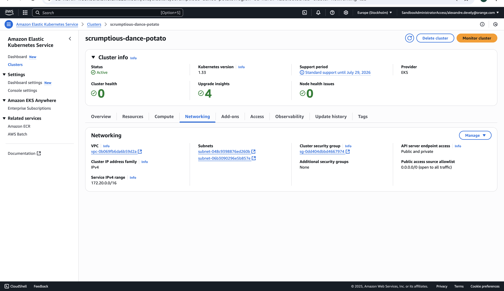
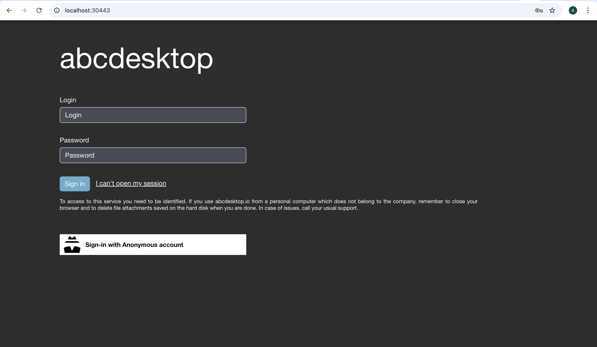
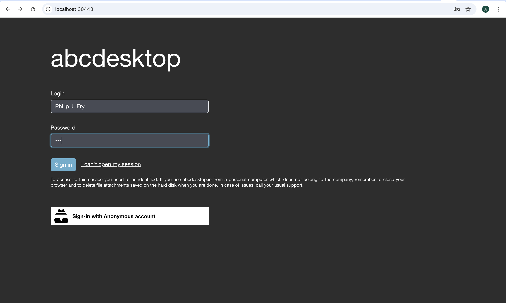
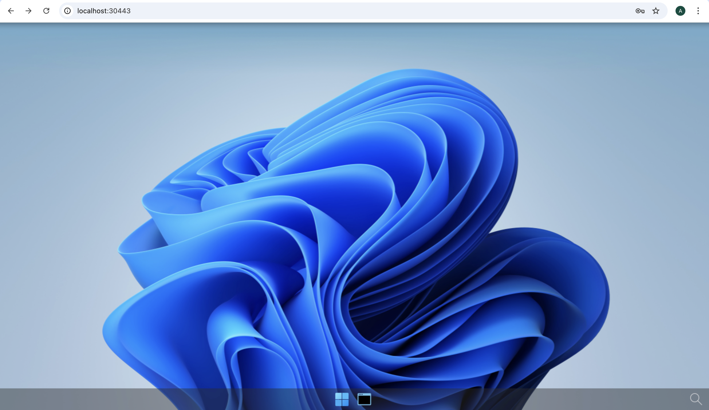
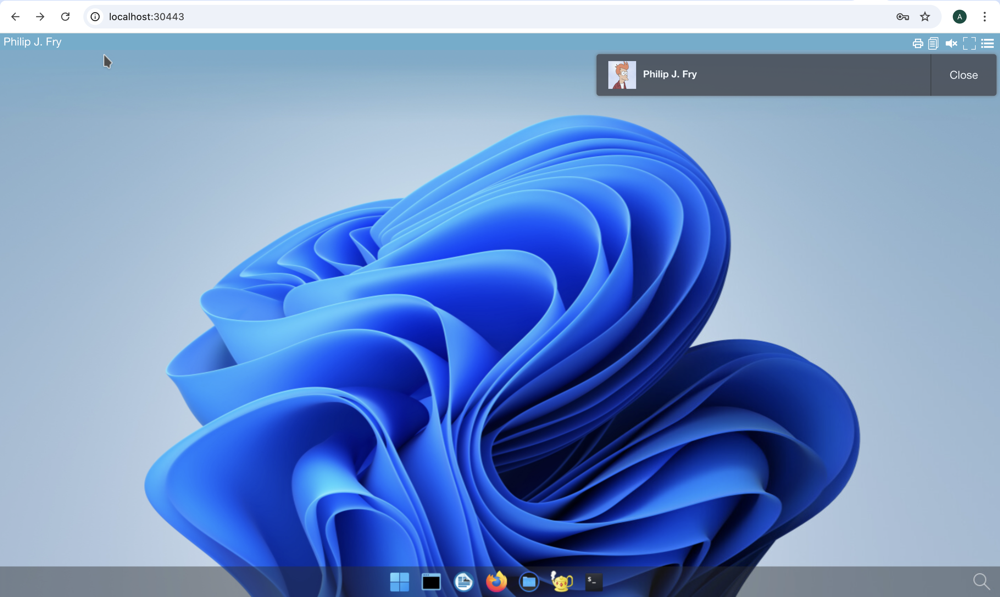
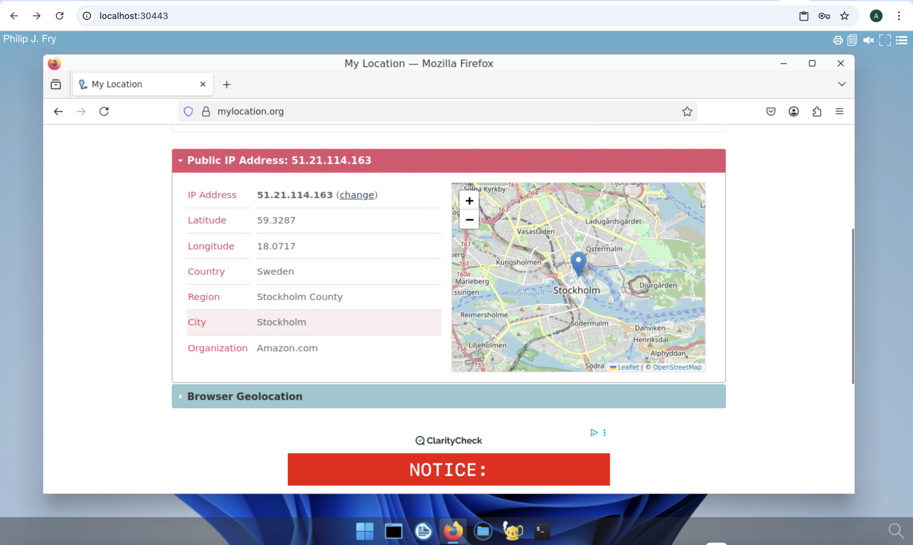

# Deploy abcdesktop on AWS with Amazon Elastic Kubernetes Service

## Requirements

- aws command line interface [aws-cli](https://aws.amazon.com/cli/)
- create an EKS `Amazon Elastic Kubernetes Service` and a VPC with a NAT gateway
> You need a **NAT gateway** to pull images from your nodes to `ghcr.io` public registry. If your kubernetes nodes can't reach `ghcr.io`, you pod will stay in ImagePullBackOff.

- Define the environnement variables `AWS_ACCESS_KEY_ID` `AWS_SECRET_ACCESS_KEY` `AWS_SESSION_TOKEN` You can retrieve credentials as often as needed from your AWS access portal. 


## EKS console overview

This screenshot describes the Amazon Elastic Kubernetes Service console. It shows the `Cluster` and `Networking` informations.




## Check your caller-identity

```
aws sts get-caller-identity
```

I'm using a `SandboxAdministratorAccess` but you can choose others  

``` bash
$ aws sts get-caller-identity
{
    "UserId": "XXXXXXXXXXXXXXXXXXX:user.namee@domain.org",
    "Account": "YYYYYYYYYYYYYYYY",
    "Arn": "arn:aws:ZZZ::ZZZZZZZZZZZZZ:assumed-role/AWSReservedSSO_SandboxAdministratorAccess_ZZZZZZZZZZZZZZZ/user.namee@domain.org"
}
```

## Find your cluster's name

I use `eu-north-1` as my region value

``` bash
aws eks list-clusters --region eu-north-1
{
    "clusters": [
        "scrumptious-dance-potato"
    ]
}
```

## Create your kubernetes config file 

Create your kubernetes config file using the `aws eks update-kubeconfig` command line

``` bash
aws eks update-kubeconfig --region region-code --name my-cluster
```

In this example 

``` bash
aws eks update-kubeconfig --region eu-north-1 --name scrumptious-dance-potato
```

Run a `kubectl` command line like `kubectl cluster-info` command line to make sure that kubeconfig is defined  

``` bash
kubectl cluster-info 
```

## Run the abcdesktop install script 


Download and extract the latest release automatically

```
curl -sL https://raw.githubusercontent.com/abcdesktopio/conf/main/kubernetes/install-4.3.sh | bash
```

To get more details about the install process, please read the [Setup guide](https://www.abcdesktop.io/4.3/setup/kubernetes_abcdesktop/)


## Connect to your abcdesktop service 

By default install script is listening on a free tcp port `:30443` and is using a `kubectl port-forward` command line to reach http web service `:80`

Open your web browser `http://locahost:30443`



 
Login as user `Philip J. Fry` with the password `fry`


 
After image pulling process, you get your first abcdesktop 




## Add applications to your desktop


Using the previous terminal shell, run the application install script 

```
curl -sL https://raw.githubusercontent.com/abcdesktopio/conf/main/kubernetes/pullapps-4.3.sh | bash
```

To get more details about the install applications process, please read the [Setup applications guide](https://www.abcdesktop.io/4.3/setup/kubernetes_abcdesktop_applications/)

Then reload the web page with the desktop of `Philip J. Fry`
New applications are now listed in the dock of `plasmashell`




Start Firefox application

> The first run may involve waiting for the image pulling process to finish

Go to `https://mylocation.org` website to check where your pod is running.




In my case for the region `north-1`, the desktop is located near `Stockholm` city in `Sweeden`.


