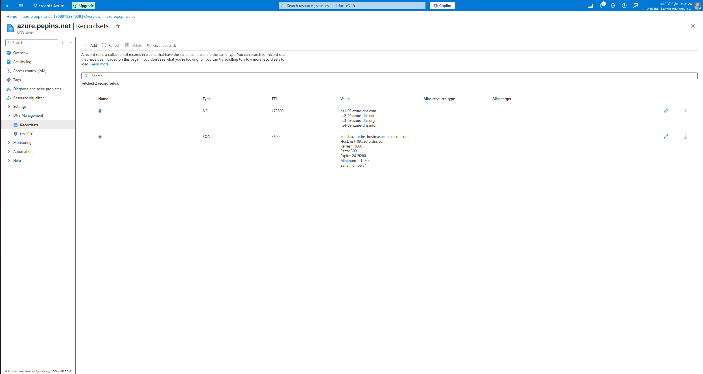
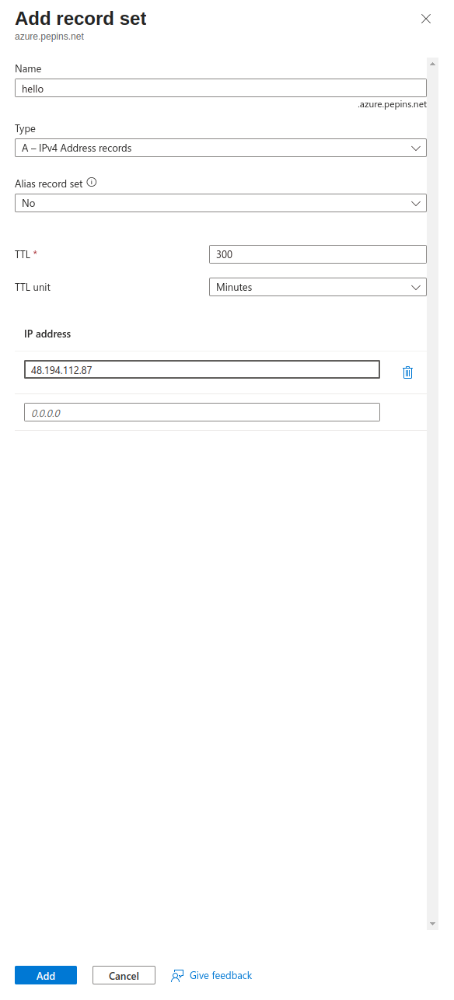
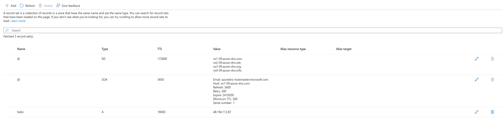
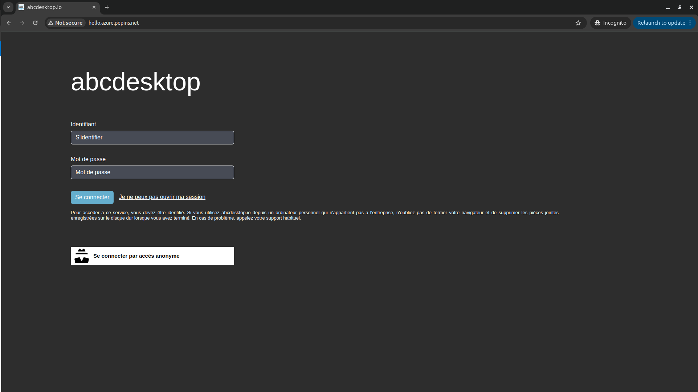

# Publish your website as a public secured service


## Requirements


- read the previous chapter [Deploy abcdesktop on Azure with Kubernetes](azure) 
- `az` command line interface [azure-cli](https://learn.microsoft.com/en-us/cli/azure/install-azure-cli?view=azure-cli-latest) installed.
- A running AZURE Kubernetes service cluster `ready` and running. 
- your own internet domain
- `kubectl` command line
- `wget` command line


## Overview

In this chapter we are going to, use a `loadBalancer` to host your abcdesktop service with a public IP Address, then configure dns zone file to use your domain name, and activate TLS to secure your service.
 

## Create a new `http-router` service yaml file


The default install define the `http-router` service with as `nodePort` type. We are going to update the `http-router` service with a `LoadBalancer` type.

Create a file named `http-router.yaml`

```
kind: Service
apiVersion: v1
metadata:
  name: http-router
  labels:
    abcdesktop/role: router-od
  annotations:
    service.beta.kubernetes.io/azure-load-balancer-health-probe-request-path: "/healthz"
    service.beta.kubernetes.io/port_80_health-probe_port: "80"
    service.beta.kubernetes.io/port_443_health-probe_port: "443"
spec:
  type: LoadBalancer
  selector:
    run: router-od
  ports:
  - protocol: TCP
    port: 443
    targetPort: 443
    name: https
  - protocol: TCP
    port: 80
    targetPort: 80
    name: http
```

Save your `http-router.yaml` file

Delete the previous service `http-router`

```
kubectl delete service http-router -n abcdesktop
service "http-router" deleted
```

Create your new `service/http-router`

```
kubectl apply -f http-router.yaml -n abcdesktop
service/http-router created
```

Wait for few minutes, the `EXTERNAL-IP` of service `http-router` stays in `Pending` state

```
kubectl get services http-router -n abcdesktop 
```

```
NAME          TYPE           CLUSTER-IP     EXTERNAL-IP   PORT(S)                      AGE
http-router   LoadBalancer   10.0.165.172   <pending>     443:32562/TCP,80:30224/TCP   4s
```

Check the EXTERNAL-IP of service `http-router` again

```
kubectl get services http-router -n abcdesktop       
```

> Great the service gets `48.194.112.87` as an `EXTERNAL-IP`

```      
NAME          TYPE           CLUSTER-IP     EXTERNAL-IP     PORT(S)                      AGE
http-router   LoadBalancer   10.0.165.172   48.194.112.87   443:32562/TCP,80:30224/TCP   22s
```

You can open a web browser to reach your abcdesktop service with the IP address


Web browser doesn't allow usage of websocket without secure protocol. To login you need `https` protocol


## Update your DNS zone file 


We will use a `FQDN` (Fully Qualified Domain Name) to replace the `IP Address`.




This screenshot describes the Microsoft Azure network console. It shows the `Domain` informations, but your can manage your zone file from your own registrar.

### Create new record

We are going to create a new record `hello` (`hello.azure.pepins.net`) to the `A` address `48.194.112.87`. I prefer to define low `TTL` value to fix some changes quickly. 

The IP Address is show by the Microsoft Azure network console, it is the same address as the `EXTERNAL-IP` of your `http-router` service.

```
kubectl get services http-router -n abcdesktop
NAME          TYPE           CLUSTER-IP     EXTERNAL-IP     PORT(S)                      AGE
http-router   LoadBalancer   10.0.165.172   48.194.112.87   443:32562/TCP,80:30224/TCP   22s
```



Press `Add` button, to update your zone file with the new record



From your local device, you can open a web browser




Web browser doesn't allow usage of websocket without secure protocol. To login you need `https` protocol.

As you can see, your website is `Not Secured`, we are going to add X509 SSL certificate to secure your service.


## Obtain a certificat 

If you already have a X509 certificat with a private and public certified key files for your web site, you can skip this chapter.

To create you SSL certificat, we are using let's encrypt service. You need your new hostname and your email address

Define the new variables `ABCDESKTOP_PUBLIC_FQDN` and `USER_EMAIL_ADDRESS` 


``` bash
ABCDESKTOP_PUBLIC_FQDN=hello.azure.pepins.net
USER_EMAIL_ADDRESS=thisisyouremail@domain.com
ROUTER_POD_NAME=$(kubectl get pods -l run=router-od -o jsonpath={.items..metadata.name}  -n abcdesktop)
kubectl exec -n abcdesktop -it ${ROUTER_POD_NAME} -- /usr/bin/certbot certonly --webroot -w /var/lib/nginx/html -d ${ABCDESKTOP_PUBLIC_FQDN} -m "${USER_EMAIL_ADDRESS}" --agree-tos -n
```

You should read on stdout

```
Saving debug log to /var/log/letsencrypt/letsencrypt.log
Account registered.
Requesting a certificate for hello.azure.pepins.net

Successfully received certificate.
Certificate is saved at: /etc/letsencrypt/live/hello.azure.pepins.net/fullchain.pem
Key is saved at:         /etc/letsencrypt/live/hello.azure.pepins.net/privkey.pem
This certificate expires on 2026-04-20.
These files will be updated when the certificate renews.

NEXT STEPS:
- The certificate will need to be renewed before it expires. Certbot can automatically renew the certificate in the background, but you may need to take steps to enable that functionality. See https://certbot.org/renewal-setup for instructions.

- - - - - - - - - - - - - - - - - - - - - - - - - - - - - - - - - - - - - - - -
If you like Certbot, please consider supporting our work by:
 * Donating to ISRG / Let's Encrypt:   https://letsencrypt.org/donate
 * Donating to EFF:                    https://eff.org/donate-le
- - - - - - - - - - - - - - - - - - - - - - - - - - - - - - - - - - - - - - - -
```

The files `fullchain.pem` and `privkey.pem` are located inside the container. 

```
Certificate is saved at: /etc/letsencrypt/live/hello.azure.pepins.net/fullchain.pem
Key is saved at:         /etc/letsencrypt/live/hello.azure.pepins.net/privkey.pem
```

We export the files and create a new secrets. 


```
kubectl exec -n abcdesktop -it  ${ROUTER_POD_NAME} -- cat /etc/letsencrypt/live/$ABCDESKTOP_PUBLIC_FQDN/fullchain.pem > fullchain.pem
kubectl exec -n abcdesktop -it  ${ROUTER_POD_NAME} -- cat /etc/letsencrypt/live/$ABCDESKTOP_PUBLIC_FQDN/privkey.pem > privkey.pem
```


## Create a secret for X509 certificat


Create a secret named `http-router-certificat` with the `fullchain.pem` and `privkey.pem` file content

```
kubectl create secret tls http-router-certificat --cert=fullchain.pem --key=privkey.pem -n abcdesktop 
```

You secret is created 

```
secret/http-router-certificat created
```


## Update `http-router` ConfigMap to use the new `http-router-certificat` secret

Download [abcdesktop-routehttp-config.4.2.yaml](https://raw.githubusercontent.com/abcdesktopio/conf/refs/heads/main/kubernetes/abcdesktop-routehttp-config.4.2.yaml) file 

```
wget https://raw.githubusercontent.com/abcdesktopio/conf/refs/heads/main/kubernetes/abcdesktop-routehttp-config.4.2.yaml
```

Open your `abcdesktop-routehttp-config.4.2.yaml` file, look for the ConfigMap `abcdesktop-routehttp-config`.

Remove the comments to enable https and change the value `YOUR_SERVER_NAME_AND_DOMAIN` by your own value. 

```
 # nginx server config
 server {
     ...
     
     ######
     # uncomment this to enable https
     #
     listen 443 ssl http2 default_server;
     listen [::]:443 ssl http2 default_server;
     server_name YOUR_SERVER_NAME_AND_DOMAIN; # change this too
     ssl_certificate     /etc/nginx/ssl/tls.crt;
     ssl_certificate_key /etc/nginx/ssl/tls.key;
     #
     # end of https section
     ######
     
     ...
     index index.html index.htm;
```

For example

```
     listen 443 ssl http2 default_server;
     listen [::]:443 ssl http2 default_server;
     server_name hello.azure.pepins.net;
     ssl_certificate     /etc/nginx/ssl/tls.crt;
     ssl_certificate_key /etc/nginx/ssl/tls.key;
```

Apply your new nginx confguration file

```
kubectl apply -f abcdesktop-routehttp-config.4.2.yaml -n abcdesktop
```
 
## Update `deployment` http-router
 
Update the `deployment` route to add certificat ssl entry

The `abcdesktop-deployment-routehttps.4.2.yaml` file  adds `mountPath: /etc/nginx/ssl` to `secretName: http-router-certificat`

```
kubectl apply -f https://raw.githubusercontent.com/abcdesktopio/conf/refs/heads/main/kubernetes/abcdesktop-deployment-routehttps.4.2.yaml -n abcdesktop
```

## Reach your website using `https`protocol 

You can now connect to your abcdesktop desktop pulic web site using `https` protocol. 


The status is secured and we get some informations from the certificate


 
 
