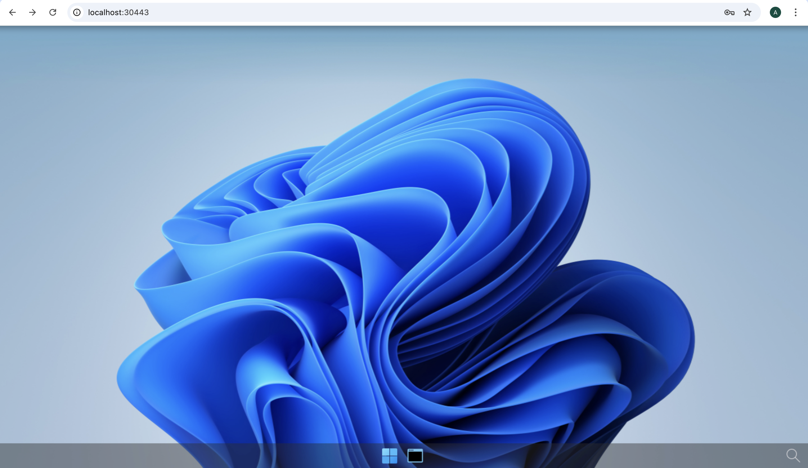

# Deploy abcdesktop on AZURE with Microsoft AZURE Kubernetes services


## Requirements

- `az` command line interface [azure-cli](https://learn.microsoft.com/en-us/cli/azure/install-azure-cli?view=azure-cli-latest) installed.
- you need your `Azure Subscription Name`, your `Username` and `Password`
- A running AZURE Kubernetes service cluster `ready` and running. 

## AZURE console overview

Create a new `AZURE Kubernetes service`. 


> Options and features are set by default.

In this example the kubernetes cluster is named `abcdesktopkubernetescluster`.
This screenshot describes the AZURE Kubernetes Service console. It shows the `Nodes pools` and `Networking` informations.


## Check your caller-identity

If you don't have already done it, use the `az login` command line

```
az login
```

The next steps are running on your web browser with your own credentials.  


## Set your `subscription` to your azur account 


``` bash
az account set --subscription XXXXXX-YYYYY-ZZZZZ-AAAA-BBBBBBBBBB
```

## Create your kubernetes config 

``` bash
az aks get-credentials --name MyManagedCluster --overwrite-existing --resource-group MyResourceGroup
``` 

For example 

- `resource-group`: abcdesktop
- `name`: abcdesktopkubernetescluster

``` bash
az aks get-credentials --resource-group abcdesktop --name abcdesktopkubernetescluster --overwrite-existing
```

## Get your kubernetes cluster informations

Run the `kubectl cluster-info` command line, to confirm that `kubectl` command can communicate whith your azur cluster

``` bash
kubectl cluster-info
```

``` bash
Kubernetes control plane is running at https://abcdesktopkubernetescluster-dns-rm7w2mot.hcp.northeurope.azmk8s.io:443
CoreDNS is running at https://abcdesktopkubernetescluster-dns-rm7w2mot.hcp.northeurope.azmk8s.io:443/api/v1/namespaces/kube-system/services/kube-dns:dns/proxy
Metrics-server is running at https://abcdesktopkubernetescluster-dns-rm7w2mot.hcp.northeurope.azmk8s.io:443/api/v1/namespaces/kube-system/services/https:metrics-server:/proxy

To further debug and diagnose cluster problems, use 'kubectl cluster-info dump'.
```

## Run the abcdesktop install script 


Download and extract the latest release automatically

```
curl -sL https://raw.githubusercontent.com/abcdesktopio/conf/main/kubernetes/install-4.3.sh | bash
```

To get more details about the install process, please read the [Setup guide](https://www.abcdesktop.io/4.3/setup/kubernetes_abcdesktop/)


## Connect to your abcdesktop service 

By default install script is listening on a free tcp port `:30443` and is using a `kubectl port-forward` command line to reach http web service `:80`

Open your web browser `http://locahost:30443`


 
Login as user `Philip J. Fry` with the password `fry`


 
After image pulling process, you get your first abcdesktop 




## Add applications to your desktop


Using the previous terminal shell, run the application install script 

```
curl -sL https://raw.githubusercontent.com/abcdesktopio/conf/main/kubernetes/pullapps-4.3.sh | bash
```

To get more details about the install applications process, please read the [Setup applications guide](https://www.abcdesktop.io/4.3/setup/kubernetes_abcdesktop_applications/)

Then reload the web page with the desktop of `Philip J. Fry`
New applications are now listed in the dock of `plasmashell`


Start Firefox application

> The first run may involve waiting for the image pulling process to finish

Go to `https://mylocation.org` website to check where your pod is running.  In my case for the region `North Europe`, the desktop is located near `Dublin` city in `Ireland`. 


