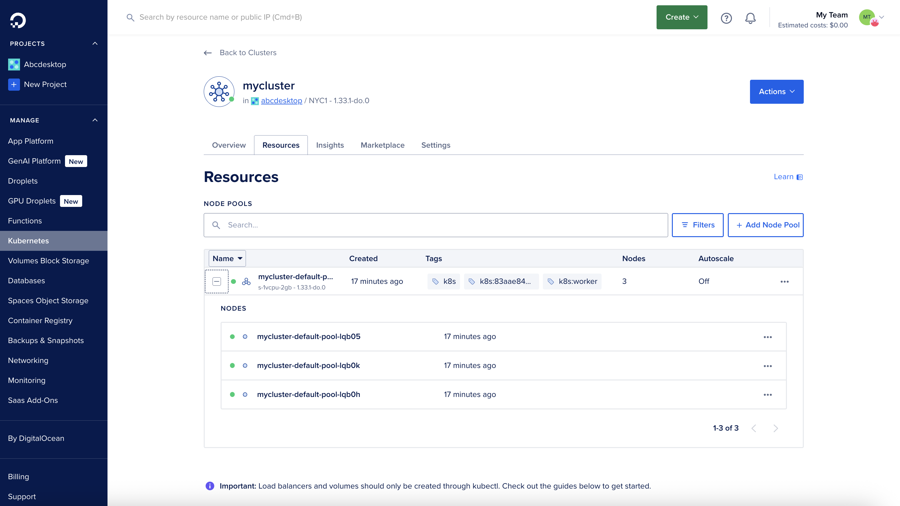
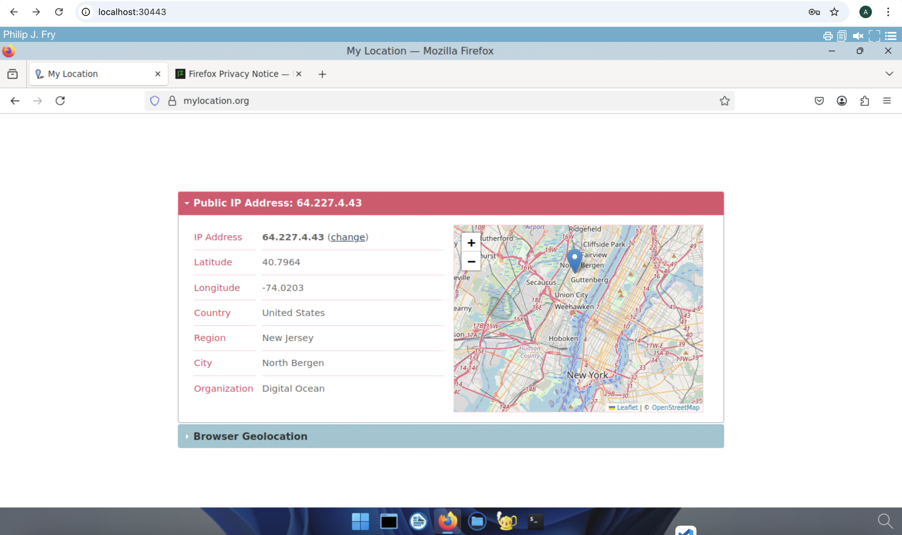

# Deploy abcdesktop on DigitalOcean with Kubernetes

## Requirements

- a DigitalOcean account
- `kubectl` 
- `doctl` command line interface [doctl cli](https://docs.digitalocean.com/reference/doctl/how-to/install/)

> If you `doctl` command line for your first time, run `doctl auth` command line for use with your DigitalOcean account using tokens that you generate in the control panel at [https://cloud.digitalocean.com/account/api/tokens](https://cloud.digitalocean.com/account/api/tokens).

## Create a `DOKS` DigitalOcean Kubernetes cluster

If you don't have a running kubernetes cluster, run the `doctl` command line with the `kubernetes cluster create` to create your cluster.

```
doctl kubernetes clusters create --size s-4vcpu-8gb myabccluster 
```

After few minutes, you get a kubernetes cluster ready

```
Notice: Cluster is provisioning, waiting for cluster to be running
...............................................................
Notice: Cluster created, fetching credentials
Notice: Adding cluster credentials to kubeconfig file found in "/Users/myuser/.kube/config"
Notice: Setting current-context to do-nyc1-myabccluster
ID                                      Name            Region    Version        Auto Upgrade    Status     Node Pools
83aae84d-cfa9-4a89-ae75-89f0d5078d33    myabccluster    nyc1      1.33.1-do.0    false           running    myabccluster-default-pool
```


## DigitalOcean console overview

This screenshot describes the DigitalOcean control panel. It shows the `Resources` of the kubernetes cluster and `Nodes` informations.




## Run the abcdesktop install script 

Download and install the latest release automatically

```
curl -sL https://raw.githubusercontent.com/abcdesktopio/conf/main/kubernetes/install-4.2.sh | bash
```

To get more details about the install process, please read the [Setup guide](https://www.abcdesktop.io/4.2/setup/kubernetes_abcdesktop/)

## Connect to your abcdesktop service 

By default install script is listening on a free tcp port `:30443` and is using a `kubectl port-forward` command line to reach http web service `:80`

Open your web browser `http://locahost:30443`


 
Login as user `Philip J. Fry` with the password `fry`


 
After image pulling process, you get your first abcdesktop 


## Add applications to your desktop


Using the previous terminal shell, run the application install script 

```
curl -sL https://raw.githubusercontent.com/abcdesktopio/conf/main/kubernetes/pullapps-4.2.sh | bash
```

To get more details about the install applications process, please read the [Setup applications guide](https://www.abcdesktop.io/4.2/setup/kubernetes_abcdesktop_applications/)

Then you just need to reload the web page with the desktop of `Philip J. Fry`
New applications are now listed in the dock of `plasmashell`.


Start Firefox application

> The first run may involve waiting for the image pulling process to finish

Go to `https://mylocation.org` website to check where your pod is running.  In my case for the region `nyc1` (New york City 1), the desktop is located near `North Bergen` city in `United States`. 



