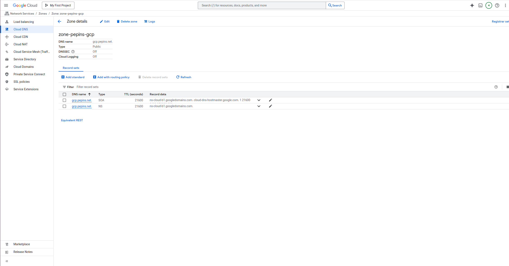
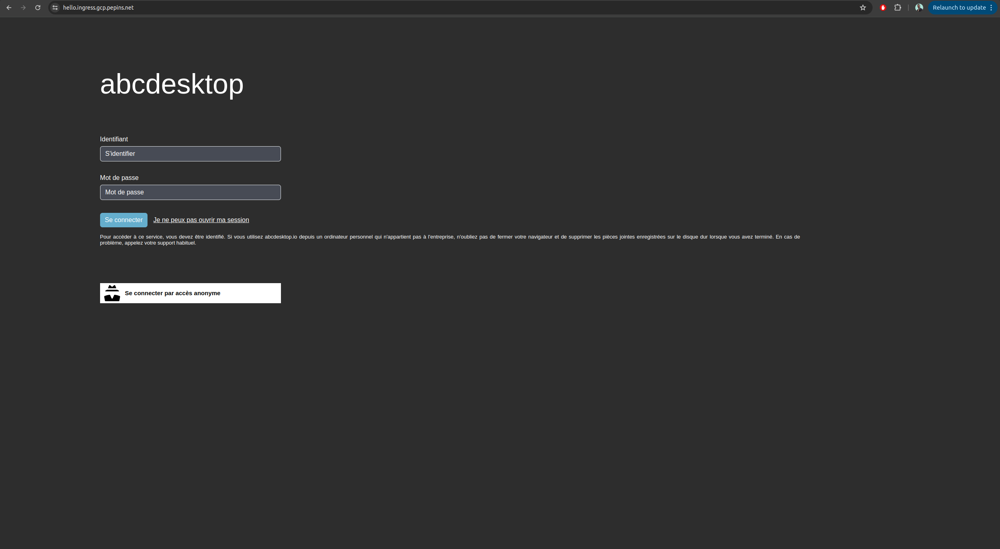
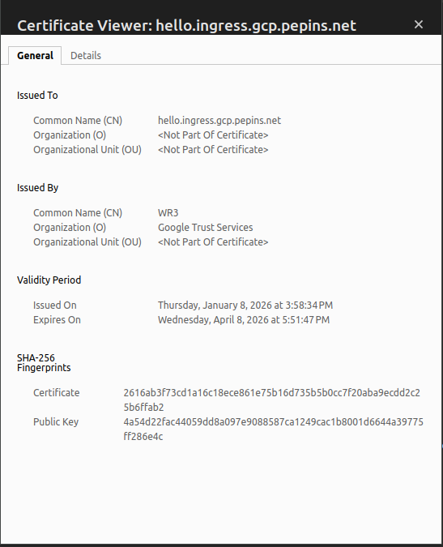

# Publish your website as a public secured service


## Requirements


- read the previous chapter [deploy abcdesktop on GCP with Kubernetes](gcp) 
- a GCP account
- a domain of you own hosted on GCP
- `gcloud` command line interface [gcloud cli](https://docs.cloud.google.com/sdk/docs/install-sdk/)
- `kubectl` command line
- `wget` command line

### To get more informations

- read the google cloud chapter [install-gke-ingress-controller](https://docs.cloud.google.com/kubernetes-engine/docs/concepts/ingress-xlb)

## Overview

In this chapter we are going to, use a `gke-ingress-controller` to host your abcdesktop service with a public IP Address, then configure dns zone file to use your own domain name, and activate TLS to secure your service.

## Set up the GKE Ingress controller

In this example we will use the GKE built-in ingress controller. Before starting you may first need to check if the `HttpLoadBalancing` add-on is enabled on your cluster.  
Go to your cluster page on the GCP console, then `Networking`, you should see `HttpLoadBalancing` as enabled, if not enable it and save your changes.


Create an ingress resource for GKE using the abcdesktop service and save it as `abcdesktop_host.yaml`
You need to update this manifest with your own FQDN, replace `hello.ingress.gcp.pepins.net` by your own values.

```
apiVersion: networking.k8s.io/v1
kind: Ingress
metadata:
  name: ingress-abcdesktop
  namespace: abcdesktop
  annotations:
    kubernetes.io/ingress.class: "gce"
spec:
  rules:
    - host: hello.ingress.gcp.pepins.net
      http:
        paths:
          - path: /
            pathType: Prefix
            backend:
              service:
                name: http-router
                port:
                  number: 80
```

As mentionned in the [GKE ingress documentation](https://docs.cloud.google.com/kubernetes-engine/docs/how-to/load-balance-ingress), you cannot specify a GKE ingress using `spec.ingressClassName`, you must use the `kubernetes.io/ingress.class` annotation. We are using the gce class to deploy an external Application Load Balancer.

Apply the Ingress yaml file

```
kubectl apply -f abcdesktop_host.yaml -n abcdesktop
```

You should read

```
ingress.networking.k8s.io/ingress-abcdesktop created
```


Verify the ingress resources:

```
kubectl get ingress -n abcdesktop
```

The output looks similar to the following:

Wait fee seconds while the `ADDRESS` field is empty  
```
NAME                 CLASS    HOSTS                          ADDRESS   PORTS   AGE
ingress-abcdesktop   <none>   hello.ingress.gcp.pepins.net             80      4s
```

When you obtain an `IP ADDRESS`

```
NAME                 CLASS    HOSTS                          ADDRESS         PORTS   AGE
ingress-abcdesktop   <none>   hello.ingress.gcp.pepins.net   35.190.86.108   80      3m14s
```

In the example above, the ingress resource tells gce to route each HTTP request that is using the / prefix for the `hello.ingress.gcp.pepins.net` host, to the `route` backend service running on port 80. In other words, every time you make a call to http://hello.ingress.gcp.pepins.net/, the request and reply are served by the echo backend service running on port 80.

## Update your DNS zone file 

We will associate your `FQDN` (Fully Qualified Domain Name) to the load-balancer's IP Address.



This screenshot describes the GCP network console. It shows the `Domain` informations, but you can manage your own zone file from your own registrar.

### Create new record

In this example, we are going to create a new record `hello.ingress` (`hello.ingress.gcp.pepins.net`) to the `A` address `35.190.86.108`. This IP Address is the `load-balancer` IP Address.

Press `Add Standard` button, to update your zone file with the new record


Then you should see your record on your domain page 


From your local device, you can open a web browser


> Web browser doesn't allow usage of websocket without secure protocol. To login you need `https` protocol.

As you can see, your website is `Not Secured`, we are going to add X509 SSL certificate to secure your service.

## Enable HTTPS

### Configure Google-managed SSL certificates

To enable HTTPS on our exposed service, we will use Google-managed SSL certificates as it is natively embedded in GCP and works well with a GKE ingress controller.

First you will create a `ManagedCertificate` object, copy the following lines in a `abcdesktop_managed_certificate.yaml` file.

```
apiVersion: networking.gke.io/v1
kind: ManagedCertificate
metadata:
  name: abcdesktop-cert
  namespace: abcdesktop
spec:
  domains:
    - hello.ingress.gcp.pepins.net
```

Then apply it to the cluster.

```
kubectl apply -f abcdesktop_managed_certificate.yaml -n abcdesktop
```

Now, you will have modify the previously created ingress file, and  specify the managed certificate the ingress will use, in the annotations section.


```
apiVersion: networking.k8s.io/v1
kind: Ingress
metadata:
  name: ingress-abcdesktop
  namespace: abcdesktop
  annotations:
    kubernetes.io/ingress.class: "gce"
    networking.gke.io/managed-certificates: "abcdesktop-cert"
spec:
  rules:
    - host: hello.ingress.gcp.pepins.net
      http:
        paths:
          - path: /
            pathType: Prefix
            backend:
              service:
                name: http-router
                port:
                  number: 80                         
```

Then apply it to the cluster to start the certificate generation.

```
kubectl apply -f abcdesktop_host.yaml -n abcdesktop
```

You can check that the provisioning started by running the following command

```
kubectl get managedcertificate -n abcdesktop
NAME                AGE   STATUS
abcdesktop-cert     30s   Provisioning
```

After a few minutes, between 10 and 15, you will see that the status will change from `Provisioning` to `Active`.

```
kubectl get managedcertificate -n abcdesktop
NAME                AGE   STATUS
abcdesktop-cert     12m   Active
```

## Reach your website using `https` protocol 

You can now connect to your abcdesktop desktop pulic web site using `https` protocol. 



The status is secured and we get some informations from the certificate




## Increase ingress connection timeout

By default, GCE type ingress has a connection timeout of 30 seconds, in our case, we doesn't want abcdesktop to drop the connection to our desktop every 30 seconds, so we will have to increase timeout.

Unlike a nginx type ingress, you cannot add annotations to the ingress yaml file to increase timeout value. You instead need to create a `BackendConfig` object that you will link to your routing service.

First copy the following lines in a `backend_config_timeout.yaml`

```
apiVersion: cloud.google.com/v1
kind: BackendConfig
metadata:
  name: long-timeout-backend
  namespace: abcdesktop
spec:
  timeoutSec: 1800
```

Apply it to the cluster

```
kubectl apply -f backend_config_timeout.yaml -n abcdesktop
```

Then you need to create a service that will use this config, copy the following lines in a `http_router_increased_timeout.yaml`

```
apiVersion: v1
kind: Service
metadata:
  name: http-router-proxy
  namespace: abcdesktop
  labels:
    abcdesktop/role: router-proxy
  annotations:
    cloud.google.com/backend-config: '{"ports": {"80":"long-timeout-backend"}}'
spec:
  type: NodePort
  selector:
    run: router-od
  ports:
  ports:
  - protocol: TCP
    port: 443
    targetPort: 443
    name: https
  - protocol: TCP
    port: 80
    targetPort: 80
    name: http
```

This new service has the same logic that the existing http-router service but uses the backend config we just created.  
Apply it to the cluster

```
kubectl apply -f http_router_increased_timeout.yaml -n abcdesktop
```

Finally update your ingress yaml file to link it to the service we just created.

```
backend:
  service:
    name: http-router-proxy 
    port:
      number: 80
```

Now wait a few minutes for GCE to apply the new configuration and reconnect to your desktop, the connection shouldn't drop after 30 seconds anymore.


> NB : By using this method with GKE ingress controller, the reverse proxy does forward the client source IP to your cluster, so there is no additional manipulations to do for that.