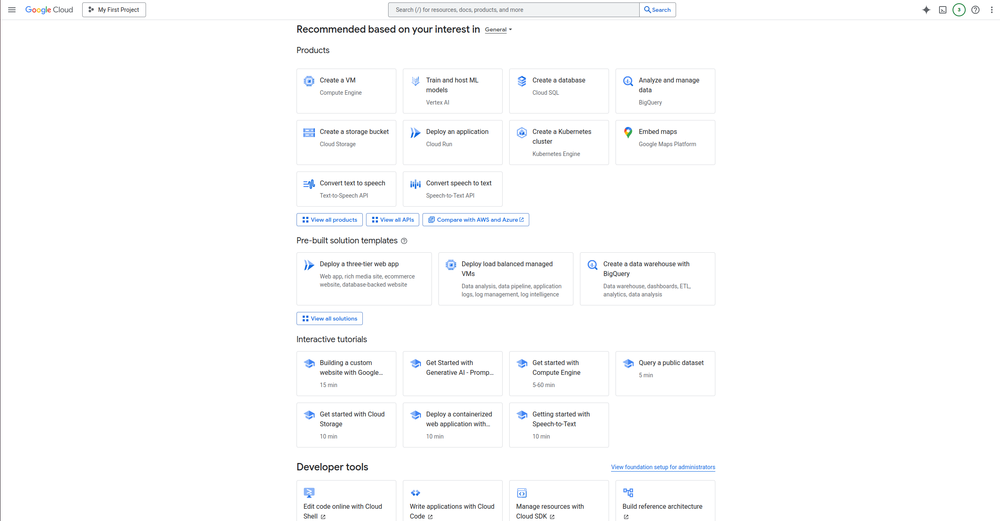
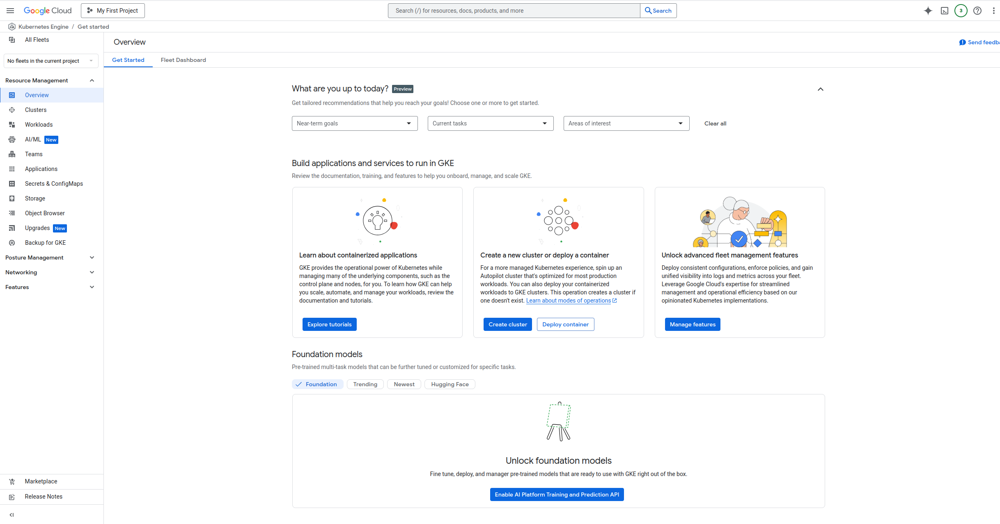
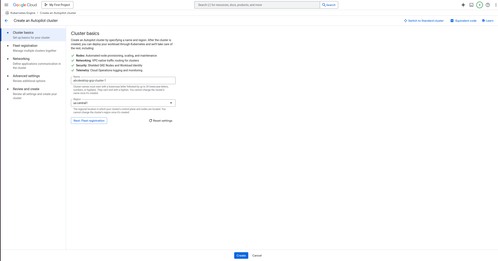
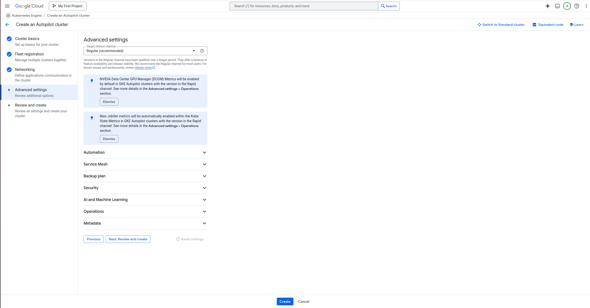
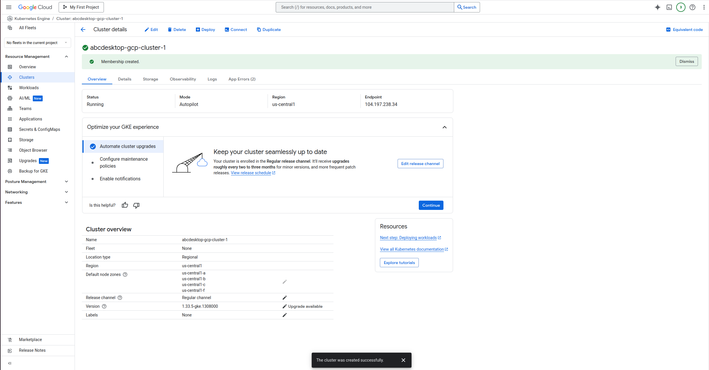
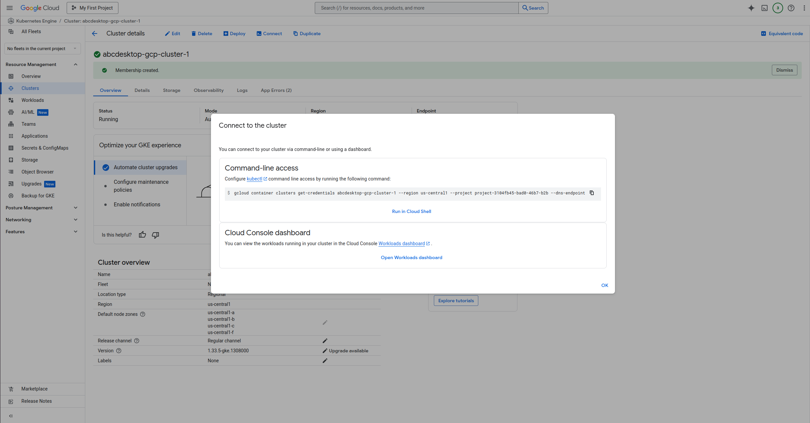

# Deploy abcdesktop on Google Cloud Provider (GCP) with Kubernetes

## Requirements

- a GCP account
- an existing [GCP project](https://developers.google.com/workspace/guides/create-project) 
- `kubectl` 
- `gcloud` command line interface [gcloud cli](https://docs.cloud.google.com/sdk/docs/install-sdk/)

> If you use `gcloud` command line for your first time, run `gcloud auth login` command line to log to toyr GCP account.

## Create a Kubernetes cluster using gcloud cli

First you will need to configure `gcloud` to set your GCP project as current project by running the following command.

```
gcloud config set project <YOUR_PROJECT_ID>
```

Now you can typrune the folllowing command to create your kubernetes cluster

```
gcloud container clusters create abcdesktop-gcp-1 --machine-type=custom-4-8192 --zone=us-central1-a --num-nodes=2
```

If you want more details about the command parameters go the [gcloud container clusters create documentation](https://docs.cloud.google.com/sdk/gcloud/reference/container/clusters/create)

After a few minutes, you get a kubernetes cluster ready

```
Note: Your Pod address range (`--cluster-ipv4-cidr`) can accommodate at most 1008 node(s).
Creating cluster abcdesktop-gcp-1 in us-central1-a... Cluster is being health-checked (Kubernetes Control Plane is healthy)...done.                                                                                                                                              
Created [https://container.googleapis.com/v1/projects/project-3104fb45-bad0-46b7-b2b/zones/us-central1-a/clusters/abcdesktop-gcp-1].
To inspect the contents of your cluster, go to: https://console.cloud.google.com/kubernetes/workload_/gcloud/us-central1-a/abcdesktop-gcp-1?project=project-3104fb45-bad0-46b7-b2b
kubeconfig entry generated for abcdesktop-gcp-1.
NAME              LOCATION       MASTER_VERSION      MASTER_IP      MACHINE_TYPE   NODE_VERSION        NUM_NODES  STATUS   STACK_TYPE
abcdesktop-gcp-1  us-central1-a  1.33.5-gke.1308000  34.172.78.248  custom-4-8192  1.33.5-gke.1308000  2          RUNNING  IPV4
```

## Create a Kubernetes cluster using Google Cloud Console

If you don't have a running kubernetes cluster, connect to your GCP console interface and search for `Create a Kubernetes Cluster`.



You will arrive on the GCP Kubernetes cluster application main page, then click on `Create cluster` and follow the step as shown below.







Now wait a few minutes for your cluster to be ready.



Once your cluster ready, you will need to link the cluster to your local machine in order to drive it. To do so, you will first need to install the `gke-gcloud-auth-plugin` by running the following command

```
gcloud components install gke-gcloud-auth-plugin
```

Then click on the `Connect` button and paste the given command into your terminal



## Run the abcdesktop install script 

Download and install the latest release automatically

```
curl -sL https://raw.githubusercontent.com/abcdesktopio/conf/main/kubernetes/install-4.3.sh | bash
```

To get more details about the install process, please read the [Setup guide](https://www.abcdesktop.io/4.3/setup/kubernetes_abcdesktop/)

## Connect to your abcdesktop service 

By default install script is listening on a free tcp port `:30443` and is using a `kubectl port-forward` command line to reach http web service `:80`

Open your web browser `http://locahost:30443`


 
Login as user `Philip J. Fry` with the password `fry`


 
After image pulling process, you get your first abcdesktop 


## Add applications to your desktop


Using the previous terminal shell, run the application install script 

```
curl -sL https://raw.githubusercontent.com/abcdesktopio/conf/main/kubernetes/pullapps-4.3.sh | bash
```

To get more details about the install applications process, please read the [Setup applications guide](https://www.abcdesktop.io/4.3/setup/kubernetes_abcdesktop_applications/)

Then you just need to reload the web page with the desktop of `Philip J. Fry`
New applications are now listed in the dock of `plasmashell`.


Start Firefox application

> The first run may involve waiting for the image pulling process to finish

Go to `https://mylocation.org` website to check where your pod is running.  In my case for the region `Iowa`, the desktop is located near `Council Bluffs` city in `United States`. 


