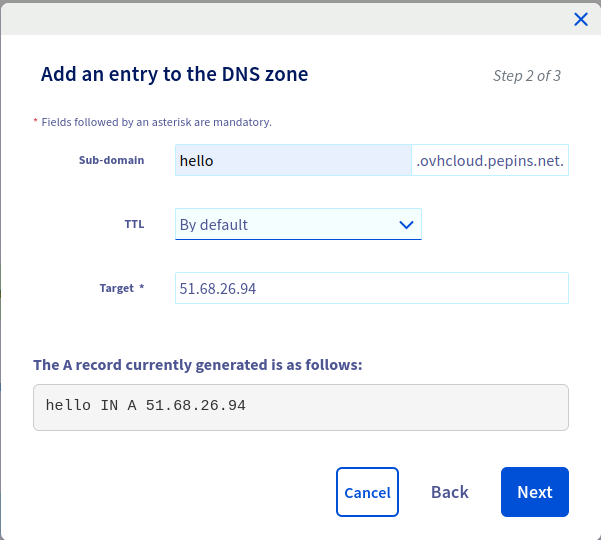
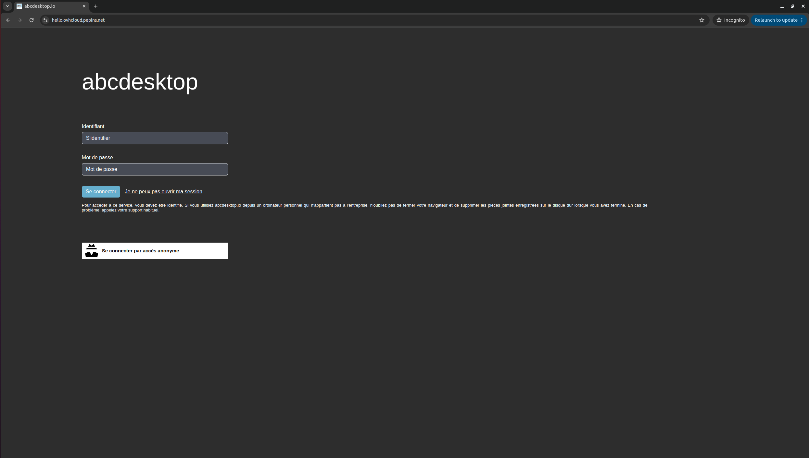
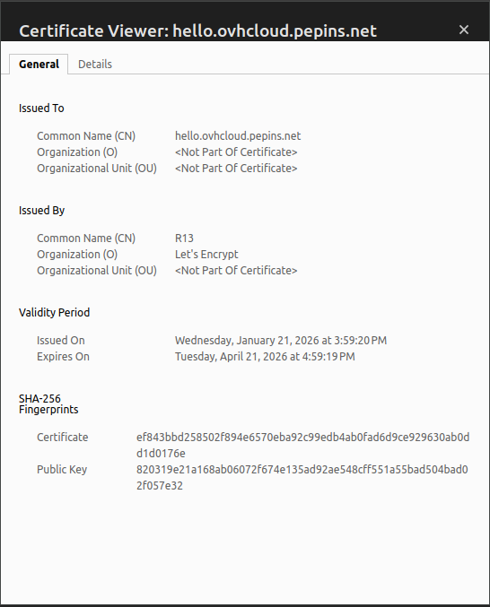

# Publish your website as a public secured service


## Requirements


- read the previous chapter [deploy abcdesktop on OVHcloud with Kubernetes](ovh) 
- an OVHcloud account
- your own internet domain
- `kubectl` command line
- `wget` command line

### To get more informations

- read the OVHcloud chapter [install-nginx-ingress-controller](https://help.ovhcloud.com/csm/en-public-cloud-kubernetes-install-nginx-ingress?id=kb_article_view&sysparm_article=KB0049843)

## Overview

In this chapter we are going to, use a `nginx-ingress-controller` to host your abcdesktop service with a public IP Address, then configure dns zone file to use your own domain name, and activate TLS to secure your service.

## Update http-router service

When installing abcdesktop, http-router service type is `NodePort` by default, in order to expose the service through an ingress controller you will need to change the service type from `NodePort` to `ClusterIP`.

If you perform a get services command you will see the `NodePort` type

``` 
kubectl get svc http-router -n abcdesktop
NAME          TYPE       CLUSTER-IP    EXTERNAL-IP   PORT(S)        AGE
http-router   NodePort   10.0.170.21   <none>        80:30443/TCP   5m31s
```

To change it, you will first need to delete the service

```
kubectl delete service http-router -n abcdesktop
service "http-router" deleted
```

Then paste the following lines in a new `http-router.yaml` file

```
kind: Service
apiVersion: v1
metadata:
  name: http-router
  labels:
    abcdesktop/role: router-od
spec:
  selector:
    run: router-od
  ports:
  - protocol: TCP
    port: 443
    targetPort: 443
    name: https
  - protocol: TCP
    port: 80
    targetPort: 80
    name: http
```

Then Create your new `service/http-router`

```
kubectl apply -f http-router.yaml -n abcdesktop
service/http-router created
```

Now check that the service type is `ClusterIP`

```
kubectl get svc http-router -n abcdesktop
NAME          TYPE        CLUSTER-IP     EXTERNAL-IP   PORT(S)          AGE
http-router   ClusterIP   10.0.132.230   <none>        443/TCP,80/TCP   5s
```

## Deploy nginx ingress controller

You will now deploy a nginx ingress controller on your cluster using `helm`.

First, run the following command to add the nginx ingress controller repository : 

```
helm repo add ingress-nginx https://kubernetes.github.io/ingress-nginx && helm repo update
```

Then install it on your cluster 

```
helm install ingress-nginx ingress-nginx/ingress-nginx --namespace ingress-nginx --create-namespace
```

Once the installation process completed, you can check that the service has been createed by running this command : 

```
kubectl get svc ingress-nginx-controller -n ingress-nginx
NAME                       TYPE           CLUSTER-IP    EXTERNAL-IP   PORT(S)                      AGE
ingress-nginx-controller   LoadBalancer   10.3.74.197   <pending>     80:32649/TCP,443:32195/TCP   12s
```

Now wait a few minutes until you get an `EXTERNAL-IP` 

```
NAME                       TYPE           CLUSTER-IP    EXTERNAL-IP   PORT(S)                      AGE
ingress-nginx-controller   LoadBalancer   10.3.74.197   51.68.26.94   80:32649/TCP,443:32195/TCP   4m34s
```

### Create new record

We are going to create a new record `hello` (`hello.ovhcloud.pepins.net`) to the `A` address `51.68.26.94`. 



Press `Add` button, to update your zone file with the new record


## Configure NGINX Ingress Rules for Backend Services 

In this step, you expose the backend applications to the outside world by telling nginx what host each service maps to. You define a rule in nginx to associate a host to a abcdesktop route backend service.

Create an ingress resource for NGNIX using the abcdesktop service and save it as `abcdesktop_host.yaml`
You need to update this manifest with your own FQDN, replace `hello.ovhcloud.pepins.net` by your own values.

```
apiVersion: networking.k8s.io/v1
kind: Ingress
metadata:
  name: ingress-abcdesktop
  namespace: abcdesktop
spec:
  rules:
    - host: hello.ovhcloud.pepins.net
      http:
        paths:
          - path: /
            pathType: Prefix
            backend:
              service:
                name: http-router
                port:
                  number: 80
  ingressClassName: nginx
```

Apply the Ingress yaml file

```
kubectl apply -f abcdesktop_host.yaml -n abcdesktop
```

You should read

```
ingress.networking.k8s.io/ingress-abcdesktop created
```


Verify the ingress resources:

```
kubectl get ingress -n abcdesktop
```

The output looks similar to the following:

Wait fee seconds while the `ADDRESS` field is empty  
```
NAME                 CLASS   HOSTS                    ADDRESS   PORTS   AGE
ingress-abcdesktop   nginx   hello.ovhcloud.pepins.net             80      5s
```

When you obtain an `IP ADDRESS`

```
NAME                 CLASS   HOSTS                       ADDRESS       PORTS   AGE
ingress-abcdesktop   nginx   hello.ovhcloud.pepins.net   51.68.26.94   80      59s
```


The spec section of the manifest contains a list of host rules used to configure the Ingress. If unspecified, or no rule matches, all traffic is sent to the default backend service. The manifest has the following fields:

- host specifies the fully qualified domain name of a network host, for example echo.`<your-domain-name>`.

- http contains the list of HTTP selectors pointing to backends.

- paths provides a collection of paths that map requests to backends.

In the example above, the ingress resource tells nginx to route each HTTP request that is using the / prefix for the `hello.ovhcloud.pepins.net` host, to the `route` backend service running on port 80. In other words, every time you make a call to http://hello.ovhcloud.pepins.net/, the request and reply are served by the echo backend service running on port 80.

You can have multiple ingress controllers per cluster. The ingressClassName field in the manifest differentiates between multiple ingress controllers present in your cluster. Although you can define multiple rules for different hosts and paths in a single ingress resource.


> Web browser doesn't allow usage of websocket without secure protocol. To login you need `https` protocol.

As you can see, your website is `Not Secured`, we are going to add X509 SSL certificate to secure your service.

## Enable HTTPS

### Deploy Cert Manager on our AKS cluster

As we previously did for the nginx ingress controller, we are going to use `helm` to install cert manager on our cluster.

First add the cert manager helm repository :

```
helm repo add jetstack https://charts.jetstack.io && helm repo update  
```

Then install it on your cluster :

```
helm install \
  cert-manager oci://quay.io/jetstack/charts/cert-manager \
  --namespace cert-manager \
  --create-namespace \
  --set crds.enabled=true
```

Once intalled, you can inspect the Kubernetes ressources created by Cert Manager :

```
kubectl get all -n cert-manager
```

The output looks similar to the following

```
NAME                                           READY   STATUS    RESTARTS   AGE
pod/cert-manager-75bb65b7b9-t8s7n              1/1     Running   0          24s
pod/cert-manager-cainjector-5cd89979d6-x2h7f   1/1     Running   0          24s
pod/cert-manager-webhook-8fc5dcf5f-r6m79       1/1     Running   0          24s

NAME                              TYPE        CLUSTER-IP     EXTERNAL-IP   PORT(S)            AGE
service/cert-manager              ClusterIP   10.3.59.46     <none>        9402/TCP           26s
service/cert-manager-cainjector   ClusterIP   10.3.233.163   <none>        9402/TCP           26s
service/cert-manager-webhook      ClusterIP   10.3.86.148    <none>        443/TCP,9402/TCP   26s

NAME                                      READY   UP-TO-DATE   AVAILABLE   AGE
deployment.apps/cert-manager              1/1     1            1           26s
deployment.apps/cert-manager-cainjector   1/1     1            1           26s
deployment.apps/cert-manager-webhook      1/1     1            1           26s

NAME                                                 DESIRED   CURRENT   READY   AGE
replicaset.apps/cert-manager-75bb65b7b9              1         1         1       25s
replicaset.apps/cert-manager-cainjector-5cd89979d6   1         1         1       25s
replicaset.apps/cert-manager-webhook-8fc5dcf5f       1         1         1       25s
```

The cert-manager pods and webhook service are running.

Cert-Manager creates custom resource definitions (CRDs). Cert-Manager relies on three important CRDs to issue certificates from a Certificate Authority (such as Let’s Encrypt):

Issuer: Defines a namespaced certificate issuer, which allows you to use different CAs in each namespace.

ClusterIssuer: Similar to Issuer, but it does not belong to a namespace and can be used to issue certificates in any namespace.

Certificate: Defines a namespaced resource that references an Issuer or ClusterIssuer for issuing certificates.

Inspect the CRDs by running the following command :

```
kubectl get crd -l app.kubernetes.io/name=cert-manager
```

The output looks similar to the following

```
NAME                                  CREATED AT
certificaterequests.cert-manager.io   2026-01-21T15:54:42Z
certificates.cert-manager.io          2026-01-21T15:54:42Z
challenges.acme.cert-manager.io       2026-01-21T15:54:42Z
clusterissuers.cert-manager.io        2026-01-21T15:54:42Z
issuers.cert-manager.io               2026-01-21T15:54:42Z
orders.acme.cert-manager.io           2026-01-21T15:54:42Z
```

### Configure Production-Ready TLS Certificates for nginx

You can issue the certificate using an Issuer. Configure a certificate issuers resource for Cert-Manager, which fetches the TLS certificate for nginx to use. The certificate issuer uses the HTTP-01 challenge provider to accomplish this task.

Create the following manifest, replace `<your-valid-email-address>` with your own value, and save it as `cert-manager-issuer.yaml` :

```
apiVersion: cert-manager.io/v1
kind: Issuer
metadata:
  name: letsencrypt-nginx
spec:
  acme:
    email: <your-valid-email-address>
    server: https://acme-v02.api.letsencrypt.org/directory
    privateKeySecretRef:
      name: letsencrypt-nginx-private-key
    solvers:
      # Use the HTTP-01 challenge provider
      - http01:
          ingress:
            class: nginx
```

The ACME issuer configuration has the following fields:

email: Email address to be associated with the ACME account.
server: URL used to access the ACME server’s directory endpoint.
privateKeySecretRef: Kubernetes secret to store the automatically generated ACME account private key.

The ingress resources use the HTTP-01 challenge.

```
kubectl apply -f cert-manager-issuer.yaml -n abcdesktop
```

The output looks similar to the following

```
issuer.cert-manager.io/letsencrypt-nginx created
```

Verify that the Issuer resource is created:

```
kubectl get issuer -n abcdesktop
```

The output looks similar to the following

```
NAME                READY   AGE
letsencrypt-nginx   True    7s
```

Next, configure each nginx ingress resource to use TLS. Open the previous `abcdesktop_host.yaml` manifest you created previously for the route application, add the `annotations` and `tls` sections shown below, and save the `abcdesktop_host.yaml` file : You can also add dedicated `nginx.ingress.kubernetes.io` annotations to increase default timeout values. Replace `hello.ovhcloud.pepins.net` by own FQDN

```
apiVersion: networking.k8s.io/v1
kind: Ingress
metadata:
  name: ingress-abcdesktop
  namespace: abcdesktop
  annotations:
   cert-manager.io/issuer: letsencrypt-nginx
   nginx.org/client-max-body-size: "256M"
   nginx.ingress.kubernetes.io/proxy-connect-timeout: "30"
   nginx.ingress.kubernetes.io/proxy-read-timeout: "1800"
   nginx.ingress.kubernetes.io/proxy-send-timeout: "1800"
   nginx.ingress.kubernetes.io/proxy-body-size: "256M"
spec:
  tls:
   - hosts:
     - hello.ovhcloud.pepins.net
     secretName: letsencrypt-nginx-echo
  rules:
    - host: hello.ovhcloud.pepins.net
      http:
        paths:
          - path: /
            pathType: Prefix
            backend:
              service:
                name: http-router
                port:
                  number: 80
  ingressClassName: nginx
```

Run the following command to configure the hosts to use TLS:

```
kubectl apply -f abcdesktop_host.yaml -n abcdesktop
```

After a few minutes, check the state of the ingress object:

```
kubectl get ingress -n  abcdesktop
NAME                 CLASS   HOSTS                       ADDRESS       PORTS     AGE
ingress-abcdesktop   nginx   hello.ovhcloud.pepins.net   51.68.26.94   80, 443   7m
```

You see that 443 appeard in the `PORTS` section.

Check that the certificate resource is created

```
kubectl get certificates -n abcdesktop
```

The output looks similar to the following

```
NAME                     READY   SECRET                   AGE
letsencrypt-nginx-echo   True    letsencrypt-nginx-echo   3m27s
```

Run a simple curl command line `curl -Li https://hello.ovhcloud.pepins.net/` to confirm that your secured abcdesktop service is running.

```
curl -Li https://hello.ovhcloud.pepins.net/
HTTP/2 200 
date: Wed, 21 Jan 2026 15:58:28 GMT
content-type: text/html
content-length: 56291
vary: Accept-Encoding
last-modified: Tue, 20 Jan 2026 12:19:32 GMT
etag: "696f72d4-dbe3"
accept-ranges: bytes
x-frame-options: SAMEORIGIN
x-xss-protection: 1; mode=block
strict-transport-security: max-age=31536000; includeSubDomains

<!doctype html>
...
```

## Reach your website using `https` protocol 

You can now connect to your abcdesktop desktop pulic web site using `https` protocol. 



The status is secured and we get some informations from the certificate

