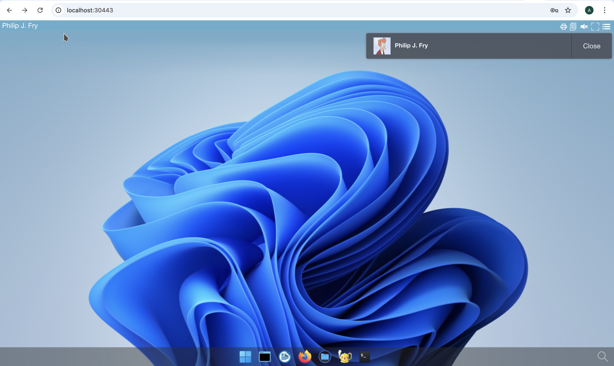

# Deploy abcdesktop on OVHcloud with Kubernetes services


## Requirements

- An OVHcloud account
- `kubectl` command line 

## OVHcloud console overview

Create a new `Kubernetes cluster`. 


> Options and features are set by default.

In this example the kubernetes cluster is named `abcdesktop-ovh-1`.
This screenshot describes the OVHcloud Kubernetes service console.


## Create your kubernetes config 

As there is no command line tool that allows us to connect our local machine to the cluster. You will have to manually copy the kubeconfig file.

Go to your cluster on the OVHcloud console


Then click on `Copy kubeconfig` and paste its content in a new `ovh-kubeconfig.yaml`, it should look like this

```
apiVersion: v1
clusters:
- cluster:
    certificate-authority-data: LS0tLS1CRUdJTiBDRVJUSUZJQ0FURS0tLS0tCk1JSUZCRENDQXV5Z0F3SUJBZ0lCS2pBTkJna3Foa2lHOXcwQkFRc0ZBREFSTVE4d0RRWURWUVFEREFZeGRtVjAKTWpZd0hoY05Nall3TVRJeE1UQXpPRFEyV2hjTk5ERXdNVEUzTVRBek9EUTJXakFSTVE4d0RRWURWUVFEREFZeApkbVYwTWpZd2dnSWlNQTBHQ1NxR1NJYjNEUUVCQVFVQUE0SUNEd0F3Z2dJS0FvSUNBUURxUDJGOFdRUUZVUmRLClhDSDZ3Wm4zTGxKNW9sMW4vVWV4ais0b2xyVzV0QUNydCt6Y3pzZzF6YlNpV1NENFl2WVBNVFA5dXhiaTNPWFMKNUtHbWVuanVobWhPWXFLRkVlcVg0VkNBNnlzZ0l5Q2tvL2F4QXFzWGNERGFneXdpbVZXNisrRWV2QmFVbEFpcwpROXdRQmdNdGJKUm5qRFMwaXd2NjZZQXd5aCtCdE5JeFcwQ3IwSS93NG1aUjQ0Z3Z5SVc3YVBNQVpFVXV0L2hSCmljUzNNTlZvbnRjalFVcG1OODgvUW1QeVBhRGdpQ21rM3NsRzZBN1ZqWGZoeUFZVmpqQVgzMk02SUxFTkF6bm0KVFVleTJRVmRIRDl6ZVlEU3c5a01BQUp0UEVsZGhwSEdjSXpmcGo3bVVCQ1M0OEFxUUJxQ3pIQitIa05ueVpIVApSZnE2SXNRbTdsK3FQTk5ubnk0QkJDSVlUZTRnM0JEK25RaVB2TEdIRmNkQU5EekF1OXQzYXhoWWNwUXAydmQxCktOKyt5cVhxUzM3UURmTUswdDVMYWJIMC8yT2dyYWh4MXZscjZNcmN4dk9ZT3lKdllDWlJZeUpNUXc5QjZycUMKbk5oTFRmOVJVS0RHV09DQUVwcExCc3pYdjlLSVQrRlpvVTFoNFdFendmVWpXN2pPYXE5bG96Y1ZHc2ZLUUI0Swp1V0VmNHQ5QWhvRnp1OUkvWkUydGlFdEJqdjc3QVNvQXBFcG5UL01tZTN3WEJWNnMrdlozMG1jZTBhakRPUEp0CkphMno1M1JndWFCN25mbVpKTmptSzdKQnBuNC9NTmVoUnJEYzJQWmhwNzgrcTlDWjBQYVRFWjFOK2hUcWl4YTAKNEhIa3JldkNMVGh0SFdLSUk3WHRJVzB6Qk10ZUV3SURBUUFCbzJjd1pUQVBCZ05WSFJNQkFmOEVCVEFEQVFILwpNQTRHQTFVZER3RUIvd1FFQXdJQkJqQWRCZ05WSFE0RUZnUVUzaGduU1NwaEE2ZVJXRjZhU0dxZC9paUxhSlF3Ckl3WURWUjBqQkJ3d0dxRVZwQk13RVRFUE1BMEdBMVVFQXd3R01YWmxkREkyZ2dFcU1BMEdDU3FHU0liM0RRRUIKQ3dVQUE0SUNBUUNFWHBSdlA4N1ZGanB4YWxjbkZhWjdvV3RBUU1MVDYrTEM5NFk4LzVSM3hkZ0tSblB4aW1QMQpPNk9BbHp5TEV2T2w2L004TWhNUk9iVFFhZ0RGOHlXeWI3VlNhdXNsd1d0eGtac1BuaVp1bmNPL1VxVzE0N2JBCnVHWHlQSWtBbmZIcTBialFiRmJWUWUrRTZuUUt3a1g5eDNIY1RyV1A4NDNFbkFsNkF3TEdtVjBlY29kSldYdk4KcnQwejZvUkxwMXEzRWZUT0JBblh5Z1JmSlhCenkwKzBHMFZPRnNYa01TTFZLVGpFNDYxUnZvb0oyRG9pMDVJUgpaV3hxTEpUS0lPTHdIM21ROEJIYzJncXN6MjhkYmgzdU52emp5djZLYmZDUW5wQ3FBNDNHMG0yN0Z0d3FMWjhJCjZoMFB0eHVwQTRpN3FJRVhzK0tsaDdPcWZKVHNBVjZuc2V1Zkp4VmM5UnAxRnRWMXJ6Tm00SHI2dzV0Z3A3ZkcKMkR3YVNKM01MYkVDb3NHWVVoMGhzOFFGWlJlelcxM2ZSNVdneHFDR1ZPc2JFQm9VaDZBNEF3RThDTnl0bDJQRgowc21XZzRiV2szTk55RnQwSGpkWUFYQ1dwVUhlSGwrMkc2TVBkcSthNDh5azcySXRyZ3lScUpWZDRQTlBkaDFWCmU5NkRxVGRjdUpHd0NCNWhMNnNPSG9TbC9KT0ZnVk1xTllaelY3S0Vaci9SdjhYQzAyaGFJMTRjbmRzejJRVmEKc3BJNURRUzJSakhoV0cwMUxFaVRudGMrN1ZBU3FHUSthQlVyNjMzNHFkSXJPb3FyWGZyZWZUZmt4R0wyZTRBbwpjcWdTSDBBRlpZRVhiMHBUMU9uVVgzaUx5U0FEYnBRVUVHYkFvWkRhY2psNDhXRUgrdG1jS2c9PQotLS0tLUVORCBDRVJUSUZJQ0FURS0tLS0tCg==
    server: https://1vet26.c1.waw1.k8s.ovh.net
  name: abcdesktop-ovh-1
contexts:
- context:
    cluster: abcdesktop-ovh-1
    user: kubernetes-admin-abcdesktop-ovh-1
  name: kubernetes-admin@abcdesktop-ovh-1
current-context: kubernetes-admin@abcdesktop-ovh-1
kind: Config
preferences: {}
users:
- name: kubernetes-admin-abcdesktop-ovh-1
  user:
    client-certificate-data: LS0tLS1CRUdJTiBDRVJUSUZJQ0FURS0tLS0tCk1JSUZSRENDQXl5Z0F3SUJBZ0lCS2pBTkJna3Foa2lHOXcwQkFRc0ZBREFSTVE4d0RRWURWUVFEREFZeGRtVjAKTWpZd0hoY05Nall3TVRJeE1USXlNalUyV2hjTk5ERXdNVEUzTVRJeU16VTJXakEwTVJrd0Z3WURWUVFEREJCcgpkV0psY201bGRHVnpMV0ZrYldsdU1SY3dGUVlEVlFRS0RBNXplWE4wWlcwNmJXRnpkR1Z5Y3pDQ0FpSXdEUVlKCktvWklodmNOQVFFQkJRQURnZ0lQQURDQ0Fnb0NnZ0lCQU55UW9XRkZFZlpNZmVHa1FwS0tMeXN1a0w5SkFYVGgKOHlvbG90ZzhIK2JWdStkU2Fhb2dUYWt6UlR0bmlRSmpMd2R5bVpOVWJQWExwTS9zUVg3RWhmaHZRQk9zbnVOZwp0c1g2Y1RYQVY1RFhMTWJCTjVZeFcyN1VCOEoySUg0aHNJQ0J2SDd0NDhnNGVyN0tpQkVTWFpZWUxOUWdwSndqCkRMVUdKcXdIaCtPSXlQdFo2K2Y3N09tSUhvWmx1UFoxME5teUpZdWVPd3lMWnJhK0hhYnJhUGJUQk5FRUxZN1EKUllGMXd0THJHbFMybGR0V0NEYU4xZTZQL1BIT0k1bkRNUnFqZ0xWd21pQjhhVmUxMmc5OWNob3hUTFJ5NU1YOQpmRWdsNWtwY3lmdXN2akFtOTZSdHZtT2pwYU12YWlCRi9WdFlsa3Y3S0V1UzZLSlR2NmZzc3Rsem5yVHhOekxNCmVKUzBtaWJUbUJIdVBrT2FpK0xxOGx4TDhzYTZKRGhiMXM1SU04ZVFpdS9Ba0VSYmg5OGxiUnROREcwRVFVTWUKeVI5NE45WktPNm1IQjJHdlRQbGp3Nml2ZjdJMUxiUkNLb1JYbU1ZZTdqTUl6a09DVDh2TE9DY2tRbHhJK2Z0TApKU0pKTEp5TitVNzU0M05MSUgvV3dpL2lRZXo0TmU4cGpOOWVrOFdBT0hRS05xZzhlTUFlSk5pS1MvNGNhOVU1CnoyYW0rcWJJWnpDeE1DeW1BVUk1Tyt2dzdtQ0xsTEVEKzBBRlQ3S3ZIbFRVNkp5b01Fb3dLUzdqZlN6RWx0RncKQzlHMFJpcVlSYkF5ZEhJY0N2amJTMVllc0ljZkJ1Zk53MjRHRnZMMXR5OCtya3JLNldaN2dQODhIdU8yNGp4dgp1blNVUy9ZNTRLQ3pBZ01CQUFHamdZTXdnWUF3REFZRFZSMFRBUUgvQkFJd0FEQU9CZ05WSFE4QkFmOEVCQU1DCkJhQXdJQVlEVlIwbEFRSC9CQll3RkFZSUt3WUJCUVVIQXdFR0NDc0dBUVVGQndNQ01CMEdBMVVkRGdRV0JCUWUKdnBYdHpreWNuRk53N1U5VXlySHB5ZjFLdXpBZkJnTlZIU01FR0RBV2dCVGVHQ2RKS21FRHA1RllYcHBJYXAzKwpLSXRvbERBTkJna3Foa2lHOXcwQkFRc0ZBQU9DQWdFQVlGQ1IwdUljeFZIMm9QSmFVSzdOV1FMQk5iMURuN2ROCnFwTWluRld3ZVV2WVUwRit4RU9NTXBsZk9XZU51aGhLUm9HaVhIZk1NS21kMVFSMHN5QllmWS9mYkp2S3pTRUkKSzliQ25pTUFjb2xLWTd3VDd3NVR3RnBTb29xZlpJNVdDRTdIMDZuRDlBdnFqWWdZRUhBNm10YzgyaEJYUHJaUQp0am1wbUxPckUzSVArT1BrVDI2dWlsa0FyS0VTSGlFSVFmNzdvKzdQUWRqQUtzS0JTVHB5TmovS0NSY1lXdmpECmdURjNMQzhMSVR2SXgzQUJEenJuSEpxSTMvemYyREZzN1U0V0h1eW56ZTJRTWI0VFdGWkhScitZQzQrVzRuUlAKQ3JzM3Y4N2tQNFF1ZUVYNy82NDdHenlGWk1FOC9HYVlkVWRhMmFwU0hhZVlNN0RWYWQ4LzlGbkRvcFA3c0F2egovTmhicHBwYVR6NmFJZGVGdWxwVU9WNFFpK0JnMDVGM0lYYy8xNVk4eTR4eVB6U2FjbnVmY3NoMVFUaFZxbU9vCkR6bWNTR2Zkc2pyYVBoVUVrY3ZTbDZwRWpZOExNK3dDakNWMGdERFpWWXp0cjk0VDJ3ZkR6SkFtMFR0ekF5emUKRkFvYXhYK3hiWENTNUQyZUZGMTg3RWJnMkUyaHM0eElLTUJBM09rVHpnVmtZUU01VDhYYXYxOUxVWnhkeklHOAp1UUk5S09aN0RjejBtZHRLUHlpZFo1S2pvRjM5V3ZWamdyN3JwM0xKekZtb25LR0FST1I1RW54VUFCeGtSeFhLCm01Ky84Syt4TDJFTXBIeFovN0pydXQ2bUhKK2FMamRzeCtpbjJHcDZML2pZVlQxenBzbFhhTUxpYURVdHpJdzAKa1VkSVRFdDFMQk09Ci0tLS0tRU5EIENFUlRJRklDQVRFLS0tLS0K
    client-key-data: LS0tLS1CRUdJTiBQUklWQVRFIEtFWS0tLS0tCk1JSUpRZ0lCQURBTkJna3Foa2lHOXcwQkFRRUZBQVNDQ1N3d2dna29BZ0VBQW9JQ0FRRGNrS0ZoUlJIMlRIM2gKcEVLU2lpOHJMcEMvU1FGMDRmTXFKYUxZUEIvbTFidm5VbW1xSUUycE0wVTdaNGtDWXk4SGNwbVRWR3oxeTZUUAo3RUYreElYNGIwQVRySjdqWUxiRituRTF3RmVRMXl6R3dUZVdNVnR1MUFmQ2RpQitJYkNBZ2J4KzdlUElPSHErCnlvZ1JFbDJXR0N6VUlLU2NJd3kxQmlhc0I0ZmppTWo3V2V2bisrenBpQjZHWmJqMmRkRFpzaVdMbmpzTWkyYTIKdmgybTYyajIwd1RSQkMyTzBFV0JkY0xTNnhwVXRwWGJWZ2cyamRYdWovenh6aU9ad3pFYW80QzFjSm9nZkdsWAp0ZG9QZlhJYU1VeTBjdVRGL1h4SUplWktYTW43ckw0d0p2ZWtiYjVqbzZXakwyb2dSZjFiV0paTCt5aExrdWlpClU3K243TExaYzU2MDhUY3l6SGlVdEpvbTA1Z1I3ajVEbW92aTZ2SmNTL0xHdWlRNFc5Yk9TRFBIa0lydndKQkUKVzRmZkpXMGJUUXh0QkVGREhza2ZlRGZXU2p1cGh3ZGhyMHo1WThPb3IzK3lOUzIwUWlxRVY1akdIdTR6Q001RApnay9MeXpnbkpFSmNTUG43U3lVaVNTeWNqZmxPK2VOelN5Qi8xc0l2NGtIcytEWHZLWXpmWHBQRmdEaDBDamFvClBIakFIaVRZaWt2K0hHdlZPYzltcHZxbXlHY3dzVEFzcGdGQ09UdnI4TzVnaTVTeEEvdEFCVSt5cng1VTFPaWMKcURCS01Da3U0MzBzeEpiUmNBdlJ0RVlxbUVXd01uUnlIQXI0MjB0V0hyQ0hId2JuemNOdUJoYnk5YmN2UHE1Swp5dWxtZTREL1BCN2p0dUk4YjdwMGxFdjJPZUNnc3dJREFRQUJBb0lDQUQ5bmhqUzNqY2ZQU2xxTWhTU3ArNUErCnhSWnY3cTdDYTB3QTRMU25hQVpNQjhXaUg4VHJuMWVWNlArQUxsY1Uyd2FaajROV1FESlNWYkQ5dWdBdWoxS1EKN0lzYlV0dUxTRTlXUktnT2dEMmZWWHhYTzlyOW1rcWNRaFRKTDJNQzNVRzd5Y3QxS0VjODBUQTZlVzNxNlNORwpGTkR3QjFIcEUzU1FiWnFEV2JGemQwOG1GTll0eWZlQ0RVQldTcHJ5MkZSVVRVMjY4VCtVYlRUNEp2Nytha0NWCi9hcjJPQUIzWjV1bEZobmF3c2w2YVU3Umh1L2p5dzFXc0FCMDRUQUk5L3N2NkVhQU5aWkVIV1k4M1JBWjRDeWUKWW0zM0gwTzVNRHB2UnFtMnpjdCs1M2RoSkV4TXplL0hzY3hjeTNXMm1QUGkzZVcrcitFMXZKRTVZUDF0WWlYdQowdTMxa0RSQ256cmtvazBiVU9HcWQ2Q0NDWUQ3aDNaQ2FETFViRHdXNi9YRFFReXdwK3JEZmF2bjVibHZrNTlXClhydHdMeHg1MjZ1K09LS2szQkRGaUtDNkluZXFpU2hwUlNwRVg2dENSL0E5K2szaTNyN3NDRkdiUVJ2dC9MQmwKTDNDdkZYaktVY0V3QzJjcUtsOU9RSlRMeFRmMEo4eEg0OEF5TzRzR1RpZ1pjVHV3VW1HbVpnR3c4Yk1YaUtlYwpDOW0xQWsyeXAxZnBIOVBManFXQ0hCUUNDYThoRlp4NHcwaXdXdUJyNVpnaVF0Ym94YXNyT0cyWCtGQm9pQ09WCnRKYlRYc2pKZlVwVk5zK0xRNGZqS3FnaWgrYU1iODM3Tm1SaExlV0dCVXVKZWVlQyt0SWdpSkpodW44aUJXWksKZzhRSzB1V3d1cFp6TDY0NGo0UVJBb0lCQVFEMUxWUDU0Q1VwTDg1M29mQW52Y21xQ2c3dzlidDNZbmxaTlJZTQp4dG0zdGpIL20vT1REMm5GU0o1WnE0VVlxT2ZhSmtkTzg1RUpmN2tPNFlOSzJGYXVYSFlHTWRBQ2M1NVZvUFNOClFTU0pEWWdiNGdWZHJRdEh4RGhmdkhOVE9GMzhwUU1RRFhmcWI4MmRiLzhrMmdEck9qMzBnUWZVT3U3SVhFaUUKZkY2RzZ0NEI2bCs3NWVuZEpydHUyQURzK1NXeHhnd0w5dithUnJrM0ZKSjUzYUxzNk54azgzK1NWa0JnUUY0ego2VUVyL214bEROYTloZlhubjFsakFLS2s0NWRzU0plS0RLMEZReEUraGlTcmhuOHNoT2xPaytnSjF2cUpJKzAzCmlhOTlLOHBmL0h1T2l1RFlBWXVJNTFwNlZ2cW1WdWJMbkRyMnBsZzlPN3hZeTc3akFvSUJBUURtVFNzZk9GR00KYjNYbDdzc2hhNWRDSFRiZ0NRN1Y0Qm9sZDZHdVFQOHVFNjIxTnc3OUQxQUxHc0ttbk1ZSWlpTjdnMTVXM09wNwpoajIxYTdOaGRiMnlyUGdIZ0tnWmNGZElmVWlvbis4cGsxVnhWVmJMNHIwV2EwdFc3NUZxcmt3YnljSG1uQTY4CnR4cWNLNEh2RG5uWjZYenE2NlpHQnBESUNpZElOaG1PQmdFUmhzcnVxNEQ4aGFYRGJLbG9GY3lCUUhiYVRLVE0KNWdDU1lnL0d6MFo4SXQ0Y0FJNlFUWlNZZG1LcGxqM3Q5YjhrczVteXk0YUJQSE9OTGRzTDR0WDdSUGFob2tRMQozcC8yaStUdVZER2VUelRySFZxQS9nMEQ4WlVwTVVPei9OaHNPeHNveFRJTFBmZmV3SzV5bTJjVkVFcWNJcEViCnNkN1VBZklrZE8veEFvSUJBRE5xdmlHNUVCSURKSm1TTEhzcEloRzI2a3MrUFlKYjlIYncyeDd5MU5YaUw3b2IKU29tY3dlSE55T2VsUU5SYkY4UjRJcHc4R0Q2VnVvbVVZYVJnbWswV3R1bTFxSm5iQldtUHg3bVgzOEdlUk4wVQpHV3Y3emxIT3BNUHZFWUJ5WWNPS0Y0cFdTTCt4a3IxaHIzQmJCN1pORUpFbVBpNFQ3ZCsyK3I1T0ZzVFVuSnBxClBJbDdQZ0JURHh1LzBQSGhqallxQW55LzMvckt1aTBDODNUN05oL1k5ZDkxOFZzUEc1RVQ3cTJVVFVhY3BMN00KWW54OGk0VjN0WmM5bXQ1Wm5IZnBBVjdDS2NiZ3VjMFM5TDNFQndlZkdBNlNsaWI2SHJDRUNFdU5aSEFycnRWUwpiZGNHNlFCajBvOXpkVllTeDUzNnU0d1h4NFhTZk03YXFEVTNCV0VDZ2dFQkFLWlliT0pEQXB3bVVnay8zeGNICnFKeUhqNEJvNm45UFBITjlvcG5EdHMyb1J4c1NadEFnaEZkUS8vSHFZUnYvOHpzZW0wQ3dsdW1iLyt5UG0yUzAKNzgwa0pJNyt2ZXlKK1hHUmxLNi92cmJRQmJJenl0cS9yb2FILzBZUENvRDgzbHBmODU5SGIxbWVCQ2x6UDRuVgpjZXdWT3paUCtheXd4MWpHQkxPaTUvaHVtOHoyQ0pRMTZwZjdUTTBJS3FEVXhmOUIrZGNaN3h0VXNtc0pTNDMxClgxc0FzRitYZzJIMXQzUWNabzFKeVBlZFBuQWJEZFJZTDVJZmdQTWpnUWxuMGRtSmFYODhQbnFPa0FvNzU2TEIKeTRrbWV2bXNIUmY0Nkp2Rm5sQy9sY0JtekVmNHRWaFFmeUlobzIwUXpiQllVUytrc2M5dkpGTFZ1aloySlZseAo0WEVDZ2dFQUN0ZXVqdzdlYTFBa0UybTdCU044MDJWWWVNYUd0L0M2aWVCYUdNTGR0Zjg1N1FNWFYvcEs0bEYyCnZpcFlFczdVcGxpMzhDSU9UN2Nza2hoRU1vRzd3dHpuUzRQVmxQanQyZ2FqelZpUk9pTE5kTXVZVXByVVpZdmsKcDhaZjh2NVJETWR6a0lCYTlLSEc4NHFBYXRnMTZSWmh4NFdhZ2FKSmxMNk93NHB5T3ZMcVM1d1NjaGlwZkhEawplcldyaXNwS1VMdTl3VHJKVTJZWG1BczNXWTJzcnY0anB0a3lJbVVzd3lZeVlxWXZiUzZFc1FUeFBPc1lEekN3ClpNUlY0NEpZRkZnN0tJa2tJeHFxRXM0YktvWFl6N1N4R2JIR2JzUDQyZjhvMlk0eDZiOTVRa0UvYzJhV2E4WEIKdmxSMGsvNzR5MG14UG9mQ2JjUkwvOWttcDVrYXR3PT0KLS0tLS1FTkQgUFJJVkFURSBLRVktLS0tLQo=
```

Then copy it in your `/.kube` folder, usually located in `/home/$USER`, as `config`

```
cp ovh-kubeconfig.yaml /home/$USER/.kube/config
```

## Get your kubernetes cluster informations

Run the `kubectl cluster-info` command line, to confirm that `kubectl` command can communicate whith your azur cluster

``` bash
kubectl cluster-info
```

``` bash
Kubernetes control plane is running at https://1vet26.c1.waw1.k8s.ovh.net
CoreDNS is running at https://1vet26.c1.waw1.k8s.ovh.net/api/v1/namespaces/kube-system/services/kube-dns:dns/proxy
Metrics-server is running at https://1vet26.c1.waw1.k8s.ovh.net/api/v1/namespaces/kube-system/services/https:metrics-server:/proxy

To further debug and diagnose cluster problems, use 'kubectl cluster-info dump'.
```

## Run the abcdesktop install script 


Download and extract the latest release automatically

```
curl -sL https://raw.githubusercontent.com/abcdesktopio/conf/main/kubernetes/install-4.3.sh | bash
```

To get more details about the install process, please read the [Setup guide](https://www.abcdesktop.io/4.3/setup/kubernetes_abcdesktop/)


## Connect to your abcdesktop service 

By default install script is listening on a free tcp port `:30443` and is using a `kubectl port-forward` command line to reach http web service `:80`

Open your web browser `http://locahost:30443`


 
Login as user `Philip J. Fry` with the password `fry`


 
After image pulling process, you get your first abcdesktop 


## Add applications to your desktop


Using the previous terminal shell, run the application install script 

```
curl -sL https://raw.githubusercontent.com/abcdesktopio/conf/main/kubernetes/pullapps-4.3.sh | bash
```

To get more details about the install applications process, please read the [Setup applications guide](https://www.abcdesktop.io/4.3/setup/kubernetes_abcdesktop_applications/)

Then reload the web page with the desktop of `Philip J. Fry`
New applications are now listed in the dock of `plasmashell`




Start Firefox application

> The first run may involve waiting for the image pulling process to finish

Go to `https://mylocation.org` website to check where your pod is running.  In my case for the region `Europe`, the desktop is located near `Warsaw` city in `Poland`. 


