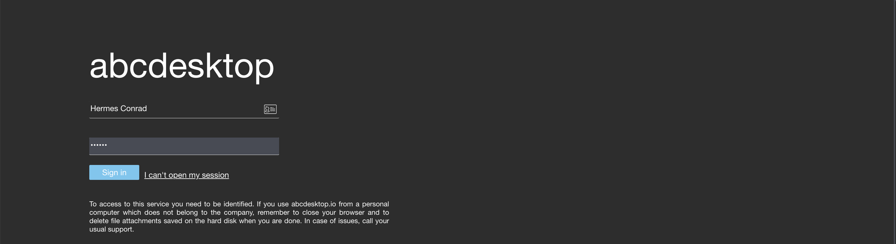
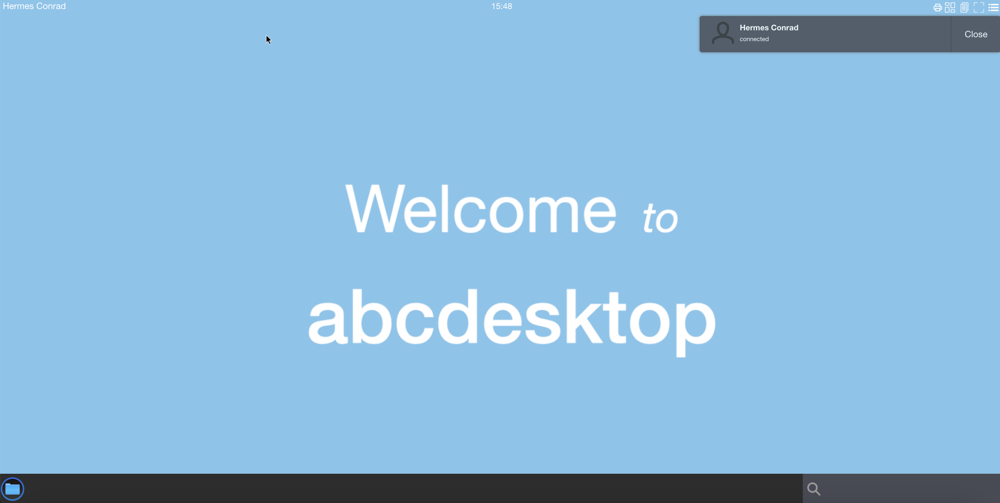
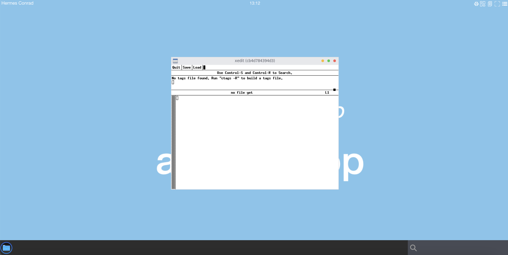
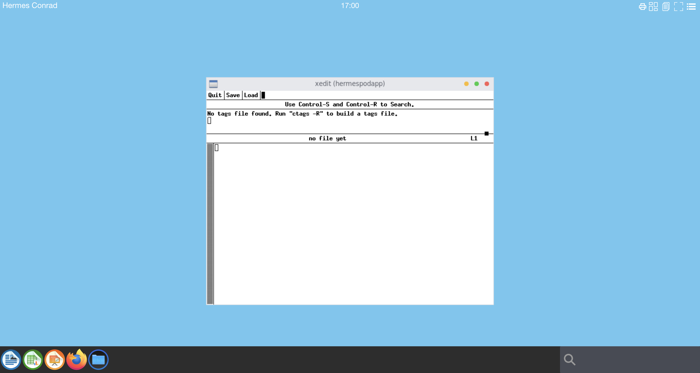

# How to create containerised application from scratch for troubleshooting


## Requirements

* `envsubst` command preinstalled. Common Linux systems have `envsubst` preinstalled


## Goals

* Create a new containerised application from scratch using pod volume mapping
* Start a pod and get a shell inside container as user `root`. Run xedit application as `root`
* Start a pod and get a shell inside container as user `hermes`. Run xedit application as `hermes`


# Create an application using a new container  

We are starting a new containerised application from a fresh `ubuntu:20.04` image and bind the X11 socket to use the pod DISPLAY.

We start a new container one as `root`, and another one as current user `hermes`


## Start a new abcdesktop session

Open a web browser and go to abcdesktop service url

### Login in as hermes 

In the example we use LDAP authentification.



The `login` is `Hermes Conrad`, the password is `hermes`  




## Get hermes's pod variables: name, uid, XAUTH_KEY 

Get a shell to your host. All next command use a host shell.

### Get the hermes's pod `name`

To read the hermes `pod name`, `MIT-MAGIC-COOKIE-1`, and `uid`

```bash
kubectl get pod -l=access_userid=hermes -o jsonpath='{.items[0].metadata.name}' -n abcdesktop
```

We save this value in the `pod` variable, for next usage

```bash
POD=$(kubectl get pod -l=access_userid=hermes -o jsonpath='{.items[0].metadata.name}' -n abcdesktop)
echo $POD
```

You should read on stdout

```bash
hermes-da0ca3c8-48ba-4736-85a9-d3fd2c85f009
```

We save this value in the `$POD` for a next usage.

### Get the hermes's `XAUTH_KEY`

The release 3.0 need the `MIT-MAGIC-COOKIE-1` to reach the x11 `DISPLAY`.

Run the command `echo $XAUTH_KEY` to read the `$XAUTH_KEY` value inside the hermes's pod

```bash
export XAUTH_KEY=$(kubectl exec -n abcdesktop -it $POD -- bash -c 'echo $XAUTH_KEY')
```

```
Defaulted container "x-planet-hermes" out of: x-planet-hermes, c-planet-hermes, f-planet-hermes, o-planet-hermes, hermes-conrad-xterm-9e2589dc0da0473da8e33d3ab98abedc (ephem), i-planet-hermes (init)
```

The `XAUTH_KEY` variable is exported for a next usage.

```sh
echo $XAUTH_KEY
306908f8e4d4768c7595ce5ad53479
```


### Get the hermes's pod `uid`


```bash
kubectl get pod -l=access_userid=hermes -o jsonpath='{.items[0].metadata.uid}' -n abcdesktop
```

We save this value in the `PODUID` exported variable, for next usage

```bash
export PODUID=$(kubectl get pod -l=access_userid=hermes -o jsonpath='{.items[0].metadata.uid}' -n abcdesktop)
```

```bash
echo $PODUID
c6d2f8a7-eb7d-4a25-9a9c-9778ca9e35cf
```


## Inspect the Hermes's pod to look for `Binding` volume mapping


### List files in `/var/lib/kubelet/pods/$PODUID`
 

The default [kubelet's](https://kubernetes.io/docs/reference/command-line-tools-reference/kubelet/) pod directory is `/var/lib/kubelet/pods/`. If you change it during the installation process replace `/var/lib/kubelet/pods/` by your own directory.


```bash
ls -la /var/lib/kubelet/pods/$PODUID/volumes/kubernetes.io~empty-dir/x11socket
```

```bash
ls -la /var/lib/kubelet/pods/$PODUID/volumes/kubernetes.io~empty-dir/x11socket
total 4
drwxrwxrwt 2 root root   60 Dec  8 19:43 .
drwxr-xr-x 9 root root 4096 Dec  8 19:43 ..
srwxrwxrwx 1 1051 2051    0 Dec  8 19:43 X0
```

`X0` is a file unix socket, we will bind the `X0` socket in the next podapp.


### Get the hermes's pod `home-hermes` volume location

```bash
kubectl get pod -l=access_userid=hermes -o jsonpath='{.items[0].spec.volumes[?(@.name=="home-hermes")].hostPath.path}' -n abcdesktop
```

> Description of this query
> 
>  - items[0] is the first entry of the pod list. 
>  - spec.volumes is an array
>  - read all entries in spec.volumes where the @.name=="home-hermes" and return .hostPath.path

We save this value in the `PODHOME` exported variable, for next usage

```bash
export PODHOME=$(kubectl get pod -l=access_userid=hermes -o jsonpath='{.items[0].spec.volumes[?(@.name=="home-hermes")].hostPath.path}' -n abcdesktop)
```

Check the value with a echo

```bash
echo $PODHOME
/tmp/hermes-conrad
```


## Start a new container from `ubuntu:20.04`

Now we've got the all volumes path and XAUTH_KEY, let's start a new container with mounted volume

- to the X11 socket `/var/lib/kubelet/pods/$PODUID/volumes/kubernetes.io~empty-dir/x11socket:/tmp/.X11-unix`
- to the user `homedir` `$PODHOME:/home/balloon`


### Create container in the pod sandbox with config file

We use `envsubst` to replace variable content in a [template yaml](https://skofgar.ch/dev/2020/08/how-to-quickly-replace-environment-variables-in-a-file/) file.

>Some systems have gettext with envsubst preinstalled. However, if it is missing, you can install it using a package manager. For macOS you can use homebrew:
>
>```brew install gettext```

The variables `${PODUID}`, `${PODHOME}` and `${XAUTH_KEY}` are exported.

> Make sure to use export, otherwise your variables are considered shell variables and might not be accessible to `envsubst`

Create a file `podapp.template.yaml` 

```yaml
apiVersion: v1
kind: Pod
metadata:
  name: podapp
  namespace: abcdesktop
spec:
  volumes:
  - name: x11socket
    hostPath:
      # x11 directory location on host ${PODUID}
      path: /var/lib/kubelet/pods/${PODUID}/volumes/kubernetes.io~empty-dir/x11socket
      # this field is optional
      type: Directory
  - name: home
    hostPath:
      # home directory location on host
      path: ${PODHOME}
      # this field is optional
      type: Directory
  containers:
  - name: abccontainer
    image: ubuntu:20.04
    command: ["/bin/sleep"]
    args: ["1d"]
    volumeMounts:
    - mountPath: /tmp/.X11-unix
      name: x11socket
    - mountPath: /home/hermes
      name: home
    env:
    - name: XAUTH_KEY
      value: ${XAUTH_KEY}
```

Run the `envsubst` command to replace `${PODUID}`, `${PODHOME}` and `${XAUTH_KEY}`

```
envsubst < podapp.template.yaml > podapp.yaml 
```

Dump the `podapp.yaml` file content, and check that the volumes are set with the new values.

```sh
# cat podapp.yaml 
```

```yaml
apiVersion: v1
kind: Pod
metadata:
  name: podapp
  namespace: abcdesktop
spec:
  volumes:
  - name: x11socket
    hostPath:
      # directory location on host
      path: /var/lib/kubelet/pods/c6d2f8a7-eb7d-4a25-9a9c-9778ca9e35cf/volumes/kubernetes.io~empty-dir/x11socket
      # this field is optional
      type: Directory
  - name: home
    hostPath:
      # directory location on host
      path: /tmp/hermes-conrad
      # this field is optional
      type: Directory
  containers:
  - name: abccontainer
    image: ubuntu:20.04
    command: /bin/sleep 1d
    volumeMounts:
    - mountPath: /tmp/.X11-unix
      name: x11socket
    - mountPath: /home/hermes
      name: home
```

Create the application pod 

```sh
kubectl apply -f podapp.yaml 
pod/podapp created
```

Check that your pod `podapp` is `Running`

```sh
kubectl get pods podapp  -n abcdesktop
NAME     READY   STATUS    RESTARTS   AGE
podapp   1/1     Running   0          32s
```

## Get a shell in `podapp`


You get a shell command inside the container.


```sh
kubectl exec -it podapp  -n abcdesktop -- bash 
```

### for release 3.0 set the MIT-MAGIC-COOKIE-1

```bash
apt-get update && apt-get install -y xauth
```

```bash
export DISPLAY=:0.0
echo $XAUTH_KEY
xauth add $DISPLAY MIT-MAGIC-COOKIE-1 $XAUTH_KEY
```

You can read on stdout

```
root@podapp:/# export DISPLAY=:0.0
root@podapp:/# echo $XAUTH_KEY
306908f8e4d4768c7595ce5ad53479
root@podapp:/# xauth add $DISPLAY MIT-MAGIC-COOKIE-1 $XAUTH_KEY
xauth:  file /root/.Xauthority does not exist
root@podapp:/#
```

The file `/root/.Xauthority` does not exist, it has been created.


### Install your X11 applications

For example, I choose to install the `x11-apps` package

Replace `x11-apps` by your own application

```bash
apt-get install -y x11-apps
```

### Start your X11 application


To start the X11 application, just run it. Your `DISPLAY` is set to `:0.0`,  (for release 3.0, you've already added the `MIT-MAGIC-COOKIE-1`). 

But remember you a running a container as `root`, and all commands are running as `root` inside the container.

Start `xedit` 

```bash
xedit
```

Go back to your web browser. 

A new x11 window `xedit` should be present on your display



`xedit` doesn't write any error message in the bash container. 

You've get a shell inside a container to run and start any application. 
You can also install and start any others applications.

To clean the running pod podapp

```bash
kubectl delete pods podapp -n abcdesktop 
```


## Start a new container from `ubuntu:20.04` as `hermes`

To start a new container from `ubuntu:20.04` as `hermes`, we have to add the `localaccount` secret volume to the previous container

Read the securityContext from the `hermes` pod 

```bash
export PODRUNASUSER=$(kubectl get pods -l=access_userid=hermes -o json  -n abcdesktop | jq -r '.items[0].spec.securityContext.runAsUser')
export PODRUNASGROUP=$(kubectl get pods -l=access_userid=hermes -o json  -n abcdesktop | jq -r '.items[0].spec.securityContext.runAsGroup')
```

Check the `uidNumber` and the `gidNumber` values

```bash
echo PODRUNASUSER:$PODRUNASUSER PODRUNASGROUP:$PODRUNASGROUP
PODRUNASUSER:1051 PODRUNASGROUP:2051
```


Create a file `hermespodapp.template.yaml` 

```yaml
apiVersion: v1
kind: Pod
metadata:
  name: hermespodapp
  namespace: abcdesktop
spec:
  securityContext:
    runAsUser: ${PODRUNASUSER}
    runAsGroup: ${PODRUNASGROUP}
  volumes:
  - name: x11socket
    hostPath:
      # x11 directory location on host ${PODUID}
      path: /var/lib/kubelet/pods/${PODUID}/volumes/kubernetes.io~empty-dir/x11socket
      # this field is optional
      type: Directory
  - name: home
    hostPath:
      # home directory location on host
      path: ${PODHOME}
      # this field is optional
      type: Directory
  - name: localaccount
    hostPath:
      # localaccount directory location on host
      path: /var/lib/kubelet/pods/${PODUID}/volumes/kubernetes.io~secret/auth-localaccount-hermes
      # this field is optional
      type: Directory
  containers:
  - name: hermescontainer
    image: ubuntu:20.04
    command: ["/bin/sleep"]
    args: ["1d"]
    volumeMounts:
    - mountPath: /tmp/.X11-unix
      name: x11socket
    - mountPath: /home/hermes
      name: home
    - mountPath: /var/secrets/abcdesktop/localaccount
      name: localaccount
    env:
    - name: XAUTH_KEY
      value: ${XAUTH_KEY}
```

Create your hermespodapp.yaml file from the previous template

```sh
envsubst < hermespodapp.template.yaml > hermespodapp.yaml 
```

Look at your `hermespodapp.yaml`

```sh
cat hermespodapp.yaml 
```

```yaml
apiVersion: v1
kind: Pod
metadata:
  name: hermespodapp
  namespace: abcdesktop
spec:
  securityContext:
    runAsUser: 1051
    runAsGroup: 2051
  volumes:
  - name: x11socket
    hostPath:
      # x11 directory location on host c6d2f8a7-eb7d-4a25-9a9c-9778ca9e35cf
      path: /var/lib/kubelet/pods/c6d2f8a7-eb7d-4a25-9a9c-9778ca9e35cf/volumes/kubernetes.io~empty-dir/x11socket
      # this field is optional
      type: Directory
  - name: home
    hostPath:
      # home directory location on host
      path: /tmp/hermes-conrad
      # this field is optional
      type: Directory
  - name: localaccount
    hostPath:
      # localaccount directory location on host
      path: /var/lib/kubelet/pods/c6d2f8a7-eb7d-4a25-9a9c-9778ca9e35cf/volumes/kubernetes.io~secret/auth-localaccount-hermes
      # this field is optional
      type: Directory
  containers:
  - name: hermescontainer
    image: ubuntu:20.04
    command: ["/bin/sleep"]
    args: ["1d"]
    volumeMounts:
    - mountPath: /tmp/.X11-unix
      name: x11socket
    - mountPath: /home/hermes
      name: home
    - mountPath: /var/secrets/abcdesktop/localaccount
      name: localaccount
    env:
    - name: XAUTH_KEY
      value: 306908f8e4d4768c7595ce5ad53479
```


Create the `hermespodapp`

```
kubectl apply -f hermespodapp.yaml 
pod/hermespodapp created
```


To install the x11 application package, we need a root access to the pod/hermespodapp. We use `runc` to get a rooted shell. 


Read the `containerID` of the pod `hermespodapp`

```
CONTAINER=$(kubectl -n abcdesktop  get pod hermespodapp -o jsonpath="{.status.containerStatuses[].containerID}" |sed 's/.*\/\///')
```

Get the shell with `runc` command
 
```
runc --root /run/containerd/runc/k8s.io/ exec -t -u 0 $CONTAINER bash
groups: cannot find name for group ID 2051
root@hermespodapp:/# 
```

This is correct `group ID 2051` does not exit. Let's patch your file system with `hermes` credentials 

- /etc/passwd
- /etc/group
- /etc/shadow
- /etc/gshadow

```
rm -f /etc/passwd && ln -s /var/secrets/abcdesktop/localaccount/passwd /etc/passwd
rm -f /etc/group && ln -s /var/secrets/abcdesktop/localaccount/group  /etc/group
rm -f /etc/shadow && ln -s /var/secrets/abcdesktop/localaccount/shadow /etc/shadow
rm -f /etc/gshadow && ln -s /var/secrets/abcdesktop/localaccount/gshadow /etc/gshadow
```

Now your files are updated.
You can exit, and reopen a bash to your container 

```
root@hermespodapp:/# exit
```

```
# runc --root /run/containerd/runc/k8s.io/ exec -t -u 0 $CONTAINER bash
root@hermespodapp:/# 
```

The error message does not appear anymore.


Install your X11 applications as root

```bash
apt-get update && apt-get install -y x11-apps
```

Quit the root session

```bash
exit
```

### Start your X11 application as `hermes`

Start a new session to the pod `hermespodapp`

```bash
kubectl -n abcdesktop exec -it hermespodapp -- bash 
```

You get a shell prompt as as `hermes`. Check the `hermes` homedirectory and id number

```bash
hermes@hermespodapp:/$
hermes@hermespodapp:/$ cd
hermes@hermespodapp:~$ pwd
/home/hermes
hermes@hermespodapp:~$ id 
uid=1051(hermes) gid=2051(hermes) groups=2051(hermes)
```

Export the var `DISPLAY` and start the edit application. You don't need to create the `.Xauthority` file.
`/home/hermes` is already mounted as a volume.


```bash
hermes@hermespodapp:~$ export DISPLAY=:0.0
hermes@hermespodapp:~$ xedit &
[1] 699
```

This process is running as `hermes` :

```bash
hermes@hermespodapp:~$ ps -ef
UID          PID    PPID  C STIME TTY          TIME CMD
hermes         1       0  0 15:57 ?        00:00:00 /bin/sleep 1d
hermes       690       0  0 16:47 pts/0    00:00:00 bash
hermes       699     690  0 16:48 pts/0    00:00:00 xedit
hermes       700     690  0 16:49 pts/0    00:00:00 ps -ef
```


Go back to your web browser. 

A new x11 window `xedit` should be present on your display 



> The name of the edit window is the name of your pod `(hermespodapp)`.

To clean the running pod hermespodapp

```bash
kubectl delete -f hermespodapp.yaml 
```

You have created a pod to run an X11 application as a user in LDAP Directory. 
You get a root shell inside the pod, to patch, update or install other applications.
 


