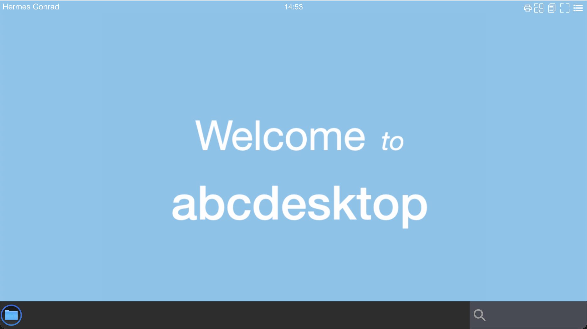
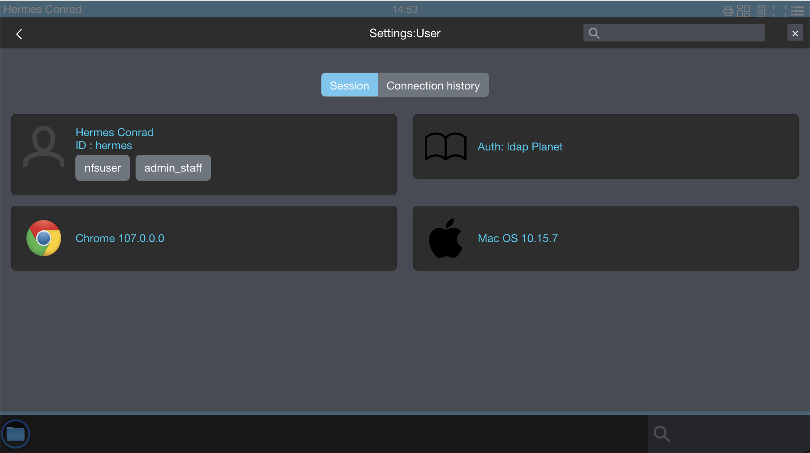
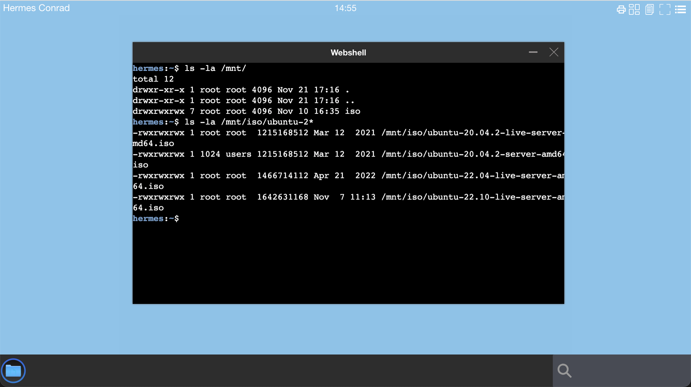

# Define rules to mount a nfs volume inside user pod 


> Only supported in abcdesktop release 3.0


An nfs volume allows an existing NFS (Network File System) share to be mounted into a Pod. NFS volume can be pre-populated with data, and can be shared between pods. NFS can be mounted by multiple writers simultaneously.


> You must have your own NFS server running with the share exported before you can use it.

## Update the `od.config` file

Update the `od.config` to add 

- a label to user
- add a desktop rules to match the label

### Add a label in the `auth provider`


In this example, we add a label `nfsuser` as a condition to mount nfs resource

In the auth provider add a `dummy` condition or a  `memberOf` condition. All types of conditions are supported, the goal is only to get a label.

Update the `od.config` file and look for the default `ldapconfig` dictionnary

#### Add a dummy condition

``` bash
ldapconfig : { 
  'planet': {  
    'default'       : True,
    'ldap_timeout'  : 15,
    'ldap_basedn'   : 'dc=planetexpress,dc=com',
    'users_ou'      : 'ou=people,dc=planetexpress,dc=com',
    'servers'       : [ 'ldap://openldap.abcdesktop.svc.cluster.local:30389' ],
    'serviceaccount': { 'login': 'cn=admin,dc=planetexpress,dc=com', 'password': 'GoodNewsEveryone' },
    'policies': { 
       'acls': None, 
       'rules' : { 
          'rule-dummy': { 
             'conditions' : [ { 'boolean': True, 'expected' : True  } ],
             'expected' : True,
             'label': 'nfsuser' } } } } } }
```


#### Or Add a `memberOf` condition

``` bash
ldapconfig : { 
  'planet': {  
    'default'       : True,
    'ldap_timeout'  : 15,
    'ldap_basedn'   : 'dc=planetexpress,dc=com',
    'users_ou'      : 'ou=people,dc=planetexpress,dc=com',
    'servers'       : [ 'ldap://openldap.abcdesktop.svc.cluster.local:30389' ],
    'serviceaccount': { 'login': 'cn=admin,dc=planetexpress,dc=com', 'password': 'GoodNewsEveryone' },
    'policies': { 
       'acls': None, 
       'rules' : { 
          'rule-nfsuser':  { 
              'conditions' : [ { 'memberOf': 'cn=admin_staff,ou=people,dc=planetexpress,dc=com',   'expected' : True  } ],
              'expected' : True, 
              'label': 'nfsuser' } } } } }
```

### Add a `rule` in the `desktop.policies` 


In this example, we define entries :

- `nfsserver` is `192.168.7.101` (can also be a FQDH)
- `path` is `/volume1/isostore`
- `mountPath` is `/mnt/iso`

The mount command become like:

``` bash
mount -t nfs 192.168.7.101:/volume1/isostore /mnt/iso
```

Update the `desktop.policies` dictionnary and add a new key `rules`.
In the new `rules` define a new entry `nfsuser`. 

> The name of the entry MUST **match** a user label tag, else the mount point is not created. 

In this example the label is defined as `nfsuser`, but you can set differents values. 
Then set nfs descriptions as you can read in [kubernetes nfs volume](https://kubernetes.io/docs/concepts/storage/volumes/)  
	
```
desktop.policies: {  
'acls' : {},
'rules': { 
  'volumes': { 
    'nfsuser': {
      'type': 'nfs', 
      'name': 'isostore', 
      'server': '192.168.7.101',
      'path': '/volume1/isostore',
      'mountPath': '/mnt/iso',
      'readOnly': True } } } } 
```

### Apply the new `od.config` file

Save your local changes in `od.config`, and update the new configmap `abcdesktop-config`

```
kubectl delete configmap abcdesktop-config -n abcdesktop
kubectl create --from-file=od.config -n abcdesktop
```


### Restart `pyos` 

Restart `pyos`  pods

```
kubectl delete pod -l run=pyos-od -n abcdesktop
```

```
pod "pyos-od-5586b88767-64jwt" deleted
```


## Create a new desktop for `Hermes Conrad` and list nfs files

Open the url `http://localhost:30443`, in your web browser, to start a simple user's pod. 

```
http://localhost:30443
```

- Login with a user `Hermes Conrad` for example.
`Hermes Conrad` is member of `admin_staff`. 



- Check that the label `nfsuser` is listed



- Run a web shell to list the `/mnt/iso` directory content



You can define many rules from LDAP groups. To get more informations about rules, read the [authentification rules section](/1.0/config/authentification-rules/)


