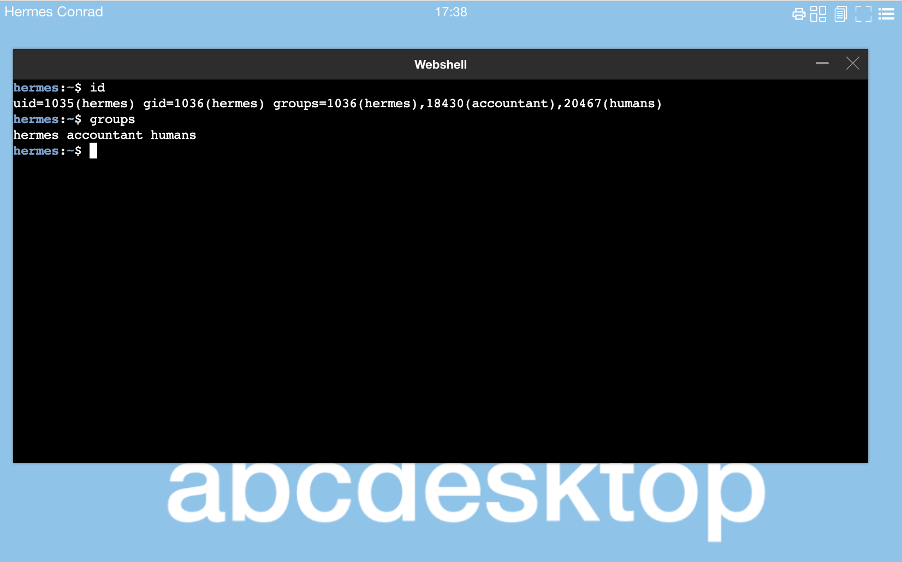
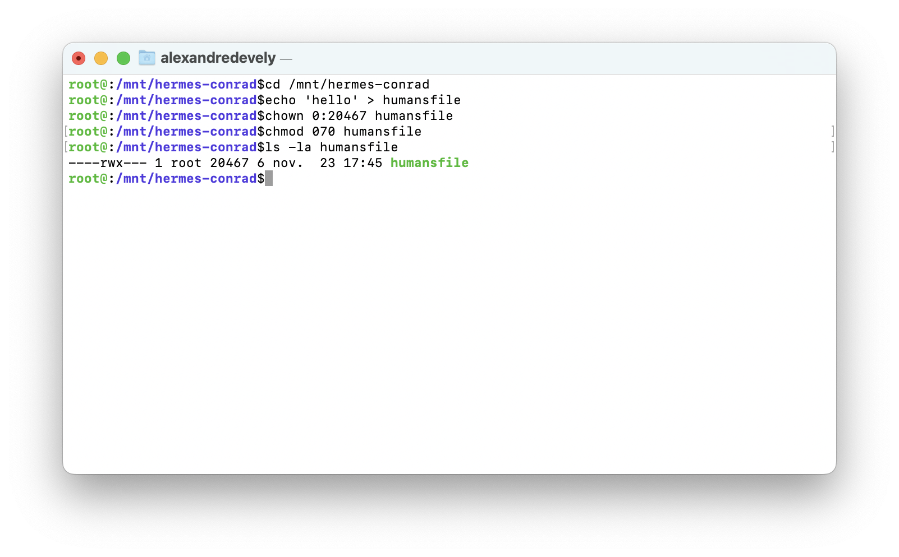
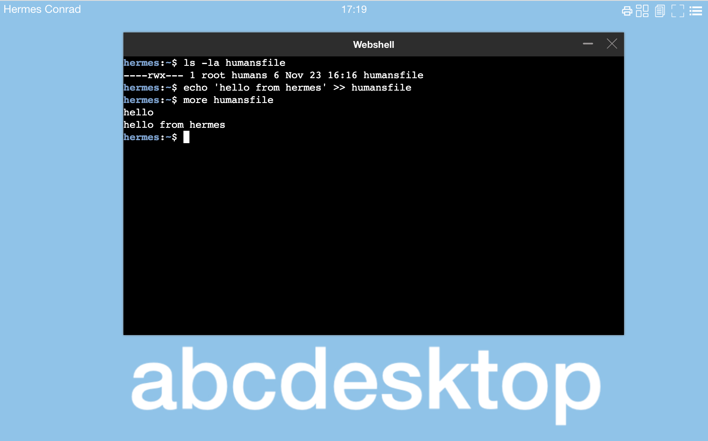

# RFC 2307: the multiple groups features


Let talk about a common features with multiple groups and user `securityContext` on pods


## context


- Use ldap auth like in sample config `ou=people,dc=planetexpress,dc=com`
- Use groups `gidNumber` and `uidNumber`
- Use filesystem access right


### accounts description


- defined a user in the LDAP series

The ldif set :

- organizationalUnit `people`: `ou=people,dc=planetexpress,dc=com`
- organizationalUnit `groups`: `ou=groups,dc=planetexpress,dc=com`

Create a posixAccount : `cn=hermes,ou=people,dc=planetexpress,dc=com`

- gidNumber: `1036`
- uid: `hermes`
- uidNumber: `1035`

Create a posixGroup for `hermes` : `cn=hermes,ou=groups,dc=planetexpress,dc=com`

- objectClass: `posixGroup`
- objectClass: `top`
- cn: `hermes`
- gidNumber: `1036`


Create a posixGroup : `cn=accountant,ou=groups,dc=planetexpress,dc=com`

- cn: `accountant`
- gidNumber: `18430`
- memberUid: `hermes`

Create a posixGroup `cn=humans,ou=groups,dc=planetexpress,dc=com`

- gidNumber: `20467`
- memberUid: `fry`
- memberUid: `hermes`

Inside the user pod, the unix group file contains : 

```bash
cat /etc/group
```

```group
hermes:x:1036:
humans:x:20467:hermes,fry
accountant:x:18430:hermes
```

> This is correct.


The user's pod is defined with a `securityContext`

```json 
'securityContext': {
  'runAsUser': 1035,
  'runAsGroup': 1036,
  'supplementalGroups': [20467, 18430] 
}
```

> This is correct.
> `supplementalGroups` defines the others groups from LDAP

Inside the user pod run the `id` command



```bash
hermes:~$ id
uid=1035(hermes) gid=1036(hermes) groups=1036(hermes),18430(accountant),20467(humans)
hermes:~$ groups
hermes accountant humans
hermes:~$
```

> This is correct.


### Create new file on host
 
The default home directory in `od.config` is a volume `hostPath` set to `/tmp`

```od.config
desktop.homedirectorytype: 'hostPath' 
desktop.hostPathRoot: '/tmp'
```

On your host server, using a root account, create a file `humansfile`  with restricted access to member of `humans` group.





```bash
cd /mnt/hermes-conrad
echo 'hello' > humansfile
chown 0:20467 humansfile
chmod 070 humansfile 
```

Check the owner and group

```
ls -la humansfile
----rwx--- 1 root 20467 6 nov.  23 17:16 humansfile
```


Check inside the user pod check that `hermes` account **can to write data** in file `humansfile`, because `hermes` is member of `humans` group.





```
hermes:~$ ls -la humansfile 
----rwx--- 1 root humans 6 Nov 23 16:16 humansfile
hermes:~$ echo 'hello from hermes' >> humansfile 
hermes:~$ more humansfile 
hello
hello from hermes
hermes:~$ 
```

> This is correct.


We describe a common features with multiple groups and user `securityContext` on pods and abcdesktop support multiple groups with posixGroup define in RFC2307. 


### ldif dump

To get more details about the ldif and ldap datas, you can download the [ldif file planetexpress](planetexpressRFC2307.ldif).


``` ldif
version: 1

dn: dc=planetexpress,dc=com
objectClass: dcObject
objectClass: organization
objectClass: top
dc: planetexpress
o: Planet Express, Inc.

dn: ou=people,dc=planetexpress,dc=com
objectClass: organizationalUnit
objectClass: top
ou: people
description: Planet Express crew

dn: cn=Hermes Conrad,ou=people,dc=planetexpress,dc=com
objectClass: inetOrgPerson
objectClass: organizationalPerson
objectClass: person
objectClass: posixAccount
objectClass: top
cn: Hermes Conrad
gidNumber: 1036
homeDirectory: /home/hermes
sn: Conrad
uid: hermes
uidNumber: 1035
description: Human
employeeType: Accountant
employeeType: Bureaucrat
givenName: Hermes
mail: hermes@planetexpress.com
ou: Office Management

dn: ou=groups,dc=planetexpress,dc=com
objectClass: organizationalUnit
objectClass: top
ou: groups

dn: cn=fry,ou=groups,dc=planetexpress,dc=com
objectClass: posixGroup
objectClass: top
cn: fry
gidNumber: 1025
memberUid: fry

dn: cn=humans,ou=groups,dc=planetexpress,dc=com
objectClass: posixGroup
objectClass: top
cn: humans
gidNumber: 20467
memberUid: fry
memberUid: hermes

dn: cn=hermes,ou=groups,dc=planetexpress,dc=com
objectClass: posixGroup
objectClass: top
cn: hermes
gidNumber: 1036

dn: cn=accountant,ou=groups,dc=planetexpress,dc=com
objectClass: posixGroup
objectClass: top
cn: accountant
gidNumber: 18430
memberUid: hermes
```

