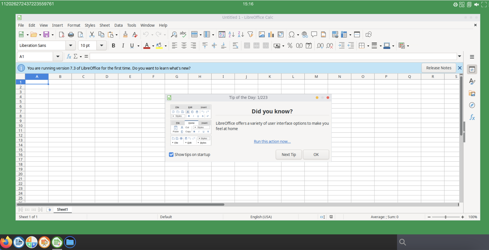

# Update and custom frontend web page


abcdesktop uses a front HTML web site and X11 Linux application. So, to get a new graphic design, you have to define it twice in HTML (CSS) files and in X11 config.

## Requirements 

* `docker` package installed 


## Goals

* Update abcdesktop default frontend web page to use your own.
* Create new image for abcdesktop oc.nginx

## Configure od.config to use the new color


In the od.config, add the env var `ABCDESKTOP_BG_COLOR`

```
desktop.envlocal :  {
  'X11LISTEN':'tcp', 
  'WEBSOCKIFY_HEARTBEAT':'30',
  'TURN_PROTOCOL': 'tcp',
  'ABCDESKTOP_BG_COLOR': ‘#18974c’ }
```

Then update the config map `abcdesktop-config` and restart deployment `pyos-od` 

```
kubectl create -n abcdesktop configmap abcdesktop-config --from-file=od.config -o yaml --dry-run=client | kubectl replace -n abcdesktop -f -
kubectl rollout restart deployment pyos-od -n abcdesktop
```

You should read on stdout

```
configmap/abcdesktop-config replaced
deployment.apps/pyos-od restarted
```

## Create new image for abcdesktop oc.nginx

### Download ui.json file

Download the `ui.json` file.  `ui.json` is located in `webModules/transpile/config` directory of `webModules` abcdesktop's repository.


```bash
mkdir build
cd build
wget https://raw.githubusercontent.com/abcdesktopio/webModules/3.2/transpile/config/ui.json
```

`ui.json` is a json dictionary file

The main entres are :

- `name`, name is the name of your project.
- `projectNameSplitedHTML`, is the animated `span` name of your project.


| entry          | default value       | example          |
|----------------|---------------------|------------------|
| name           | abcdesktop.io       | acmedesktop.io   |
| projectNameSplitedHTML | `<span id='projectNameSplitedStagea'>a</span><span id='projectNameSplitedStageb'>b</span><span id='projectNameSplitedStagec'>c</span><span id='projectNameSplitedStaged'>desktop</span>`     | `<span id='projectNameSplitedStagea'>A</span><span id='projectNameSplitedStageb'>c</span><span id='projectNameSplitedStagec'>me</span><span id='projectNameSplitedStaged'>desktop</span>` |


```json
{
  "name": "abcdesktop.io",
  "projectNameSplitedHTML": "<span id='projectNameSplitedStagea'>a</span><span id='projectNameSplitedStageb'>b</span><span id='projectNameSplitedStagec'>c</span><span id='projectNameSplitedStaged'>desktop</span>",
  "colors": [
    {
      "name": "@x11bgcolor",
      "value": "#6EC6F0"
    },
    {
      "name": "@primary",
      "value": "#474B55"
    },
    {
      "name": "@secondary",
      "value": "#2D2D2D"
    },
    {
      "name": "@tertiary",
      "value": "#6EC6F0"
    },
    {
      "name": "@quaternary",
      "value": "#1E1E1E"
    },
    {
      "name": "@svgColor",
      "value": "#FFFFFF"
    },
    {
      "name": "@danger",
      "value": "#CD3C14"
    },
    {
      "name": "@success",
      "value": "#32C832"
    },
    {
      "name": "@info",
      "value": "#527EDB"
    },
    {
      "name": "@warning",
      "value": "#FFCC00"
    },
    {
      "name": "@light",
      "value": "#FFFFFF"
    },
    {
      "name": "@dark",
      "value": "#666666"
    },
    {
      "name": "@blue",
      "value": "#4BB4E6"
    },
    {
      "name": "@green",
      "value": "#50BE87"
    },
    {
      "name": "@purple",
      "value": "#A885D8"
    },
    {
      "name": "@pink",
      "value": "#FFB4E6"
    },
    {
      "name": "@yellow",
      "value": "#FFD200"
    }
  ],
  "urlcannotopensession": "/identification/site/",
  "urlusermanual":  "https://www.abcdesktop.io/",
  "urlusersupport": "https://www.abcdesktop.io/",
  "urlopensourceproject": "https://www.abcdesktop.io/"
}
```


#### Update the ui.json with your own values

Change for example the `name` of the project, and `projectNameSplitedHTML` to

```json
  "name": "acmedesktop.io",
  "projectNameSplitedHTML": "<span id='projectNameSplitedStagea'>A</span><span id='projectNameSplitedStageb'>c</span><span id='projectNameSplitedStagec'>me</span><span id='projectNameSplitedStaged'>desktop</span>",
```

Change the color `@x11bgcolor ` with your own.

| entry name     | new color value     | 
|----------------|---------------------|
| @x11bgcolor    | #18974c             |


> You should use the same value for `ABCDESKTOP_BG_COLOR` and for `@x11bgcolor`. 

Example

```json
{
  "name": "acmedesktop.io",
  "projectNameSplitedHTML": "<span id='projectNameSplitedStagea'>A</span><span id='projectNameSplitedStageb'>c</span><span id='projectNameSplitedStagec'>me</span><span id='projectNameSplitedStaged'>desktop</span>",
   "colors": [
    {
      "name": "@x11bgcolor",
      "value": "#18974c"
    },
    {
      "name": "@primary",
      "value": "#474B55"
    },
    {
      "name": "@secondary",
      "value": "#2D2D2D"
    },
    {
      "name": "@tertiary",
      "value": "#18974C"
    },
    {
      "name": "@quaternary",
      "value": "#18974c"
    },
    {
      "name": "@svgColor",
      "value": "#FFFFFF"
    },
    {
      "name": "@danger",
      "value": "#CD3C14"
    },
    {
      "name": "@success",
      "value": "#32C832"
    },
    {
      "name": "@info",
      "value": "#18974c"
    },
    {
      "name": "@warning",
      "value": "#FFCC00"
    },
    {
      "name": "@light",
      "value": "#FFFFFF"
    },
    {
      "name": "@dark",
      "value": "#666666"
    },
    {
      "name": "@blue",
      "value": "#4BB4E6"
    },
    {
      "name": "@green",
      "value": "#50BE87"
    },
    {
      "name": "@purple",
      "value": "#A885D8"
    },
    {
      "name": "@pink",
      "value": "#FFB4E6"
    },
    {
      "name": "@yellow",
      "value": "#FFD200"
    }
  ],
  "urlcannotopensession": "/identification/site/",
  "urlusermanual":  "https://www.abcdesktop.io/",
  "urlusersupport": "https://www.abcdesktop.io/",
  "urlopensourceproject": "https://www.abcdesktop.io/"
}
```


### Create a new `Dockerfile` to build changes

#### Write your `Dockerfile` to build the new image 

Dockerfile 

```Dockerfile
#
# --- update oc.nginx:builder image start here ---
# use the abcdesktopio/oc.nginx:builder
# oc.nginx:builder contains Makefile and tools like nodejs, lessc need to update the ui.json file
# oc.nginx:builder source https://raw.githubusercontent.com/abcdesktopio/oc.nginx/main/Dockerfile.builder          

#######
FROM abcdesktopio/oc.nginx:builder as builder
# copy data files /var/webModules
COPY --from=abcdesktopio/oc.nginx:3.2 var/webModules /var/webModules
# copy updated file ui.json with your own custom values
COPY ui.json /var/webModules/transpile/config/

# run makefile
# make dev (for dev)
# make prod (for prod)
RUN cd /var/webModules && make dev
# make version to update the version number from .git commit
RUN cd /var/webModules && ./mkversion.sh

#######
#
# --- oc.nginx image start here ---
#
FROM abcdesktopio/oc.nginx:3.2
# COPY updated files from builder container to oc.nginx
COPY --from=builder var/webModules /var/webModules
RUN cat /var/webModules/index.html
```


#### Docker build

Run the docker build command to build the new `oc.nginx:acme` image

```bash
docker build -t oc.nginx:acme .
```

```bash
# docker build -t oc.nginx:acme .
Sending build context to Docker daemon  21.88MB
Step 1/8 : FROM abcdesktopio/oc.nginx:builder as builder
builder: Pulling from abcdesktopio/oc.nginx
eaead16dc43b: Pull complete 
2b469c68b643: Pull complete 
5cee1fa1576f: Pull complete 
359c5b0dcf0a: Pull complete 
Digest: sha256:b9b2c232a885405df39e146d7ac02f3da034a5addc78c00faca59e2d8934ec5b
Status: Downloaded newer image for abcdesktopio/oc.nginx:builder
 ---> ef7e71c277b9
Step 2/8 : COPY --from=abcdesktopio/oc.nginx:3.2 var/webModules /var/webModules
3.0: Pulling from abcdesktopio/oc.nginx
eaead16dc43b: Already exists 
d78e49ae48aa: Pull complete 
5a1b3cde12da: Pull complete 
d46852e47788: Pull complete 
301ba448a167: Pull complete 
e352a410ea9e: Pull complete 
6478c15f8c14: Pull complete 
52697000c467: Pull complete 
4f346a00bc16: Pull complete 
9d4bc434c5bb: Pull complete 
Digest: sha256:d8692b633b221654899d8dbe7987330f878364d7288ec5628f7aa47152ce4ea6
Status: Downloaded newer image for abcdesktopio/oc.nginx:3.2

 ---> c5a084901830
Step 3/8 : COPY ui.json /var/webModules/transpile/config/
 ---> cbb23fb8634e
Step 4/8 : RUN cd /var/webModules && make prod
 ---> Running in 976ee31ac5db
create html page /var/webModules/demo.html
create html page /var/webModules/index.session.mustache.html
create html page /var/webModules/app.html
create html page /var/webModules/app.session.mustache.html
create html page /var/webModules/index.html
create html page /var/webModules/description.html
Apply userInterface conf: 1.355s
Transform and copy js files:
Build svg: 2.034s
Build css: 2.041s
[...]
Total duration copy and transform: 10.430s
Writing /var/webModules/app.js
Writing /var/webModules/index.html: 0.975ms
Writing /var/webModules/app.html: 0.855ms
Writing /var/webModules/index.session.mustache.html: 0.781ms
Build app.js file: 11.362s
remove out dir base /var/webModules/build: 9.129ms
Total duration: 12.752s
Removing intermediate container 976ee31ac5db
 ---> 784902ce50c1
Step 5/8 : FROM abcdesktopio/oc.nginx:3.2
 ---> c77f6c5ca8a1
Step 6/8 : COPY --from=builder var/webModules /var/webModules
 ---> 68474a5ee2d5
Step 7/8 : RUN cat /var/webModules/index.html
 ---> Running in ddb958078b50
 [...]
Removing intermediate container ddb958078b50
 ---> f02e3c57ec7e
Step 8/8 : LABEL name="frontend acmedesktop base image"       maintainer="acmedesktop"       version="3.0"
 ---> Running in da5363dcf434
Removing intermediate container da5363dcf434
 ---> b5449d85393f
Successfully built b5449d85393f
Successfully tagged oc.nginx:acme
```


Run the `docker images` command to read the new `oc.nginx` image

```bash
docker images 

REPOSITORY              TAG       IMAGE ID       CREATED         SIZE
oc.nginx                acme      b5449d85393f   2 minutes ago   685MB
```

### Save the container image to a file 

```bash
docker image save oc.nginx:acme -o oc.nginx.acme
```

### Import the file `oc.nginx.acme` in `k8s.io` namespace for `containerd`

The `oc.nginx.acme` not is listed in the `k8s.io` namespace.

Run the `ctr` command line to import `oc.nginx.acme` 

```bash
ctr -n k8s.io images import oc.nginx.acme 
unpacking docker.io/library/oc.nginx:acme (sha256:5c3debc775894d079fa61be7f8217be0ecc7b2e7c47f0318bc1c94921c278e14)...done
```

Check that your new image is listed

```bash
ctr -n k8s.io images ls |grep oc.nginx:acme
docker.io/library/oc.nginx:acme                                                                                                  application/vnd.docker.distribution.manifest.v2+json      sha256:5c3debc775894d079fa61be7f8217be0ecc7b2e7c47f0318bc1c94921c278e14 384.9 MiB linux/amd64                                                                                                                        io.cri-containerd.image=managed 
```

### Update abcdesktop.yaml` file

Update your own `abcdesktop.yaml` file to replace the default image `abcdesktopio/oc.nginx:3.0` by the new container image `oc.nginx:acme` name.

```
 containers:
      - name: nginx
        imagePullPolicy: Always
        image: abcdesktopio/oc.nginx:3.2
```

Replace :

- `image: abcdesktopio/oc.nginx:3.2` by `image: oc.nginx:acme`

```
 containers:
      - name: nginx
        image: oc.nginx:acme
```

Apply the new `abcdesktop.yaml` file

```
kubectl apply -f abcdesktop.yaml 
```

The `deployment.apps/nginx-od` is `configured`

```
clusterrole.rbac.authorization.k8s.io/pyos-role unchanged
clusterrolebinding.rbac.authorization.k8s.io/pyos-rbac unchanged
serviceaccount/pyos-serviceaccount unchanged
storageclass.storage.k8s.io/storage-local-abcdesktop unchanged
configmap/nginx-config unchanged
deployment.apps/memcached-od unchanged
secret/mongodb-secret configured
deployment.apps/mongodb-od unchanged
deployment.apps/nginx-od configured
deployment.apps/speedtest-od unchanged
deployment.apps/nginx-od configured
endpoints/desktop unchanged
service/desktop unchanged
service/memcached unchanged
service/mongodb unchanged
service/speedtest unchanged
service/nginx unchanged
service/pyos unchanged
deployment.apps/openldap-od unchanged
service/openldap unchanged
```

Start you web browser. You can read the new project name at the home page. After login you get the new color.



You have updated the html web page for abcdesktop release 3.X

