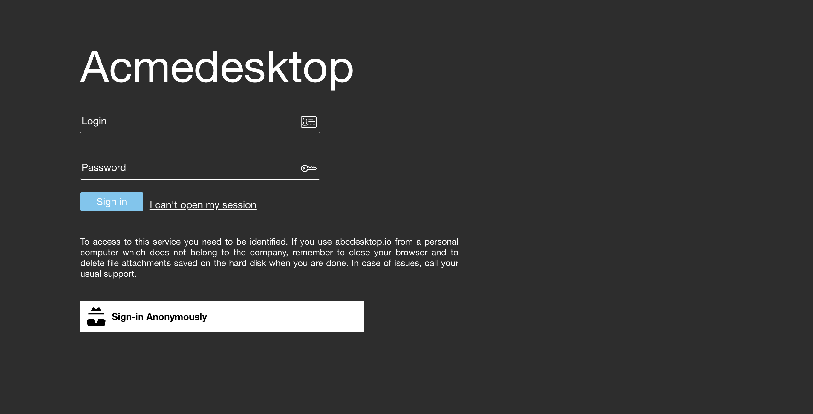

# Update and custom frontend web page


## Requirements 

* `ctr` and `docker` package installed 


## Goals

* Update abcdesktop default frontend web page to use your own.
* Create new image for abcdesktop oc.nginx


## Update oc.nginx image


* Change logo and website name
* Rename the project name
 

### Clone default `webModules`  

```bash
mkdir build
cd build/
~/build$ git clone -b 3.2  https://github.com/abcdesktopio/webModules.git
Cloning into 'webModules'...
remote: Enumerating objects: 4971, done.
remote: Counting objects: 100% (1443/1443), done.
remote: Compressing objects: 100% (638/638), done.
remote: Total 4971 (delta 900), reused 1324 (delta 794), pack-reused 3528
Receiving objects: 100% (4971/4971), 5.87 MiB | 7.64 MiB/s, done.
Resolving deltas: 100% (2701/2701), done.
~/build$
```


## Locate project and ui files 

### Update ui.json file

Update your `ui.json` file.  `ui.json` is located in `webModules/transpile/config` directory.


```bash
cd webModules/transpile/config
total 24
drwxr-xr-x   5 deva  wheel   160 Dec  7 15:17 .
drwxr-xr-x  11 deva  wheel   352 Dec  7 15:17 ..
-rw-r--r--   1 deva  wheel    34 Dec  7 15:17 .cache.json
-rw-r--r--   1 deva  wheel  1532 Dec  7 15:17 modules.json
-rw-r--r--   1 deva  wheel  1480 Dec  7 15:17 ui.json
```

`ui.json` is a json dictionary file

The main entres are :

- `name`, name is the name of your project.
- `projectNameSplitedHTML`, is the animated `span` name of your project.


| entry          | default value       | example          |
|----------------|---------------------|------------------|
| name           | abcdesktop.io       | acmedesktop.io   |
| projectNameSplitedHTML | `<span id='projectNameSplitedStagea'>a</span><span id='projectNameSplitedStageb'>b</span><span id='projectNameSplitedStagec'>c</span><span id='projectNameSplitedStaged'>desktop</span>`     | `<span id='projectNameSplitedStagea'>A</span><span id='projectNameSplitedStageb'>c</span><span id='projectNameSplitedStagec'>me</span><span id='projectNameSplitedStaged'>desktop</span>` |


```json
{
  "name": "abcdesktop.io",
  "projectNameSplitedHTML": "<span id='projectNameSplitedStagea'>a</span><span id='projectNameSplitedStageb'>b</span><span id='projectNameSplitedStagec'>c</span><span id='projectNameSplitedStaged'>desktop</span>",
  "colors": [
    {
      "name": "@primary",
      "value": "#474B55"
    },
    {
      "name": "@secondary",
      "value": "#2D2D2D"
    },
    {
      "name": "@tertiary",
      "value": "#6EC6F0"
    },
    {
      "name": "@quaternary",
      "value": "#1E1E1E"
    },
    {
      "name": "@svgColor",
      "value": "#FFFFFF"
    },
    {
      "name": "@danger",
      "value": "#CD3C14"
    },
    {
      "name": "@success",
      "value": "#32C832"
    },
    {
      "name": "@info",
      "value": "#527EDB"
    },
    {
      "name": "@warning",
      "value": "#FFCC00"
    },
    {
      "name": "@light",
      "value": "#FFFFFF"
    },
    {
      "name": "@dark",
      "value": "#666666"
    },
    {
      "name": "@blue",
      "value": "#4BB4E6"
    },
    {
      "name": "@green",
      "value": "#50BE87"
    },
    {
      "name": "@purple",
      "value": "#A885D8"
    },
    {
      "name": "@pink",
      "value": "#FFB4E6"
    },
    {
      "name": "@yellow",
      "value": "#FFD200"
    }
  ],
  "urlcannotopensession": "/identification/site/",
  "urlusermanual":  "https://www.abcdesktop.io/",
  "urlusersupport": "https://www.abcdesktop.io/",
  "urlopensourceproject": "https://www.abcdesktop.io/"
}
```


#### Update the ui.json with your own values

Change for example the `name` of the project, and `projectNameSplitedHTML` to

```json
  "name": "acmedesktop.io",
  "projectNameSplitedHTML": "<span id='projectNameSplitedStagea'>A</span><span id='projectNameSplitedStageb'>c</span><span id='projectNameSplitedStagec'>me</span><span id='projectNameSplitedStaged'>desktop</span>",
```


Example

```json
{
  "name": "acmedesktop.io",
  "projectNameSplitedHTML": "<span id='projectNameSplitedStagea'>A</span><span id='projectNameSplitedStageb'>c</span><span id='projectNameSplitedStagec'>me</span><span id='projectNameSplitedStaged'>desktop</span>",
   "colors": [
    {
      "name": "@primary",
      "value": "#474B55"
    },
    {
      "name": "@secondary",
      "value": "#2D2D2D"
    },
    {
      "name": "@tertiary",
      "value": "#6EC6F0"
    },
    {
      "name": "@quaternary",
      "value": "#1E1E1E"
    },
    {
      "name": "@svgColor",
      "value": "#FFFFFF"
    },
    {
      "name": "@danger",
      "value": "#CD3C14"
    },
    {
      "name": "@success",
      "value": "#32C832"
    },
    {
      "name": "@info",
      "value": "#527EDB"
    },
    {
      "name": "@warning",
      "value": "#FFCC00"
    },
    {
      "name": "@light",
      "value": "#FFFFFF"
    },
    {
      "name": "@dark",
      "value": "#666666"
    },
    {
      "name": "@blue",
      "value": "#4BB4E6"
    },
    {
      "name": "@green",
      "value": "#50BE87"
    },
    {
      "name": "@purple",
      "value": "#A885D8"
    },
    {
      "name": "@pink",
      "value": "#FFB4E6"
    },
    {
      "name": "@yellow",
      "value": "#FFD200"
    }
  ],
  "urlcannotopensession": "/identification/site/",
  "urlusermanual":  "https://www.abcdesktop.io/",
  "urlusersupport": "https://www.abcdesktop.io/",
  "urlopensourceproject": "https://www.abcdesktop.io/"
}
```


### Create a new `Dockerfile` to build changes


#### Copy ui.json file to your build directory

```bash
$ cp ui.json ~/build
```

#### Write your `Dockerfile` to build the new image 

Dockerfile 

```Dockerfile
#
# --- update oc.nginx:builder image start here ---
# use the abcdesktopio/oc.nginx:builder
# oc.nginx:builder contains Makefile and tools like nodejs, lessc need to update the ui.json file
# oc.nginx:builder source https://raw.githubusercontent.com/abcdesktopio/oc.nginx/main/Dockerfile.builder          

#######
FROM abcdesktopio/oc.nginx:builder as builder
# copy data files /var/webModules
COPY --from=abcdesktopio/oc.nginx:main var/webModules /var/webModules
# copy updated file ui.json with your own custom values
COPY ui.json /var/webModules/transpile/config/

# run makefile
# make dev (for dev)
# make prod (for prod)
RUN cd /var/webModules && make dev
# make version to update the version number from .git commit
RUN cd /var/webModules && ./mkversion.sh

#######
#
# --- oc.nginx image start here ---
#
FROM abcdesktopio/oc.nginx:3.2
# COPY updated files from builder container to oc.nginx
COPY --from=builder var/webModules /var/webModules
RUN cat /var/webModules/index.html
```


#### Docker build

Run the docker build command to build the new `oc.nginx:acme` image

```bash
docker build -t oc.nginx:acme .
```

```bash
# docker build -t oc.nginx:acme .
Sending build context to Docker daemon  21.88MB
Step 1/8 : FROM abcdesktopio/oc.nginx:builder as builder
builder: Pulling from abcdesktopio/oc.nginx
eaead16dc43b: Pull complete 
2b469c68b643: Pull complete 
5cee1fa1576f: Pull complete 
359c5b0dcf0a: Pull complete 
Digest: sha256:b9b2c232a885405df39e146d7ac02f3da034a5addc78c00faca59e2d8934ec5b
Status: Downloaded newer image for abcdesktopio/oc.nginx:builder
 ---> ef7e71c277b9
Step 2/8 : COPY --from=abcdesktopio/oc.nginx:3.0 var/webModules /var/webModules
3.0: Pulling from abcdesktopio/oc.nginx
eaead16dc43b: Already exists 
d78e49ae48aa: Pull complete 
5a1b3cde12da: Pull complete 
d46852e47788: Pull complete 
301ba448a167: Pull complete 
e352a410ea9e: Pull complete 
6478c15f8c14: Pull complete 
52697000c467: Pull complete 
4f346a00bc16: Pull complete 
9d4bc434c5bb: Pull complete 
Digest: sha256:d8692b633b221654899d8dbe7987330f878364d7288ec5628f7aa47152ce4ea6
Status: Downloaded newer image for abcdesktopio/oc.nginx:3.0

 ---> c5a084901830
Step 3/8 : COPY ui.json /var/webModules/transpile/config/
 ---> cbb23fb8634e
Step 4/8 : RUN cd /var/webModules && make prod
 ---> Running in 976ee31ac5db
fatal: not a git repository: /var/webModules/../../.git/modules/var/webModules
fatal: not a git repository: /var/webModules/../../.git/modules/var/webModules
fatal: not a git repository: /var/webModules/../../.git/modules/var/webModules
create html page /var/webModules/demo.html
create html page /var/webModules/index.session.mustache.html
create html page /var/webModules/app.html
create html page /var/webModules/app.session.mustache.html
create html page /var/webModules/index.html
create html page /var/webModules/description.html
Apply userInterface conf: 1.355s
Transform and copy js files:
Build svg: 2.034s
Build css: 2.041s
[...]
Total duration copy and transform: 10.430s
Writing /var/webModules/app.js
Writing /var/webModules/index.html: 0.975ms
Writing /var/webModules/app.html: 0.855ms
Writing /var/webModules/index.session.mustache.html: 0.781ms
Build app.js file: 11.362s
remove out dir base /var/webModules/build: 9.129ms
Total duration: 12.752s
Removing intermediate container 976ee31ac5db
 ---> 784902ce50c1
Step 5/8 : FROM abcdesktopio/oc.nginx:3.0
 ---> c77f6c5ca8a1
Step 6/8 : COPY --from=builder var/webModules /var/webModules
 ---> 68474a5ee2d5
Step 7/8 : RUN cat /var/webModules/index.html
 ---> Running in ddb958078b50
 [...]
Removing intermediate container ddb958078b50
 ---> f02e3c57ec7e
Step 8/8 : LABEL name="frontend acmedesktop base image"       maintainer="acmedesktop"       version="3.0"
 ---> Running in da5363dcf434
Removing intermediate container da5363dcf434
 ---> b5449d85393f
Successfully built b5449d85393f
Successfully tagged oc.nginx:acme
```


Run the `docker images` command to read the new `oc.nginx` image

```bash
docker images 

REPOSITORY              TAG       IMAGE ID       CREATED         SIZE
oc.nginx                acme      b5449d85393f   2 minutes ago   685MB
```

### Save the container image to a file 

```bash
docker image save oc.nginx:acme -o oc.nginx.acme
```

### Import the file `oc.nginx.acme` in `k8s.io` namespace for `containerd`

The `oc.nginx.acme` not is listed in the `k8s.io` namespace.

Run the `ctr` command line to import `oc.nginx.acme` 

```bash
ctr -n k8s.io images import oc.nginx.acme 
unpacking docker.io/library/oc.nginx:acme (sha256:5c3debc775894d079fa61be7f8217be0ecc7b2e7c47f0318bc1c94921c278e14)...done
```

Check that your new image is listed

```bash
ctr -n k8s.io images ls |grep oc.nginx:acme
docker.io/library/oc.nginx:acme                                                                                                  application/vnd.docker.distribution.manifest.v2+json      sha256:5c3debc775894d079fa61be7f8217be0ecc7b2e7c47f0318bc1c94921c278e14 384.9 MiB linux/amd64                                                                                                                        io.cri-containerd.image=managed 
```

### Update abcdesktop.yaml` file

Update your own `abcdesktop.yaml` file to replace the default image `abcdesktopio/oc.nginx:3.0` by the new container image `oc.nginx:acme` name.

```
 containers:
      - name: nginx
        imagePullPolicy: Always
        image: abcdesktopio/oc.nginx:3.2
```

Replace :

- `imagePullPolicy: Always` by `imagePullPolicy: Never`
- `image: abcdesktopio/oc.nginx:3.2` by `image: oc.nginx:acme`

```
 containers:
      - name: nginx
        imagePullPolicy: Never
        image: oc.nginx:acme
```

Apply the new `abcdesktop.yaml` file

```
kubectl apply -f abcdesktop.yaml 
```

The `deployment.apps/nginx-od` is `configured`

```
clusterrole.rbac.authorization.k8s.io/pyos-role unchanged
clusterrolebinding.rbac.authorization.k8s.io/pyos-rbac unchanged
serviceaccount/pyos-serviceaccount unchanged
storageclass.storage.k8s.io/storage-local-abcdesktop unchanged
configmap/nginx-config unchanged
deployment.apps/memcached-od unchanged
secret/mongodb-secret configured
deployment.apps/mongodb-od unchanged
deployment.apps/nginx-od configured
deployment.apps/speedtest-od unchanged
deployment.apps/nginx-od configured
endpoints/desktop unchanged
service/desktop unchanged
service/memcached unchanged
service/mongodb unchanged
service/speedtest unchanged
service/nginx unchanged
service/pyos unchanged
deployment.apps/openldap-od unchanged
service/openldap unchanged
```

```
kubectl delete pod -l run=nginx-od -n abcdesktop
```

Start you web browser. You can read the new project name at the home page.




The new login animation paints `acme`desktop


You have updated the html web page for abcdesktop release 3.0

