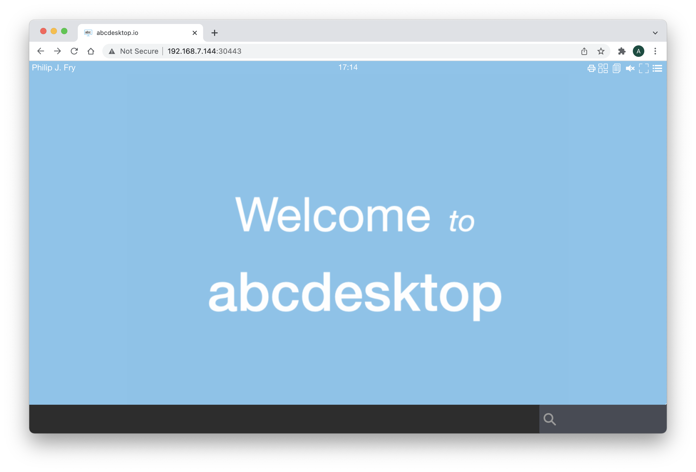
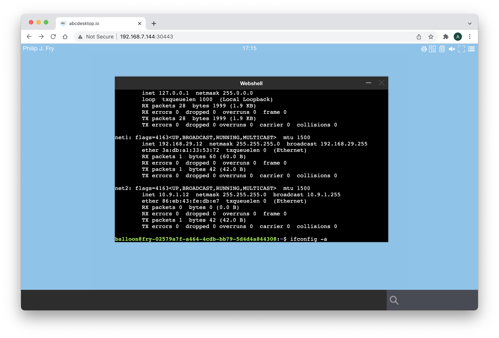
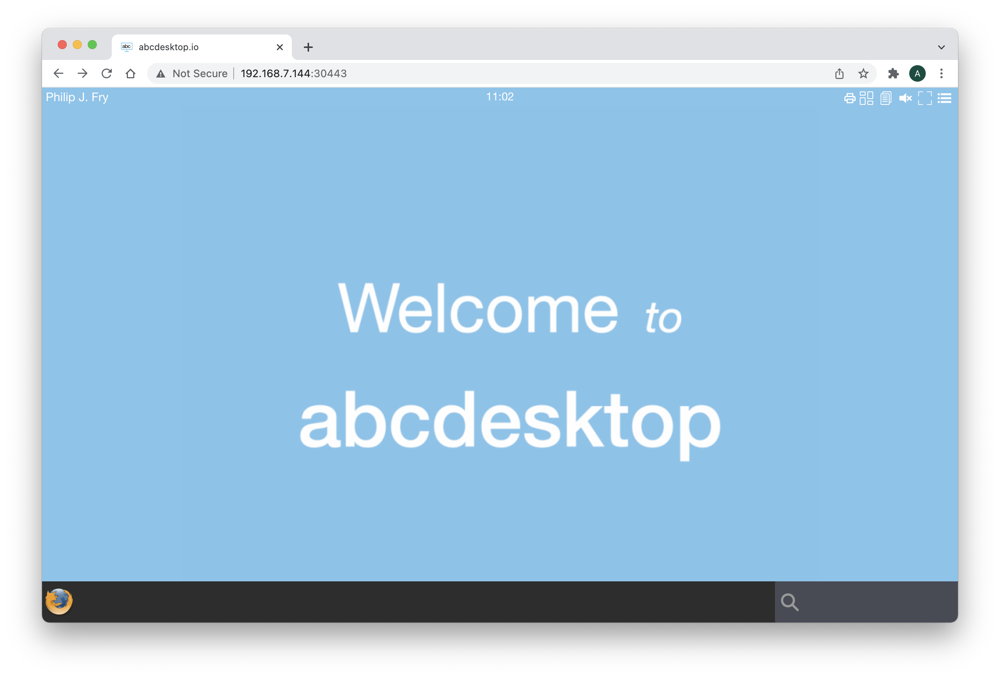

# Setup guide to use abcdesktop.io as bastion service


## Design 

The goal of this setup guide is to install abcdesktio.io as a bastion service, with only one virtual machine


## script and vagrant file


### get script and vagrant file

To get the installation script and the vagrant file, run the command

```
git clone https://github.com/abcdesktopio/vagrant.git
```

- The vagrant file name is [`Vagrantfile.kubernetes.bastion`](https://raw.githubusercontent.com/abcdesktopio/vagrant/main/Vagrantfile.kubernetes.bastion)
- The installation script is [`abcdesktop_kubernetes_bastion.sh`](https://raw.githubusercontent.com/abcdesktopio/vagrant/main/abcdesktop_kubernetes_bastion.sh)


#### start vagrant file to run the `kmaster` vm

Run the command to run the vagrant file 

```
$ cd vagrant
$ VAGRANT_VAGRANTFILE=Vagrantfile.kubernetes.bastion vagrant up
```

This vagrant file defines a vm `kmaster` :

```
kmaster.vm.box = "hashicorp/bionic64"
kmaster.vm.hostname = "kmaster.example.com"
# By default, Vagrant uses a netmask of 255.255.255.0
# config.vm.network :hostonly, "10.11.12.13", :netmask => "255.255.0.0"
kmaster.vm.network "private_network", ip: "172.42.42.100"
kmaster.vm.network "private_network", ip: "10.9.1.100", virtualbox__intnet: true
kmaster.vm.network "private_network", ip: "192.168.29.100", virtualbox__intnet: true
kmaster.vm.network "forwarded_port", guest: 30443, host: 30443
kmaster.vm.provider "virtualbox" do |v|
  v.name = "kmaster"
  v.memory = 4096
  v.cpus = 4
end
kmaster.vm.provision "shell", path: "abcdesktop_kubernetes_bastion.sh"
```

It forward the host tcp port 30443 to guest port 30443 ( mapped as a host port in kubernetes )

All networks are defined as `private_network` to make it simplest as possible.


#### `abcdesktop_kubernetes_bastion.sh` description

`abcdesktop_kubernetes_bastion.sh` takes more than ten minutes to install all services, from an ubuntu bionic 64  `hashicorp/bionic64` : 

- kubernetes 
- abcdesktop
- multus-cni
- multi-networkpolicy 

Read step by step the [`abcdesktop_kubernetes_bastion.sh`](https://raw.githubusercontent.com/abcdesktopio/vagrant/main/abcdesktop_kubernetes_bastion.sh) content to get more details.


### login to get a ssh into the `kmaster` vm

```
VAGRANT_VAGRANTFILE=Vagrantfile.kubernetes.bastion vagrant ssh
```

> List `kube-system` pods and `abcdesktop` pods 

To run kubectl commands inside the master virtual machine

```
export KUBECONFIG=/etc/kubernetes/admin.conf 
```

```
vagrant@kmaster:~$ kubectl get pods -n kube-system
NAME                              READY   STATUS    RESTARTS   AGE
coredns-64897985d-4d57p           1/1     Running   0          11h
coredns-64897985d-qtmkq           1/1     Running   0          11h
etcd-kmaster                      1/1     Running   0          11h
kube-apiserver-kmaster            1/1     Running   0          11h
kube-controller-manager-kmaster   1/1     Running   0          11h
kube-flannel-ds-gskrs             1/1     Running   0          11h
kube-proxy-c566l                  1/1     Running   0          11h
kube-scheduler-kmaster            1/1     Running   0          11h
```

```
vagrant@kmaster:~$ kubectl get pods -n abcdesktop
NAME                            READY   STATUS    RESTARTS   AGE
daemonset-nginx-pt2j6           1/1     Running   0          11h
daemonset-pyos-zqpf7            1/1     Running   0          11h
memcached-od-78578c879-kstcl    1/1     Running   0          11h
mongodb-od-5c68794bb8-wf6sm     1/1     Running   0          11h
openldap-od-558f7959d5-vhbln    1/1     Running   0          11h
speedtest-od-7b66cc656b-fh97g   1/1     Running   0          11h
```


## Login as a user 


### Connect your local abcdesktop

Open your web browser to 

```
http://[your-ip-hostname]:30443/
```

> Replace `[your-ip-hostname]` by the host node IP address

You should get the web page 


### Log in as 

`abcdesktop` adds an OpenLDAP server for testing LDAP applications, i.e. unit tests. The [ldap server](https://github.com/rroemhild/docker-test-openldap) is used to authenticate user. To get more informations about the OpenLDAP server and the account detail, read [ldap server](https://github.com/rroemhild/docker-test-openldap)


| Login Accounts           | Login Password   |
|--------------------------|------------------|
| Hubert J. Farnsworth     | professor        | 
| Philip J. Fry            | fry              | 
| Hermes Conrad            | hermes           | 
| Turanga Leela            | leela            | 
| Bender Bending Rodríguez | bende            | 


Use the credentials, to login

- **Login Account**: `Philip J. Fry`
- **Login Password**: `fry`


### Get the default desktop

After the login, you should get the default desktop.



### Run a web shell process

To start a shell, insert `webshell` as keywords in the search text area :


### Run `ifconfig` command to list network interfaces

In the web shell, run the command


```
$ ifconfig -a
```



This command shows the network interfaces `net1` and `net2` with the associated ip address


## Tag and rules


- Login into your `kmaster` 

```
VAGRANT_VAGRANTFILE=Vagrantfile.kubernetes.bastion vagrant ssh
```

- Become root into your `kmaster` 

```
vagrant@kmaster:~$ sudo bash
```

### Config file `abcdesktop.yaml` 

Open the `abcdesktop.yaml` configuration file, and look at `ldapconfig`

```
    ldapconfig : { 'planet': {  'default'       : True,
                                'ldap_timeout'  : 15,
                                'ldap_protocol' : 'ldap',
                                'ldap_basedn'   : 'ou=people,dc=planetexpress,dc=com',
                                'servers'       : [ 'openldap.abcdesktop.svc.cluster.local' ],
                                'secure'        : False,
                                'serviceaccount': { 'login': 'cn=admin,dc=planetexpress,dc=com', 'password': 'GoodNewsEveryone' },
                                'policies': {
                                    'acls': None,
                                    'rules' : {
                                        'rule-ship': { 'conditions' : [ { 'memberOf': 'cn=ship_crew,ou=people,dc=planetexpress,dc=com',   'expected' : True  } ], 'expected' : True, 'label': 'shipcrew'   },
                                        'rule-test': { 'conditions' : [ { 'memberOf': 'cn=admin_staff,ou=people,dc=planetexpress,dc=com', 'expected' : True  } ], 'expected' : True, 'label': 'adminstaff' } } } } }
```

- `openldap.abcdesktop.svc.cluster.local` is a local ldap server running as a pod

#### Rules description

- `'rule-ship': { 'conditions' : [ { 'memberOf': 'cn=ship_crew,ou=people,dc=planetexpress,dc=com',   'expected' : True  } ], 'expected' : True, 'label': 'shipcrew'   }` 
If a user is member of `'cn=ship_crew,ou=people,dc=planetexpress,dc=com'` then the `label` tag `shipcrew` is set to the user's pod 


- `'rule-admin': { 'conditions' : [ { 'memberOf': 'cn=admin_staff,ou=people,dc=planetexpress,dc=com', 'expected' : True  } ], 'expected' : True, 'label': 'adminstaff' }`
If a user is member of `'cn=admin_staff,ou=people,dc=planetexpress,dc=com'` then the `label` tag `adminstaff` is set to the user's pod 


In the `abcdesktop.yaml` configuration file, and look at the `desktop.policies` and the `network` option

```
 desktop.policies: {
        'rules': {
            'network': {
                'shipcrew': {
                    'annotations' : {
                        'k8s.v1.cni.cncf.io/networks': '[ {"name":"macvlan-conf-eth3"}, { "name":"macvlan-conf-eth2", "default-route": ["10.9.1.100"] } ]'
                    }
                }
            }
        },
        'acls' : {} }
```

If a pod as the `'shipcrew'` tag, then add the network annotations
```
[ 
	{	"name":	"macvlan-conf-eth3"}, 
	{	"name":	"macvlan-conf-eth2", "default-route": ["10.9.1.100"] }
]
```


#### List pods and labels in `abcdesktop` namespace 


To list pod in the `abcdesktop` namespace, run the command

```
export KUBECONFIG=/etc/kubernetes/admin.conf 
kubectl get pods -n abcdesktop 
```

```
root@kmaster:~# export KUBECONFIG=/etc/kubernetes/admin.conf 
root@kmaster:~# kubectl get pods -n abcdesktop
NAME                                       READY   STATUS    RESTARTS   AGE
daemonset-nginx-5dzjc                      1/1     Running   0          151m
daemonset-pyos-szs8h                       1/1     Running   0          151m
fry-02579a7f-a464-4cdb-bb79-5d4d4a844308   3/3     Running   0          86m
memcached-od-78578c879-vx26h               1/1     Running   0          151m
mongodb-od-6568f85897-tgfjb                1/1     Running   0          151m
openldap-od-558f7959d5-qz2kg               1/1     Running   0          151m
speedtest-od-76d578578d-rl8k8              1/1     Running   0          151m
```

#### Describe pods fry 

Run the command 

```
kubectl describe pods YOUR_POD
```

Replace YOUR_POD by your pod 


```
root@kmaster:~# kubectl describe pods fry-02579a7f-a464-4cdb-bb79-5d4d4a844308 -n abcdesktop
Name:         fry-02579a7f-a464-4cdb-bb79-5d4d4a844308
Namespace:    abcdesktop
Priority:     0
Node:         kmaster/10.0.2.15
Start Time:   Mon, 31 Jan 2022 16:14:16 +0000
Labels:       access_provider=planet
              access_userid=FRY
              access_username=philip_j__fry
              broadcast_cookie=f7ee45615acce9c5fbed2607d35471264d6c6c14b5cd5778
              domain=desktop
              netpol/ocuser=true
              pulseaudio_cookie=f7cfdfb7b4227e816f3ad59f9d122fac49674a1a60455951
              shipcrew=true
              type=x11server
              xauthkey=ad9e3675cb184db9b6c9eee4852a94est-od-76d578578d-rl8k8
```

> The label `shipcrew=true` is set

```
Annotations:  k8s.v1.cni.cncf.io/network-status:
                [{
                    "name": "cbr0",
                    "interface": "eth0",
                    "ips": [
                        "10.244.0.12"
                    ],
                    "mac": "06:17:a7:0c:24:9b",
                    "default": true,
                    "dns": {}
                },{
                    "name": "abcdesktop/macvlan-conf-eth3",
                    "interface": "net1",
                    "ips": [
                        "192.168.29.12"
                    ],
                    "mac": "3a:db:a1:33:53:72",
                    "dns": {}
                },{
                    "name": "abcdesktop/macvlan-conf-eth2",
                    "interface": "net2",
                    "ips": [
                        "10.9.1.12"
                    ],
                    "mac": "86:eb:43:fe:db:e7",
                    "dns": {}
                }]
```

> The `Annotations` `k8s.v1.cni.cncf.io/network-status` describes the network interfaces inside the pod.


### Look at the pre installed network rules


Run the command 

```
kubectl get net-attach-def -n abcdesktop
```

```
root@kmaster:~#  kubectl get net-attach-def -n abcdesktop
NAME                AGE
macvlan-conf-eth2   154m
macvlan-conf-eth3   154m
```

Get more details about `macvlan-conf-eth3`

```
root@kmaster:~# kubectl describe net-attach-def macvlan-conf-eth3 -n abcdesktop
Name:         macvlan-conf-eth3
Namespace:    abcdesktop
Labels:       <none>
Annotations:  <none>
API Version:  k8s.cni.cncf.io/v1
Kind:         NetworkAttachmentDefinition
Metadata:
  Creation Timestamp:  2022-01-31T15:10:38Z
  Generation:          1
  Managed Fields:
    API Version:  k8s.cni.cncf.io/v1
    Fields Type:  FieldsV1
    fieldsV1:
      f:metadata:
        f:annotations:
          .:
          f:kubectl.kubernetes.io/last-applied-configuration:
      f:spec:
        .:
        f:config:
    Manager:         kubectl-client-side-apply
    Operation:       Update
    Time:            2022-01-31T15:10:38Z
  Resource Version:  1008
  UID:               a5b0d3a0-52c4-42da-887b-8de73cff2b1c
Spec:
  Config:  { "cniVersion": "0.3.0", "type": "macvlan", "master": "eth3", "mode": "bridge", "ipam": { "type": "host-local", "subnet": "192.168.29.0/24", "rangeStart": "192.168.29.10", "rangeEnd": "192.168.29.99", "gateway": "192.168.29.100" } }
Events:    <none>
```

> `macvlan-conf-eth3` is used by the user's pod.


#### List multi-policy 

To list multi-policy, run the command 

```
kubectl get multi-policy -n abcdesktop
```

```
root@kmaster:~# kubectl get multi-policy -n abcdesktop
NAME                  AGE
mnp-permit-shipcrew   3h
```

And get description about the policy `mnp-permit-shipcrew` 

```
apiVersion: k8s.cni.cncf.io/v1beta1
kind: MultiNetworkPolicy
metadata:
  name: mnp-permit-shipcrew
  namespace: abcdesktop 
  annotations:
    k8s.v1.cni.cncf.io/policy-for: macvlan-conf-eth3
spec:
  podSelector:
    matchLabels:
      shipcrew: 'true' 
  policyTypes:
  - Egress
  egress:
  - to:
    - ipBlock: 
        cidr: 192.168.55.21/32
    - ipBlock:
        cidr: 192.168.55.22/32
    ports:
      - protocol: TCP
        port: 22
```

> If a pod in the `abcdesktop` namespace, contains a label `shipcrew: 'true'` set the `iptables` to permit egress to host `192.168.55.21/32` and `192.168.55.22/32` using protocol `TCP` destination port `22`.


### dump the generated by iptables in `/var/lib/multi-networkpolicy/iptables/` 

- Login into your `kmaster` 

```
VAGRANT_VAGRANTFILE=Vagrantfile.kubernetes.bastion vagrant ssh
```

- Become root into your `kmaster` 

```
vagrant@kmaster:~$ sudo bash
```

- list the directories `/var/lib/multi-networkpolicy/iptables/` in `kmaster`

```
root@kmaster:~# ls /var/lib/multi-networkpolicy/iptables/
afe82680-77b4-4bac-ad2b-8be9488402fb
```

A new `afe82680-77b4-4bac-ad2b-8be9488402fb` exists


- cat the `current.iptables` file content in the `/var/lib/multi-networkpolicy/iptables/
afe82680-77b4-4bac-ad2b-8be9488402fb`

```
root@kmaster:~# cat /var/lib/multi-networkpolicy/iptables/afe82680-77b4-4bac-ad2b-8be9488402fb/current.iptables 
# Generated by iptables-save v1.4.21 on Mon Jan 31 16:16:22 2022
*mangle
:PREROUTING ACCEPT [441:57462]
:INPUT ACCEPT [441:57462]
:FORWARD ACCEPT [0:0]
:OUTPUT ACCEPT [370:150632]
:POSTROUTING ACCEPT [367:150476]
COMMIT
# Completed on Mon Jan 31 16:16:22 2022
# Generated by iptables-save v1.4.21 on Mon Jan 31 16:16:22 2022
*filter
:INPUT ACCEPT [0:0]
:FORWARD ACCEPT [0:0]
:OUTPUT ACCEPT [0:0]
:MULTI-0-EGRESS - [0:0]
:MULTI-0-EGRESS-0-PORTS - [0:0]
:MULTI-0-EGRESS-0-TO - [0:0]
:MULTI-EGRESS - [0:0]
:MULTI-INGRESS - [0:0]
-A INPUT -i net2 -j MULTI-INGRESS
-A INPUT -i net1 -j MULTI-INGRESS
-A OUTPUT -o net2 -j MULTI-EGRESS
-A OUTPUT -o net1 -j MULTI-EGRESS
-A MULTI-0-EGRESS -j MARK --set-xmark 0x0/0x30000
-A MULTI-0-EGRESS -j MULTI-0-EGRESS-0-PORTS
-A MULTI-0-EGRESS -j MULTI-0-EGRESS-0-TO
-A MULTI-0-EGRESS -m mark --mark 0x30000/0x30000 -j RETURN
-A MULTI-0-EGRESS -j DROP
-A MULTI-0-EGRESS-0-PORTS -o net1 -p tcp -m tcp --dport 22 -j MARK --set-xmark 0x10000/0x10000
-A MULTI-0-EGRESS-0-TO -d 192.168.55.21/32 -o net1 -j MARK --set-xmark 0x20000/0x20000
-A MULTI-0-EGRESS-0-TO -d 192.168.55.22/32 -o net1 -j MARK --set-xmark 0x20000/0x20000
-A MULTI-EGRESS -o net1 -m comment --comment "policy:mnp-permit-shipcrew net-attach-def:abcdesktop/macvlan-conf-eth3" -j MULTI-0-EGRESS
COMMIT
# Completed on Mon Jan 31 16:16:22 2022
# Generated by iptables-save v1.4.21 on Mon Jan 31 16:16:22 2022
*nat
```


### Add some applications to your desktop

For abcdesktop a desktop application is a container image. To add an application you just need to pull an container image.

- Login into your `kmaster` 

```
VAGRANT_VAGRANTFILE=Vagrantfile.kubernetes.bastion vagrant ssh
```

- Become root into your `kmaster` 

```
vagrant@kmaster:~$ sudo bash
```

- list your docker images

```
root@kmaster:~# docker images
REPOSITORY                                                  TAG       IMAGE ID       CREATED         SIZE
abcdesktopio/oc.pyos                                        dev       6bd8b8d33b73   19 hours ago    1.17GB
rancher/mirrored-flannelcni-flannel                         v0.16.3   8cb5de74f107   3 days ago      59.7MB
memcached                                                   latest    fa6cf68061c2   5 days ago      89.1MB
k8s.gcr.io/kube-apiserver                                   v1.23.3   f40be0088a83   6 days ago      135MB
k8s.gcr.io/kube-controller-manager                          v1.23.3   b07520cd7ab7   6 days ago      125MB
k8s.gcr.io/kube-scheduler                                   v1.23.3   99a3486be4f2   6 days ago      53.5MB
k8s.gcr.io/kube-proxy                                       v1.23.3   9b7cc9982109   6 days ago      112MB
abcdesktopio/oc.user.18.04                                  latest    52176672cf2e   7 days ago      1.79GB
abcdesktopio/oc.user.ssh.18.04                              dev       52176672cf2e   7 days ago      1.79GB
ghcr.io/k8snetworkplumbingwg/multi-networkpolicy-iptables   latest    54838d8bbd14   10 days ago     408MB
rancher/mirrored-flannelcni-flannel-cni-plugin              v1.0.1    ac40ce625740   12 days ago     8.1MB
abcdesktopio/oc.nginx                                       dev       fe71c8621ef2   12 days ago     506MB
abcdesktopio/oc.pulseaudio.18.04                            dev       d44997a46969   2 months ago    170MB
abcdesktopio/oc.pulseaudio.18.04                            latest    d44997a46969   2 months ago    170MB
k8s.gcr.io/etcd                                             3.5.1-0   25f8c7f3da61   3 months ago    293MB
ghcr.io/k8snetworkplumbingwg/multus-cni                     stable    e6cafb5d5aa1   3 months ago    290MB
k8s.gcr.io/coredns/coredns                                  v1.8.6    a4ca41631cc7   3 months ago    46.8MB
abcdesktopio/oc.cupsd.18.04                                 dev       095105a59722   4 months ago    745MB
abcdesktopio/oc.cupsd.18.04                                 latest    095105a59722   4 months ago    745MB
k8s.gcr.io/pause                                            3.6       6270bb605e12   5 months ago    683kB
rroemhild/test-openldap                                     latest    c6b1bec361ca   10 months ago   144MB
abcdesktopio/oc.mongo                                       latest    802219537d3b   12 months ago   493MB
abcdesktopio/oc.speedtest                                   dev       298a391cfb5b   3 years ago     355MB
```


- Add new application images 

To add an application like Firefox, run the `docker pull` command :

```
root@kmaster:~# docker pull abcdesktopio/firefox.d:dev
```

```
docker pull abcdesktopio/firefox.d:dev
dev: Pulling from abcdesktopio/firefox.d
7b1a6ab2e44d: Already exists 
2371f0a6d5ec: Already exists 
b55247ebc792: Already exists 
38b40dedf719: Already exists 
a609cdbac5b4: Already exists 
f2e98da86f69: Already exists 
8589cdafb8d3: Already exists 
f110041cad0c: Already exists 
8d2557b365eb: Already exists 
0de73c57e07d: Already exists 
165ea38f2f53: Already exists 
66b43fff8150: Already exists 
ccc0386d04e3: Already exists 
26d822b9fccb: Already exists 
d489c5be8f43: Already exists 
c342009660e3: Already exists 
e2006e25f603: Already exists 
612638393a03: Already exists 
dae51e73d8bc: Already exists 
07243e67b561: Pull complete 
2ee8a212fe21: Pull complete 
19e557a0567c: Pull complete 
ff417f05521e: Pull complete 
539fd422158e: Pull complete 
ef5cf2280d59: Pull complete 
24d2ecc0cc9a: Pull complete 
9dc58ab20296: Pull complete 
aba0cc69761b: Pull complete 
Digest: sha256:454657f20f7a09d45dc8ac4f4d3263360480c15f69bece280dd06b8d1647ad7f
Status: Downloaded newer image for abcdesktopio/firefox.d:dev
docker.io/abcdesktopio/firefox.d:dev
```


### Reload the web browser page 


### Connect your local abcdesktop

Reload or open your web browser 

```
http://[your-ip-hostname]:30443/
```



Firefox is added to your desktop dock.
Start Firefox application

> No rule has be defined to allow http request from your pod to a web site


> All http requests are denied 


The firefox application inherits from the pod's the network rules.


## Troubleshooting 

If you choose to use VMware instead of VirtualBox hypervisor

### Notes about the `macvlan` driver :

Macvlan allows you to configure sub-interfaces of a parent, physical Ethernet interface, each with its **own unique MAC address**, and consequently its own IP address. Applications, VMs and containers can then bind to a specific sub-interface to connect directly to the physical network, using their own MAC and IP address.

#### `macvlan` driver on vSwitch VMware
 
 The security policy of a virtual switch includes a MAC address changes option. This option allows virtual machines to receive frames with a Mac Address that is different from the one configured in the VMX.
 
 When the Mac address changes option is set to Accept, ESXi accepts requests to change the effective MAC address of a virtual machine to a different address than the initial MAC address.

> Set the Mac address changes option is set to **Accept**

     