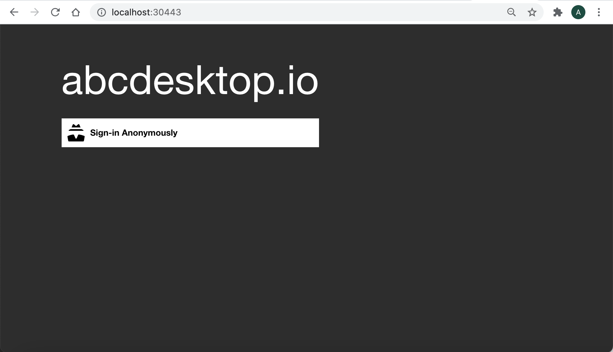
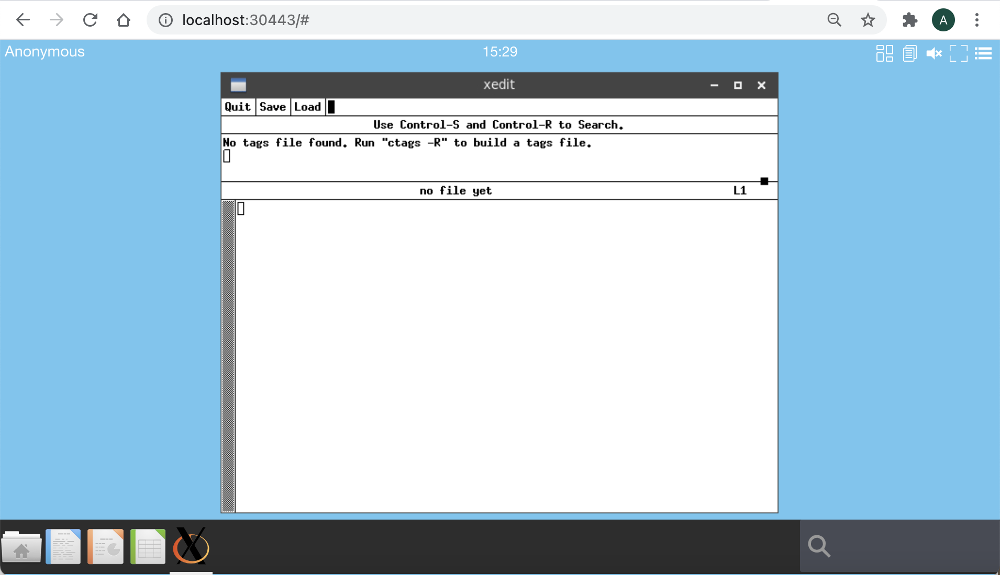

# Define access control list for application


## Goals
* restrict access to applications using authentication label 

## Requirements

- A running dockerd last version 
- An access to the docker public registry
- An access to the ubuntu repository
- Nodejs installed on your host.  


## Update applist.json file 

 
To restrict access to applications using authentication label, you need to define an `acl` entry in the application dictionary object.

```
    "acl": { "permit": [ "tag" ] },
```

For example using the application `xedit`

`all` is a special label for everything. The `xedit` application can be run for all tags.

```
{
    "acl": { "permit": [ "all" ] },
    "cat": "utilities",
    "debpackage": "x11-apps",
    "icon": "xedit.svg",
    "keyword": "text,notepad,edit,txt,editor,xedit",
    "launch": "xedit.Xedit",
    "name": "xedit",
    "displayname": "Xedit",
    "path": "/usr/bin/xedit",
    "template": "abcdesktopio/oc.template.gtk",
    "mimetype": "application/text;",
    "fileextensions":"txt;log;md"
}
```

To restrict access to applications using authentication label, you have to define label using rules during authentification step, and define label to the application.


## Define authenticated label using rules

You can read the chapter [authentification-rules](/config/authentification-rules) to define some autenticated labels.


Update the od.config file, to add a label `mylocal` if the source ip address is in local network `192.168.0.0/16`

```
authmanagers: {
 'external': {},
 'explicit': {},
 'implicit': {
   'providers': {
     'anonymous': {
        'displayname': 'Anonymous',
        'caption': 'Have a look !',
        'userid': 'anonymous',
        'username': 'Anonymous',
        'policies': { 
          'acl'   : { 'permit': [ 'all' ] }, 
			'rules' : 
			    { 'rule-net-home': {  
			   	    'conditions' : [ { 'network': '192.168.0.0/16', 'expected' : True } ],
                    'expected'   : True,
                    'label'      : 'localnet'
                   } 
                } 
        } 
     } 
    } 
  } 
} 

```

Restart the pyos service 

```
kubectl delete pod -l run-pyos-od -n abcdesktop
```

When your services are restarted, launch your web browser



Login to your abcdesktop service and choose anonymous authentication


Check the label set during the authentication process

Goto the menu option at the right up corner, choose `Settings` | `User` | `Session` 


You should read the label `localnet` in the Anonymous user information.


## Define the acl label to the application

You can read the chapter [Build your own application image ](/buildapplicationsgnulinux/), if your are building user docker abcdsktop application image for the first time.

### Create a xedit.json file 

Create a edit.json file with the content :

```
{
    "acl": { "permit": [ "localhost", "localnet"  ] },
    "cat": "utilities",
    "debpackage": "x11-apps",
    "icon": "xedit.svg",
    "keyword": "text,notepad,edit,txt,editor,xedit",
    "launch": "xedit.Xedit",
    "name": "xedit",
    "displayname": "Xedit",
    "path": "/usr/bin/xedit",
    "template": "abcdesktopio/oc.template.gtk",
    "mimetype": "application/text;",
    "fileextensions":"txt;log;md"
}
```

To build your new image, download the [make.js](https://raw.githubusercontent.com/abcdesktopio/oc.apps/main/make.js) script file. `make.js` is located in the `oc.apps` repository. Look at [https://github.com/abcdesktopio/oc.apps](https://github.com/abcdesktopio/oc.apps) if you can't download this file. 

Make sure that you have installed `nodejs`

To install `make.js` command 


```
wget https://raw.githubusercontent.com/abcdesktopio/oc.apps/main/make.js
```

Create `icons` directory

```
mkdir -p icons
curl --output icons/xedit.svg https://raw.githubusercontent.com/abcdesktopio/oc.apps/main/icons/xedit.svg 
```

Run the make command 

```
node make.js -f xedit.json Dockerfile
```

You should read on standard output 

```
myArgs:  [ '-f', 'xedit.json', 'Dockerfile' ]
opening file xedit.json
applist.json entries: 1
myArgs:  [ '-f', 'xedit.json', 'Dockerfile' ]
Building file Dockerfile as output
{
  acl: { permit: [ 'all' ] },
  cat: 'utilities',
  debpackage: 'x11-apps',
  icon: 'xedit.svg',
  keyword: 'text,notepad,edit,txt,editor,xedit',
  launch: 'xedit.Xedit',
  name: 'xedit',
  displayname: 'Xedit',
  path: '/usr/bin/xedit',
  template: 'abcdesktopio/oc.template.gtk',
  mimetype: 'application/text;',
  fileextensions: 'txt;log;md'
}
Building xedit.Xedit
```

Look at the new `Dockerfile`, and build the new docker image for `xedit` 

 
``` 
docker build -t xedit.d .
```
You should read on standard output

``` 
[+] Building 13.0s (11/11) FINISHED                                                                                                                                                                     
 => [internal] load build definition from Dockerfile                                                                                                                                               0.0s
 => => transferring dockerfile: 2.01kB                                                                                                                                                             0.0s
 => [internal] load .dockerignore                                                                                                                                                                  0.0s
 => => transferring context: 2B                                                                                                                                                                    0.0s
 => [internal] load metadata for docker.io/abcdesktopio/oc.template.gtk:dev                                                                                                                        2.3s
 => [auth] abcdesktopio/oc.template.gtk:pull token for registry-1.docker.io                                                                                                                        0.0s
 => [1/6] FROM docker.io/abcdesktopio/oc.template.gtk:dev@sha256:4aac32209c27a3e88906f39aecdfee6833bed022871366356bfd5518e2248b79                                                                  0.4s
 => => resolve docker.io/abcdesktopio/oc.template.gtk:dev@sha256:4aac32209c27a3e88906f39aecdfee6833bed022871366356bfd5518e2248b79                                                                  0.0s
 => => sha256:4aac32209c27a3e88906f39aecdfee6833bed022871366356bfd5518e2248b79 3.88kB / 3.88kB                                                                                                     0.0s
 => => sha256:fe01ec1c214baf8b3e86255ac7dbca3157be4932ae19dfe07bbcf7d8c8839b07 7.80kB / 7.80kB                                                                                                     0.0s
 => [2/6] RUN DEBIAN_FRONTEND=noninteractive apt-get update && apt-get install -y  --no-install-recommends x11-apps && apt-get clean                                                               8.7s
 => [3/6] RUN echo 'debconf debconf/frontend select Noninteractive' | debconf-set-selections                                                                                                       0.4s
 => [4/6] RUN  if [ -d /usr/share/icons ];   then cd /usr/share/icons;    /composer/safelinks.sh; fi                                                                                               0.3s 
 => [5/6] RUN  if [ -d /usr/share/pixmaps ]; then cd /usr/share/pixmaps;  /composer/safelinks.sh; fi                                                                                               0.3s 
 => [6/6] WORKDIR /home/balloon                                                                                                                                                                    0.0s 
 => exporting to image                                                                                                                                                                             0.3s 
 => => exporting layers                                                                                                                                                                            0.3s 
 => => writing image sha256:0b7cb908c88bf6301eb0555e558e99436e40bd5604e7ffebd12f137e9b5f9878                                                                                                       0.0s
 => => naming to docker.io/library/xedit.d  
``` 

Then look at the acl label

``` 
docker inspect xedit.d | grep oc.acl
``` 

``` 
                "oc.acl": "{\"permit\":[\"localhost\",\"localnet\"]}",
                "oc.acl": "{\"permit\":[\"localhost\",\"localnet\"]}",
``` 

The acl is stringified json object.


## Run the xedit application from your local network

The xedit application is listed only if your are connected from a local network matching the previous rules.

Look for the application `xedit`, using the quick launch search text area on the bottom right corner. Insert the first character of xedit :


Launch the `xedit` application



## Run the application from another source IP address or update the acl application

### Update acl of xedit application

To update the `acl` of `xedit` application, edit the edit.json file with the content, and set `nowhere` tag in `acl` array :

```
{
    "acl": { "permit": [ "nowhere"  ] },
    "cat": "utilities",
    "debpackage": "x11-apps",
    "icon": "xedit.svg",
    "keyword": "text,notepad,edit,txt,editor,xedit",
    "launch": "xedit.Xedit",
    "name": "xedit",
    "displayname": "Xedit",
    "path": "/usr/bin/xedit",
    "template": "abcdesktopio/oc.template.gtk",
    "mimetype": "application/text;",
    "fileextensions":"txt;log;md"
}
```

Then, rebuild `Dockerfile` and the `docker image` of the xedit application


```
node make.js -f xedit.json Dockerfile
docker build -t xedit.d .
```

```
% node make.js -f xedit.json Dockerfile
myArgs:  [ '-f', 'xedit.json', 'Dockerfile' ]
opening file xedit.json
applist.json entries: 1
myArgs:  [ '-f', 'xedit.json', 'Dockerfile' ]
Building file Dockerfile as output
{
  acl: { permit: [ 'nowhere' ] },
  cat: 'utilities',
  debpackage: 'x11-apps',
  icon: 'xedit.svg',
  keyword: 'text,notepad,edit,txt,editor,xedit',
  launch: 'xedit.Xedit',
  name: 'xedit',
  displayname: 'Xedit',
  path: '/usr/bin/xedit',
  template: 'abcdesktopio/oc.template.gtk',
  mimetype: 'application/text;',
  fileextensions: 'txt;log;md'
}
Building xedit.Xedit

% docker build -t xedit.d .
[+] Building 1.5s (11/11) FINISHED                                                                                                                                                                      
 => [internal] load build definition from Dockerfile                                                                                                                                               0.0s
 => => transferring dockerfile: 4.19kB                                                                                                                                                             0.0s
 => [internal] load .dockerignore                                                                                                                                                                  0.0s
 => => transferring context: 2B                                                                                                                                                                    0.0s
 => [internal] load metadata for docker.io/abcdesktopio/oc.template.gtk:dev                                                                                                                        1.4s
 => [auth] abcdesktopio/oc.template.gtk:pull token for registry-1.docker.io                                                                                                                        0.0s
 => [1/6] FROM docker.io/abcdesktopio/oc.template.gtk:dev@sha256:4aac32209c27a3e88906f39aecdfee6833bed022871366356bfd5518e2248b79                                                                  0.0s
 => CACHED [2/6] RUN DEBIAN_FRONTEND=noninteractive apt-get update && apt-get install -y  --no-install-recommends x11-apps && apt-get clean                                                        0.0s
 => CACHED [3/6] RUN echo 'debconf debconf/frontend select Noninteractive' | debconf-set-selections                                                                                                0.0s
 => CACHED [4/6] RUN  if [ -d /usr/share/icons ];   then cd /usr/share/icons;    /composer/safelinks.sh; fi                                                                                        0.0s
 => CACHED [5/6] RUN  if [ -d /usr/share/pixmaps ]; then cd /usr/share/pixmaps;  /composer/safelinks.sh; fi                                                                                        0.0s
 => CACHED [6/6] WORKDIR /home/balloon                                                                                                                                                             0.0s
 => exporting to image                                                                                                                                                                             0.0s
 => => exporting layers                                                                                                                                                                            0.0s
 => => writing image sha256:640a4dd66b03420c4128e2fcd920dc5749cc5b687abc62b68e52f3c562943903                                                                                                       0.0s
 => => naming to docker.io/library/xedit.d       
```

Launch your web browser, and log in to your abcdesktop service

Check that `xedit` is not found and not listed.


The new `acl` does not allow the `xedit` application to be run and show.
You can now define your own rules, add set the access control list to your applications.


