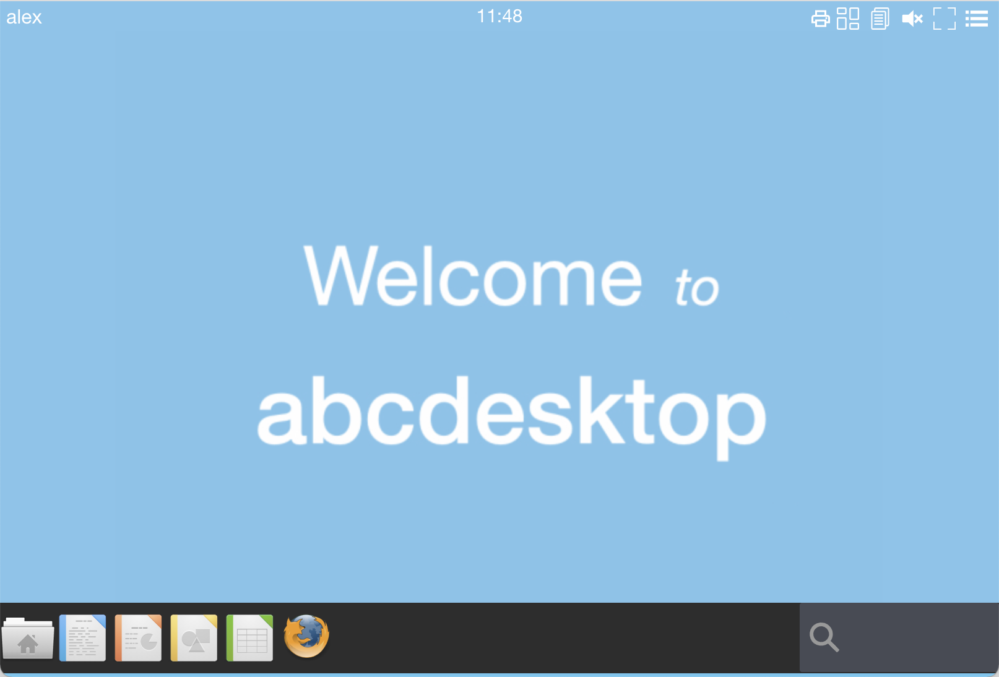
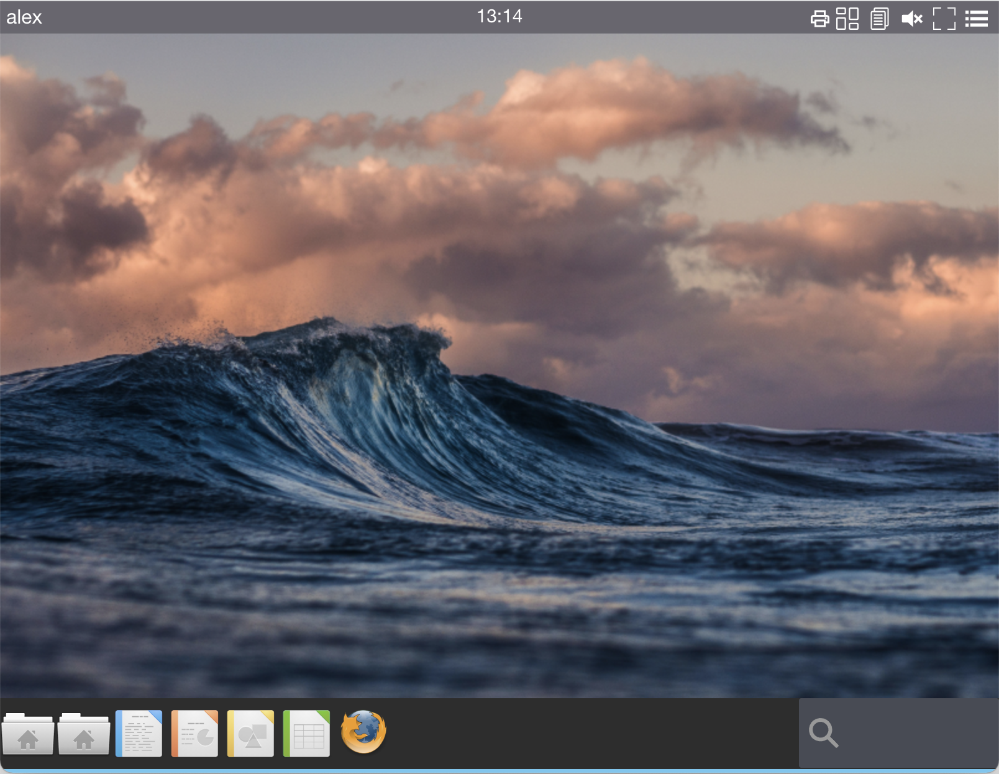

# Customize default wallpaper


## Requirements 


## Goals

* Change the default wallpaper and use your own


## Change od.config file

To update the default wallpaper file, add a ```ENV``` variable in the ```desktop.envlocal``` dictionary.

* Add the new entry ```SET_DEFAULT_WALLPAPER``` to the value like ```welcometoabcdesktop.png```. The file ```welcometoabcdesktop.png``` already exists in the ```/composer/wallpapers``` directory of your abcdesktopio/oc.user.XX.YY container image.

```
desktop.envlocal :  {   'DISPLAY'               : ':0.0',
                        'USER'                  : 'balloon',
                        'LOGNAME'               : 'balloon',
                        'LIBOVERLAY_SCROLLBAR'  : '0',
                        'UBUNTU_MENUPROXY'      : '0',
                        'HOME'                  : '/home/balloon',
			              'SET_DEFAULT_WALLPAPER' : 'welcometoabcdesktop.png'
                    } 
```

* Restart your pyos daemon, to make sure that the ```ENV``` dictionary will be use to start a new user container.
* Login on your abcdesktop service, your should see the wallpaper file:




## Update oc.user image to add your own wallpaper

### Find a new wallpaper image

* Download a new wallpaper image, for example I choose the file on [unsplash.com](https://unsplash.com) web site [wallpaper unsplash from Silas Baisch](https://unsplash.com/photos/ceITO2rlDgc)
* Rename the downloaded file as silas-baisch-unsplash.jpg

### Create a new oc.user image


* Create a Dockerfile to copy the new wallpaper file in `/composer/wallpapers` directory

Not For a development environment, add the TAG dev

```
FROM abcdesktopio/oc.user.18.04:dev 
USER root
COPY silas-baisch-unsplash.jpg /composer/wallpapers
USER balloon
```


* Build the new docker image


To build the new docker image, run the command line

```
docker build -t abcdesktopio/oc.user.18.04 .
```

You should read on the standard output :

```
Sending build context to Docker daemon  3.184MB
Step 1/4 : FROM abcdesktopio/oc.user.18.04:dev
 ---> 61bfdb4e71d4
Step 2/4 : USER root
 ---> Using cache
 ---> c1aa17b9999c
Step 3/4 : COPY silas-baisch-unsplash.jpg /composer/wallpapers
 ---> 73c786ecca04
Step 4/4 : USER balloon
 ---> Running in 1e0ad794c0cb
Removing intermediate container 1e0ad794c0cb
 ---> a0b12a183b47
Successfully built a0b12a183b47
Successfully tagged abcdesktopio/oc.user.18.04:dev
```


## Change od.config file

To update the default wallpaper file, add a `ENV` variable in the `desktop.envlocal` dictionary.

* Add the new entry `SET_DEFAULT_WALLPAPER` to the value like `silas-baisch-unsplash.jpg`. The file `silas-baisch-unsplash.jpg` exists in the `/composer/wallpapers` directory of your **new** `abcdesktopio/oc.user.18.04` container image.

```
desktop.envlocal :  {   'DISPLAY'               : ':0.0',
                        'USER'                  : 'balloon',
                        'LOGNAME'               : 'balloon',
                        'LIBOVERLAY_SCROLLBAR'  : '0',
                        'UBUNTU_MENUPROXY'      : '0',
                        'HOME'                  : '/home/balloon',
			              'SET_DEFAULT_WALLPAPER' : 'silas-baisch-unsplash.jpg'
                    } 
```

* Restart your pyos daemon, to make sure that the `ENV` dictionary will be use to start a new user container.
* Login on your abcdesktop service, your should see the wallpaper :




