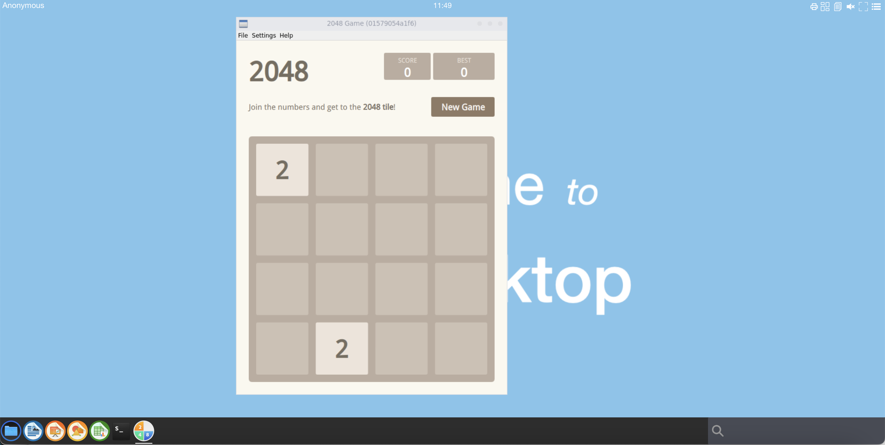
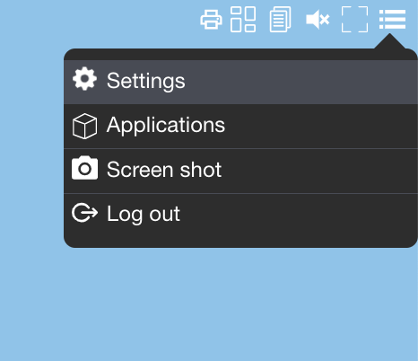
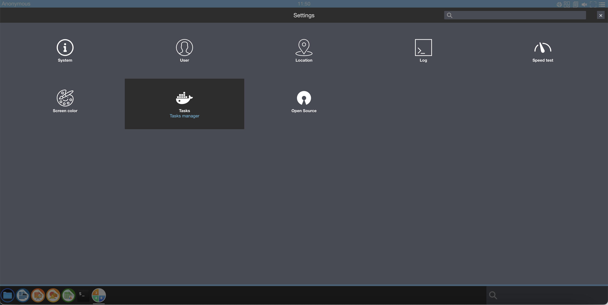
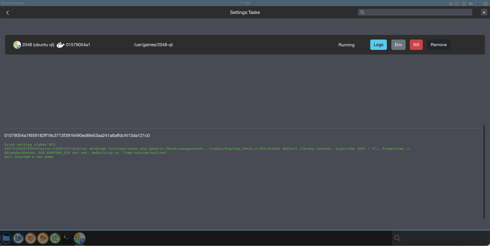
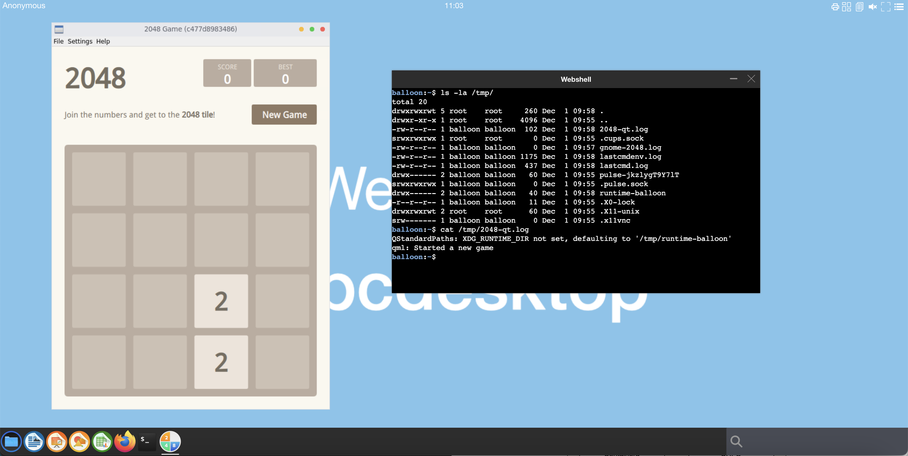
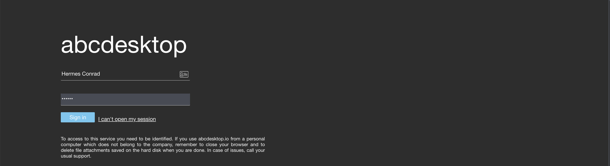
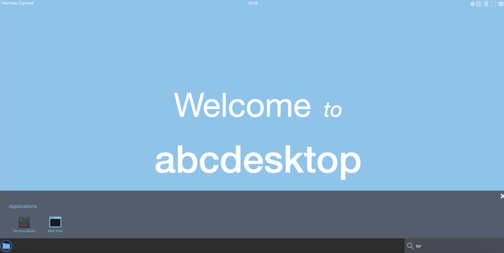
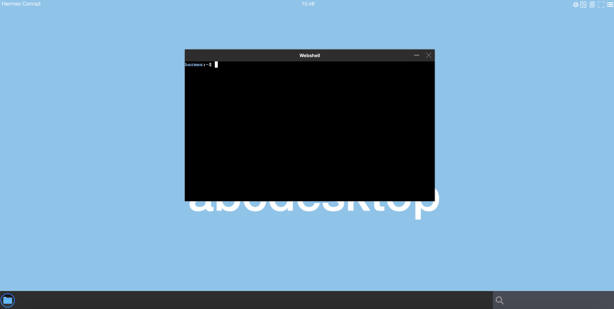
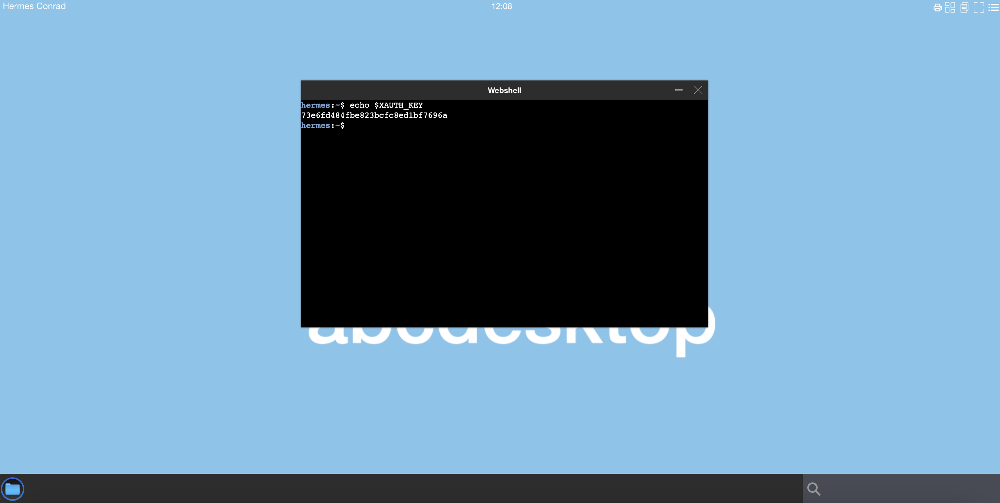
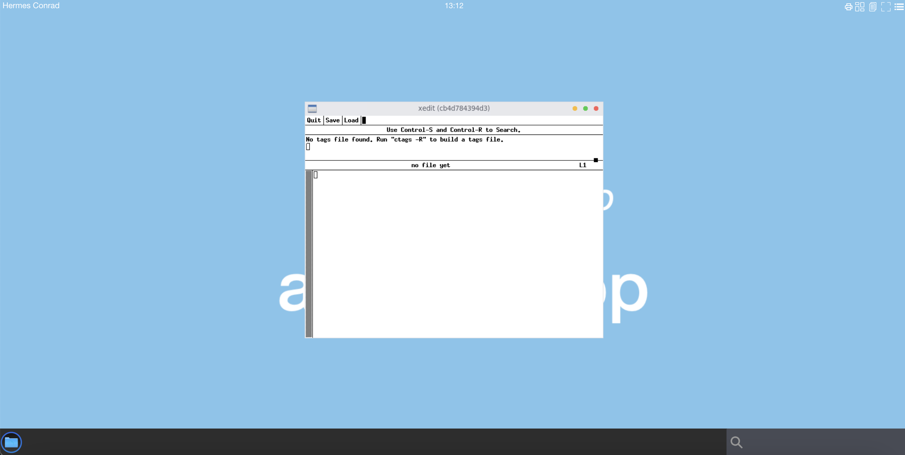

# How to debug containerised application in abcdesktop


## Requirements 

* `jq` package should be install on your Linux
* `docker` or `ctr` package should be install on your Linux

In this example, I use `docker` command but you can easily convert it as `ctr` (containerd CLI) command

## Goals

* Read log from web interface
* Read stdout and stderr, dump all environment variables, and entrypoint log, to troubleshoot application error and get quick informations
* Create a new containerised application from scratch using pod volume mapping


## Read log from web interface

Start an containerised application, I choose `2048` application, for example.



Using the web browser, choose `Settings` in the menu.



Choose `Tasks` to list all running containers



Choose `Logs` to read the stdout log file of an application



This application write on `stdout`

```
Error setting cipher RC4
40F7D1D5D07F0000:error:0308010C:digital envelope routines:inner_evp_generic_fetch:unsupported:../crypto/evp/evp_fetch.c:349:Global default library context, Algorithm (RC4 : 37), Properties ()
QStandardPaths: XDG_RUNTIME_DIR not set, defaulting to '/tmp/runtime-balloon'
qml: Started a new game
```


> You will read the sample stdout line, using a `docker logs` command


Look for the `container id` of the `2048` containerised application

```bash
$ docker ps -a|grep 2048
01579054a1f6   abcdesktopio/ubuntu-2048.d:3.0   "/composer/appli-doc…"   21 minutes ago      Up 21 minutes                                                                   anonymous-ubuntu-2048-37830ad00d9f473aa4d0c7872089c6b8
```

Read the log file form the `docker logs` command

```bash
$ docker logs 01579054a1f6
```

You should read on output the same lines writed on the web interface

```
Error setting cipher RC4
40F7D1D5D07F0000:error:0308010C:digital envelope routines:inner_evp_generic_fetch:unsupported:../crypto/evp/evp_fetch.c:349:Global default library context, Algorithm (RC4 : 37), Properties ()
QStandardPaths: XDG_RUNTIME_DIR not set, defaulting to '/tmp/runtime-balloon'
qml: Started a new game
```


## Debug an application using `stderr` and `stdout`


The main log files are `lastcmd.log` `lastcmdenv.log` and `$APPBIN.log`:

- `/tmp/lastcmd.log` : contains the stdout file of the init script command `/composer/appli-docker-entrypoint.sh` for latest running application
- `/tmp/lastcmdenv.log`: contains the dump of all environment variables for latest running application
- `/tmp/$APPBIN.log`: contains `stderr` and `stdout` of the application `$APPBIN`. `$APPBIN` should be replace by the name of your binary application filename.


By default, with all abcdesktop templates, applications redirect `stderr` to `stdout` and pipe to a tee.


```
${APP} ${ARGS} "${APPARGS}" 2>&1 | tee /tmp/$BASENAME_APP.log
```

By default, the `/tmp` volume is shared with all containers.
So to debug and read log applications, you can run a `webshell` to have an access to `stdout` and `stderr` content.

The var `$BASENAME_APP` is the name of your application

```
BASENAME_APP=$(basename "$APPBIN")
```

and `APPBIN` is `path` to the binary

Example with the `2048-qt` application

```
APPBIN=/usr/games/2048-qt
```



The `/tmp` directory, you can read the log file '/tmp/2048-qt.log'. Look at the `/tmp` directory

```
balloon:~$ ls -la /tmp/
total 20
drwxrwxrwt 5 root    root     260 Dec  1 09:58 .
drwxr-xr-x 1 root    root    4096 Dec  1 09:55 ..
-rw-r--r-- 1 balloon balloon  102 Dec  1 09:58 2048-qt.log
srwxrwxrwx 1 root    root       0 Dec  1 09:55 .cups.sock
-rw-r--r-- 1 balloon balloon    0 Dec  1 09:57 gnome-2048.log
-rw-r--r-- 1 balloon balloon 1175 Dec  1 09:58 lastcmdenv.log
-rw-r--r-- 1 balloon balloon  437 Dec  1 09:58 lastcmd.log
drwx------ 2 balloon balloon   60 Dec  1 09:55 pulse-jkzlygT9Y7lT
srwxrwxrwx 1 balloon balloon    0 Dec  1 09:55 .pulse.sock
drwx------ 2 balloon balloon   40 Dec  1 09:58 runtime-balloon
-r--r--r-- 1 balloon balloon   11 Dec  1 09:55 .X0-lock
drwxrwxrwt 2 root    root      60 Dec  1 09:55 .X11-unix
srw------- 1 balloon balloon    0 Dec  1 09:55 .x11vnc
balloon:~$
```

The main files are `/tmp/lastcmd.log`, `/tmp/lastcmdenv.log` and `/tmp/2048-qt.log`.


Dump the `/tmp/2048-qt.log`, with a cat command `cat /tmp/2048-qt.log`. Replace `/tmp/2048-qt.log` by your own application (binary) if you choose another application.


```
balloon:~$ cat /tmp/2048-qt.log 
QStandardPaths: XDG_RUNTIME_DIR not set, defaulting to '/tmp/runtime-balloon'
qml: Started a new game
```


Dump the `/composer/appli-docker-entrypoint.sh` result in `/tmp/lastcmd.log`, with a cat command `cat /tmp/lastcmd.log`.


```
balloon:~$ cat /tmp/lastcmd.log 
APP=/usr/bin/gnome-2048
ARGS=
APPARGS=
run previous init overlay stack
run init app if exists
BASENAME_APP=gnome-2048
xauth add :0.0 MIT-MAGIC-COOKIE-1 55dd9838e9404e3b13b635153365d3
setting pulseaudio cookie
end of app exit_code=0
```

Dump all environment variables in file `/tmp/lastcmdenv.log`.

```
balloon:/tmp$ cat /tmp/lastcmdenv.log 
BUSER=balloon
SENDCUTTEXT=enabled
PARENT_ID=2eecb67f5408c2552e7ee78b4fa2c9a419e9af9557c12c4d2f9f5c4fd1af70f4
APPBIN=/usr/games/2048-qt
HOSTNAME=c477d8983486
LANGUAGE=en_US
STDOUT_LOGFILE=/tmp/lastcmd.log
LC_ADDRESS=en_US.UTF-8
CUPS_SERVER=/tmp/.cups.sock
LIBOVERLAY_SCROLLBAR=0
LC_MONETARY=en_US.UTF-8
PULSEAUDIO_COOKIE=17de4db317fbf10624911dbe28c528bd
PWD=/home/balloon
LOGNAME=balloon
XAUTH_KEY=55dd9838e9404e3b13b635153365d3
TZ=Europe/Paris
HOME=/home/balloon
LC_PAPER=en_US.UTF-8
LANG=en_US.UTF-8
ACCEPTCUTTEXT=enabled
APP=/usr/games/2048-qt
APPNAME=ubuntu-2048
DEBCONF_FRONTEND=noninteractive
SET_DEFAULT_WALLPAPER=welcometoabcdesktop.png
TERM=linux
LC_IDENTIFICATION=en_US.UTF-8
USER=balloon
DISPLAY=:0.0
SHLVL=1
LC_TELEPHONE=en_US.UTF-8
LC_MEASUREMENT=en_US.UTF-8
UBUNTU_MENUPROXY=0
STDOUT_ENVLOGFILE=/tmp/lastcmdenv.log
BROADCAST_COOKIE=b7bc93457df5aa6bedb5ad2fe972268fa268bf3439b4024c
LC_TIME=en_US.UTF-8
LC_ALL=en_US.UTF-8
PATH=/usr/local/sbin:/usr/local/bin:/usr/sbin:/usr/bin:/sbin:/bin
PULSE_SERVER=/tmp/.pulse.sock
LC_NUMERIC=en_US.UTF-8
```


## Debug an application using a new container

We are starting a new containerised application from a fresh `ubuntu:22.04` image and bind the X11 socket to use the pod DISPLAY.


### Start a new abcdesktop session

Login in as hermes 




### for release 3.0 Start `webshell` client instance

Write `webshell` or `terminal` in the application search bar



The new `webshell` window is opened



Run the command `echo $XAUTH_KEY` to read the `$XAUTH_KEY` value, and copy the value for a next usage.



```bash
$ echo $XAUTH_KEY
```

For example

``` bash
$ echo $XAUTH_KEY
73e6fd484fbe823bcfc8ed1bf7696a
```

Copy the value `73e6fd484fbe823bcfc8ed1bf7696a` for a next usage.


### Run docker inspect command to look for `Binding`

Get a shell on your host, and run the docker command 

```bash
$ docker ps -a |grep k8s_x
952aeedc815d   0c7301c0630d                     "/composer/docker-en…"   10 minutes ago      Up 10 minutes                                                                        k8s_x-hermes-eff4a4cf-729e-453f-b948-d03d7cfa2b02_hermes-eff4a4cf-729e-453f-b948-d03d7cfa2b02_abcdesktop_32754d0c-bd43-49c0-a12a-e51d15ee7691_0

```

The docker container id is `952aeedc815d`

### Read the binding mounts

```bash
export mycontainer=952aeedc815d
docker inspect -f '{{ json .HostConfig.Binds }}' $mycontainer | jq
```

Replace `952aeedc815d` with your own container id, read previously.

```json
[
  "/var/lib/kubelet/pods/32754d0c-bd43-49c0-a12a-e51d15ee7691/volumes/kubernetes.io~empty-dir/tmp:/tmp",
  "/var/lib/kubelet/pods/32754d0c-bd43-49c0-a12a-e51d15ee7691/volumes/kubernetes.io~empty-dir/x11socket:/tmp/.X11-unix",
  "/var/lib/kubelet/pods/32754d0c-bd43-49c0-a12a-e51d15ee7691/volumes/kubernetes.io~empty-dir/run:/var/run/desktop",
  "/var/lib/kubelet/pods/32754d0c-bd43-49c0-a12a-e51d15ee7691/volumes/kubernetes.io~empty-dir/log:/var/log/desktop",
  "/var/lib/kubelet/pods/32754d0c-bd43-49c0-a12a-e51d15ee7691/volumes/kubernetes.io~secret/auth-localaccount-hermes:/var/secrets/abcdesktop/localaccount:ro",
  "/var/lib/kubelet/pods/32754d0c-bd43-49c0-a12a-e51d15ee7691/volumes/kubernetes.io~secret/auth-vnc-hermes:/var/secrets/abcdesktop/vnc:ro",
  "/mnt/hermes-conrad:/home/balloon",
  "/var/lib/kubelet/pods/32754d0c-bd43-49c0-a12a-e51d15ee7691/etc-hosts:/etc/hosts",
  "/var/lib/kubelet/pods/32754d0c-bd43-49c0-a12a-e51d15ee7691/containers/x-hermes-eff4a4cf-729e-453f-b948-d03d7cfa2b02/d881dda3:/dev/termination-log"
]
```

Copy the lines with the `/tmp/.X11-unix` and `/home/balloon` mapping

```json
 "/var/lib/kubelet/pods/32754d0c-bd43-49c0-a12a-e51d15ee7691/volumes/kubernetes.io~empty-dir/x11socket:/tmp/.X11-unix"
 "/mnt/hermes-conrad:/home/balloon"
```

### Start a new container from `ubuntu:22.04`

```bash
docker run -it \ 
-v /var/lib/kubelet/pods/32754d0c-bd43-49c0-a12a-e51d15ee7691/volumes/kubernetes.io~empty-dir/x11socket:/tmp/.X11-unix \
-v /mnt/hermes-conrad:/home/balloon \
ubuntu:22.04 \
bash
```

You get a shell inside the container.


### for release 3.0 set the MIT-MAGIC-COOKIE-1

```bash
apt-get update && apt-get install -y xauth
```

Replace `73e6fd484fbe823bcfc8ed1bf7696a` by your own `XAUTH_KEY` read previously.

```bash
export DISPLAY=:0.0
export XAUTH_KEY=73e6fd484fbe823bcfc8ed1bf7696a
xauth add $DISPLAY MIT-MAGIC-COOKIE-1 $XAUTH_KEY
```

You can read on stdout

```
xauth:  file /root/.Xauthority does not exist
```

The new file `/root/.Xauthority` has been created.


### Install your X11 applications, for example I choose the `x11-apps` package

Replace `x11-apps` by you own application

```bash
apt-get update && apt-get install -y x11-apps
```


### Start your X11 applications

To start the application, just run it.

But remember you a running a container as `root`

```bash
xedit
```

Go back to your web browser and a new x11 window `xedit` should be present :x



 


