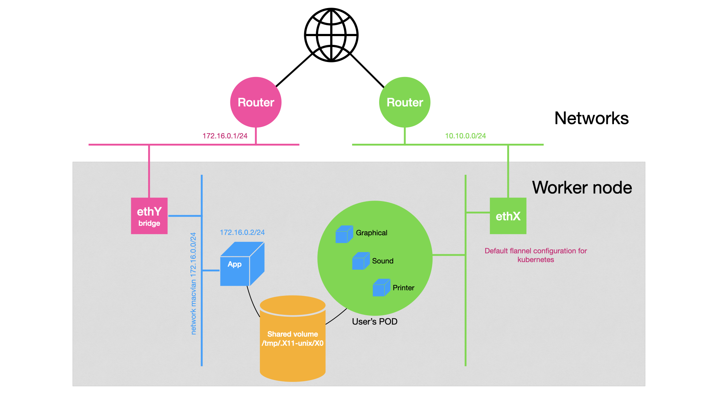

# Using docker network for an application


## Requirements 


## Goals
* Use a dedicated network for an application. For example bind the application Firefox to a dedicated docker network. 
This dedicated network can use macvlan, ipvlan or an SRIOV network driver.


## Architecture

When abcdesktop create a docker container, abcdesktop can set a dedicated network for this container.



## Create a dedicated network for your application

On your worker nodes :

* create a dedicated network interface to bridge the new network interface
* add the label `abcdesktop=true` to the network object

You have to choose a nework driver for example 

| network driver | 
|--------|
| [macvlan](https://docs.docker.com/network/macvlan/) |
| [ipvlan](https://docs.docker.com/network) |
| [docker-sriov-plugin](https://github.com/Mellanox/docker-sriov-plugin) |


Only the name of the network is used by abcdesktop.

Create a network with ```macvlan``` or ```ipvlan``` driver 

In these two examples :

* Subnet is ```192.168.8.0/24``` 
* Gateway is ```192.168.8.254``` 
* Ip Range is ```192.168.8.0/27```

#### Example with ```macvlan``` :

Create a network abcnetfirefox with the driver macvlan and bridge the network interface eno1 with the vlan 123 

```bash
docker network create --label abcdesktop=true -d macvlan --subnet=192.168.8.0/24 --gateway=192.168.8.254 --ip-range=192.168.8.0/27 -o parent=eno1.123 abcnetfirefox
```

#### Example with ```ipvlan``` ipvlan_mode=l2 :

Create a network abcnetfirefox with the driver ipvlan with ipvlan_mode=l2 option and bridge the network interface eno1 with the vlan 123.


```bash
docker network create --label abcdesktop=true -d ipvlan  -o ipvlan_mode=l2 --subnet=192.168.8.0/24 --gateway=192.168.8.254 --ip-range=192.168.8.0/27 -o parent=eno1.123 abcnetfirefox
```

#### Test your new network (```macvlan``` or ```ipvlan```):

Make sure that's you can reach the default gateway and the dns server for container.
In this example, just start a busybox to :

* ```ping``` the default gateway
* ```nslookup``` to query www.google.com ip address

```bash
export GATEWAY=192.168.8.254
docker run --rm --network abcnetfirefox busybox ping $GATEWAY
# Google’s public DNS server 8.8.8.8 is added
docker run --rm --network abcnetfirefox --dns 8.8.8.8 busybox ping www.google.com
```

## Applications rules

Update your ```applist.json``` file and add a specific rule into the firefox application description 

```bash
git clone https://github.com/abcdesktopio/oc.apps.git
cd oc.apps
```

Specific rules entry example

```json
"rules": { "homedir": { "default": true, "ship": true }, 
           "network": { "default": false, 
                        "internet": { 
                        			"name": "abcnetfirefox", 
                        			"dns": [ "8.8.8.8" ] } } },
```


In this example, if the current user token contains the tag label ```internet``` when the firefox application use ```abcnetfirefox``` and the dns ```8.8.8.8```

### Edit the ```applist.json``` file
Edit the ```applist.json``` file, and add rules to the application ```firefox``` for example

The new firefox dictionary with rules :

```json
{
    "cat": "office",
    "preruncommands": [ "RUN DEBIAN_FRONTEND=noninteractive echo ttf-mscorefonts-installer msttcorefonts/accepted-mscorefonts-eula select true | debconf-set-selections",
                        "RUN apt-get update && apt-get install  --no-install-recommends --yes ttf-mscorefonts-installer ttf-bitstream-vera ttf-dejavu ttf-xfree86-nonfree && apt-get clean",
                        "RUN apt-get update && apt-get install  --no-install-recommends --yes winbind firefox $(apt-cache search firefox-locale | awk '{print $1 }') && apt-get clean",
                        "RUN apt-get update && apt-get install  --no-install-recommends --yes flashplugin-installer ubuntu-restricted-extras libavc1394-0 && apt-get clean",
                        "RUN apt-get update && apt-get install  --no-install-recommends --yes libasound2-plugins libgail-common libgtk2.0-bin chromium-codecs-ffmpeg-extra gstreamer1.0-libav gstreamer1.0-plugins-ugly gstreamer1.0-vaapi libavcodec-extra && apt-get clean",
                        "COPY composer/init.d/init.firefox /composer/init.d/init.firefox",
                        "COPY policies.json /usr/lib/firefox/distribution",
                        "COPY /ntlm_auth /usr/bin/ntlm_auth.abcdesktop",
                        "RUN chown root:root /usr/bin/ntlm_auth.desktop && chmod 111 /usr/bin/ntlm_auth.abcdesktop",
                        "ENV NSS_SDB_USE_CACHE=yes" ],
    "debpackage": "",
    "icon": "firefox.svg",
    "keyword": "firefox,mozilla,web,internet",
    "launch": "Navigator.Firefox",
    "name": "Firefox",
    "displayname": "Firefox",
    "showinview": "dock",
    "splash": "enable",
    "mem_limit": "16gb",
    "oomkilldisable": true,
    "path": "/usr/bin/firefox",
    "template": "abcdesktopio/oc.template.gtk",
    "mimetype": "text/html;text/xml;application/xhtml+xml;application/xml;application/rss+xml;application/rdf+xml;x-scheme-handler/http;x-scheme-handler/https;x-scheme-handler/ftp;video/webm;application/x-xpinstall;",
    "legacyfileextensions": "htm;html;xml",
    "fileextensions": "htm;html;xml;gif",
    "desktopfile":"/usr/share/applications/firefox.desktop",
    "shm_size": "2gb",
    "usedefaultapplication": true,
    "rules": { "homedir": { "default": true, "ship": true }, 
           "network": { "default": false, 
                        "internet": { 
                        			"name": "abcnetfirefox", 
                        			"dns": [ "8.8.8.8" ] } } }
}
```

Save your changes, and run ```make dockerfile```, next ```docker build```

Build and update your new firefox application

```bash
# create the Dockerfile firefox.d 
make dockerfile

# build the new image
docker build -f firefox.d -t firefox.d .
```

Check that the ```oc.rules``` label in new firefox.d image 

```bash
docker inspect firefox.d 
```

The ```oc.rules``` label is a string json formated

```
"oc.rules": "{\"homedir\":{\"default\":true,\"ship\":true},\"network\":{\"default\":false,\"internet\":{\"name\":\"abcnetfirefox\",\"dns\":[\"8.8.8.8\"]}}}"
```


## Add tag the user auth 

Add a tag ```internet``` to the user auth provider

### Update authprovider in ```od.config``` file

Update the ```ldapconfig``` for planet with the new ```policies``` dict

```json
  'policies': { 'acls': None, 
			  'rules'	: { 'rule-ship': { 'conditions' : [ { 'memberOf': 'cn=ship_crew,ou=people,dc=planetexpress,dc=com', 'expected' : True  } ],
			  'expected' : True, 
			  'label': 'internet' },
```


The complete ```ldapconfig``` for planet is 

```json
ldapconfig : { 'planet': {    'default'       : True,
                        'ldap_timeout'  : 15,
                        'ldap_protocol' : 'ldap',
                        'ldap_basedn'   : 'ou=people,dc=planetexpress,dc=com',
                        'servers'       : [ '192.168.7.69' ],
                        'secure'        : False,
                        'auth_protocol' : { 'ntlm': True, 'cntlm': False, 'kerberos': False, 'citrix': False},
                        'citrix_all_regions' : 'Hello, {{ domain }}\\{{ user }}:{{ password }}',  
                        'serviceaccount': { 'login': 'cn=admin,dc=planetexpress,dc=com', 'password': 'GoodNewsEveryone' },
                        
                        'policies': { 'acls': None, 
			 'rules'	: { 'rule-ship': { 'conditions' : [ { 'memberOf': 'cn=ship_crew,ou=people,dc=planetexpress,dc=com', 'expected' : True  } ], 'expected' : True, 'label': 'internet' } 
      } } } }
```

Restart your kubernetes pyos pod, to reload new the ```od.config``` configuration file.

### Use the ```Philip J. Fry``` user context. 

Open a web browser, go to the abcdesktop login page.


> Login Accounts
> 
> | Login	             | Password | 
> |----------------------|----------|
> | Philip J. Fry.       |	fry    |
> | Hubert J. Farnsworth	| professor|

> Note: the user ```Philip J. Fry``` is **member of** ```cn=ship_crew,ou=people,dc=planetexpress,dc=com```

> Note: the user ```Hubert J. Farnsworth``` is **NOT member of** ```cn=ship_crew,ou=people,dc=planetexpress,dc=com```


Login as the  ```Philip J. Fry``` user account. 


During the user  login process, pyos tag the user authentification with the ```'label': 'internet'```

Start the new application ```firefox```, the docker network for this application use the ```abcnetfirefox``` 


Run the command

``` bash
docker network inspect abcnetfirefox
```

abcdesktop start a new container ```"Name": "philip-j--fry-firefox-d2c22d9912fc4a489a1224237af9a3e0"``` and bind the ```abcnetfirefox``` to user container.


```json
[
    {
        "Name": "abcnetfirefox",
        "Id": "69c5ac0996226654635377458c044675114d5feb742a8a56d8a228180829d9cd",
        "Created": "2021-02-05T16:24:41.781733948+01:00",
        "Scope": "local",
        "Driver": "macvlan",
        "EnableIPv6": false,
        "IPAM": {
            "Driver": "default",
            "Options": {},
            "Config": [
                {
                    "Subnet": "192.168.8.0/24",
                    "Gateway": "192.168.8.254"
                }
            ]
        },
        "Internal": false,
        "Attachable": false,
        "Ingress": false,
        "ConfigFrom": {
            "Network": ""
        },
        "ConfigOnly": false,
        "Containers": {
            "05f88ee41055b209e7599a455705088cf633f6458313508ce867d13b8d39014a": {
                "Name": "philip-j--fry-firefox-d2c22d9912fc4a489a1224237af9a3e0",
                "EndpointID": "ae0271ed73aa5478ac364444b29342278b82bc710bd4e4eeb64a51d7eeec4d9c",
                "MacAddress": "02:42:a1:69:d0:82",
                "IPv4Address": "192.168.8.1/24",
                "IPv6Address": ""
            }
        },
        "Options": {
            "parent": "eno1.106"
        },
        "Labels": {
            "abcdesktop": "true"
        }
    }
]
```


Close the firefox application.

Logoff, to remove the user pod ```Philip J. Fry```. 


### Use the ````Hubert J. Farnsworth``` user context. 

Login as the  ```Hubert J. Farnsworth``` user account. 

> Note: the user ```Hubert J. Farnsworth``` is **NOT member of** ```cn=ship_crew,ou=people,dc=planetexpress,dc=com``


Start the new application ```firefox```, the docker network for this application do **NOT use** the ```abcnetfirefox``` 

Run the command

```bash
docker network inspect abcnetfirefox
```

```abcnetfirefox``` description :

```json
docker network inspect abcnetfirefox
[
    {
        "Name": "abcnetfirefox",
        "Id": "69c5ac0996226654635377458c044675114d5feb742a8a56d8a228180829d9cd",
        "Created": "2021-02-05T16:24:41.781733948+01:00",
        "Scope": "local",
        "Driver": "macvlan",
        "EnableIPv6": false,
        "IPAM": {
            "Driver": "default",
            "Options": {},
            "Config": [
                {
                    "Subnet": "192.168.8.0/24",
                    "Gateway": "192.168.8.254"
                }
            ]
        },
        "Internal": false,
        "Attachable": false,
        "Ingress": false,
        "ConfigFrom": {
            "Network": ""
        },
        "ConfigOnly": false,
        "Containers": {},
        "Options": {
            "parent": "eno1.106"
        },
        "Labels": {
            "abcdesktop": "true"
        }
    }
]
```


The new firefox container doesn't use the docker network ```abcnetfirefox```, because the ```Hubert J. Farnsworth``` user account is **NOT member of** ```cn=ship_crew,ou=people,dc=planetexpress,dc=com```

The network is disabled by default.


Inspect the ```Hubert J. Farnsworth``` firefox container

```json
        "NetworkSettings": {
            "Bridge": "",
            "SandboxID": "",
            "HairpinMode": false,
            "LinkLocalIPv6Address": "",
            "LinkLocalIPv6PrefixLen": 0,
            "Ports": {},
            "SandboxKey": "",
            "SecondaryIPAddresses": null,
            "SecondaryIPv6Addresses": null,
            "EndpointID": "",
            "Gateway": "",
            "GlobalIPv6Address": "",
            "GlobalIPv6PrefixLen": 0,
            "IPAddress": "",
            "IPPrefixLen": 0,
            "IPv6Gateway": "",
            "MacAddress": "",
            "Networks": {}
        }
```

The network access is disable for this application

```json
"rules": { "homedir": { "default": true, "ship": true }, 
           "network": { "default": false, 
                        "internet": { 
                        			"name": "abcnetfirefox", 
                        			"dns": [ "8.8.8.8" ] } } }
```           

In this case, only users with the label tag ```internet```, can bind the network name ```abcnetfirefox```.


### Enable network for ````Hubert J. Farnsworth```

Update the application firefox rules
 
Now it's time to permit network access to 

Update the applist.json file :

Specific rules entry example

```json
"rules": { "homedir": { "default": true, "ship": true }, 
           "network": { "default": true, 
                        "internet": { 
                        			"name": "abcnetfirefox", 
                        			"dns": [ "8.8.8.8" ] } } },
```

The new firefox dictionary with network rules set with "default": true :

```json
{
    "cat": "office",
    "preruncommands": [ "RUN DEBIAN_FRONTEND=noninteractive echo ttf-mscorefonts-installer msttcorefonts/accepted-mscorefonts-eula select true | debconf-set-selections",
                        "RUN apt-get update && apt-get install  --no-install-recommends --yes ttf-mscorefonts-installer ttf-bitstream-vera ttf-dejavu ttf-xfree86-nonfree && apt-get clean",
                        "RUN apt-get update && apt-get install  --no-install-recommends --yes winbind firefox $(apt-cache search firefox-locale | awk '{print $1 }') && apt-get clean",
                        "RUN apt-get update && apt-get install  --no-install-recommends --yes flashplugin-installer ubuntu-restricted-extras libavc1394-0 && apt-get clean",
                        "RUN apt-get update && apt-get install  --no-install-recommends --yes libasound2-plugins libgail-common libgtk2.0-bin chromium-codecs-ffmpeg-extra gstreamer1.0-libav gstreamer1.0-plugins-ugly gstreamer1.0-vaapi libavcodec-extra && apt-get clean",
                        "COPY composer/init.d/init.firefox /composer/init.d/init.firefox",
                        "COPY policies.json /usr/lib/firefox/distribution",
                        "COPY /ntlm_auth /usr/bin/ntlm_auth.abcdesktop",
                        "RUN chown root:root /usr/bin/ntlm_auth.desktop && chmod 111 /usr/bin/ntlm_auth.abcdesktop",
                        "ENV NSS_SDB_USE_CACHE=yes" ],
    "debpackage": "",
    "icon": "firefox.svg",
    "keyword": "firefox,mozilla,web,internet",
    "launch": "Navigator.Firefox",
    "name": "Firefox",
    "displayname": "Firefox",
    "showinview": "dock",
    "splash": "enable",
    "mem_limit": "16gb",
    "oomkilldisable": true,
    "path": "/usr/bin/firefox",
    "template": "abcdesktopio/oc.template.gtk",
    "mimetype": "text/html;text/xml;application/xhtml+xml;application/xml;application/rss+xml;application/rdf+xml;x-scheme-handler/http;x-scheme-handler/https;x-scheme-handler/ftp;video/webm;application/x-xpinstall;",
    "legacyfileextensions": "htm;html;xml",
    "fileextensions": "htm;html;xml;gif",
    "desktopfile":"/usr/share/applications/firefox.desktop",
    "shm_size": "2gb",
    "usedefaultapplication": true,
    "rules": { "homedir": { "default": true, "ship": true }, 
           "network": { "default": true, 
                        "internet": { 
                        			"name": "abcnetfirefox", 
                        			"dns": [ "8.8.8.8" ] } } }
}
```

Save your changes, and run ```make dockerfile```, next ```docker build```

Build and update your new firefox application

```bash
# create the Dockerfile firefox.d 
make dockerfile

# build the new image
docker build -f firefox.d -t firefox.d .
```

Check that the ```oc.rules``` label in new firefox.d image 

```bash
docker inspect firefox.d 
```

The ```oc.rules``` label is a string json formated

```
 "oc.rules": "{\"homedir\":{\"default\":true,\"ship\":true},\"network\":{\"default\":true,\"internet\":{\"name\":\"abcnetfirefox\",\"dns\":[\"8.8.8.8\"]}}}",
```

Request the abcdesktop core service to update the application cache data

> Replace MY_FQDN by your own hostname 

```bash
export MY_FQDN=localhost
curl http://$MY_FQDN/API/manager/buildapplist 
```


You do not need to logoff the ```Hubert J. Farnsworth```, just close Firefox application and start it again. The new firefox container use the default network.


Now default user has a network access, and member of ```cn=ship_crew,ou=people,dc=planetexpress,dc=com``` use the ```abcnetfirefox``` network.

